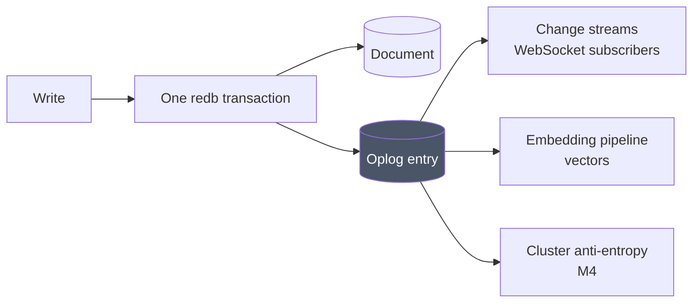

# KimmyDB Documentation

KimmyDB is a JSON document database written in Rust. It runs as a single binary
from a terminal or a container, speaks HTTP and WebSocket, and is designed
around three things that are usually awkward to have together:

1. **Change streams that work on one node.** No replica set, no cluster, no
   ceremony.
2. **Leaderless clustering.** No primary, no elections, no quorum — peers gossip
   membership and state with one another and converge eventually.
3. **AI-native storage.** Embeddings maintained automatically per collection,
   and an MCP server running *inside* the database.

---

## Where to start

**New to the project?** Read [Architecture](architecture.md) first — it explains
the one structural idea everything else follows from.

**Trying to use it?** [HTTP API](http-api.md), then [Query Language](query-language.md)
[Vectors](vectors.md), and — if you are wiring up an agent — [MCP](mcp.md).

**Running it?** [Operations](operations.md), then [Security](security.md).

**Building on it or continuing development?** [Roadmap](roadmap.md) for what's
planned and why, [Decisions](decisions.md) for what's already settled,
[Testing](testing.md) for the invariants that must not break, and
**[Deviations](deviations.md)** for where the implementation differs from what
was asked for — the debts, in one place. **[Handoff](handoff.md)** is the
shortest path back into the work: where it stands and what is next.

---

## Document map

```mermaid
graph TD
    IDX[README<br/>you are here]

    IDX --> ARCH["Architecture<br/>crates · layering · the oplog spine"]
    IDX --> USE["Using it"]
    IDX --> INT["Internals"]
    IDX --> OPS["Running it"]
    IDX --> DEV["Developing it"]

    USE --> API["HTTP API<br/>endpoint reference"]
    USE --> QL["Query Language<br/>filters · updates · sort · projection"]
    USE --> CS["Change Streams<br/>subscribing · resuming"]
    USE --> MCP["MCP<br/>agent tools · resources · schema inference"]

    INT --> STO["Storage<br/>on-disk layout · codecs"]
    INT --> KE["Key Encoding<br/>order-preserving bytes"]
    INT --> IX["Indexes<br/>maintenance · planning · unique"]
    INT --> TC["Time and Conflicts<br/>HLC · last-writer-wins"]
    INT --> OPL["Oplog<br/>the shared log"]
    INT --> VEC["Vectors<br/>embeddings · chunking · HNSW"]

    OPS --> OP["Operations<br/>config · deploy · observability"]
    OPS --> SEC["Security<br/>auth · RBAC · threat model"]

    DEV --> RM["Roadmap<br/>milestones and planned design"]
    DEV --> DEC["Decisions<br/>what was chosen and why"]
    DEV --> TST["Testing<br/>invariants and how they are checked"]
    DEV --> DEV2["Deviations<br/>drifts and deferrals, in one place"]
    DEV --> HO["Handoff<br/>current state · what's next"]
```



| Document | What it covers |
|---|---|
| [Architecture](architecture.md) | Crate layout, layering, request lifecycle, the oplog spine |
| [Storage](storage.md) | redb tables, on-disk record formats, tombstones, durability |
| [Key Encoding](key-encoding.md) | Order-preserving byte encoding — the subtlest component |
| [Indexes](indexes.md) | Index maintenance, the planner, multikey and unique semantics |
| [Time & Conflicts](time-and-conflicts.md) | Hybrid logical clocks, last-writer-wins, the consistency model |
| [Oplog](oplog.md) | The shared log, its three consumers, retention |
| [Vectors](vectors.md) | Auto-embeddings, providers, chunking, the two search paths |
| [MCP](mcp.md) | The in-process agent surface: tools, resources, and how authorization is shared with REST |
| [Change Streams](change-streams.md) | The replay/live splice, resume tokens, lag recovery |
| [Query Language](query-language.md) | Filter and update operators, array semantics, Mongo compatibility |
| [HTTP API](http-api.md) | Endpoint reference, request and response shapes, status codes |
| [Security](security.md) | Authentication, RBAC, what is and is not defended against |
| [Operations](operations.md) | Configuration, Docker, Kubernetes, health, metrics, backup |
| [Roadmap](roadmap.md) | Milestone status and the planned design for what remains |
| [Decisions](decisions.md) | Architecture decision record — choices and their rationale |
| [Benchmarks](benchmarks.md) | What has been measured, and which guessed constants it replaced |
| [Testing](testing.md) | Testing philosophy and the invariants that carry the weight |
| [Deviations](deviations.md) | Where the build differs from the plan, why, and what would close it |
| [Handoff](handoff.md) | Current state, what's next, and what needs a decision |

---

## Current capabilities

Honest status. "Working" means exercised by tests and verified by driving the
running server, not merely compiled.

| Capability | Status | Notes |
|---|---|---|
| JSON documents and collections | ✅ Working | BSON on disk, Extended JSON at the edge |
| Multiple databases | ✅ Working | Created implicitly by their first collection |
| Document CRUD | ✅ Working | Insert, get, replace, delete, upsert |
| Mongo-style queries | ✅ Working | 17 filter operators, dot paths, array semantics |
| Update operators | ✅ Working | 12 operators plus whole-document replacement |
| Sort and projection | ✅ Working | Multi-key sort, inclusion/exclusion projection |
| Change streams | ✅ Working | **Single node, no replica set.** Resumable by token |
| Multiple users | ✅ Working | Argon2id, JWT, per-collection RBAC |
| HTTP + WebSocket API | ✅ Working | Also health and Prometheus metrics |
| Docker container | ✅ Working | ~106 MB, graceful SIGTERM shutdown |
| Secondary indexes | ✅ Working | Compound, descending, multikey, unique (single-node) |
| Vector search & auto-embeddings | ✅ Working | Shadow collections, oplog-driven worker, HNSW above 500 vectors |
| Hybrid search | ✅ Working | Dense + lexical, fused by reciprocal rank fusion |
| Built-in MCP server | ✅ | Streamable HTTP at `/mcp`, RBAC-gated tools, sampled schema inference |
| Gossip clustering | ✅ Working | SWIM membership over UDP, oplog anti-entropy over TCP, snapshot resync. **Containers must set `cluster.bind` to a routable address** — see [Operations](operations.md) |
| Login rate limiting | ✅ Working | Token bucket per caller, checked before the password hash |
| TLS | ✅ Clients · 📋 node↔node | Native termination for HTTP/WebSocket/MCP. Replication frames are still plaintext |
| Aggregation pipeline | 📋 Planned (M5) | `$match`, `$group`, `$unwind`, `$project`, `$sort`, `$limit` |
| Backup / restore | 📋 Planned (M5) | Cold file copy only today |
| `kimmy` CLI | 📋 Planned (M5) | The binary today prints a pointer to the HTTP API |

Replication has been driven on real daemons and in containers, not only in
tests: a collection, a unique index and documents converging in both directions
from one seed address, a partition healing, a node joining a cluster whose oplog
history had been collected, and both survivors agreeing a killed node was down
within milliseconds. See [Roadmap](roadmap.md).

---

## The one idea worth understanding

**The oplog is the spine.** Every mutation appends exactly one durable,
totally-ordered entry, in the same transaction as the change itself. Three
independent subsystems then read that same log:



Building the log once and reusing it three times is why single-instance change
streams work here at all. In MongoDB they are a byproduct of replication, so
they require a replica set. Here the log exists whether or not the node has
ever seen a peer — clustering is a *consumer* of the log, not its cause.

It is also why auto-embeddings need no scheduler: the embedding worker is an
ordinary change-stream subscriber. See [Vectors](vectors.md).

---

## Consistency, stated plainly

Read this before building on it. These are the normal consequences of choosing
leaderless availability over coordination, and the failure mode of an
eventually-consistent store is a user who assumed otherwise.

- Single-document writes are **atomic and durable** on the accepting node.
- **Read-your-writes holds only on the node you wrote to.**
- Conflicts resolve by **last-writer-wins at whole-document granularity**. The
  losing write is discarded, not merged.
- **No multi-document atomicity.** No transactions across documents.
- Deletes are **tombstones with a retention window**. A partition outlasting
  that window can resurrect deleted documents.

Full detail in [Time & Conflicts](time-and-conflicts.md).

---

## Repository layout

```
kimmydb/
├── crates/
│   ├── kimmy-core/      Hlc, Stamp, DocId, DocRecord, OplogEntry, keyenc, cmp
│   ├── kimmy-storage/   redb engine, documents, oplog, change streams
│   ├── kimmy-query/     filter / update / sort / projection evaluation
│   ├── kimmy-auth/      Argon2id, JWT, RBAC, user store
│   ├── kimmy-api/       axum router, WebSocket, JSON boundary
│   ├── kimmy-cluster/   discovery, SWIM membership, replication transport
│   ├── kimmy-vector/    embeddings, HNSW, index cache, search
│   ├── kimmy-mcp/       MCP server
│   ├── kimmyd/          the server binary
│   └── kimmy-cli/       terminal client (M5)
├── docs/                this directory
├── Dockerfile
├── docker-compose.yml
└── kimmy.example.toml
```

---

## Conventions used in these documents

- ✅ Working · 🚧 Partial · 📋 Planned · ⛔ Not implemented
- Code references are given as `crate/src/file.rs` so they survive line drift.
- Where a design has a *sharp edge*, it is called out rather than smoothed over.
  Sharp edges that are only discovered in production are the expensive kind.
