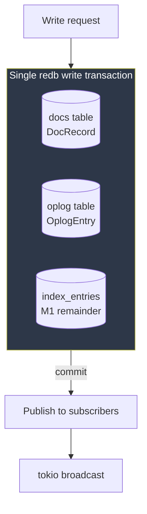
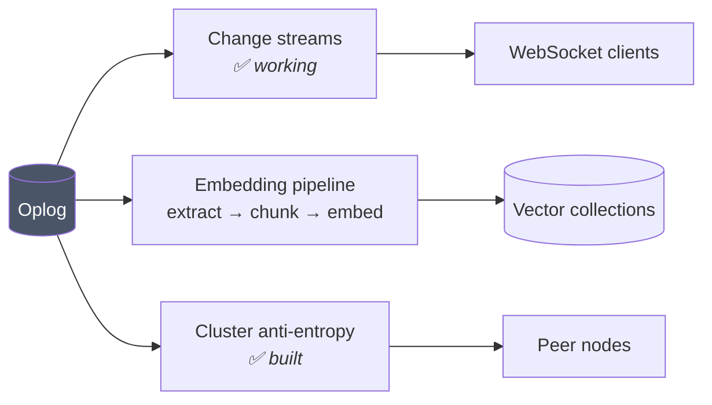
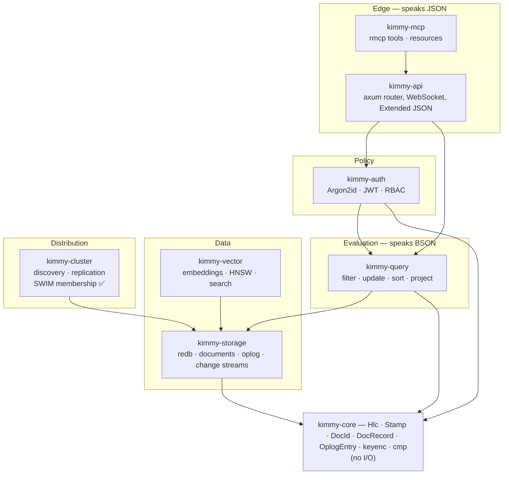
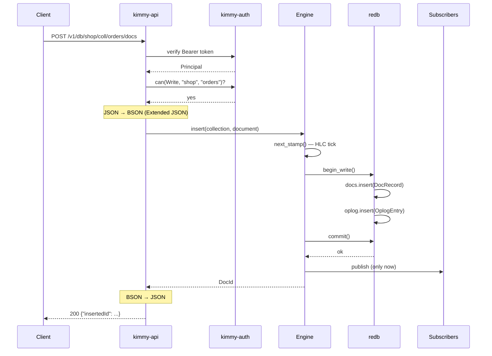
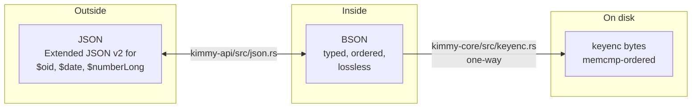

# Architecture

[← Documentation index](README.md)

---

## The structural idea

Every mutation in KimmyDB does two things inside **one** redb transaction:
write the document, and append one entry to the oplog.



Two consequences follow, and most of the system's behaviour is downstream of
them:

**The log can never disagree with the data.** There is no window in which a
document is changed but unlogged, or logged but not applied. Anything that
reads the oplog can therefore trust it as a complete, ordered account of what
happened.

**Events publish only after commit.** A subscriber can never observe a change
that was subsequently rolled back. The broadcast send happens *after*
`txn.commit()` returns, never before.

Because the log is trustworthy and complete, three unrelated subsystems can be
built as readers of it rather than as separate machinery:



This is why **change streams work on a single node**. In MongoDB they are a
byproduct of the replication log, so they require a replica set. Here the log
is written unconditionally; clustering *consumes* it rather than causing it.

It is also why auto-embeddings will need no scheduler — the embedding worker is
just another change-stream subscriber, so "keep vectors up to date" reduces to
"consume the log", which is already solved.

---

## Layering



### Crates

| Crate | Responsibility | Does *not* |
|---|---|---|
| `kimmy-core` | The vocabulary: identifiers, timestamps, records, encodings | Touch disk, network, or the clock |
| `kimmy-storage` | redb tables, document CRUD, oplog, change streams | Know about HTTP, users, or query syntax |
| `kimmy-query` | Parse and evaluate filters, updates, sorts, projections | Touch storage |
| `kimmy-auth` | Password hashing, tokens, the authorization decision | Know about HTTP |
| `kimmy-api` | Routing, JSON⇄BSON, WebSocket, status codes, and the shared executor both edges call | Contain business logic beyond composing storage and query |
| `kimmy-cluster` | Discovery, the wire protocol, anti-entropy replication, SWIM membership | Decide what wins — that is `kimmy-storage` |
| `kimmy-vector` | Embedding providers, the worker, HNSW, index selection, search | Sit on the write path |
| `kimmy-mcp` | MCP tools and resources | Re-implement authorization — it calls `kimmy_api::exec`, where the check lives |
| `kimmyd` | Configuration, wiring, lifecycle | — |
| `kimmy-cli` | Terminal client (M5) | — |

### Two rules that keep the layering honest

**`kimmy-core` performs no I/O — including reading the clock.** The hybrid
logical clock takes physical time as a *parameter*:

```rust
pub fn tick(&mut self, physical_ms: u64) -> Hlc
```

This is not purism. Clock skew, backwards NTP jumps, and counter exhaustion are
exactly the conditions an HLC exists to survive, and they are almost impossible
to test if the clock reads `SystemTime::now()` internally. Passing time in makes
those cases ordinary unit tests. `kimmy-storage::engine::physical_now_ms()` is
the single place the wall clock is actually read.

**There is exactly one authorization decision point.** `Principal::can()` in
`kimmy-auth/src/rbac.rs`. The HTTP API and the MCP server both call it. A
second enforcement path is precisely how an MCP tool ends up quietly more
permissive than the REST route beside it.

---

## Request lifecycle

A write, end to end:



Note the ordering: authorization *before* the collection is resolved, and
publication *after* commit. Both are deliberate, and both are covered in
[Security](security.md) and [Change Streams](change-streams.md) respectively.

---

## The type boundary



**Why BSON internally.** Mongo-style comparison needs typed values and a defined
cross-type ordering. JSON has one number type and no dates, binary, or object
ids. Storing JSON would mean either losing types or inventing a parallel type
system.

**Why Extended JSON at the edge.** Plain JSON keeps working for everything
expressible in it, so a caller who does not care never sees the distinction.
Callers who do care get `{"$oid": "..."}` and friends.

**Why the key encoding is one-way.** Index keys are never decoded, only
compared. Dropping the decode requirement lets the encoding do things a
reversible format could not — most importantly, making `5i32`, `5i64`, and
`5.0f64` produce *identical* bytes so an index lookup for `5` finds a document
that stored `5.0`. Document ids, which *do* need reconstructing during
replication, use a separate reversible encoding in
`kimmy-storage/src/codec.rs`.

---

## Concurrency model

| Concern | Approach |
|---|---|
| Transactions | redb MVCC — many readers, one writer |
| HLC | `parking_lot::Mutex`, held only to mint a stamp, **never across a commit** |
| Change feed | `tokio::sync::broadcast`, 1024-event buffer |
| Slow subscribers | Never block writers; recover by replaying from the oplog |
| Collection scans | Callback-based, so the read transaction's lifetime stays contained |

The scan API is worth a note:

```rust
pub fn for_each_doc<F>(&self, coll: &CollectionMeta, f: F) -> Result<()>
where F: FnMut(DocId, Document) -> Result<bool>
```

It is callback-based rather than iterator-returning because redb's range borrows
its transaction. Returning an iterator would leak that lifetime into every
caller; returning a `Vec` would materialize whole collections. The callback
returns `false` to stop early.

> **Constraint:** redb permits only one handle per database file. A second
> `Engine::open()` on the same path in the same process will fail. Share one
> `Arc<Engine>` — this was discovered by a test that tried to open a second
> handle for a writer thread.

---

## What is deliberately absent

| Not present | Why |
|---|---|
| Query planner with a cost model | The operator surface is small; a rule-based planner is more predictable to debug. See [Roadmap](roadmap.md). |
| Connection pooling / session state | Every request is independent; there are no cursors to keep alive. |
| A leader, elections, or quorum | Leaderless by design. See [Time & Conflicts](time-and-conflicts.md). |
| Multi-document transactions | Would require coordination, which is the thing being avoided. |
| An ORM-ish client library | HTTP + JSON is the interface; any language already has a client. |

---

## Next

- [Storage](storage.md) — what the bytes on disk actually look like
- [Oplog](oplog.md) — the log's format and its consumers
- [Decisions](decisions.md) — why redb, why BSON, why leaderless
