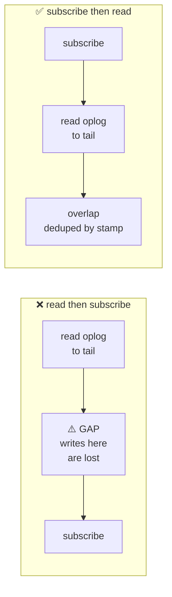
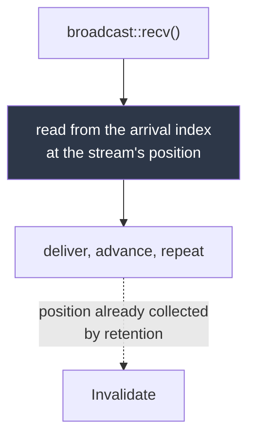
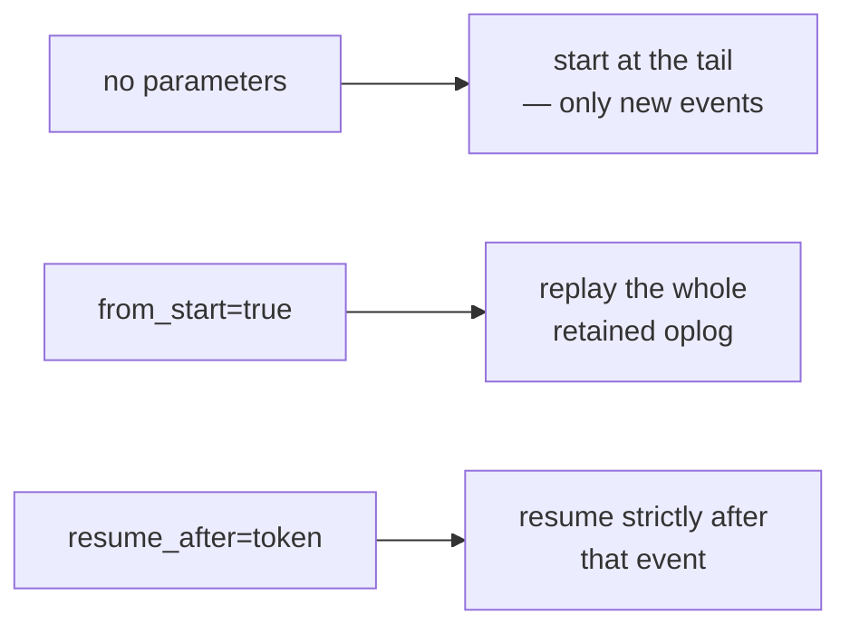

# Change Streams

[← Documentation index](README.md)

Subscribe to changes as they happen — on a single node, with no replica set.

> **Looking for webhooks?** A change stream needs the client to open and hold a
> WebSocket. Registering a URL and having the node **push** to it is
> [Webhooks](webhooks.md). The events are the same; the direction is not.

Implemented in `kimmy-storage/src/watch.rs` and `kimmy-api/src/watch.rs`.

---

## Using them

```bash
websocat "ws://localhost:7878/v1/db/shop/coll/orders/watch?full_document=true" \
  -H "Authorization: Bearer $TOKEN"
```

Each event is one JSON text frame:

```json
{
  "operationType": "insert",
  "documentKey": { "_id": 42 },
  "resumeToken": "AAABn9nAG7sAAAAAAAAAAAAAAAAAAAAA",
  "clusterTime": "1762300000000.0",
  "fullDocument": { "_id": 42, "item": "widget", "qty": 5 }
}
```

| Parameter | Meaning |
|---|---|
| `resume_after=<token>` | Resume immediately **after** that event |
| `from_start=true` | Replay the whole retained oplog |
| `full_document=true` | Include the post-image on every event |

`operationType` is `insert`, `update`, `replace`, `delete`, `uniqueViolation`,
or `invalidate`. Requires the `watch` action on the collection — which is
**not** implied by `read`. See [Security](security.md).

A `uniqueViolation` event reports that merging a replicated write broke a unique
constraint. It carries no `documentKey` — nothing was lost, and no single
document is *the* problem — but names the index and every colliding id:

```json
{
  "operationType": "uniqueViolation",
  "index": "email_1",
  "merged": "remote-doc",
  "documentKeys": [{ "_id": "local-doc" }, { "_id": "remote-doc" }],
  "resumeToken": "…",
  "clusterTime": "…"
}
```

Both documents still exist. Uniqueness cannot be enforced across nodes without
coordination, so this converts a silent constraint break into something an
application can reconcile. See [ADR-020](decisions.md).

---

## Why they work on one node

MongoDB change streams are a byproduct of the replication oplog, so they require
a replica set — a real operational cost for a single-instance deployment.

KimmyDB writes its oplog **unconditionally**, in the same transaction as every
mutation, whether or not the node has ever seen a peer. Clustering *consumes*
the log; it does not cause it. So a single `docker run` has fully working,
resumable change streams.

---

## The splice

A change stream is a durable oplog replay joined onto a live in-memory
broadcast. Joining them without a gap or a duplicate is the entire difficulty.

```mermaid
sequenceDiagram
    participant C as Client
    participant S as ChangeStream
    participant B as broadcast channel
    participant O as oplog (disk)

    C->>S: watch(resume_after)
    rect rgb(40, 70, 40)
        Note over S,B: STEP 1 — subscribe FIRST
        S->>B: subscribe()
        Note right of B: everything committed from<br/>this instant is buffered for us
    end
    rect rgb(40, 55, 80)
        Note over S,O: STEP 2 — then replay from disk
        S->>O: read_oplog_from(resume_point, 1024)
        O-->>S: batch
        Note right of S: repeat until a short batch<br/>= caught up to the tail
    end
    rect rgb(70, 60, 35)
        Note over S,B: STEP 3 — then go live
        S->>B: recv()
        Note right of S: discard anything with<br/>stamp ≤ last delivered
    end
```



### Why the order matters

Doing it the intuitive way — read the oplog, then subscribe — leaves a window
between the read and the subscription in which committed events reach nobody:



That gap is silent, intermittent, and load-dependent — it only appears when a
write lands in exactly the wrong microsecond. It is the kind of bug that ships.

So it gets a dedicated test rather than a comment:
`resuming_under_continuous_writes_has_no_gaps_and_no_duplicates` runs 500 writes
on a background thread while a subscriber reads a prefix, disconnects, and
resumes from its token — then asserts the delivered sequence is exactly
`0..500`, in order, with nothing missing or repeated.

### Deduplicating the overlap

Replay and the live channel overlap by construction. Every delivered event
advances a high-water mark, and anything at or below it is discarded:

```rust
if let Some(last) = self.last_delivered
    && entry.stamp <= last { return None; }
```

Filtered-out events (wrong collection, wrong database) also advance the mark —
otherwise they would be re-examined forever.

---

## Lag recovery

`tokio::sync::broadcast` buffers 1024 events per subscriber, and a consumer
slower than the write rate falls off the back of it. That is a non-event here,
because **the broadcast channel is only a wake-up**: its payload is discarded,
and every delivered entry is read from the oplog.



So a `Lagged` receiver is just a wake-up that arrived late — the data is on disk
either way. Tested by writing 2,500 events with nobody reading, then draining
and asserting all 2,500 arrive in order.

Recovery is bounded by a **resume floor** — the position the stream started at —
so a stream that deliberately skipped history cannot resurrect it by lagging.

> **`Invalidate` is reachable in exactly one way:** retention collected the
> range the stream was about to read. A stream checks the oldest retained
> position before each read and emits `ConsumerLagged` rather than skipping the
> gap silently. Before retention landed there was no way to reach it at all.

---

## Scopes

| Scope | Status | Notes |
|---|---|---|
| `Collection(id)` | ✅ Exposed over HTTP | The only scope with a route today |
| `Database(name)` | ✅ Implemented | Resolves collection→database with a cache; no route yet |
| `Cluster` | ✅ Implemented | Every change on the node; no route yet |

Database and cluster scopes work at the storage layer and are covered by tests;
they simply have no endpoint yet.

---

## Starting positions



Resumption is **exclusive** of the token. Resuming *at* it would redeliver the
last event the client already acknowledged.

### Expired tokens

A token older than the oldest retained oplog entry gets **410 Gone**:

```json
{ "error": "resume_token_expired",
  "message": "change stream resume token is no longer available; the oplog has advanced past it" }
```

Silently restarting from the beginning would hide the fact that events were
missed. A token *newer* than everything on disk is fine — nothing has happened
since — and is accepted.

The check happens **before** the WebSocket upgrade, so the client gets a real
HTTP status rather than an unexplained socket close after a successful
handshake. Authorization happens before the upgrade for the same reason.

---

## Verified behaviour

Beyond unit tests, the following was exercised against the running server with a
WebSocket client:

| Check | Result |
|---|---|
| Subscriber attaches, three inserts follow | All three delivered, in order, with `fullDocument` |
| Resume from the first event's token | Delivered events 2 and 3; event 1 **not** redelivered |
| Well-formed but ancient token | `410 resume_token_expired` |
| Malformed token | `400 bad_request` |

---

## Sharp edges

**Cancel safety.** `ChangeStream::next()` is *not* cancel-safe with respect to
the live channel: abandoning a call inside a `select!` you intend to resume may
drop an event. The WebSocket pump only races it against socket-close, which is
terminal, so this is safe there.

**Replicated writes reach subscribers.** This was once a real gap: an applied
remote entry keeps its *originating* stamp, so it lands in the oplog behind the
local tail, and a subscriber past that point would never have seen it. Streams
now follow a second ordering over local arrival sequence (`oplog_arrival`) while
the oplog stays keyed by origin stamp for conflict resolution and anti-entropy.
Resume tokens are unchanged — they are translated to an arrival position at
watch time. [ADR-030](decisions.md), and [Oplog](oplog.md) for the mechanism.

**Collection DDL is filtered out.** Create and drop append `kind = Collection`
entries with no document. The WebSocket layer drops them rather than emitting
malformed document events.

---

## Next

- [Oplog](oplog.md) — the log being consumed
- [HTTP API](http-api.md) — the endpoint reference
- [Security](security.md) — why `watch` is a separate action from `read`
