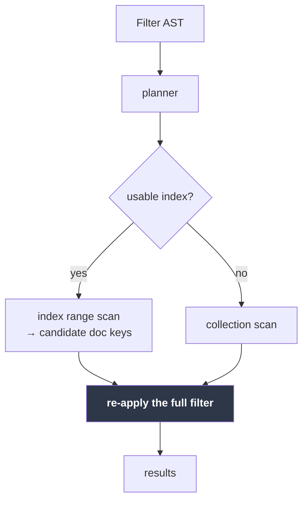
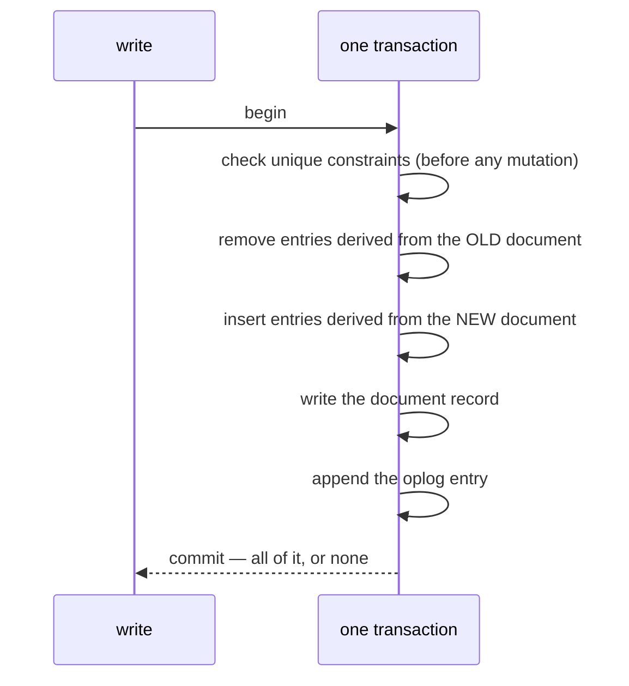

# Indexes

[← Documentation index](README.md)

Secondary indexes: how entries are maintained, how the planner picks one, and
what a unique constraint does and does not promise.

Implemented in `kimmy-storage/src/index.rs` and `kimmy-query/src/plan.rs`.

---

## Using them

```bash
curl -XPOST localhost:7878/v1/db/shop/coll/orders/indexes -H "$A" -d '{
  "fields": [ { "path": "item" }, { "path": "qty", "descending": true } ],
  "unique": false,
  "name":   "item_qty"
}'

curl        localhost:7878/v1/db/shop/coll/orders/indexes -H "$A"
curl -XDELETE localhost:7878/v1/db/shop/coll/orders/indexes/item_qty -H "$A"
```

`fields` is an **array**, not a `{field: 1}` object, deliberately: field order
decides which queries a compound index can answer, and JSON object key order is
not something a client can rely on surviving serialization.

Creating and dropping require the `admin` action; listing requires `read`.

### Did it get used?

```bash
curl -XPOST .../orders/find -H "$A" -d '{"filter":{"qty":7},"explain":true}'
```

```json
{ "documents": [ … ],
  "explain": {
    "strategy": "index",
    "index": "qty_1",
    "indexFieldsUsed": 1,
    "documentsExamined": 10,
    "documentsMatched": 10
  } }
```

`strategy` is `index` or `collectionScan`. Watching `documentsExamined` fall
while `documentsMatched` stays the same is the whole point of an index.

---

## The rule everything follows from

> An index answers **"which documents might match"**. Only the filter decides
> membership.

So every candidate an index produces is **re-checked against the full filter**
before it is returned. Skipping that recheck is how index-backed queries start
returning documents that do not match.

It follows that a computed key range may be **too wide, but never too narrow**.
A wide range costs time; a narrow one silently drops matching documents. Every
uncertain decision in the planner resolves toward "wider".



---

## Entry maintenance

Index entries are written in the **same redb transaction** as the document they
describe. Anything less lets an index disagree with its data — which does not
crash, it returns wrong answers.



A replace needs the document's **previous image** to know which entries to
remove; they are derived from the old value, not the new one. A delete removes
every entry, so a scan cannot surface a candidate whose document is gone.

Constraints are checked before anything is mutated, so a rejected write leaves
the index exactly as it was.

---

## What gets indexed

| Document | Keys produced for an index on `a` |
|---|---|
| `{a: 5}` | `5` |
| `{b: 1}` — `a` absent | `null` |
| `{a: null}` | `null` |
| `{a: ["x", "y"]}` | `"x"`, `"y"`, **and** `["x","y"]` |
| `{a: ["x", "x"]}` | `"x"`, `["x","x"]` |

**A missing field indexes as `null`.** That is what keeps `{a: null}` —
which matches missing fields — answerable from the index.

**An array indexes its elements *and* itself.** Mongo indexes only the elements;
that would leave `{tags: ["a","b"]}` (whole-array equality) with no entry, so an
index-backed query would return an *incomplete* result. Storing both costs a
little space and removes the hole.

**Values equal across numeric types share a key.** `5i32`, `5i64`, and `5.0`
encode identically, so a lookup for `5` finds a document that stored `5.0`. See
[Key Encoding](key-encoding.md).

### Compound indexes over two arrays are rejected

A compound index spanning two array fields would write the cartesian product —
`|a| × |b|` entries for a single document. Mongo rejects this; so does KimmyDB,
with a hard cap of 1,000 keys per document as a backstop.

---

## The planner

Rule-based, no cost model. The operator surface is small enough that
predictability beats sophistication.

1. Collect the predicates that must hold for **every** match.
2. For each index, count how many **leading** fields those predicates cover with
   equality, plus an optional range on the next field.
3. Take the index covering the most fields. If that count is zero, scan.

```javascript
// index: [item, qty]
{ item: "w1", qty: 3 }              // 2 fields  ✓ best
{ item: "w1", qty: { $gt: 3 } }     // 2 fields — equality prefix + range
{ item: "w1" }                      // 1 field
{ qty: 3 }                          // 0 — the leading field is unconstrained
```

### What the planner deliberately ignores

Each of these only costs selectivity, never correctness, because the filter is
re-applied regardless.

| Ignored | Why |
|---|---|
| `$or` / `$nor` branches | Their branches need not all hold; narrowing on one would drop what the other matches |
| `$ne` `$nin` `$not` | Describe what a document is *not* — no bounded range |
| `$in` | Needs a *union* of point lookups. 📋 Planned |
| `$exists` `$regex` `$size` `$all` `$elemMatch` | Cannot be turned into a key range safely |
| The **second end** of a two-sided range, on a **multikey** index only | See below — an array field can satisfy each bound with a *different element* |

Ranges on **descending** fields are planned like any other. The inverted
encoding swaps which end each bound narrows — the value-space lower bound caps
the key-space *top* — and getting that swap backwards yields a range that is
too **narrow**, which is why the planner refused these outright until the swap
had its own tests: encoded-key assertions on the planner, equivalence and
selectivity tests against a real engine, and the property test that caught the
original two-sided-range bug, which generates descending indexes too.

### When an index is worth it — measured

| Matching documents (of 10,000) | Indexed | Scan |
|---:|---:|---:|
| 1 | 0.003 ms | 8.1 ms |
| 100 | 0.171 ms | 8.1 ms |
| 1,000 | 1.67 ms | 7.9 ms |
| 5,000 | 8.29 ms | 7.9 ms |

A scan is flat — it reads everything either way, at ~0.8 µs per document. The
indexed path costs ~1.66 µs per candidate and reads only candidates. A random
read is about twice a sequential one, so **an index wins whenever it eliminates
more than half the collection**, and the measured crossover sits exactly there.

The planner has no statistics, so it uses an index whenever one applies —
including on the unselective filters where a scan would be marginally faster.
That costs 8.3 ms against 7.9 ms in the worst case measured, which is why
statistics have not been worth building. Full numbers in
[Benchmarks](benchmarks.md).


A conjunction *containing* an `$or` still uses its other conjuncts —
`{a: 1, $or: [...]}` narrows on `a == 1`, which must hold for every match.

### Ranges use both ends — unless the index is multikey

A field may hold an array — a **multikey** index — and Mongo semantics let
*different elements* satisfy each end of a range:

```javascript
// document
{ a: [2, 0] }

// matches: element 2 satisfies $gte, element 0 satisfies $lte
{ a: { $gte: 1, $lte: 1 } }
```

Neither element satisfies *both* bounds, so intersecting them into a single key
range `[1, 1]` excludes the document entirely — a range that is too narrow, and
therefore silently wrong.

So whether both ends may be used hangs on one fact about the *data*, and the
write path tracks it: each index carries a **`multikey`** flag, set — in the
same transaction as the index entries — the first time any document contributes
more than one key, whether by holding an array or by a path that fans out
through one (`a.b` over `{a: [{b: 1}, {b: 2}]}`). The backfill sets it for
documents that predate the index, and a replicated write sets it on the node
that applies it. It shows in `GET /indexes`.

- **Not multikey** (the scalar-only majority): both bounds.
  `{qty: {$gte: 5, $lte: 9}}` scans exactly `[5, 9]` and stops.
- **Multikey**: one bound, as before — the range stays a superset and the
  recheck removes the extras.

The flag is **one-way**. Deleting the last array does not clear it, because
proving no document still holds one is a full scan for the sake of a planner
hint.

Two details that keep this honest under concurrency, both found rather than
designed:

- A plan that intersected both bounds is re-validated **in the same storage
  snapshot as the scan**. The plan was built from a metadata read that is
  already stale; if a write made the index multikey in between, the scan
  refuses and the query falls back to scanning the collection — possible at
  most once per index, ever.
- Index maintenance re-reads the index definitions **inside the write's own
  transaction** rather than trusting the caller's handle. A write through a
  handle fetched before an index existed used to skip that index silently —
  no entries, no unique check, no multikey observation.

> The one-bound rule was a real bug fix, found by the equivalence property test
> once it began generating two-sided ranges. It had passed hundreds of
> one-sided cases first — a one-sided range with a bad bound comes out too
> *wide*, which the recheck silently repairs. The flag now confines that
> penalty to the indexes that actually need it.

### Bounds

The upper bound carries a `0xFF` sentinel so it reaches past every continuation
of the prefix. Type tags occupy `0x01..=0xF0`, and a descending component
inverts them into `0x0F..=0xFE`, so `0xFF` exceeds any possible first byte. That
is what lets a one-field equality on a two-field index still find documents
whose key carries a second component.

---

## Unique indexes

```json
{ "fields": [{ "path": "email" }], "unique": true }
```

A duplicate write is rejected with **409 `unique_violation`**. A document's own
existing entry never counts against it, so updating in place works. Creating a
unique index over data that *already* violates it is refused — building it
anyway would advertise a constraint that does not hold.

### The cross-node limit, stated plainly

> **A `local` unique index is a single-node guarantee.**

Uniqueness is a *global* invariant: deciding whether a write is legal requires
knowing what every other node is concurrently doing. That is provably not
maintainable without coordination, so a leaderless cluster that accepts writes
everywhere during a partition cannot also guarantee it. Full reasoning in
[ADR-020](decisions.md).

| `enforcement` | Reach | Availability | Status |
|---|---|---|---|
| `local` (default) | The accepting node. Cross-node violations are **detected after merge**, not prevented | Full | ✅ |
| `coordinated` | Cluster-wide, by reserving the value at its owning node | That value's writes fail while its owner is unreachable | **Reserved, not implemented** — refused with `501`. Clustering shipped in M4; this did not, because it trades availability for the guarantee |

**`_id` needs none of this.** Two nodes inserting the same `_id` collide on one
key and last-writer-wins converges them to a single document, so primary-key
uniqueness holds by construction.

---

## Backfill

Creating an index on a non-empty collection populates it **inside one
transaction**. The index is therefore either fully present or entirely absent —
a crash partway can never leave a half-built index silently answering queries
with incomplete results.

The cost: writes to that collection wait for the build. Acceptable at current
scale; an online backfill is a later concern.

---

## Sharp edges

**`skip` is still O(n).** Skipped documents are visited even with an index. Deep
paging remains expensive.

**Order without an explicit `sort` is unspecified.** An index-backed query and a
scan visit documents in different orders, so which documents a `limit` returns
can differ between them. Add a `sort` when the subset matters. This matches
MongoDB.

**Index ids are derived from the index name**, not allocated from a counter, so
every node in a cluster computes the same id for the same index. That is what
lets an index definition replicate at all: entry keys embed the id, so a
node-local counter would mean two nodes keying the same storage while describing
different indexes. See [ADR-032](decisions.md).

The consequence is that **recreating an index under the same name reuses its
id** — unavoidable, since "same name means same id everywhere" and "recreating
yields a fresh id" cannot both hold. Purging on drop is therefore load-bearing
rather than tidy, and `drop_index` removes the entries in the same transaction
as the metadata change.

**No index statistics.** The planner counts covered fields; it has no idea which
index is more *selective*. Two indexes covering the same number of fields are
resolved by declaration order.

---

## How this is verified

The load-bearing test asserts that **index-backed results are identical to a
full collection scan** — across a dataset built from the cases indexes most
easily get wrong (missing fields, nulls, arrays, mixed numeric types,
duplicates), and again after replace, delete, insert, and delete-then-reinsert.

Mutation testing found a real gap in that suite: the equivalence proptest
originally generated only *one-sided* ranges, where a mis-encoded bound makes the
range too **wide** and the recheck silently repairs it. Only a **two-sided**
range exposes a range that is too narrow. The generator now produces them, and a
descending-only index test was added so the planner cannot sidestep the
descending path by preferring an ascending index.

See [Testing](testing.md).

---

## Next

- [Key Encoding](key-encoding.md) — the byte ordering indexes rest on
- [Query Language](query-language.md) — the operators the planner reads
- [Decisions](decisions.md) — ADR-020 on uniqueness and coordination
