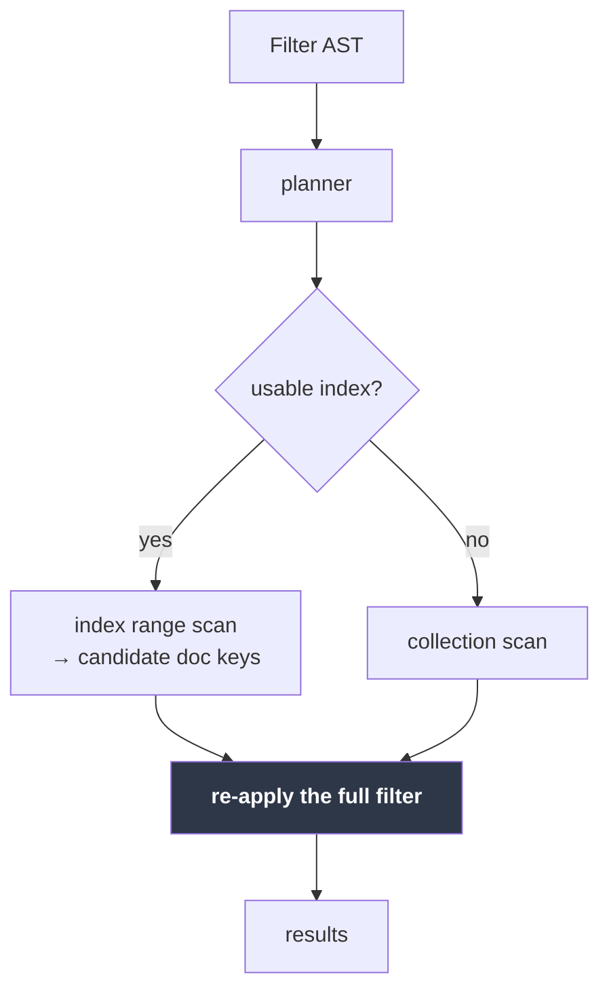
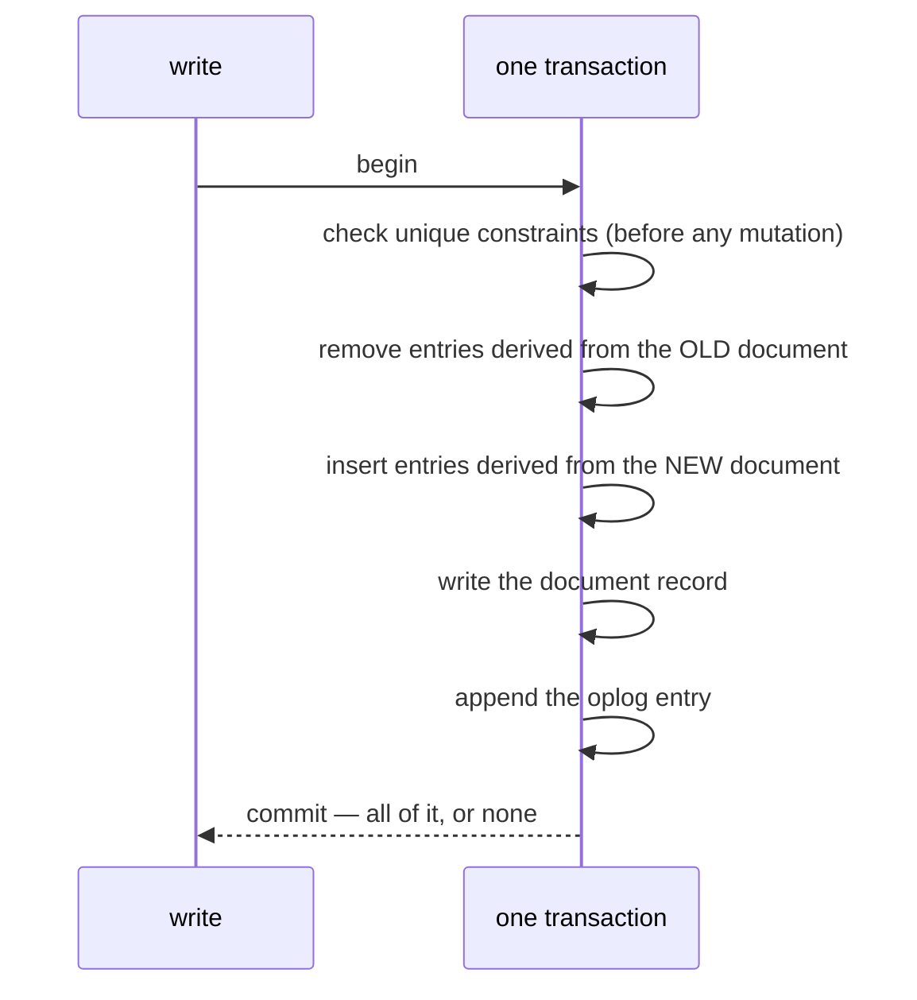

# Indexes

[← Documentation index](README.md)

Secondary indexes: how entries are maintained, how the planner picks one, and
what a unique constraint does and does not promise.

Implemented in `kimmy-storage/src/index.rs` and `kimmy-query/src/plan.rs`.

---

## Using them

```bash
curl -XPOST localhost:7878/v1/db/shop/coll/orders/indexes -H "$A" -d '{
  "fields": [ { "path": "item" }, { "path": "qty", "descending": true } ],
  "unique": false,
  "name":   "item_qty"
}'

# The same route builds a TTL index — see "TTL indexes" below.
curl -XPOST localhost:7878/v1/db/shop/coll/sessions/indexes -H "$A" -d '{
  "fields": [ { "path": "seen" } ],
  "expireAfterSeconds": 3600,
  "name":   "ttl_seen"
}'

curl        localhost:7878/v1/db/shop/coll/orders/indexes -H "$A"
curl -XDELETE localhost:7878/v1/db/shop/coll/orders/indexes/item_qty -H "$A"
```

`fields` is an **array**, not a `{field: 1}` object, deliberately: field order
decides which queries a compound index can answer, and JSON object key order is
not something a client can rely on surviving its own serialization. The server
keeps the order it receives — `docs/http-api.md`, "The JSON boundary" — so the
array guards the client end of the wire, not this one.

Creating and dropping require the `admin` action; listing requires `read`.

### Did it get used?

```bash
curl -XPOST .../orders/find -H "$A" -d '{"filter":{"qty":7},"explain":true}'
```

```json
{ "documents": [ … ],
  "explain": {
    "strategy": "index",
    "index": "qty_1",
    "indexFieldsUsed": 1,
    "documentsExamined": 10,
    "documentsMatched": 10
  } }
```

`strategy` is `index`, `collectionScan`, `indexUnion` or `idLookup`. Watching
`documentsExamined` fall while `documentsMatched` stays the same is the whole
point of an index.

The `filter` of `vector_search` and `hybrid_search` is planned the same way, so
an index on a field that searches filter by is used there too; `explain` on a
`find` with the same filter shows the strategy the search gets
([Vectors](vectors.md#search)).

## `_id` needs no index

**A filter that pins `_id` is answered through the primary key**, reported as
`"strategy": "idLookup"` with `index: null` — no index was consulted and none
needs to exist. It applies to an equality and to an `$in` over `_id`, and
`update`, `delete` and `count` get it as well as `find`.

```jsonc
{ "_id": 4171 }                  // idLookup — one read
{ "_id": {"$in": [1, 2, 3]} }    // idLookup — one read per value
{ "_id": {"$gt": 100} }          // scan — a range, not a set of probes
{ "$or": [{"_id": 1}, {"qty": 3}] }
                                 // scan — a disjunction constrains nothing
                                 //        that must hold of every match
```

Over 10,000 documents this is 7.3 ms → 0.5 ms; see [Benchmarks](benchmarks.md).
`GET /v1/db/{db}/coll/{coll}/docs/{id}` is still slightly cheaper, because it
does no filter parsing or planning, but it is no longer a difference worth
restructuring an application around.

**Creating an index on `_id` is not useful** and the fast path does not need
one. If you have one, it is maintained on every write for nothing.

**`update` and `delete` take `explain` too, and plan the same way.** They did
not until M9 — both scanned the collection however selective the filter was,
which meant an index sped up reading a document but never changing one. If a
write feels slow, ask it the same question you would ask a read.

---

## The rule everything follows from

> An index answers **"which documents might match"**. Only the filter decides
> membership.

So every candidate an index produces is **re-checked against the full filter**
before it is returned. Skipping that recheck is how index-backed queries start
returning documents that do not match.

Candidates are **streamed, not gathered.** A read walks the index range and
rechecks each document as it arrives, so a `limit` bounds the work and nothing
proportional to the range is held ([ADR-098](decisions.md)). An equality that
pins a complete key — every field of the index, or a `$in` on its last field
behind equalities on the rest — is one run of entries already in `_id` order,
read in place and stopped where the caller stops. A `$in` is those runs
merged, one head per probe. A range, or an equality on a prefix of a compound
index, spans many keys whose document keys interleave; a read that needs
`_id` order keeps only the `skip + limit` smallest document keys of one pass
over the range, and goes back for more only if the recheck rejected enough of
them. `explain` reports the entries read as `indexEntriesRead`, beside the
documents examined.

It follows that a computed key range may be **too wide, but never too narrow**.
A wide range costs time; a narrow one silently drops matching documents. Every
uncertain decision in the planner resolves toward "wider".



---

## Entry maintenance

Index entries are written in the **same redb transaction** as the document they
describe. Anything less lets an index disagree with its data — which does not
crash, it returns wrong answers.



A replace needs the document's **previous image** to know which entries to
remove; they are derived from the old value, not the new one. A delete removes
every entry, so a scan cannot surface a candidate whose document is gone.

Constraints are checked before anything is mutated, so a rejected write leaves
the index exactly as it was.

---

## What gets indexed

| Document | Keys produced for an index on `a` |
|---|---|
| `{a: 5}` | `5` |
| `{b: 1}` — `a` absent | `null` |
| `{a: null}` | `null` |
| `{a: ["x", "y"]}` | `"x"`, `"y"`, **and** `["x","y"]` |
| `{a: ["x", "x"]}` | `"x"`, `["x","x"]` |

**A missing field indexes as `null`.** That is what keeps `{a: null}` —
which matches missing fields — answerable from the index.

**An array indexes its elements *and* itself.** Mongo indexes only the elements;
that would leave `{tags: ["a","b"]}` (whole-array equality) with no entry, so an
index-backed query would return an *incomplete* result. Storing both costs a
little space and removes the hole.

**Values equal across numeric types share a key.** `5i32`, `5i64`, and `5.0`
encode identically, so a lookup for `5` finds a document that stored `5.0`. See
[Key Encoding](key-encoding.md).

### Documents an index cannot key

Three shapes give an index no finite, exact set of keys for a document:

- **arrays at two of a compound index's paths** — the keys would be the
  cartesian product, `|a| × |b|` entries for one document;
- **more than 1,000 keys for one document** — the backstop behind that rule,
  and the ceiling for a single-field index over one very large array;
- **a `Decimal128` at an indexed path** — which has no exact key encoding
  ([Key Encoding](key-encoding.md#decimal128-is-refused)).

MongoDB refuses the first ("cannot index parallel arrays"). KimmyDB used to
refuse all three, per document, at write time. **It no longer refuses any of
them.** The document is stored, and the index files it under its **unkeyed
run** — one entry under an empty key, which no real key can be and which
sorts ahead of every real key. Every scan of the index reads that run beside
its ranges and rechecks each document against the full filter, exactly as it
rechecks any candidate. So every query still finds the document, and none
finds it wrongly: the range was too wide, never too narrow, which is the rule
everything above follows from.

**An index is an access path, not a schema.** That is the whole of the
reasoning, and [ADR-139](decisions.md) records what it cost to learn: a
refusal that depends on an index is a constraint, and a leaderless store
cannot hold a constraint across members without coordination. A member that
had not yet received a definition legally accepted a document the
definition's holder could then neither apply nor skip, and the holder's
replication stopped for the life of the process. The rule bought a smaller
index and an early error for a badly shaped document; it cost a cluster its
convergence.

**Where it shows.** Each unkeyed filing is logged at warning naming the
database, collection, index and document id, and counted in
`kimmy_index_unkeyed_total`. The index listing, `describe` and `createIndex`
report `unkeyed` — how many documents the index holds that it could not
key — and `explain` reports `unkeyedCandidates` beside `indexEntriesRead`,
the entries a query read from the run. Zero is the index doing its whole
job. Anything else is the cost of leaving such documents under the index:
every scan of it rechecks all of them. The fix is the collection owner's, and
needs no access to the server — reshape the documents, or split the compound
index into single-field ones, which key every shape.

**The unique exception.** A unique index must be able to key every document
it covers, or it reports a constraint it does not hold. So a **local** write
a unique index cannot key is still refused with `400`, naming the index, and
creating a unique index over such a document is refused too — a client on
this member is there to be told ([ADR-020](decisions.md)). A **replicated**
write a unique index cannot key is a fact another member accepted: it is
filed unkeyed, takes part in no uniqueness check, and is warned about and
counted like any other, rather than refused.

**On a clustered node, `createIndex` and `dropIndex` do not answer until
every live member has applied or refused the change**, or a deadline has
passed ([ADR-140](decisions.md)). The response's `confirmation` names each
member's answer, so a client that creates an index here and writes through a
front a moment later finds it enforced wherever the write lands. What is
pushed is the window the member lacks, ending in the change, so a member's
history never gains a hole ([ADR-143](decisions.md)). A member that did not
answer in time, or was too far behind for one push to reach, is listed as
`pending` and receives the change through anti-entropy; a partitioned member
always will, which is why the
paragraph above, not this one, is what keeps the cluster safe.

**On a replica.** A definition replicates as an operation, and the replica
builds it over *its own* documents, which are not the origin's. A document
the definition cannot key is filed unkeyed, and the definition stands. The
replica **skips** a definition only when it cannot apply it at all — a shape
this build does not support, or a rival under a name it holds with no
creation stamp to arbitrate — logging a warning naming the index and the
reason and counting it in `kimmy_sync_ddl_refused_total`. The round goes on,
the entries behind it arrive, and the definition stands on the members that
could apply it. It does not fail the round: the refusal is a fact about the
replica's state, and retrying the same entry could never succeed.

What reaches the refusal is a definition this build cannot apply, an
`enforcement` mode it does not implement, or a rival definition arriving
against a name this member holds **without a creation stamp**, which the
conflict rule below has nothing to compare and so cannot resolve. Two
*stamped* definitions under one name are resolved rather than refused, and
the resolution itself is counted nowhere; the stamp rules below say how. A
snapshot page carrying a definition this member cannot apply is classified
the same way, and the page's documents still restore.

**A drop is an instruction to the cluster, not a report on the member that
answers it.** `DELETE …/indexes/{name}` records the drop and replicates it
whether or not the answering member holds the index, so a drop issued
through a front that spreads requests across members removes the index
wherever it stands; `dropped` in the response says only whether *that*
member held it ([ADR-141](decisions.md)). On a clustered node the drop is
pushed to every live member before the response, and `confirmation` names
who applied it.

**A dropped index leaves a tombstone**, and it is one reason the counter does
*not* move for the sequence ADR-123 was written about. Like a dropped collection, an
index drop is recorded in `indexes_dropped` under the drop's stamp and kept
for `tombstone_retention_secs`. So a creation re-served or replayed after the
drop — which anti-entropy does routinely, and which is how the original wedge
kept rebuilding an index over a two-array document written legally once the
index was gone — reads as **history**: it is counted as applied and never
backfilled, so nothing can be refused and the counter stays where it was.
That is the fix working, not a signal missing. Creating an index of the same
name again, stamped after the drop, is a new index and wins. See
[ADR-123](decisions.md).

**Every index carries the stamp of its creation**, and two questions are
answered by comparing against it.

*A drop older than the index it names is history.* A name that has been
created, dropped and created again derives the same id each time, and
anti-entropy re-serves overlapping windows as a matter of course — so the drop
between the two creations arrives again after the recreation. It records its
tombstone, which never moves backwards, and leaves the newer index alone. A
drop stamped **after** the index it names still removes it, which is the
ordinary case.

> **A replicated drop cannot remove an index whose creation stamp is ahead of
> it.** Ordinarily that is the rule doing its job on a re-served window, and
> it is logged at debug and counted nowhere, because it happens routinely. But
> a member whose clock ran far ahead when it created the index will decline
> *every* drop for that name, indefinitely, with no default-level signal — the
> drops keep arriving and keep being declined — each one counted in
> `kimmy_sync_ddl_declined_total` and logged at info with both stamps, which
> is the signal this case has ([ADR-141](decisions.md)). The escape hatch is a local
> `DELETE /v1/db/{db}/coll/{coll}/indexes/{name}` on that member: a **local**
> drop does not consult the creation stamp, removes the index, and mints a
> drop entry under the member's own current stamp, which is ahead of the
> creation and so removes it on every other member too.

*Two identical definitions converge on one stamp.* Two members can also create
the *same* definition independently, which is not a conflict — but the two
creations carry different stamps, and after the rules above the stamp is what
answers a drop. So the stamp converges as well: the **later** creation is the
one that stands, on every member. That is the same rule as the first one above
rather than a second: the stamp names the index now standing under the name,
both members have held one continuously since the later creation, and a drop
stamped before it was aimed at neither. Without the convergence, one
definition under two stamps would answer one drop two ways and the members
would split with nothing left to re-serve.

*Two definitions under one name settle on the later stamp.* Two members can
create the same index name with different definitions while they cannot see
each other; neither is wrong, and neither can be kept without the cluster
holding two schemas indefinitely. The later creation stamp wins on every
member — the same rule, and the same stamp comparison, that settles two
concurrent writes to one document. The member whose definition loses logs a
warning naming the index and which parts of the definition moved, and rebuilds
the name under the winner. Nothing is counted for this: it is the conflict
rule working, not a divergence. **Creating a conflicting definition through
the API is unaffected** — a client is refused `409 conflict`, naming what
differs, because a client is there to be told.

Where the winning definition is one the receiving member cannot apply, the
whole replacement is abandoned: that member keeps the index it already had,
the refusal is counted in `kimmy_sync_ddl_refused_total` and logged, and the
round goes on. A document the winner cannot key does not abandon it — the
document is filed unkeyed under the winner, as under any index.

**An index created before this version carries no creation stamp**, and reads
as *older* than every drop and every rival: a replayed drop removes it, and a
rival definition is refused and counted rather than resolved. That is exactly
the behaviour of the version before it. It ends as soon as the index is
recreated — or sooner, on its own: a member holding the same definition *with*
a stamp hands it over on the next round, which is the true creation stamp
rather than an invented one. See [ADR-132](decisions.md).

---

## The planner

Rule-based, no cost model. The operator surface is small enough that
predictability beats sophistication.

1. Collect the predicates that must hold for **every** match.
2. For each index, count how many **leading** fields those predicates cover with
   equality, plus an optional range on the next field.
3. Take the index covering the most fields. If that count is zero, scan.

```javascript
// index: [item, qty]
{ item: "w1", qty: 3 }              // 2 fields  ✓ best
{ item: "w1", qty: { $gt: 3 } }     // 2 fields — equality prefix + range
{ item: "w1" }                      // 1 field
{ qty: 3 }                          // 0 — the leading field is unconstrained
```

### What the planner deliberately ignores

Each of these only costs selectivity, never correctness, because the filter is
re-applied regardless.

| Ignored | Why |
|---|---|
| `$or` / `$nor` branches | Their branches need not all hold; narrowing on one would drop what the other matches |
| `$ne` `$nin` `$not` | Describe what a document is *not* — no bounded range |
| `$exists` `$regex` `$size` `$all` `$elemMatch` | Cannot be turned into a key range safely |
| `$mod` | A remainder is not a range — every fourth key is not a contiguous run of them |
| The **second end** of a two-sided range, on a **multikey** index only | See below — an array field can satisfy each bound with a *different element* |

`$in` **is planned**, as a union of point probes — one per distinct value,
deduplicated on the encoded key so `[5, 5.0]` probes once, each probe carrying
the equality prefix. `$in` differs from `$or` in the way that matters: it is a
disjunction *on one field*, so every match still satisfies "this field is one
of these", which a union of index probes can answer. The probes are
equalities, so they are sound on a multikey index — a document whose array
holds two listed values is found by both probes, and the merge that reads
them sees its key twice in a row and takes it once. `explain` reports the
shape as `"strategy": "indexUnion"` with a `"probes"` count **when there are
two or more probes**; a one-value `$in` is one probe and reports as
`"strategy": "index"`, like the equality it is. An empty `$in` list plans an
empty union — zero probes, zero candidates, no documents touched — and
`explain` reports that as `"strategy": "index"` with `"documentsExamined": 0`
and **no `probes` key**: the key appears only when there is more than one.

Ranges on **descending** fields are planned like any other. The inverted
encoding swaps which end each bound narrows — the value-space lower bound caps
the key-space *top* — and getting that swap backwards yields a range that is
too **narrow**, which is why the planner refused these outright until the swap
had its own tests: encoded-key assertions on the planner, equivalence and
selectivity tests against a real engine, and the property test that caught the
original two-sided-range bug, which generates descending indexes too.

### When an index is worth it — measured

| Matching documents (of 10,000) | Indexed | Scan |
|---:|---:|---:|
| 1 | 0.003 ms | 8.1 ms |
| 100 | 0.171 ms | 8.1 ms |
| 1,000 | 1.67 ms | 7.9 ms |
| 5,000 | 8.29 ms | 7.9 ms |

A scan is flat — it reads everything either way, at ~0.8 µs per document. The
indexed path costs ~1.66 µs per candidate and reads only candidates. A random
read is about twice a sequential one, so **an index wins whenever it eliminates
more than half the collection**, and the measured crossover sits exactly there.

The planner has no statistics, so it uses an index whenever one applies —
including on the unselective filters where a scan would be marginally faster.
That costs 8.3 ms against 7.9 ms in the worst case measured, which is why
statistics have not been worth building. Full numbers in
[Benchmarks](benchmarks.md).


A conjunction *containing* an `$or` still uses its other conjuncts —
`{a: 1, $or: [...]}` narrows on `a == 1`, which must hold for every match.

### Ranges use both ends — unless the index is multikey

A field may hold an array — a **multikey** index — and Mongo semantics let
*different elements* satisfy each end of a range:

```javascript
// document
{ a: [2, 0] }

// matches: element 2 satisfies $gte, element 0 satisfies $lte
{ a: { $gte: 1, $lte: 1 } }
```

Neither element satisfies *both* bounds, so intersecting them into a single key
range `[1, 1]` excludes the document entirely — a range that is too narrow, and
therefore silently wrong.

So whether both ends may be used hangs on one fact about the *data*, and the
write path tracks it: each index carries a **`multikey`** flag, set — in the
same transaction as the index entries — the first time any document contributes
more than one key, whether by holding an array or by a path that fans out
through one (`a.b` over `{a: [{b: 1}, {b: 2}]}`). The backfill sets it for
documents that predate the index, and a replicated write sets it on the node
that applies it. It shows in `GET /indexes`.

- **Not multikey** (the scalar-only majority): both bounds.
  `{qty: {$gte: 5, $lte: 9}}` scans exactly `[5, 9]` and stops.
- **Multikey**: one bound, as before — the range stays a superset and the
  recheck removes the extras.

The flag is **one-way**. Deleting the last array does not clear it, because
proving no document still holds one is a full scan for the sake of a planner
hint.

Two details that keep this honest under concurrency, both found rather than
designed:

- A plan that intersected both bounds is re-validated **in the same storage
  snapshot as the scan**. The plan was built from a metadata read that is
  already stale; if a write made the index multikey in between, the scan
  refuses and the query falls back to scanning the collection — possible at
  most once per index, ever.
- Index maintenance re-reads the index definitions **inside the write's own
  transaction** rather than trusting the caller's handle. A write through a
  handle fetched before an index existed used to skip that index silently —
  no entries, no unique check, no multikey observation.

> The one-bound rule was a real bug fix, found by the equivalence property test
> once it began generating two-sided ranges. It had passed hundreds of
> one-sided cases first — a one-sided range with a bad bound comes out too
> *wide*, which the recheck silently repairs. The flag now confines that
> penalty to the indexes that actually need it.

### Bounds

The upper bound carries a `0xFF` sentinel so it reaches past every continuation
of the prefix. Type tags occupy `0x01..=0xF0`, and a descending component
inverts them into `0x0F..=0xFE`, so `0xFF` exceeds any possible first byte. That
is what lets a one-field equality on a two-field index still find documents
whose key carries a second component.

---

## Partial indexes — indexing only some documents

An index with a `partialFilterExpression` holds **only the documents matching
it**. Smaller index, and a unique constraint that applies to a subset.

```json
{ "fields": [{ "path": "email" }],
  "unique": true,
  "partialFilterExpression": { "email": { "$exists": true } },
  "name": "email_unique_present" }
```

That example is the motivating case: **unique only where the field is present**.
It was impossible before, because a missing field indexes as null and two
documents lacking it collided on that null entry.

A bound or an equality in the expression cannot be a `Decimal128`: the
canonical order ranks one equal to every other number, so the filter would
select every numeric value and the index would hold documents its definition
never named. `createIndex` refuses it, naming the path
([Key encoding](key-encoding.md#decimal128-is-refused)).

**There is no separate `sparse` flag.** A sparse index is exactly
`{field: {$exists: true}}`, which is where MongoDB has been steering people for
years, so there is one mechanism rather than two overlapping ones.

### The filter language is deliberately small

| Allowed | |
|---|---|
| `{field: {$exists: true}}` | the sparse case |
| `{field: <value>}` | equality |
| `{field: {$eq\|$gt\|$gte\|$lt\|$lte: <value>}}` | comparison against a literal |
| any conjunction of the above | |

**Refused at index creation:** `$or`, `$ne`, `$in`, `$nin`, `$regex`, `$not`,
`$elemMatch`, `$exists: false`, and more than one operator on a field.

This is not laziness — it is the safety property. A partial index may answer a
query only if the query is **provably contained** by the filter, and general
implication between filters is not decidable. Restricting the language makes
containment a *decision* rather than a best effort, and a wrong best effort here
returns a **subset** with nothing to indicate it. That is the same failure this
codebase already met with multikey.

The refusal lands at creation, where an operator is present to read it, rather
than at query time where the only symptom would be a plan that quietly stopped
applying.

### When the planner will use one

It must prove every predicate of the filter from the query:

```javascript
// index: {status: "active"}
{ "status": "active", "qty": 4 }      // index      — proven
{ "qty": 4 }                          // scan       — nothing about status
{ "status": "done", "qty": 4 }        // scan       — wrong value
{ "status": {"$in": ["active"]} }     // scan       — equivalent, not proven
```

Bounds compare by strictness, and the edges matter:

```javascript
// index: {qty: {$gte: 10}}
{ "qty": {"$gte": 50} }   // index
{ "qty": {"$gt": 10} }    // index
{ "qty": {"$gte": 5} }    // scan  — looser

// index: {qty: {$gt: 10}}
{ "qty": {"$gte": 10} }   // scan  — the document holding exactly 10
                          //         satisfies the query and is not indexed
```

**`{field: null}` never proves anything.** It matches an explicit null *and* a
missing field, so it cannot imply the field exists — answering it from a
presence-filtered index would silently drop every document missing the field.
`explain` will report `collectionScan` for it, and that is correct.

### Other behaviours

- **Membership is maintained, not decided once.** A document updated *out* of
  the filter loses its entries; updated back *in*, it regains them.
- **Creating a partial unique index judges only the documents it covers.**
  Duplicates outside the filter do not block creation, because they are not in
  the index.
- **A document outside the filter cannot make the index multikey**, since the
  array it holds is not indexed.
- `listIndexes` reports `partialFilterExpression` when there is one.

If a partial index is not being used and you expected it to be, ask `find` with
`"explain": true` — the answer is almost always that the query does not pin
enough to prove containment.

---

## Resolving a unique violation

A `local` unique index is enforced on the node that accepts a write and only
*detected* across nodes, after the fact, when a replicated write is merged
([ADR-029](decisions.md)): both documents exist, the constraint is broken, and
the database cannot choose between them. Detection is a `uniqueViolation`
change-stream event and the `kimmy_unique_violations` count; **resolution**
is the application's, and `GET …/violations` is where it starts
([ADR-087](decisions.md)):

```bash
# Which indexes have violations standing right now, and how many
curl localhost:7878/v1/db/shop/coll/users/violations -H "$A"
# -> { "count": 1, "indexes": [ { "name": "email_1", "count": 1 } ] }

# The colliding groups on one index, each with its documents
curl 'localhost:7878/v1/db/shop/coll/users/violations?index=email_1' -H "$A"
# -> { "index": "email_1", "count": 1, "groups": [
#      { "ids": ["local", "remote"], "merged": "remote",
#        "documents": [ {...}, {...} ] } ] }
```

The recipe: for each group, decide which document keeps the value — `merged`
is the one whose arrival revealed the collision, the others were already
visible — then delete or rewrite the rest. Either resolves it: the route
re-evaluates each group's documents when asked, so a member that is gone, or
whose value no longer meets another member's under the index, drops out of
the group, and a group left with one member stops being reported. Nothing is
written by the route itself. The report is derived from the retained oplog, so a
collision older than `storage.oplog_retention_secs` is no longer listed even
if both documents still exist — the change-stream event is the durable
record, and an application that needs longer memory keeps it.

**What a call costs.** Being derived from the retained oplog, the report is
one pass over it — the header of every retained entry, whatever collection
wrote it — so a call takes longer as `storage.oplog_retention_secs` and the
node's write rate grow, not as this collection does. A collection with no
unique index, or `?index=` naming something that is not one of its unique
indexes, is answered without the pass. Call the route to resolve what a
`uniqueViolation` event announced, not on a timer ([ADR-153](decisions.md)).

---

## TTL indexes — expiring documents

An index with `expireAfterSeconds` also becomes a **policy**: a background pass
deletes documents whose indexed date is that many seconds in the past.

```json
{ "fields": [{ "path": "seen" }], "expireAfterSeconds": 3600, "name": "ttl_seen" }
```

`expireAfterSeconds: 0` is the absolute-deadline pattern — the document goes as
soon as the date passes, so store the moment it should die.

**Why the policy rides on an index rather than being a collection setting.**
The pass has to *find* expired documents on every tick, forever. A collection
scan costs ~0.8 µs per document present, so at ten million documents that is
~8 s per pass whether anything expired or not. A range scan over the TTL index
costs ~1.66 µs per candidate returned, and the candidates are exactly the
expired documents ([Benchmarks](benchmarks.md)). The index is both the policy
and the mechanism, and it still answers ordinary queries.

### The rules

- **One field.** A compound TTL index is refused: expiry reads one date and
  there would be no rule for which field that is.
- **Dates only.** A document whose indexed field holds a string, a number or
  nothing at all is never expired. This is what stops a policy added to a
  heterogeneous collection from deleting everything that lacks the field. Type
  ordering in the key encoding gives it for free — non-dates sort outside the
  scanned range.
- **Best-effort, not a deadline.** Expiry runs every `storage.ttl_interval_secs`
  (default 60), and a pass removes at most 1,000 documents per collection so a
  backlog drains over several ticks instead of holding the single writer.
  A document lives until the pass that finds it.
- **A refreshed document survives.** The scan and the delete are separate
  transactions, so the delete re-reads the document inside its write and
  declines if the date has moved on. Extending a session while the pass is
  running does not lose it.
- **Changing the policy needs the index recreated.** Re-creating an index
  under its existing name with an identical definition is idempotent; any
  part differing — `expireAfterSeconds`, but equally the field list, `unique`
  or `partialFilterExpression` — is a `409 conflict` naming what moved,
  rather than a silent keep, because silently keeping the old TTL would leave
  documents living longer than you just asked with a success in return.

### In a cluster

**One node expires a given collection**, chosen by rendezvous hashing over the
live member set — the same mechanism webhook subscriptions use (ADR-045,
ADR-051). Its deletes then replicate as ordinary deletes.

The alternative, every node expiring independently, is *convergent* — N deletes
of one document settle to the same tombstone — but N-1 of those entries are
superseded work that still costs oplog space, replication bandwidth and
change-stream traffic. On a five-node cluster that is 5× amplification of a
background job.

Two consequences, both deliberate:

- If the owning node is stopped or partitioned, that collection **stops
  expiring** until membership changes and ownership moves.
- While membership settles, a brief double-delete is possible. Both converge to
  the same tombstone, so it costs one extra oplog entry.

**An expiry is an ordinary delete.** It is indistinguishable from a user delete
in a change stream or a webhook, which is also MongoDB's behaviour. A dedicated
op kind would have been a stop-the-cluster upgrade — `op_kind_from_tag` refuses
an unknown tag as *corruption* — and that was not worth the audit trail.

### Watching it

| Metric | |
|---|---|
| `kimmy_ttl_expired_total` | Documents deleted by a TTL index |
| `kimmy_ttl_skipped_total` | Candidates refused because the document was refreshed first |

Summed across a cluster, `kimmy_ttl_expired_total` is what makes "one document,
one delete" a *measured* property — the cluster harness asserts exactly that,
because correctness alone cannot tell the two designs apart.

A steadily rising `kimmy_ttl_skipped_total` means documents are being refreshed
about as fast as the pass finds them, which is worth knowing before it looks
like the pass is broken.

`storage.ttl_interval_secs = 0` disables expiry entirely, leaving any TTL index
defined but inert.

---

## Unique indexes

```json
{ "fields": [{ "path": "email" }], "unique": true }
```

A duplicate write is rejected with **409 `unique_violation`**. A document's own
existing entry never counts against it, so updating in place works. Creating a
unique index over data that *already* violates it is refused — building it
anyway would advertise a constraint that does not hold. For the same reason a
unique index refuses a document it cannot key, where every other index files
it unkeyed: see [Documents an index cannot key](#documents-an-index-cannot-key).

### The cross-node limit, stated plainly

> **A `local` unique index is a single-node guarantee.**

Uniqueness is a *global* invariant: deciding whether a write is legal requires
knowing what every other node is concurrently doing. That is provably not
maintainable without coordination, so a leaderless cluster that accepts writes
everywhere during a partition cannot also guarantee it. Full reasoning in
[ADR-020](decisions.md).

| `enforcement` | Reach | Availability | Status |
|---|---|---|---|
| `local` (default) | The accepting node. Cross-node violations are **detected after merge**, not prevented | Full | ✅ |
| `coordinated` | Cluster-wide, by reserving the value at its owning node | That value's writes fail while its owner is unreachable | **Reserved, not implemented** — refused with `501`. Clustering shipped in M4; this did not, because it trades availability for the guarantee |

**`_id` needs none of this.** Two nodes inserting the same `_id` collide on one
key and last-writer-wins converges them to a single document, so primary-key
uniqueness holds by construction.

---

## Backfill

Creating an index on a non-empty collection populates it **inside one
transaction**. The index is therefore either fully present or entirely absent —
a crash partway can never leave a half-built index silently answering queries
with incomplete results.

The cost: writes to that collection wait for the build. Acceptable at current
scale; an online backfill is a later concern.

---

## Sharp edges

**`skip` is still O(n).** Skipped documents are visited even with an index. Deep
paging remains expensive, and with a `sort` other than `{"_id": 1}` the window
`skip + limit` may not exceed 10,000 ([ADR-098](decisions.md)).

**Order without an explicit `sort` is unspecified.** An index-backed query and a
scan visit documents in different orders, so which documents a `limit` returns
can differ between them. Add a `sort` when the subset matters. This matches
MongoDB.

**Index ids are derived from the index name**, not allocated from a counter, so
every node in a cluster computes the same id for the same index. That is what
lets an index definition replicate at all: entry keys embed the id, so a
node-local counter would mean two nodes keying the same storage while describing
different indexes. See [ADR-032](decisions.md).

The consequence is that **recreating an index under the same name reuses its
id** — unavoidable, since "same name means same id everywhere" and "recreating
yields a fresh id" cannot both hold. Purging on drop is therefore load-bearing
rather than tidy, and `drop_index` removes the entries in the same transaction
as the metadata change.

**No index statistics.** The planner counts covered fields; it has no idea which
index is more *selective*. Two indexes covering the same number of fields are
resolved by declaration order.

---

## How this is verified

The load-bearing test asserts that **index-backed results are identical to a
full collection scan** — across a dataset built from the cases indexes most
easily get wrong (missing fields, nulls, arrays, mixed numeric types,
duplicates), and again after replace, delete, insert, and delete-then-reinsert.

Mutation testing found a real gap in that suite: the equivalence proptest
originally generated only *one-sided* ranges, where a mis-encoded bound makes the
range too **wide** and the recheck silently repairs it. Only a **two-sided**
range exposes a range that is too narrow. The generator now produces them, and a
descending-only index test was added so the planner cannot sidestep the
descending path by preferring an ascending index.

See [Testing](testing.md).

---

## Next

- [Key Encoding](key-encoding.md) — the byte ordering indexes rest on
- [Query Language](query-language.md) — the operators the planner reads
- [Decisions](decisions.md) — ADR-020 on uniqueness and coordination
