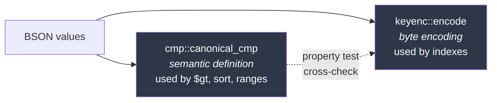
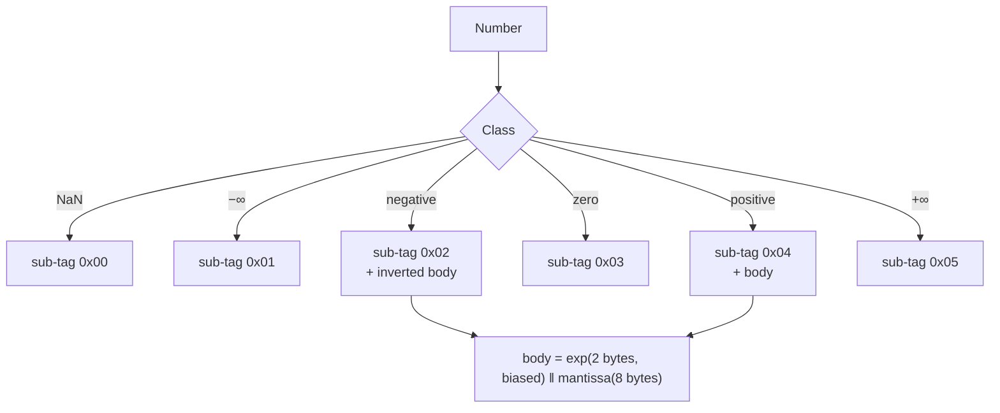

# Key Encoding

[← Documentation index](README.md)

The most subtle component in KimmyDB, and the one whose failure mode is worst:
it does not crash, it silently returns wrong query results.

Implemented in `kimmy-core/src/keyenc.rs` and `kimmy-core/src/cmp.rs`.

---

## The problem

Secondary indexes are redb key ranges, and redb compares keys with `memcmp`. So
an index is only correct if the byte encoding of a value sorts *exactly* the way
the value itself sorts:

```
encode(a).cmp(encode(b))  ==  canonical_cmp(a, b)     for all a, b
```

Get this wrong and nothing fails loudly. Range scans quietly miss documents,
`$gt` returns the wrong set, sorts come out shuffled. The bug surfaces as "the
database gave me the wrong answer", weeks later, on someone else's data.

That risk shapes everything below.

---

## Two independent implementations

There are deliberately **two** implementations of ordering:



`keyenc` does not call `canonical_cmp`, and `canonical_cmp` does not call
`keyenc`. A property test asserts they agree over 2,000 generated value pairs
concentrated on type boundaries, numeric limits, NUL bytes, and empty
composites.

Writing the encoder to delegate to the comparator would have been less code and
strictly worse: a single implementation cannot catch its own bit-manipulation
errors. An oracle is the point.

---

## Type ordering

Values of different types never compare by content. A leading tag byte decides,
and the tags are chosen so cross-type ordering falls out of that byte alone.

| Tag | Type | Tag | Type |
|---|---|---|---|
| `0x01` | MinKey | `0x80` | Boolean |
| `0x10` | Null / Undefined | `0x90` | DateTime |
| `0x20` | Numbers | `0xA0` | Timestamp |
| `0x30` | String / Symbol | `0xB0` | Regex |
| `0x40` | Document | `0xC0` | DbPointer |
| `0x50` | Array | `0xD0` | JavaScript |
| `0x60` | Binary | `0xE0` | JS with scope |
| `0x70` | ObjectId | `0xF0` | MaxKey |

This is MongoDB's canonical order, so queries written against Mongo behave the
same way here. Gaps between tags are intentional — a type can be slotted in
later without renumbering.

---

## Numbers: the hard part

All numeric types share one tag, because `5i32`, `5i64`, and `5.0f64` must
compare equal *and encode identically*. If they encoded differently, an index
lookup for `5` would miss a document that stored `5.0`.

### Why not encode through `f64`?

The obvious approach — convert everything to a double and bit-twiddle for
order — loses above 2^53:

```
9_007_199_254_740_992  as f64  →  9007199254740992.0
9_007_199_254_740_993  as f64  →  9007199254740992.0    ← same!
```

Two distinct `i64` values would collapse into one index entry. Anyone using
large integer ids gets silently wrong results.

### The exact representation

Every finite `i32`, `i64`, and `f64` is written as:

```
value = ±mantissa × 2^(exp − 63)
```

with the mantissa normalized so its high bit is set. This is exact for all three
types — no rounding anywhere.



The sub-tags are ordered so the leading byte alone sorts
`NaN < −∞ < negatives < 0 < positives < +∞` — matching Mongo, which sorts NaN
below all numbers.

For finite non-zero values the body is 10 bytes: a 2-byte biased exponent
(`exp + 32768`, big-endian) followed by the 8-byte mantissa. Larger exponent →
larger magnitude; equal exponents compare by mantissa.

**Negatives invert every byte of the body.** For a *prefix-free* code — which
this is, see below — flipping all bytes exactly reverses order, which is what
turns "larger magnitude" into "smaller value".

### Worked example: 5 as three types

| Input | Decomposition | exp | mantissa | Bytes |
|---|---|---|---|---|
| `Int32(5)` | 5 × 2⁰, `lz`=61 | `63−61 = 2` | `5 << 61` | `20 04 80 02 A0 00…` |
| `Int64(5)` | identical | `2` | `5 << 61` | identical |
| `Double(5.0)` | 5×2⁵⁰ × 2⁻⁵⁰, `lz`=11 | `−50−11+63 = 2` | `5 << 61` | identical |

All three produce the same bytes, which is exactly what an index needs.

### Decimal128 is refused

`Decimal128` has no exact representation in this form. Rather than encode it
approximately — which would silently mis-order values — `encode()` returns an
error, and Decimal128 cannot be an index key or `_id`.

Refusing is the honest outcome. An approximate index key is a wrong answer
waiting to happen.

---

## Strings and prefix-freeness

Byte strings are NUL-escaped and terminated:

- `0x00` in the input → `0x00 0xFF`
- terminator → `0x00 0x00`

The terminator sorts *below* an escaped NUL, which is what makes a string sort
before its own extensions:

```
"ab"      →  61 62 00 00
"ab\0c"   →  61 62 00 FF 63 00 00
                    ^^ 00 < FF  ✓
"abc"     →  61 62 63 00 00
                 ^^ 62 < 63  ✓
```

### Prefix-freeness, and why it matters

**No encoding is ever a proper prefix of another.** Fixed-width encodings share
a length; variable-width ones are terminated; documents and arrays end with an
explicit element terminator that cannot appear where an element starts.

Two things depend on this:

1. **Compound keys need no separators.** `encode_compound` is plain
   concatenation, and the leading component still dominates the ordering.
2. **Byte inversion reverses order exactly.** For prefix-free codes this holds;
   for codes with prefixes it does not (if `A` is a prefix of `B` then `A < B`,
   but `flip(A)` is still a prefix of `flip(B)` so `flip(A) < flip(B)` — order
   preserved, not reversed). This is what makes negative numbers work, and what
   will make descending index fields work when indexes land.

---

## Composite values

Documents and arrays are encoded recursively with explicit framing:

```
Array:     0x50  [0x01 <element>]*  0x00
Document:  0x40  [0x01 <key> <value>]*  0x00
```

An element is introduced by `0x01`; the composite ends with `0x00`. Since
`0x00 < 0x01`, a shorter sequence sorts before a longer one that shares its
prefix — matching "compare elementwise, then by length".

Documents compare key-then-value, pair by pair, which is Mongo's rule.

---

## Invariants under test

| Invariant | Test |
|---|---|
| Encoding order matches semantic order | `encoding_order_matches_canonical_order` — 2,000 cases |
| Equal values encode identically | `equal_values_encode_identically` |
| Compound keys order lexicographically by component | `compound_encoding_matches_lexicographic_component_order` |
| Numeric ordering is correct | `numeric_order_matches_an_independent_oracle` — 4,000 cases |
| Ordering is a total order | `ordering_is_transitive`, `ordering_is_antisymmetric` |

### The oracle, and the gap it closed

The cross-check above has a hole for numbers: `keyenc` encodes numbers *through*
`cmp::decompose`, so the two implementations are **not** independent for numeric
values. A bug in the decomposition would corrupt both identically and the
property test would happily pass.

So numeric ordering is additionally checked against an oracle that shares no
code with either — comparing integers as integers, and mixed int/double pairs by
splitting the double into floor plus remainder, never rounding the integer.

### Mutation testing

A passing property test proves nothing if it cannot detect a bug. Two faults
were injected deliberately and both were caught with minimal counterexamples:

| Injected fault | Caught by | Counterexample |
|---|---|---|
| Removed negative-number byte inversion | encoder cross-check | `Int32(-1)` vs `Int32(-2)` |
| Changed exponent normalization `63 → 62` | numeric oracle | `Double(2^53)` vs `Int64(2^53)` |

---

## Comparison semantics beyond the encoder

`canonical_cmp` defines total order across *all* values, but query comparison
adds a rule on top: **`$gt`/`$lt` do not cross type groups.**

```javascript
{ a: { $gt: 1 } }        // does NOT match { a: "text" }
```

Even though strings sort after numbers canonically, Mongo does not report that a
string is greater than a number, and neither does KimmyDB. Sorting uses the full
canonical order; comparison operators are type-restricted. See
[Query Language](query-language.md).

---

## Next

- [Storage](storage.md) — where these keys are used
- [Query Language](query-language.md) — the comparison rules built on top
- [Testing](testing.md) — the wider testing approach
