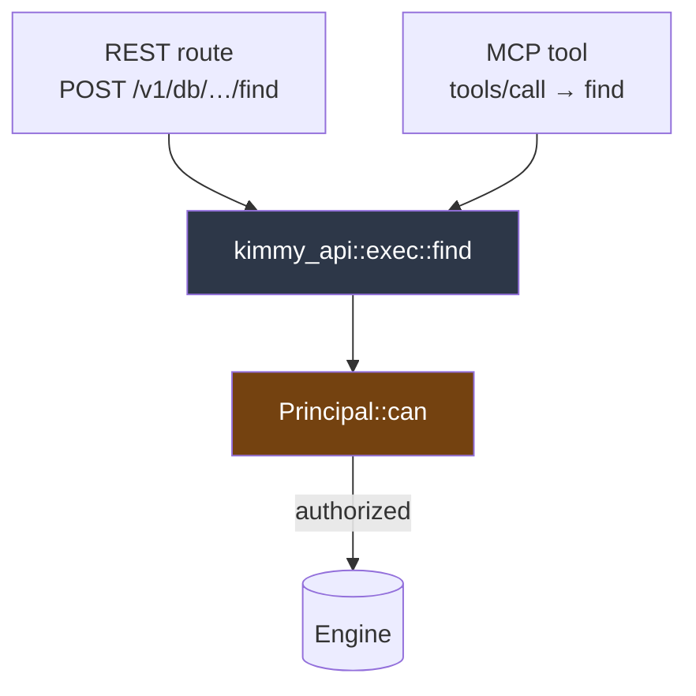

# MCP Server

[← Documentation index](README.md)

KimmyDB speaks the [Model Context Protocol](https://modelcontextprotocol.io)
from inside the database process, at `/mcp` on the same listener as the REST
API. An agent can list databases, infer a collection's shape, query it, and
search it semantically — as whichever user its token identifies.

---

## The one rule

**Every tool call runs as the authenticated principal, through the same
authorization check as the REST route beside it.**

That is the entire reason MCP lives in this process rather than in a sidecar. A
separate MCP server would need its own copy of the rules, and a second copy is
how an agent tool ends up quietly more permissive than the endpoint next to it —
usually months later, when someone adds a tool and forgets a check.

Co-location alone does not achieve this; it only makes it possible. The property
is enforced structurally:



`exec` performs the check *inside* each operation, not beside it. There is no
path from either edge to the engine that skips it — a new tool cannot forget to
authorize, because it never had the option. See [ADR-024](decisions.md).

**Write tools are always registered.** A read-only token sees `insert` in
`tools/list` and gets an authorization error if it calls one. Capability is a
property of the role, not of the build or of a filtered tool list — see
[ADR-025](decisions.md) for why hiding would cost more than it buys.

---

## Connecting

The endpoint is streamable HTTP, stateless, and requires a bearer token.

```bash
TOKEN=$(curl -sX POST http://localhost:7878/v1/auth/login \
  -H 'Content-Type: application/json' \
  -d '{"user":"root","password":"…"}' | jq -r .token)

curl -X POST http://localhost:7878/mcp \
  -H "Authorization: Bearer $TOKEN" \
  -H 'Content-Type: application/json' \
  -H 'Accept: application/json, text/event-stream' \
  -d '{"jsonrpc":"2.0","id":1,"method":"tools/list"}'
```

The `Accept` header must name **both** media types; the protocol requires it,
and omitting one gets a `406`.

An unauthenticated request is rejected with `401` by middleware, before the MCP
transport runs — so a missing token fails at the door rather than inside twelve
separate tools.

### In a client config

```json
{
  "mcpServers": {
    "kimmydb": {
      "type": "http",
      "url": "http://localhost:7878/mcp",
      "headers": { "Authorization": "Bearer <token>" }
    }
  }
}
```

Issue the agent its own user with the narrowest grants that do the job, rather
than handing it a root token:

```bash
curl -X POST http://localhost:7878/v1/users \
  -H "Authorization: Bearer $ROOT_TOKEN" -H 'Content-Type: application/json' \
  -d '{
    "user": "agent",
    "password": "…",
    "grants": [{"db": "shop", "collection": "orders", "actions": ["read", "search"]}]
  }'
```

**`search` is grantable without `read`**, so an agent can be given semantic
search over a collection without raw document access. See
[Security](security.md).

---

## Sessions and token lifetime

The server runs **stateless**: no MCP session is created, and every POST is
authenticated on its own.

This has a consequence worth knowing. A token that expires mid-conversation
stops working immediately, rather than riding a session opened while it was
still valid. That is the correct behaviour — a session that outlives its
credential is a credential that cannot be revoked — but a long-running agent
will need to re-authenticate rather than assuming a connection stays good.

---

## Tools

### Read

| Tool | |
|---|---|
| `list_databases` | Databases the caller may read |
| `list_collections` | Collections in a database, filtered by grant |
| `describe_collection` | **Sampled schema.** See below |
| `find` | Query with the full filter language, with `sort`, `projection`, paging, and `explain` |
| `count` | Match count without returning documents |
| `aggregate` | Group, reshape, join. See [Aggregation](aggregation.md) |

### Search

| Tool | |
|---|---|
| `vector_search` | Semantic k-NN, optionally composed with a filter |
| `hybrid_search` | Dense + lexical, fused with reciprocal rank fusion |

Both require the collection to have embeddings configured — see
[Vectors](vectors.md).

### Write

| Tool | |
|---|---|
| `insert` | One document |
| `insert_many` | Up to 1000 documents in one commit, all or nothing |
| `update` | Update operators against a filter |
| `delete` | Delete against a filter |
| `create_collection` | Required before inserting; a write to a missing collection fails rather than creating it |
| `create_index` | Secondary index |

`aggregate` is the one an agent should reach for when it wants a *number*
rather than rows. Left to `find`, a model pulls documents into its context and
reduces them there — slower, lossy past a page, and expensive. A `$group` does
the work in the database and returns the answer.

Its `$lookup` stage is authorized against the collection it joins, at this edge
as well as the REST one, so a tool call cannot reach a collection the caller's
grants exclude.

---

## `describe_collection` is the important one

A schemaless store is hostile to an agent that has never seen the data. It can
list collections and then has to *guess* field names, which produces empty
results that look like "no matching data" rather than "wrong field".

`describe_collection` samples documents and reports what is actually there:

```json
{
  "database": "shop",
  "collection": "orders",
  "documentCount": 3,
  "sampled": 3,
  "fields": [
    { "path": "customer.tier", "types": ["string"], "presence": 1.0, "example": "gold" },
    { "path": "tags",          "types": ["array"],  "presence": 1.0 },
    { "path": "tags[]",        "types": ["string"], "presence": 1.0, "example": "web" },
    { "path": "total",         "types": ["int"],    "presence": 1.0, "example": 25 }
  ],
  "indexes": [],
  "vector": null
}
```

Points worth understanding:

- **Nested documents become dotted paths**, matching what you write in a filter.
- **Array elements appear under `path[]`**, mirroring how a multikey index
  treats them: a query on `tags` matches an *element*, so the element's type is
  what a caller needs. Reporting only `"array"` would be useless.
- **`presence` is a fraction of the sample, not of the collection**, and counts
  *documents* — a field absent from the sample may still exist. It is inference,
  not a schema, and nothing here is enforced.
- **Recursion is bounded** at six levels, so one pathological document cannot
  produce a field list longer than the documents it describes.

The same information is available over REST at
`GET /v1/db/{db}/coll/{coll}/describe`.

---

## Resources

Each collection is also published as an MCP *resource* at
`kimmy://{database}/{collection}`. Reading one returns its inferred schema plus
three whole documents — the same material `describe_collection` gives, offered
through the channel clients use for "here is what you are working with" rather
than "go and do this".

Listing is filtered by the caller's grants, exactly as `list_collections` is.
Guessing a URI does not help: `resources/read` runs the same check.

**KimmyDB's own internals are omitted** — the `__kimmy` system database and the
`.__vectors` shadow collections. Not as an access control (a superuser can still
read them through `find`, exactly as through REST) but because a resource is
material an agent attaches to its context, and the user store is a column of
password hashes. [ADR-027](decisions.md) has the reasoning.

---

## Configuration

```toml
[server]
mcp = true
mcp_allowed_hosts = []
```

| | |
|---|---|
| `mcp` | Serve `/mcp`. Also `--no-mcp` / `KIMMY_NO_MCP` |
| `mcp_allowed_hosts` | `Host` values to accept. Empty accepts any |

Turning `mcp` off removes surface area; it does not remove a privilege, because
MCP never had one of its own.

`mcp_allowed_hosts` is DNS-rebinding protection, **off by default**. The attack
it prevents needs a server with no authentication, and `/mcp` requires a bearer
token checked before the transport runs. Leaving the SDK's loopback-only default
in place would have rejected every client connecting by a real hostname. If you
set it, list every name clients actually use — anything else is refused. See
[ADR-026](decisions.md).

---

## What an agent is told

The server sends `instructions` at initialize, and they are load-bearing —
they are the only documentation a model gets:

> Start with `list_databases`, then `list_collections`, then
> `describe_collection` […] Guessing field names without it is the usual cause
> of an empty result.
>
> Tools you are not authorized for still appear in this list; calling one
> returns an authorization error rather than being hidden.

The second paragraph matters as much as the first. Without it a model reads an
authorization error as a malfunction and retries; with it, the refusal is a fact
about its own permissions, and it moves on.

Errors are returned with their message intact for anything that is the caller's
fault — a rejected filter names the operator it did not recognize — so an agent
can correct itself instead of retrying blindly. Storage faults return a generic
message, as they do over REST.

---

## Next

- [Security](security.md) — roles, grants, and what `search` means
- [Query Language](query-language.md) — what `find` accepts
- [Vectors](vectors.md) — configuring the search tools
- [Decisions](decisions.md) — ADR-024 through ADR-027
