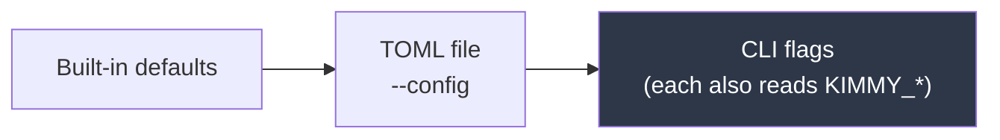

# Operations

[← Documentation index](README.md)

Configuring, deploying, and running KimmyDB.

---

## Configuration

Three sources, lowest precedence first:



Flags win because they are the most specific thing the operator typed. Every
flag also reads an environment variable, so containers need no config file.

Check what a combination actually resolves to, without starting the server:

```bash
kimmyd --config kimmy.example.toml check-config
```

This validates and prints the effective configuration, then exits non-zero if
anything is wrong — useful as a container entrypoint check or a CI step, and it
fails fast on a bad volume mount.

### Settings

| TOML | Env | Default | Notes |
|---|---|---|---|
| `server.bind` | `KIMMY_BIND` | `0.0.0.0:7878` | HTTP, WebSocket, and MCP |
| `server.advertise` | — | derived from `bind` | The URL clients should use to reach *this* node, published to the cluster so `/v1/topology` can hand it out. It cannot be inferred from a wildcard bind, so a node on `0.0.0.0` with this unset advertises nothing and says so at startup; with a concrete bind it defaults to that address, the scheme following whether this node terminates TLS |
| `storage.data_dir` | `KIMMY_DATA_DIR` | `/var/lib/kimmy` | Holds `kimmy.redb` |
| `storage.tombstone_retention_secs` | — | `86400` | **Must exceed your worst tolerable partition.** Governs deleted documents, dropped collections *and* dropped indexes |
| `storage.oplog_retention_secs` | — | `86400` | Bounds resume and peer catch-up |
| `storage.gc_interval_secs` | — | `600` | How often retention is enforced. `0` disables it. A pass holds the single writer only to remove what it found, a thousand records per commit, never for its scans, and visits at most 100,000 documents of the tombstone scan per pass; a pass that overruns the interval is logged at `WARN` and the next runs a full interval after it finished ([ADR-151](decisions.md)) |
| `storage.durability` | — | `durable` | `durable` (every commit fsyncs before it returns) or `coalesced` (a commit waits for the next shared fsync, one per window, so concurrent writers share it). Both are durable when the response returns; there is no class that is not (ADR-088). The sharing is among *concurrent* committers: a lone writer gains nothing from `coalesced` and waits out a window for company that never comes — one writer measured 79 docs/s under `coalesced` against 170 under `durable`, 0.46× ([Benchmarks](benchmarks.md#coalesced-durability--the-flat-line-bends)). The embedding worker is a lone writer, so on a member that embeds, `coalesced` makes that member's own embedding slower per batch, not faster; the class is for a member's concurrent clients, and a member kept for embedding stays on `durable` |
| `storage.commit_coalesce_ms` | — | `5` | The coalescing window for `coalesced`, 1–1000 ms. Ignored under `durable` |
| `storage.ttl_interval_secs` | — | `60` | How often TTL indexes are checked for expired documents. Separate from `gc_interval_secs`: that reclaims *garbage*, this deletes *live documents* a policy says are due. `0` leaves any TTL index defined but inert |
| `storage.multi_chunk_docs` | — | `1000` | Documents a `multi: true` update or delete commits per transaction, 1–10,000. The single writer is released between chunks, so this bounds how long one request can hold it and a failure loses at most the chunk in flight; larger amortises the per-commit fsync over more documents, smaller lets other writers in sooner ([ADR-086](decisions.md)) |
| `cluster.sync_interval_secs` | — | `5` | How often to contact each peer for an anti-entropy round. A tick makes **several pulls** from a peer while it is behind: a pull that came back full at the 1,024-entry batch cap is followed by another, round-robin across the tick's peers, until every pull comes back short of the cap or the tick has spent this interval ([ADR-157](decisions.md)). So the interval is what bounds a tick's own length, not what bounds how fast a backlog drains: another pull is started only when the pull before it would have fitted in what is left of the interval, so a draining tick stops short of its own period rather than one pull past it. A tick that overruns anyway — one stuck behind the single writer, or a pull slower than every pull before it — is logged at `WARN` and the next follows a full interval after it |
| `cluster.discovery_interval_secs` | — | `30` | How often to re-resolve seeds. Must repeat, or a node never sees peers that joined later |
| `cluster.fanout` | — | `3` | Peers contacted per round. A cap, not a quota — a smaller cluster contacts everyone |
| `cluster.ddl_confirm_timeout_secs` | — | `10` | How long `createIndex` and `dropIndex` wait for every live member to apply or refuse the change before answering ([ADR-140](decisions.md)). A member that does not answer in time, or is too far behind for one push to reach, is named `pending` in the response and receives the change through anti-entropy ([ADR-143](decisions.md)). `0` turns the confirmation off. Needs `membership` |
| `cluster.membership` | — | `true` | Gossip liveness over UDP. Off falls back to discovery-only peers |
| `server.tls.cert_file` | `KIMMY_TLS_CERT` | — | PEM chain, leaf first. TLS is on when this and the key are both set. Re-read on SIGHUP, or within 60s of changing |
| `server.tls.key_file` | `KIMMY_TLS_KEY` | — | PEM private key (PKCS#8, PKCS#1 or SEC1) |
| `server.rate_limit.login_per_ip` | — | `10` | Failed logins per client address per window. `0` disables |
| `server.rate_limit.login_per_ip_window_secs` | — | `60` | |
| `server.rate_limit.login_per_user` | — | `0` | Failed logins per username across all addresses. Off by default — it is a real defence and a real lockout, see [Security](security.md#login-rate-limiting) |
| `server.rate_limit.login_per_user_window_secs` | — | `300` | |
| `server.rate_limit.trusted_proxy_header` | — | — | Unset means use the socket peer. **Only set it if a proxy you control rewrites the header** |
| `server.rate_limit.max_tracked_keys` | — | `100000` | Bounds the limiters' own memory; the key space is attacker-controlled |
| `server.rate_limit.per_principal` | `KIMMY_RATE_LIMIT_PER_PRINCIPAL` | `0` | Requests per authenticated principal per window, on every route that takes a token. `0` disables — the default. See [Security](security.md#limits-on-authenticated-requests) |
| `server.rate_limit.per_principal_window_secs` | `KIMMY_RATE_LIMIT_PER_PRINCIPAL_WINDOW_SECS` | `60` | |
| `server.request_timeout_secs` | `KIMMY_REQUEST_TIMEOUT_SECS` | `30` | Deadline for a request still waiting for its body or for an embedding provider; `503 timeout` past it. Not a query timeout — storage work already running completes. Change streams, `/mcp` and `GET /v1/admin/backup` are exempt |
| `server.max_body_bytes` | `KIMMY_MAX_BODY_BYTES` | `2097152` | Largest request body; `413 payload_too_large` over it. The default is what every release has enforced |
| `storage.cache_bytes` | — | `268435456` | Bound on redb's page cache — most of the node's resident memory. Filled by reads and never released on a timer, so RSS settles at the busiest period's level; raise it for a large, latency-sensitive database, lower it for a small footprint |
| `vector.index_cache.max_bytes` | — | `536870912` | Bound on the HNSW graphs kept in memory across vector collections, least recently searched evicted first. About `dim × 4 + 5,000` bytes per chunk (6.5 KB at 384 dimensions, 11 KB at 1,536); size it so the routinely searched collections fit, or their searches pay a rebuild. A single graph over the whole bound is held anyway. `0` lifts the bound (ADR-103) |
| `auth.root_user` | `KIMMY_ROOT_USER` | `root` | First start only |
| `auth.root_password` | `KIMMY_ROOT_PASSWORD` | — | Required unless `--insecure-no-auth`. Off loopback, an example's value (`changeme`, `hunter2`, …) is refused |
| `auth.jwt_secret` | `KIMMY_JWT_SECRET` | — | **Required whenever auth is on**, single node or cluster — without it the node refuses to start rather than sign tokens with a built-in constant. ≥32 bytes (was 16 up to 0.16.x), and **identical on every node** of a cluster |
| `auth.jwt_previous_secret` | `KIMMY_JWT_PREVIOUS_SECRET` | — | The secret being retired, accepted for verification only while a rotation is in progress; tokens are never signed with it. Same length floor and the same placeholder refusal; must differ from `jwt_secret`. Remove it one `token_ttl_secs` after the roll — see [Rotating the signing secret](security.md#rotating-the-signing-secret) |
| `auth.token_ttl_secs` | — | `3600` | Also the revocation delay, and how long a previous secret has to stay configured after a rotation |
| `auth.insecure_no_auth` | `KIMMY_INSECURE_NO_AUTH` | `false` | Loopback binds only. Refused together with `auth.oidc` |
| `auth.local.login` | `KIMMY_LOCAL_LOGIN` | `always` | `always`, `loopback_only` or `disabled`. Where `/v1/auth/login` and `/v1/auth/refresh` answer; `loopback_only` judges the **TCP peer**, never a forwarded header, so a same-host proxy makes everyone look local. Governs minting only — issued tokens keep verifying. `disabled` needs `auth.oidc` — see [Security](security.md#local-login-is-a-mode) |
| `auth.oidc.issuer` | `KIMMY_OIDC_ISSUER` | — | Federate with one external OIDC provider. `https` only — the signing keys come down this URL. Setting it obliges `audience` |
| `auth.oidc.audience` | `KIMMY_OIDC_AUDIENCE` | — | The `aud` a federated token must carry. Required: a provider signs for every application that trusts it |
| `auth.oidc.roles_claim` | `KIMMY_OIDC_ROLES_CLAIM` | `roles` | `groups` for Entra ID. Getting it wrong is quiet — every federated caller arrives with no grants |
| `auth.oidc.subject_claim` | `KIMMY_OIDC_SUBJECT_CLAIM` | — | A claim (`preferred_username`, `email`, `upn`) carried as a federated principal's **display** name in `whoami` and the audit record. Display only: `sub` stays the identity for everything that decides anything. Unset keeps `sub` — see [Federation](federation.md#a-readable-subject-subject_claim) |
| `auth.oidc.refresh_interval_secs` | `KIMMY_OIDC_REFRESH_INTERVAL_SECS` | `300` | How often the provider's JWKS is re-fetched. An unknown `kid` triggers one rate-limited refetch besides |
| `auth.oidc.role_mappings` | — | `[]` | File-only. A claim value and the grants it is worth. **`admin` is refused** — see [Security](security.md) |
| `auth.oidc.allow_federated_admin` | — | `false` | Whether a stored role a federated principal holds may grant `admin`. Off, the action is dropped and the drop is logged once naming this setting; on, the startup summary announces it. File-only, like `role_mappings` ([ADR-067](decisions.md) makes `admin` local-only, [ADR-074](decisions.md) adds this setting; [Security](security.md)) |
| `cluster.enabled` | `KIMMY_CLUSTER_ENABLED` | `false` | Naming seeds implies it. In containers also set `cluster.bind` |
| `cluster.bind` | `KIMMY_CLUSTER_BIND` | `0.0.0.0:7900` | Gossip |
| `cluster.seeds` | `KIMMY_SEEDS` | `[]` | Naming seeds implies `enabled` |
| `cluster.cluster_secret` | `KIMMY_CLUSTER_SECRET` | — | Required when clustering |
| `webhooks.allowed_hosts` | — | `[]` | Hosts a webhook may target beyond the public internet. Empty means public addresses only |
| `webhooks.max_concurrent_deliveries` | — | `8` | Deliveries in flight at once. A bound, and what stops one dead endpoint delaying the others |
| `webhooks.max_payload_bytes` | — | `1048576` | Largest request body. Batches are trimmed; a single oversized document is sent without `fullDocument` |
| `vector.worker_enabled` | `KIMMY_DISABLE_VECTOR_WORKER` (inverse) | `true` | Run the embedding worker on this node. Off makes the node a consumer of embeddings by replication rather than a producer of provider calls; search is unaffected |
| `vector.batch.max_chunks` | — | `32` | The most chunks one embedding provider call carries ([ADR-095](decisions.md)). Below every hosted provider's per-request input cap |
| `vector.batch.max_tokens` | — | `32768` | The most *estimated* tokens one call carries, by the estimate a collection's `chunk.max_tokens` uses (one token per two bytes). 32 default-sized chunks, about 64 KiB of text. A single document over this goes alone |
| `vector.batch.max_wait_ms` | — | `100` | How long a partial batch waits for more documents once the stream is idle. A backlog fills batches without waiting; a quiet collection's document is delayed by at most this. `0` sends whatever has queued; refused above `10000` |
| `vector.provider.allowed_key_env` | — | `["OPENAI_API_KEY", "COHERE_API_KEY", "GEMINI_API_KEY", "DEEPINFRA_API_KEY", "KIMMY_PROVIDER_*"]` | Environment variables an embedding provider may be handed as its key: exact names or prefixes with one trailing `*`. Every `KIMMY_*` other than `KIMMY_PROVIDER_*` is refused regardless, and listing one is a startup error ([ADR-115](decisions.md)) |
| `vector.provider.allowed_hosts` | — | `[]` | Hosts a provider may be sent to beyond the public internet, with `webhooks.allowed_hosts` semantics. An Ollama or llama.cpp on `localhost` or the LAN needs its host here |
| `vector.provider.endpoints_locked` | — | `false` | Refuse every provider kind but `profile`, `byo` and `local` when a collection is configured |
| `vector.providers.<name>` | — | none | A server-defined provider — the fields a collection's `provider` takes, as TOML keys — that a collection uses as `{"kind":"profile","name":"<name>"}`. Held to the two rules above at startup and by `check-config` |
| `audit.mode` | — | `denials` | `off`, `denials`, `writes` or `all`. Records go to the `kimmy::audit` target |
| `log.level` | `KIMMY_LOG_LEVEL` | `info` | `RUST_LOG` overrides |
| `log.format` | `KIMMY_LOG_FORMAT` | `pretty` | `pretty` or `json` |

[`kimmy.example.toml`](../kimmy.example.toml) documents every setting inline.

### Limits on a request

Three of the settings above bound what one authenticated caller can cost the
node ([ADR-099](decisions.md)), and each defaults to what the server already
did. `request_timeout_secs` is a deadline on *waiting*: a request whose body
is still trickling in, or whose embedding-provider call has stalled, is
abandoned with `503 timeout` at 30 s. It does not cut short storage work — a
scan, a bulk commit or an index backfill runs to completion and is answered
normally — so raising it is about slow clients and slow providers, never about
slow queries. `max_body_bytes` is the ceiling axum always applied, now yours to
move; `/mcp` reads its bodies under rmcp's own 4 MiB limit. `per_principal` is
off until you set it; when you do, `kimmy_rate_limited_principal_total` is the
series that tells you whether the number is right, and `3000` over `60`
seconds (fifty a second, sustained, per principal) is a defensible place to
start. Two principals behind one address are limited separately; one principal
across many addresses is limited once. Details and the reasoning are in
[Security](security.md#limits-on-authenticated-requests).

### Refused at startup

These are configuration errors, caught before serving rather than surfacing as
runtime confusion:

| Combination | Why |
|---|---|
| `insecure_no_auth` + non-loopback bind | Would expose an unauthenticated database to the network |
| No root password, no `insecure_no_auth` | Nothing could authenticate |
| `auth.local.login = "disabled"` with no `auth.oidc` | The same: no password door and no identity provider leaves nobody who can log in |
| An unknown `auth.local.login`, or an empty `auth.oidc.subject_claim` | A typo in either would silently mean "the default", which for the first is the most permissive mode |
| Auth on with no `jwt_secret` | The node would sign tokens with a constant compiled into the binary, so anyone could forge one. Required for a single node, not just a cluster — and in a cluster the *same* value everywhere, or a token issued by one node is rejected by the next |
| A `jwt_secret` shorter than 32 bytes | The HS256 key floor RFC 7518 §3.2 sets, and the whole cluster shares this one value, so a short one makes offline brute force cheap. Checked here as well as at startup, so `check-config` gives the answer the server would. Was 16 up to 0.16.x (ADR-093) |
| A `jwt_previous_secret` shorter than 32 bytes, or equal to `jwt_secret` | It still verifies tokens while it is set, so it is held to the same floor; and the same value twice is not a rotation, it is a configuration edited halfway |
| A placeholder secret on a non-loopback bind | `root_password`, `jwt_secret`, `jwt_previous_secret` or `cluster_secret` equal to a value this repository's own examples use — `changeme`, `change-me`, `hunter2`, the compose file's former defaults, `password`, `secret`, and the rest of `PLACEHOLDER_SECRETS` in `kimmyd`'s `config.rs`. A value every reader of the repository holds is not a secret. Loopback binds accept them, so the examples stay runnable; the error names the setting, not the value (ADR-093) |
| `cluster.enabled` with no seeds | A node with no discovery source can never find peers |
| `cluster.enabled` with no `cluster_secret` | Peers would accept replication from anyone |
| `vector.provider.allowed_key_env` naming a `KIMMY_*` variable other than `KIMMY_PROVIDER_*`, or a malformed pattern | The node's own secrets are never handed to an embedding provider, and an entry that would reach one is refused rather than silently ignored; a `*` anywhere but trailing is a typo, not a wildcard ([ADR-115](decisions.md)) |
| A `[vector.providers.<name>]` the provider policy refuses | A profile naming a denied or unlisted variable, or a host that is private and not in `vector.provider.allowed_hosts`, is held to the same rule a collection's own provider is, where the operator can see it |
| `oplog_retention_secs = 0` | Change streams could never resume |
| `tombstone_retention_secs = 0` | A peer that never saw a delete could resurrect the document immediately |
| `tombstone_retention_secs` < `oplog_retention_secs` | The oplog would still offer a delete to peers after its tombstone was collected; a peer replaying it has nothing to lose against and its older image wins. Tombstones must outlive the oplog window (ADR-085) |
| `durability` not `durable` or `coalesced`; `commit_coalesce_ms` outside 1–1000 | There is deliberately no class under which an acknowledged write can be lost, and a window of zero would never coalesce |
| `gc_interval_secs` > `oplog_retention_secs` | Records would outlive their window by up to a whole interval, so the retention setting would not mean what it says |
| An unknown `audit.mode` | A typo would produce a server recording nothing, which looks exactly like a server nobody has attacked |
| A rate-limit window of `0` with a non-zero burst | The burst would divide by a clamped one-millisecond window, making the limit decorative. Disable a limiter by setting its burst to `0` |
| `max_tracked_keys = 0` | A limiter that can remember nothing cannot limit anything |
| `request_timeout_secs = 0` | A deadline of zero would abandon every request that has to wait for its own body |
| `max_body_bytes = 0` | A ceiling of zero refuses every request that carries a body, login included |
| Exactly one of `server.tls.cert_file` / `key_file` | The node would start and serve plaintext on a port an operator believes is encrypted |
| A TLS certificate or key that is missing or unreadable | The failure would otherwise land on the first client to connect, not on the operator watching the boot |
| An empty `trusted_proxy_header` | Reads as a header whose name is empty, so it never matches — an operator would believe forwarding was configured when it was not |

Boolean flags are one-way: passing `--insecure-no-auth` turns it on, but
omitting it does **not** turn off what the config file asked for.

---

## Running

```bash
# From source. The signing key is 32 bytes minimum; an example's value for
# either secret is refused off loopback, so pick your own.
export KIMMY_ROOT_PASSWORD=$(openssl rand -base64 18)
KIMMY_JWT_SECRET=$(openssl rand -base64 32) \
  cargo run --bin kimmyd -- --bind 127.0.0.1:7878 --data-dir ./data

# Local development, no auth (loopback only)
cargo run --bin kimmyd -- --insecure-no-auth --bind 127.0.0.1:7878 --data-dir ./data
```

### Docker

```bash
docker build -t kimmydb .
docker run -d --name kimmy -p 7878:7878 \
  -e KIMMY_ROOT_PASSWORD \
  -e KIMMY_JWT_SECRET="$(openssl rand -base64 32)" \
  -v kimmy-data:/var/lib/kimmy \
  kimmydb
```

Image is ~106 MB (Debian slim runtime). Notes:

- Runs as **uid 10001**, not root. **Anything you mount must be readable by that
  uid** — a TLS key at mode `0600` owned by you makes the node refuse to start
  with `Permission denied`, naming the file. Either `chown 10001` the key or
  give it a group the container can read.
- `kimmyd` is PID 1 with **no shell wrapper**, so it receives `SIGTERM` directly
  from `docker stop` and Kubernetes. Measured: `docker stop` returns in ~290 ms
  with exit code 0. It also takes **`SIGHUP` to reload the TLS certificate**
  (`docker kill -s HUP`) — though under an orchestrator you rarely need to,
  since a changed file is picked up within 60 seconds either way
  ([Security](security.md)).
- `/var/lib/kimmy` is a volume. **Losing it loses node identity**, not just data.
- Ports: `7878/tcp` (HTTP), `7900/tcp` (replication) **and** `7900/udp` (SWIM membership). Both are needed when clustering.

> **Upgrading a cluster to a version with replication TLS.** Replication is now
> encrypted always ([ADR-040](decisions.md)), and a node speaking TLS cannot
> talk to one speaking plaintext. A cluster therefore cannot be upgraded one
> node at a time across that boundary: stop the cluster, upgrade every node,
> start it again. Nodes will not lose data — each holds a full copy and
> anti-entropy reconciles on restart — but replication stops for the duration.

> **Upgrading a cluster to a version whose SWIM identity carries a node id.**
> The same shape of cutover, for the same reason. Membership identities are
> encoded with postcard, which is not self-describing, so the added field
> changes the wire format ([ADR-051](decisions.md)): a new node **rejects** an
> old node's identity outright, and an old node silently ignores the new
> field. A mixed-version cluster therefore does not form membership at all —
> it does not merely disagree about webhook ownership. Stop the cluster,
> upgrade every node, start it again. Replication still runs from discovery
> while membership is down, so data keeps moving; what stops is failure
> detection and webhook ownership.

> **Upgrading a cluster to a version that authenticates SWIM.** The third
> cutover of this shape, for the same reason. Membership datagrams now carry an
> HMAC over the payload ([ADR-053](decisions.md)), and a tagged datagram is not
> a valid untagged one, so old and new nodes cannot gossip. Stop the cluster,
> upgrade every node, start it again. Replication is unaffected while
> membership is down — it falls back to discovery — but failure detection and
> webhook ownership are.
>
> **Rotating `cluster_secret` is the same operation.** A node holding a
> different secret is now refused by membership as well as by replication,
> which is the point: before, it joined the member set and silently won
> ownership of a share of the webhook subscriptions it could not deliver. Roll
> the secret with the cluster stopped, not one node at a time.

> **Upgrading a cluster to a version whose batch answer reports the window's
> end.** Replication's `Entries` message gained `scanned_to` and `exhausted`
> and changed shape to carry them ([ADR-127](decisions.md)), so a node of the
> new version and one of the old fail each other's sync rounds as a malformed
> frame. Unlike the three above, this needs **no** stop: membership, failure
> detection and webhook ownership are untouched, so roll the members one at a
> time as usual. What to expect while the roll is in progress is
> `kimmy_sync_failures_total` rising on both sides of every not-yet-matched
> pair and `kimmy_sync_peers_backing_off` above zero; both settle once the
> last member is rolled, and anti-entropy then reconciles everything written
> during the window. Finish the roll well inside `storage.oplog_retention_secs`
> — a member left behind longer than retention falls past the horizon and pays
> for a snapshot instead.

> **Upgrading a cluster to a version with the divergence check.** A second new
> message pair, `AskDivergence`/`Divergence` ([ADR-133](decisions.md)), on the
> same connection anti-entropy already opens. No stop needed, same as the
> `Entries` change above — roll the members one at a time. An old peer cannot
> decode `AskDivergence` and the round fails the same way an `Entries` mismatch
> does — a malformed frame, counted in `kimmy_sync_failures_total` — but **only
> on a round that would have run the check**: one that finds nothing left to
> pull, or whose own pull is not truncated by the batch cap. A freshly mixed
> pair still actively catching up looks completely healthy; only once a round
> reaches the branch that sends `AskDivergence` does it start failing, every
> time, against the not-yet-rolled peer. `kimmy_sync_failures_total` and
> `kimmy_sync_peers_backing_off` are what to watch, same as above; both settle
> once the last member is rolled. A genuinely malfunctioning peer (an empty
> batch claiming its tail was not reached, below) fails a round the same way
> and adds to the same counter, so during a roll a real fault could plausibly
> be blamed on the upgrade — the `warn!` line at the point of detection is
> what tells the two apart; a version-mismatch failure has none. A later
> change to the same exchange rolls without failing anything: a member on a
> release before [ADR-146](decisions.md) answers `AskVersions` without the
> vector of what it has processed, and the requester gates the count half
> of the check on what that member can serve for that contact, as it did
> before, logging `peer answered without saying what it has processed` once
> per such member; see "The divergence check" below for what that does to
> `deferred` while the roll is in progress.

> **Upgrading a cluster to a version whose snapshot repair pulls one
> collection.** `AskSnapshot` gained an optional collection
> ([ADR-152](decisions.md)), and neither side of the roll fails a round on it:
> a member on an earlier release ignores the field and serves its whole
> database, which the upgraded requester applies as it comes and logs once as
> `the peer answered a snapshot of one collection with its whole database`; an
> earlier-release requester sends no field and is served as it always was. A
> repair against a not-yet-rolled peer therefore costs what it cost before the
> roll, and completes once the peer is rolled. No stop, roll one member at a
> time.

**Clustering in containers needs an explicit `KIMMY_CLUSTER_BIND`.** It defaults
to the wildcard `0.0.0.0:7900`, and a wildcard is a listening instruction rather
than an identity, so the node refuses to announce it and advertises loopback
with a warning ([ADR-037](decisions.md)). Inside a container that tells every
peer to reach this node at `127.0.0.1`, which is their own container.

The symptom is specific and easy to misread as working: **replication still
converges**, because anti-entropy dials the addresses discovery resolved. What
is lost is SWIM — learning peers nobody configured, and a shared opinion about
which nodes are alive. Nothing is ever declared down; only each node's private
backoff notices. Set it to the container's routable address:

```bash
docker run ... -e KIMMY_CLUSTER_BIND=172.28.0.11:7900 ...
```

`cluster.bind` is a socket address and takes an IP literal, not a hostname,
which is why [`docker-compose.yml`](../docker-compose.yml) pins a subnet and
gives each node a fixed address. On Kubernetes use the downward API — see below.

### Kubernetes

Use a **StatefulSet** with a headless Service — stable identity and per-pod
storage both matter here.

```yaml
apiVersion: v1
kind: Service
metadata:
  name: kimmy-headless
spec:
  clusterIP: None          # headless: resolves to every ready pod IP
  selector: { app: kimmy }
  ports:
    - { name: http,   port: 7878 }
    - { name: cluster,    port: 7900, protocol: TCP }
    - { name: membership, port: 7900, protocol: UDP }
---
apiVersion: apps/v1
kind: StatefulSet
metadata:
  name: kimmy
spec:
  serviceName: kimmy-headless
  replicas: 3
  selector: { matchLabels: { app: kimmy } }
  template:
    metadata: { labels: { app: kimmy } }
    spec:
      terminationGracePeriodSeconds: 30
      containers:
        - name: kimmy
          image: kimmydb:latest
          ports:
            - { containerPort: 7878 }
            - { containerPort: 7900 }
          env:
            # Required for gossip. `cluster.bind` defaults to the wildcard
            # 0.0.0.0:7900, and a wildcard is a listening instruction rather
            # than an identity, so the node refuses to announce it and falls
            # back to advertising loopback with a warning (ADR-037). In a pod
            # that means every peer is told to reach this node at 127.0.0.1 —
            # which is their own container. Replication still converges via
            # discovery; SWIM does not.
            - name: POD_IP
              valueFrom: { fieldRef: { fieldPath: status.podIP } }
            - name: KIMMY_CLUSTER_BIND
              value: "$(POD_IP):7900"
            - name: KIMMY_SEEDS
              value: "k8s:kimmy-headless.default.svc.cluster.local"
            - name: KIMMY_JWT_SECRET
              valueFrom: { secretKeyRef: { name: kimmy, key: jwt-secret } }
            - name: KIMMY_ROOT_PASSWORD
              valueFrom: { secretKeyRef: { name: kimmy, key: root-password } }
            - name: KIMMY_CLUSTER_SECRET
              valueFrom: { secretKeyRef: { name: kimmy, key: cluster-secret } }
          livenessProbe:
            httpGet: { path: /healthz, port: 7878 }
          readinessProbe:
            httpGet: { path: /readyz, port: 7878 }
          volumeMounts:
            - { name: data, mountPath: /var/lib/kimmy }
  volumeClaimTemplates:
    - metadata: { name: data }
      spec:
        accessModes: [ReadWriteOnce]
        resources: { requests: { storage: 10Gi } }
```

> **`KIMMY_CLUSTER_BIND` is not optional here.** Without it the node advertises
> loopback and SWIM never forms — replication still converges through discovery,
> which is what makes the misconfiguration look healthy. The downward-API
> snippet above is the fix.

A headless Service resolving to every ready pod IP is exactly the seed set a
SWIM member needs, which is why `k8s:` discovery is a one-liner.

### Discovery formats

| Form | Meaning |
|---|---|
| `k8s:kimmy-headless.default.svc.cluster.local` | Headless Service, one A record per pod |
| `dns:seeds.example.com` | A/AAAA records, port defaults to 7900 |
| `dns-srv:_kimmy._tcp.example.com` | SRV records carry their own ports |
| `static:10.0.0.1:7900,10.0.0.2:7900` | Explicit list |
| `10.0.0.1:7900` | Shorthand for one static peer |

All four resolve. Every form is re-resolved each `discovery_interval_secs`, so
a peer that appears later is found without a restart.

**`dns-srv:` is the one form where peers need not agree on a port**, because
each record carries its own:

```
_kimmy._tcp.example.com. 60 IN SRV 0 10 7911 node-a.example.com.
_kimmy._tcp.example.com. 60 IN SRV 0 10 7922 node-b.example.com.
```

Each target is then resolved to addresses, and every address is paired with the
port from the record that named it. Priority and weight are read but not acted
on — every peer is contacted, because this is a peer set rather than a
failover list.

Resolution uses `/etc/resolv.conf`, so a container inherits its cluster's
resolver with nothing configured. A target that will not resolve is skipped and
the rest are kept: one pod mid-restart should not cost a node every other peer.
A name that exists with no SRV records is an empty set rather than an error —
the normal state of a cluster before its first node registers
([ADR-050](decisions.md)).

---

## Observability

### Logs

`tracing`, with `RUST_LOG` taking precedence over `log.level` — that is what an
operator reaches for when debugging a running container.

```bash
RUST_LOG=info,kimmy_storage=debug kimmyd …
KIMMY_LOG_FORMAT=json kimmyd …          # one JSON object per line
```

#### What a failed request logs, and what to alert on

**Alert on `ERROR`.** That rule is meant to be correct as written, on a node
nobody has tuned, and the levels below are chosen so that it is: an `ERROR` line
is something *you* have to fix, and a client cannot produce one by sending a
request this API documents as a refusal.

The level is a property of the **error code**, decided by one question — is the
fix in the operator's hands or the caller's? — and not by the HTTP status
([ADR-136](decisions.md)). Those are different cuts: a `501` for a capability
that is reserved and unbuilt is a `5xx` no operator can act on, and a `500` for
a provider this member cannot build is one only an operator can.

| `error` | Level | What it means for an alert |
|---|---|---|
| `internal` | `ERROR` | A fault on this node — storage failed, or something that cannot happen did. Nothing a caller sends causes it. **Page** |
| `misconfigured` | `ERROR` | This member cannot build the embedding provider a stored vector configuration names, while some other member could: an unset environment variable, an egress policy that refuses it, a profile it does not define. It is silent until somebody searches that collection *on this member*, so the first line is the whole warning you get. **Page** |
| `snapshot` | `ERROR` | A vector index snapshot on this node's disk could not be written or read back. The cache is supposed to absorb this by discarding and rebuilding, so one reaching a response means that did not happen — a fault on top of whatever the disk did. **Page** |
| `timeout` | `WARN` | The request was abandoned at `server.request_timeout_secs` while waiting for the rest of its body or for an embedding provider. One is usually a slow client; a *rise* is worth looking at, and the level does not distinguish the two causes because the deadline is enforced above the code that knows which one it was |
| `provider_error` | `WARN` | An upstream embedding provider failed. Nobody needs to act on one; a rise is a quota, a revoked key, or a provider that is down, and those are yours. Pair it with `kimmy_embed_provider_errors_total{kind}`, which says at which layer |
| `not_implemented` | `INFO` | A caller asked for a capability that is reserved and does not exist yet. There is no operator action — no configuration turns it on — so it is recorded and nothing more. **One exception, which logs `ERROR`**: a node that cannot build *local embeddings* returns this same code, and that is a member provisioned unlike its cluster; every search of that collection landing here fails, and behind a load balancer the other members hide it |

**Every other code writes no line at all**, at any level, however `log.level` or
`RUST_LOG` is set. These are the refusals the caller caused and the caller can
already read in full in the response body, so logging them would be an access
log of nothing but the failures — half a record, and one this server has never
kept. They are `bad_request`, `payload_too_large`, `unsupported_media_type`,
`unauthorized`, `forbidden`, `not_found`, `conflict`, `duplicate_key`,
`unique_violation`, `no_vectors`, `resume_token_expired`, `rate_limited` and
`stale`. Count them with `kimmy_responses_total{class="4xx"}`, read the
authorization decisions among them in [the audit log](#the-audit-log), and see
[HTTP API](http-api.md#errors) for what each one means to the client.

**Every line here carries `event: request failed`, at all three levels**, with
the code in a `code` field and the client-facing text — the same text the
response body carries — in a `message` field. Three fields, each written once:
in the JSON format they sit under `fields` beside the `timestamp`, `level` and
`target` the subscriber adds, and in the pretty format they render as
`event="request failed" code=… message=…` ([ADR-144](decisions.md)). The event
name does not soften at `INFO`: one that varied by level would be a second
thing to filter on beside the level itself, and a query written for one
wording would miss the lines written under the other. Filter on the level,
match on `event`, and read `code` for which failure it was.

That list and the levels above are not maintained by hand beside the server: the
levels live on the error-code enum, and
`crates/kimmy-api/tests/docs.rs` fails the build if this section and that enum
disagree — a code given a level and left out here, or listed here as silent
after it started logging, is a test failure rather than an operator finding out
from a page.

#### A start that rebuilds the live document counts

Each collection's live document count is kept in the database, moved by every
document write, so the divergence check reads a number instead of walking a
collection ([ADR-174](decisions.md)). A start rebuilds those counts when it
cannot trust them:
- the first start of 0.30.0 or later on a database;
- a start after `kimmyd restore`, since a backup does not carry the counts;
- a start after an older build wrote to the database;
- a start that also rebuilt the arrival index.

A rewind does not force it: the counts' mark moves with the rows a rewind
removes. Opening the database with 0.29.x in between is safe, because 0.29.x
ignores the counts, and the next start of 0.30.0 or later rebuilds them.

The rebuild reads the header of every document record in the store, in one
transaction, **before the node serves anything**, and logs at `INFO` when it is
done:

```text
rebuilt the live document counts before serving  collections=12 records=4803112 elapsed_ms=38211
```

It is a walk of every page that holds documents. On a store larger than the
page cache, or with a cold cache after a host restart, it runs at the disk's
speed and takes minutes, the same dependence as the retention pass and a backup
([Capacity](#capacity)). Plan the first start after upgrading, and the start
after a restore, for that; a readiness probe that gives up sooner restarts the
node into the same walk. A start that does not need the rebuild does not read
the documents.

#### What a shutdown logs, and what a start says about the last one

Every way out of the process is named. A signal — `SIGTERM` from `docker
stop` or Kubernetes, `SIGINT` from a terminal — logs `shutdown signal
received, draining` and then `shutdown complete`. A start that fails — a port
already bound, a certificate that will not parse — logs `exiting on an error`
with the error's text, beside the one-line error on stderr. Both leave a
marker, `kimmy.last-exit`, in the data directory beside `kimmy.redb`: how the
run ended (`shutdown`, `error`, or `restore` for a directory `kimmyd restore`
wrote), its pid, its build and the time, as TOML. The next start reads and
removes it, and logs `previous run ended cleanly` at `INFO` with those fields
([ADR-147](decisions.md)).

A start that finds the database and **no marker** logs at `WARN`:

```text
previous run did not shut down cleanly: the database is here and the exit marker is not, …  last_database_write_secs_ago=612
```

Nothing inside `kimmyd` exits without writing the marker — except a panic
that unwinds out of `main`, which exits 101 with its message on stderr and
leaves none, so that start too reads as unclean, which it was. Otherwise that
line means the previous process was ended from outside by something that did
not send it a signal it could log: the kernel's OOM killer, a runtime that
lost the container, a host that went away. `last_database_write_secs_ago` is the
database file's age at this start, the cheapest clue to when it stopped. Look
at the runtime and the kernel log for that time, and at
`kimmy_process_resident_peak_bytes` against the memory limit
([Capacity](#capacity)). **Alert on it** as you alert on `ERROR`: a member
restarting under an orchestrator has no other way of saying it did not choose
to. A first start in an empty directory says nothing about a previous run;
there was none.

**The first start after upgrading warns once, on every node.** No release
before this one wrote the marker, so a data directory written by 0.24.0 or
earlier has a database and no marker beside it, and the code cannot tell
that from a crash. Expect one `previous run did not shut down cleanly` per
node on the first start of this release, and read it as the upgrade; the
start after that is the first one the line means what it says.

### Health

| Endpoint | Meaning | Probe |
|---|---|---|
| `/healthz` | The process is alive | liveness |
| `/readyz` | The **storage engine responds** | readiness |

`/readyz` performing a real storage read is the point: a node with a wedged
database is taken out of rotation rather than served traffic it cannot handle.

### Metrics

Unauthenticated, like the health endpoints, and deliberately **counts only** —
exposing collection *names* would leak your schema to anything that can reach the
port. The table is grouped by topic rather than in the order `/metrics` emits
the series; every series the endpoint exposes has a row.

| Series | |
|---|---|
| `kimmy_up` | Always 1; presence means the node is serving |
| `kimmy_uptime_seconds` | Since this process started |
| `kimmy_runtime_stall_seconds` | Worst delay a 250 ms timer on the async runtime saw since the last scrape, then reset. Tens of milliseconds is normal jitter; whole seconds means a worker thread was blocked — the storage lock or an fsync — and peers may have marked this node down in the meantime. **Alert on this** at 1 s |
| `kimmy_embed_provider_requests_total` | Embedding provider calls answered — documents embedded by the worker and search queries embedded for `vector_search`/`hybrid_search` alike. Compare with the provider's own request count. One call carries many documents ([ADR-095](decisions.md)), so `kimmy_embed_chunks_total` over this is the batch size the worker is achieving; there is no separate batch-size series |
| `kimmy_embed_provider_tokens_total` | Input tokens the provider reported billing for (`usage.prompt_tokens` and equivalents). The number a metered provider's invoice is made of; zero for providers that report none |
| `kimmy_embed_documents_total` | Documents whose vectors this node wrote |
| `kimmy_embed_chunks_total` | Provider inputs embedded — the closest proxy for provider spend. Over `kimmy_embed_provider_requests_total` it is the batch size the worker is achieving |
| `kimmy_embed_deferred_total` | Documents this member holds but does not own the embedding of, held for a later re-check rather than embedded on arrival — including a document written here, whose writer holds it until the owner embeds it |
| `kimmy_embed_skipped_not_owned_total` | Documents this node dropped un-embedded because another node owns embedding for the collection ([Vectors](vectors.md#throughput-and-why-more-nodes-do-not-embed-one-collection-faster)). Each is a duplicate provider call not made: before ownership, every member embedded every document, and on a three-member cluster that was three calls for one |
| `kimmy_embed_failures_total` | Failed provider calls, counting each retry. Climbing while `kimmy_embed_documents_total` stays flat is a provider outage |
| `kimmy_embed_provider_errors_total{kind}` | Provider calls that failed before any response, by what failed: `connect` (DNS, TCP, TLS), `timeout`, `reset` (the far side closed an open connection), `other`. Where `kimmy_embed_failures_total` says a call failed, this says at which layer |
| `kimmy_databases`, `kimmy_collections` | Counts, not names |
| `kimmy_storage_bytes` | Size of the database file |
| `kimmy_vector_index_cache_bytes` | Estimated bytes of HNSW graphs resident in memory — the figure `vector.index_cache.max_bytes` bounds, by the same estimate. Pinned at the bound while vector searches are slow is eviction churn: collections are rebuilding graphs on each other's behalf, and the bound wants raising |
| `kimmy_process_resident_bytes` | Resident memory of the whole process as the kernel reports it (`VmRSS` from `/proc/self/status`) — the figure a container memory limit is enforced against, which neither `kimmy_storage_bytes` (a file size) nor `kimmy_vector_index_cache_bytes` (an estimate of one part of the heap) is. It holds `storage.cache_bytes`, the graphs, every request in flight and whatever heap the allocator keeps for reuse after a burst, so it does not follow the two byte gauges down; [Capacity](#capacity) says what to expect and what to do. **Alert on this** against the container's limit — at 80% of it, and on a reading still climbing while `kimmy_requests_total` is flat. 0 where there is no `/proc` ([ADR-147](decisions.md)) |
| `kimmy_process_resident_peak_bytes` | The most the process has had resident at any moment since it started (`VmHWM`) — what a limit was reached *by*, readable after the current figure has come back down. Never falls within one process life; a restart resets it. 0 where there is no `/proc` |
| `kimmy_requests_total` | HTTP requests handled |
| `kimmy_responses_total{class}` | `2xx`, `4xx`, `5xx` |
| `kimmy_authz_denied_total` | Refused by RBAC |
| `kimmy_auth_failures_total` | Rejected credentials and tokens |
| `kimmy_rate_limited_total` | Refused by a rate limit — the login limiters and the per-principal one together |
| `kimmy_rate_limited_principal_total` | The part of that total refused by `server.rate_limit.per_principal`; the difference is the login limiters. Zero until the limit is set. A legitimate client appearing here is the measurement the number was waiting for ([ADR-099](decisions.md)) |
| `kimmy_unique_violations` | Constraints broken by merging replicated writes |
| `kimmy_fsyncs` | Times the disk was asked to make something durable: one per commit under `durable`, one per shared flush under `coalesced`. Equal to `kimmy_commits` under `durable`; under `coalesced` the gap between the two is what the class buys ([Storage](storage.md#durability-classes)) |
| `kimmy_commits_grouped_total` | Commits made durable by a shared flush rather than an fsync of their own. Zero under `durable` |
| `kimmy_commits` | Durable write transactions committed. redb has a single writer and every commit is an fsync, so this over `kimmy_requests_total` is what a write *costs* — a client-visible write that takes two commits costs twice one that takes one, and no latency figure tells you which is happening. This is the number that explained the daemon-versus-engine write gap; see [Benchmarks](benchmarks.md). On a replica a sync batch is one commit per run of document entries, not one per document (ADR-119), so a replica's commit rate is not its document rate — `applied` on the `cluster.sync` span is. End to end, a replicated batch costs a member one commit per run plus one embedding-worker position checkpoint per second while entries are arriving (ADR-125); before ADR-125 the worker checkpointed once per entry, on every member, and a replica's commit rate *was* its document rate — a 1,000-document bulk that converged in 3–5 s was followed by about 75 s of committing at ~18/s on every member |
| `kimmy_write_lock_wait_seconds` | Histogram of how long each write transaction waited for the single writer before it could begin — the part of a write's latency that is *not* its own work, which `kimmy_request_duration_seconds` folds in. A bulk, a repair or a retention pass holding the writer shows here on every other write ([ADR-151](decisions.md)). **Alert on the `5`-second bucket falling behind `+Inf`**: writes are waiting longer than any single transaction should hold the writer, and the `WARN` logged when the holder lets go names it, as does `kimmy_write_lock_held_seconds` below |
| `kimmy_write_lock_wait_timeouts_total` | Writes refused with `503 timeout` because the writer stayed held for the whole of `server.request_timeout_secs`. Nothing was written and the client was told to retry. Any rise is a member whose writer is held for longer than a request is allowed to take, and the histogram above says by how much |
| `kimmy_write_lock_held_seconds_max` | The longest any one transaction has held the writer since start. Every other write on the node waited behind it. A value above a few seconds on a member with no bulk traffic is a background pass that walked more than it should have. One number about one moment, and it names nothing: the histogram below is what says which path to go and look at |
| `kimmy_write_lock_held_seconds{holder}` | Histogram of how long each transaction *held* the single writer, by what held it. The cause `kimmy_write_lock_wait_seconds` is the effect of: every other write on the node queues behind the hold, and until this existed nothing on the page could say which of the twelve holders it was queueing behind. The holders are `write` (one document from a client), `bulk` (a bulk insert, a chunk of a multi-document update, a scoped batch), `ddl` (a schema change that writes metadata alone), `index_build` (an index creation, which files every document of the collection in the transaction that creates it), `drop` (the destructive half of a drop: one chunk of a collection's purge, or an index drop, which is still one transaction. The burial that precedes a collection's purge writes metadata alone and is `ddl`; the chunks a creation or a restart's sweep runs to finish an earlier drop are `drop`, because the label names the work and not who asked for it), `replication` (applying a peer's entries), `repair` (a page of a peer's snapshot), `retention` (the pass removing what its scans found, never the scans), `expiry` (a TTL index's delete), `embedding` (the worker writing vectors or checkpointing its position), `durability` (the shared fsync of the coalescing barrier), and `rewind` (a point-in-time rewind, which runs only under `kimmyd restore --until` in a process that serves no metrics, so it reads 0 here). A holder is what the transaction *does*, not who asked for it, so a collection drop is `drop` whether a client issued it or a peer's entry carried it. **Alert on the `5`-second bucket falling behind `+Inf` for any holder**: that is the same threshold as the `WARN` logged when the holder lets go, so every hold counted there has a log line naming the same holder. Read `_sum` by holder for the other question — which holder is spending the writer's time when no single hold is long enough to warn ([ADR-159](decisions.md)) |
| `kimmy_backups_total` | Backups served |
| `kimmy_backup_duration_seconds` | Histogram of how long each backup took to produce: the walk of the whole store and its spill to disk, before any of it was sent. Buckets run from 1 s to 3,600 s. It follows the store's size and whether the database file is in page cache, so a backup several times slower than the last one on the same store is usually a cold cache rather than a fault. Its count is `kimmy_backups_total`; on the OTLP bridge its sum is `kimmy.backup.duration_seconds` ([ADR-170](decisions.md)) |
| `kimmy_ttl_expired_total` | Documents deleted by a TTL index |
| `kimmy_ttl_skipped_total` | Expiry candidates the pass declined because the document was refreshed between the scan and the delete — a session heartbeat landing while the pass ran ([TTL indexes](indexes.md#ttl-indexes--expiring-documents)) |
| `kimmy_index_unkeyed_total` | Documents stored under an index that could not key them — arrays at two of a compound index's paths, more than 1,000 keys for one document, a `Decimal128` at an indexed path — and are rechecked on every scan of that index instead ([Indexes](indexes.md#documents-an-index-cannot-key)). Local writes, replicated writes and backfills all count here; each is logged at warning naming the database, collection, index and document id. Rising steadily is a schema the index does not fit: reshape the documents, or split the index. The standing number per index is `unkeyed` on the index listing, which a collection's owner can read without this endpoint ([ADR-139](decisions.md)) |
| `kimmy_webhook_deliveries_total{outcome}` | Webhook delivery attempts, `delivered` or `failed` |
| `kimmy_webhook_events_total` | Change events pushed to endpoints |
| `kimmy_webhook_subscriptions{state}` | Registered subscriptions as this node sees the registry: `active`, or `invalidated` after falling too far behind ([Webhooks](webhooks.md)) |
| `kimmy_webhook_backlog_seconds` | Age of the oldest undelivered event across the subscriptions this node owns. Climbing means an endpoint this node delivers to is not taking events, and how long it has not been |
| `kimmy_cluster_members` | Peers SWIM currently considers alive; 0 with clustering off. A formed three-node cluster reads 2 on every node |
| `kimmy_replication_lag_seconds` | How far **behind in time** this node is: seconds since the newest entry it has applied from an origin a peer holds newer entries of, worst peer in the last sync round ([ADR-122](decisions.md)). **Alert on this**: 0 is the caught-up steady state, and it climbing means the backlog exceeds a sync batch — a node thirty seconds into draining one reads about 30, and keeps climbing until it is through. **How fast it gets through**: a tick keeps pulling from a peer while the pull before it came back full at the 1,024-entry cap, until the tick has spent `cluster.sync_interval_secs` ([ADR-157](decisions.md)), so the drain runs at what the member can apply rather than at one batch per interval — the `pulls` field on that peer's `merged from peer` line says how many the tick took. A member that fell **below a peer's retention horizon** catches up by snapshot instead and is not drained this way: it still applies a round's worth of pages per tick ([ADR-152](decisions.md)), and `kimmy_sync_repair_rounds_total` rather than this is what to watch it by. It used to be one batch per peer per tick whatever the wire could do, about 205 entries a second at the default interval, which left a quarter-million-entry backlog seventy minutes to drain and the divergence check skipped for all of it. Holds its last value while no peer is reachable — an outage has *unknown* lag, not zero — **and a round that fails does not move it either**: only a round that completed can measure how far behind it left the node, so a peer this node fails against every time reads as whatever the last good round said, usually 0. Pair it with `kimmy_sync_failures_total`, which is what rises in that case. Measured against what this node has processed rather than what it could re-serve, or entries it correctly discarded would pin it non-zero forever ([ADR-054](decisions.md)). One reading to know about: an origin that was quiet for hours and then writes once shows the length of that silence for one round on each peer, until the entry is pulled. Compares a peer's entry timestamps against this node's clock, so member clock skew shifts it by the skew — a peer running ahead makes it under-read |
| `kimmy_sync_failures_total` | Anti-entropy rounds against a peer that failed, any cause: unreachable, handshake refused, a batch this node could not apply. **Alert on this** rising while `kimmy_replication_lag_seconds` sits at 0 — that pairing was exactly a silent wedge observed on a three-member cluster running 0.20.0, where a replayed index definition failed every round against one peer for the life of the process, the lag gauge read 0 throughout, and `/v1/topology` showed every member live ([ADR-123](decisions.md)). A peer rebooting produces a handful; a peer that never recovers produces one per backoff interval, up to every 300 s |
| `kimmy_sync_peers_backing_off` | Peers this node is currently leaving alone after failed rounds, as of the last tick. 0 when every known peer answered its last round, or with clustering off. Non-zero for longer than a restart takes is a peer that is down or one this node cannot sync with; the `sync round failed` warning names it |
| `kimmy_sync_ddl_refused_total` | Replicated schema changes this node could not apply and skipped: a definition this build cannot apply, or an index name held here by a different definition that no creation stamp can settle. **Alert on this**: each one is an index the peers hold and this node does not, nothing will retry it, and the warning logged at the time names the database, collection, index and reason. Resolve by dropping the definition on the origin and recreating it ([ADR-123](decisions.md)). It no longer rises for a definition this node's *documents* do not fit: such a definition is built, with those documents filed unkeyed under it ([ADR-139](decisions.md)). It does **not** rise for two members creating one name with different definitions, which now settle on the later creation stamp and log a warning on the member whose definition lost ([ADR-132](decisions.md)) |
| `kimmy_sync_ddl_declined_total` | Replicated index drops this node declined because the index standing under the name here was created *after* the drop ([ADR-132](decisions.md)) — **and which it had not already recorded**. A drop it applied when the drop was current left a tombstone, so a re-served window carrying that drop past the recreation it preceded is recognised as a replay and is **not** counted: that case rose on a healthy cluster and sent operators looking for a clock problem that was not there. What is left is the case worth a look, and it counts **once per drop this member had not seen**: declining records the drop's tombstone, so the same drop re-served afterwards is the replay above and is not counted again. That case is a drop this member has never seen, older than the index it names, which means a member whose clock ran ahead when it created the index and which is now the only member still holding it; drop it directly on that member ([ADR-141](decisions.md)). Logged at info with both stamps; the uncounted replay is logged at debug |
| `kimmy_sync_divergent_collections` | Collections a periodic cross-member check currently finds disagreeing with a peer, confirmed on two checks running: held there and not here, or held by both with a different document count. 0 on a converged cluster. **Alert on this above 0**: it is the one series in this table that moves for a divergence the other three cannot — no round fails, the lag gauge reads 0, nothing is refused. **Its 0 is only as good as the series below**: a 0 while the check is not running means *not checked*, not *not divergent*, so alert on the pair, not on this alone. **And it is only as fresh as `kimmy_sync_divergence_check_age_seconds` says**: the check runs inside the anti-entropy loop, so a 0 beside an age above its threshold is *unknown*, not clean — and a 0 beside an age that reads the same on every scrape is a loop that is not completing ticks, which freezes the age with it: measured on a three-member cluster, one member read 0 while some 30,000 documents behind, its round waiting on the single writer ([ADR-145](decisions.md)). See [below](#the-divergence-check) for what it compares, how often, and what it cannot catch ([ADR-133](decisions.md)) |
| `kimmy_sync_divergence_checks_total{outcome}` | Contacts with a peer in which the check above **`ran`**, and rounds that did not run it (**`skipped`**): the round completed but the pull was truncated by the batch cap and could not be trusted, or the round failed. This is what tells a quiet cluster from a blind one. **Alert on `ran` not increasing** while `kimmy_cluster_members` is above 0 — the gauge above is then holding a value nothing has re-examined — and treat any sustained `skipped` rate as the gauge being *unknown* rather than clean, **including while `ran` is also rising**, which is the partly-blind case the alert cannot catch because neither series is labelled by peer. A round that failed is in `kimmy_sync_failures_total` *and* in `skipped` ([ADR-145](decisions.md)), so `ran` + `skipped` is every contact the node attempted, one per peer per tick however many pulls it made. See [below](#the-divergence-check) for the four readings ([ADR-135](decisions.md)) |
| `kimmy_sync_divergence_count_probes_total{outcome}` | Checked contacts in which the count half of the check — the half that catches a run of missing documents in a collection every member holds by name — **`compared`** the probed collection's count against the peer's, and checked contacts in which it was **`deferred`** because one member is behind the other and still catching up: the peer has not *processed* everything this node has ([ADR-146](decisions.md)), or this node, when it read its count, had not processed everything the peer can serve ([ADR-168](decisions.md)). **Against a member that keeps writing — one document a round is enough — `deferred` rises and `compared` stays flat for as long as the writes go on**: the count half does not compare against it then, by design; the existence half still does. `deferred` rising on a busy cluster is ordinary, and on a converged idle cluster it should not rise at all; **`compared` flat while `ran` rises** is a count half that has not looked at anything, and the gauge's 0 then says nothing about document counts. A peer that is behind but whose position has not moved for 3 consecutive checked contacts is compared regardless, so a member whose replication has stopped is not deferred for as long as it stays stopped ([ADR-145](decisions.md)) |
| `kimmy_sync_divergence_check_age_seconds` | Seconds since the last contact, with any peer, in which the check ran, computed at the moment it is read; 0 before the first, when `ran` is also 0. **Alert on this above *k* × `cluster.sync_interval_secs`** (three is a reasonable *k*): the gauge above is then holding a value nothing has re-examined, whatever it reads — look at `kimmy_sync_failures_total` and `kimmy_sync_peers_backing_off`, and if both are quiet, at `kimmy_write_lock_wait_seconds`. The one divergence series that keeps moving on a member whose every round fails, which leaves `ran` flat and the gauge serving its last value — measured on a three-member cluster, one member's gauge read 0 for half an hour after its last completed round ([ADR-145](decisions.md)) — and equally on a member whose anti-entropy loop has stopped completing ticks and pushes nothing at all: the age is a subtraction against the scrape's own clock, not a number the loop reported, so a stuck loop cannot freeze it. It used to be pushed at the end of each tick, and on a member whose tick waited on the single writer for over an hour it read the same number on every scrape while the member fell some 30,000 documents behind with the gauge at 0 ([ADR-154](decisions.md)). A tick that took longer than the interval is logged at `WARN` when it ends, with how long it took |
| `kimmy_sync_entries_skipped_total{reason}` | Replicated entries a sync round left rather than took ([ADR-148](decisions.md)). **`unknown_collection`**: batches stopped at an entry for a collection this member has *no record of* — it neither holds the collection nor a tombstone for it — because the creation was witnessed here without being applied, or has aged out of the peer's oplog. One per stopped batch, at the entry the warning names. Nothing past the stop is witnessed, the same window is re-served every round, and the round plans a snapshot from that peer to bring the collection. A collection this member *dropped* is history and stops nothing, so an ordinary concurrent drop-and-write does not move this. **Alert on this sustained**: one or two while a creation propagates is ordinary, a rate that does not stop is a member that cannot place what its peers keep sending it, and `kimmy_sync_repair_rounds_total` is what says the snapshot is being pulled. **`beyond_advertised`**: entries above the vector the peer advertised before serving the window — it appended them in between — left for the next round, which asks for them from the right position. Ordinary and rare on a busy cluster — the counter for a race, not a fault — and, since [ADR-152](decisions.md), routine for the length of a snapshot when this member pulls from a member that is *mid-snapshot*: that member's oplog holds the snapshot's documents above what it advertises until the snapshot completes, so every window it serves carries entries this member must leave, a batch at a time. Harmless — nothing is witnessed — and it stops when that member's `caught up from a snapshot` line lands; only a rate that outlives every snapshot on the cluster is worth a look |
| `kimmy_sync_held_marks_released_total` | Entries this member held as *state* — written by a snapshot page, a carried delete or a scoped repair, above the vector it advertises — that then arrived in a sync window served contiguously from this member's position and were **released**: the mark removed and both vectors raised over the entry ([ADR-169](decisions.md)). One per entry, counted when the batch that released it commits, so a release rolled back with a failed batch is not counted and a second delivery of the same entry adds nothing. **Read it beside `beyond_advertised` above.** A member pulling from one that holds entries leaves them under `beyond_advertised` until they are released, and that label also counts the ordinary race, so a few there and a stop cannot say which happened; this series rising on the member that held them, over the same minutes, is the release. 0 on a member that has never held anything as state, and after a snapshot it rises as the snapshot's entries arrive as history. Nothing to alert on: an entry that stays held is not counted here, and shows instead as `beyond_advertised` on its peers that does not stop |
| `kimmy_sync_held_marks` | A gauge: entries this member holds as *state* right now — written by a snapshot page, a carried delete or a scoped repair above the vector it advertises — and still waiting to arrive as history in a sync window contiguous from this member's position, which releases them ([ADR-169](decisions.md)). Read at scrape from the count the table keeps, so it costs nothing however large. **What non-zero means**: this member holds entries it cannot yet serve a contiguous window over. After a snapshot that is ordinary, and it falls as the entries arrive and `kimmy_sync_held_marks_released_total` rises. Non-zero and not falling over many rounds is a member whose peers are not serving those entries; while it is non-zero, each of this member's pulls names the entries to its peers as spans, and a peer walks its oplog across each span to serve it ([ADR-172](decisions.md)), so a member reading non-zero is also one whose peers do that reading. 0 on a member that holds nothing as state. Not split by origin, which would take a walk of the table |
| `kimmy_sync_repair_rounds_total` | Sync **pulls** spent repairing against a peer ([ADR-148](decisions.md)), which is one per tick except while a tick is draining a backlog, when it is one per pull the drain made ([ADR-157](decisions.md)): re-serving its oplog from a divergent collection's creation, window by window until one reaches the peer's tail, or pulling its snapshot of that one collection — a page per commit, resumed on the next round from the last page applied when one round's budget is not enough ([ADR-152](decisions.md)). Rises after `kimmy_sync_divergent_collections` goes above 0, or after a batch stops at a collection this member lacks, and stops when the repair is done — so a burst here followed by the gauge returning to 0 is the repair working. A snapshot of a large collection is several rounds of this with an `INFO` line per round saying how many pages and documents landed and where the cursor stands; that is the repair working too. Rising steadily while the gauge stays above 0 with no page landing is a divergence the repair cannot close: a repair is abandoned after three rounds that apply nothing, the same collection is repaired again at most once every sixty **contacts** with that peer — a contact being a peer per tick however many pulls the tick made at it, so five minutes at the default interval — and the warning at the time names it and the peer. One cause of that state is worth knowing because no other page names it. A count divergence in a collection this member holds is repaired by re-serving the peer's oplog from the collection's creation, and where the peer's delete of a document this member still holds is in that window the repair removes it — the ordinary case. Where it is not, the peer answers below its retention horizon and the fallback is a **whole-database** snapshot, which since [ADR-167](decisions.md) carries, on each page, the peer's document tombstones in the range that page walks, and removes the document here through the same last-writer-wins check a replicated delete goes through. Before it — and on any pair where one end has not rolled, since the field is defaulted — the snapshot carried no document tombstones and granted this member coverage of the peer's history, so the delete was below what any peer would serve, the document stayed here for good, and the count half went on reporting that collection at every probe of it ([ADR-155](decisions.md)). A delete older than the peer's `storage.tombstone_retention_secs` has no tombstone left to carry, so it still does not travel. **A drop does not start a repair round**, by either of the two routes into one, for as long as the tombstone is retained. The check no longer reports a collection this member dropped while a peer still holds the incarnation that was dropped; and a batch cannot stop at one either, because an entry addressed to a collection this member holds a tombstone for is history rather than a member that cannot place it — which is why the `unknown_collection` label above does not move for a drop. So a drop replicating through the cluster moves neither `kimmy_sync_divergent_collections` nor this counter. It used to move both, and the repair it started brought the dropped collection back ([ADR-155](decisions.md)) |
| `kimmy_request_duration_seconds` | End-to-end latency histogram; buckets measured, not guessed ([ADR-046](decisions.md)). Health and metrics routes are excluded so scrapes do not crowd the buckets real traffic lands in |
| `kimmy_tls_reloads_total{outcome}` | `ok` / `failed` certificate reloads. **Alert on `failed`**: the node keeps serving the certificate it already had, so a botched renewal is invisible until that one expires and every client drops at once ([ADR-049](decisions.md)) |
| `kimmy_jwks_refresh_total{outcome}` | `ok` / `failed` fetches of the OIDC provider's signing keys. **Alert on `failed`** for the same shape of reason: the node keeps verifying perfectly against the keys it already holds, until the provider rotates and every federated caller is refused at once. Zero on a node with no `auth.oidc` configured ([ADR-064](decisions.md)) |

Counters render at zero before their first event, so a dashboard shows "nothing
has gone wrong yet" rather than "no data".

The two absences ADR-043 recorded — latency histograms and oplog lag — are
filled by `kimmy_request_duration_seconds` and `kimmy_replication_lag_seconds`,
each on the terms that kept it out ([ADR-046](decisions.md)).

### The divergence check

Anti-entropy converges by folding entries into a version vector, and that
path cannot see a divergence it produced itself — a member can end up
believing it has witnessed everything a peer holds while a collection, or a
run of documents, that peer has is simply missing here, with
`kimmy_replication_lag_seconds` at 0 and `kimmy_sync_failures_total`,
`kimmy_sync_peers_backing_off` and `kimmy_sync_ddl_refused_total` all
unmoved, because nothing about it fails a round ([ADR-133](decisions.md)).
`kimmy_sync_divergent_collections` exists because that state is otherwise
invisible.

**The signature, stated once.** A hole in a member's *position* — it believes
it has processed entries it was never served — reads `0` on
`kimmy_replication_lag_seconds` by construction: the gauge measures how far
behind the member's position says it is, and the position is exactly what is
wrong. No round fails, so `kimmy_sync_failures_total` is flat and nothing is
backed off; nothing is refused or declined. The three series that move for it
are `kimmy_sync_divergent_collections`, which confirms the collection,
`kimmy_sync_entries_skipped_total`, whose `unknown_collection` label rises
when a member cannot place what it is being sent, and
`kimmy_sync_repair_rounds_total`, which rises while the repair runs and stops
when it is done ([ADR-148](decisions.md)). Since ADR-148 a confirmed
divergence is repaired rather than only reported — the collection is re-served
from its creation, or pulled as a snapshot of that one collection, a page per
commit, across as many rounds as it needs ([ADR-152](decisions.md)) — so the
shape to expect is the gauge going above 0, repair rounds rising, and the
gauge returning to 0. A gauge that stays above 0 while repair rounds keep
rising, with no `snapshot left to resume` line saying pages are landing, is a
divergence the repair cannot close, and the warning at the time names the
collection and the peer. Both snapshot lines — `caught up from a snapshot` and
`snapshot left to resume` — carry `superseded` beside `documents`: pages that
landed nothing because everything on them belonged to a collection this member
has since dropped, which is a repair finishing rather than a repair stuck
([ADR-155](decisions.md)).

**The reading to be careful of is no reading at all.** The check compares this
member against a *peer*, so a hole no peer disagrees about is invisible to it:
if the same run of documents is missing on two of three members, all three
counts agree, the gauge stays at 0, no repair is planned, and no counter here
moves — which looks exactly like a converged cluster. Neither the gauge nor
the repair is a proof of convergence across the cluster; they are a proof
about pairs. When you have independent reason to suspect a loss — a client's
own count, a bulk load whose totals do not match what it wrote — compare the
members' document counts directly rather than reading this page, and repair
with a restore or by removing and re-seeding the odd member out
([ADR-148](decisions.md)).

**A collection only one member holds is invisible to that member's own
check**, and there are two ways to reach that state. The existence
half reports what a *peer* holds and this member does not, never the reverse,
and the count half has nothing to compare when the peer holds no such
collection — so a member holding a collection every other member has dropped
sees a clean gauge, and the members that dropped it now subtract it rather
than reporting it ([ADR-155](decisions.md)). Both ways in are the
**whole-database** snapshot, which **since ADR-162 carries the sender's
collection tombstones on every page** and applies them through the same
incarnation check the rest of the drop machinery uses. On a cluster where every
member has rolled past that, this route is closed.

Before it — and on any pair where one end has not rolled, since the field is
defaulted and an older sender sends nothing — the whole-database snapshot
carried no collection drops and, on completing, granted the member coverage of
the sender's history, so the drop entry it never applied was below that coverage
and no peer would serve it. The member keeps the collection, live and writable,
until the dropping member's
tombstone expires, at which point that member's check reports it and repairs it
back onto the cluster.

**The tell is only half reliable, so know which half.** `caught up from a
snapshot` is logged whenever a pull completes, whether it was the whole database
or the one collection of a repair, so on its own it does not say which. The
`WARN` that names the cause — `behind the peer's retention horizon; falling back
to a snapshot` — is logged only when no repair is already in flight, so it marks
the first way in and not the second: a repair that was re-serving a peer's oplog,
found its window below that peer's horizon and fell back to the whole database
logs the completion line alone. The `WARN` is therefore sufficient and not
necessary. **Where it appears, compare that member's collection list against one
that stayed up and drop anything only it holds** — and do the same on suspicion
for a member that has been repairing against a peer over many rounds, because
nothing will have named that one. Recorded rather than closed
([ADR-155](decisions.md)).

**What runs, and when.** Every anti-entropy round whose pull reaches the
peer's true tail also asks that peer what it holds, on the same connection —
whether the round found nothing left to pull, or the round pulled something
and this round's own batch was not truncated by the 1,024-entry cap. A round
whose pull *is* truncated by the cap skips the check entirely: that is
precisely the state a truncated window can fake without it being true, and
checking on the strength of a truncated pull would reopen the same hole one
level up. There is no separate interval to configure; the check rides
`cluster.sync_interval_secs` (default 5 s) via the anti-entropy round itself,
and it runs on nearly every round of a converged cluster and on most rounds
of a modestly busy one — a handful of writes between rounds still leaves a
round's own pull comfortably under the cap.

**The check waits for the tick's last pull at a peer**, since a tick may make
several ([ADR-157](decisions.md)). Whether a contact is counted as checked or
as skipped is decided by the pull the tick ends on: one that came back short
of the cap reached the peer's tail and is checked, exactly as a single such
round always was, and a tick that spent its budget with the pull still
truncated counts one skip. Either way it is one check or one skip per peer
per tick, whatever the tick pulled in between — so a backlog now costs the
check the ticks it takes to drain rather than one tick per batch.

**What a `0` reading means, and does not — read this before writing an alert
on the gauge.** On a cluster whose backlog stays deeper than one batch on
*every* tick — sustained write volume the tick's whole budget of pulls
cannot drain — the check does not run at all, and the gauge holds its last value
rather than climbing or falling. A `0` during that state means *not checked*,
not *not divergent*.

**A sustained backlog silences the check, and a sustained backlog is exactly
when you will most want to trust it.** That correlation is real and is not
going away: heavy write load, a member catching up after an outage, and a
partition healing are all times a divergence is plausibly being created, and
all times a member's pull is likeliest to be truncated. So do not read a
quiet gauge as proof of convergence during one.

**`kimmy_sync_divergence_checks_total` is how you tell a quiet cluster from a
blind one** ([ADR-135](decisions.md)). Its `outcome="ran"` count rises once
per contact in which the check actually ran, and its `outcome="skipped"`
count rises once per contact that did not run it — the tick's last pull
from that peer was still truncated, or the round failed
([ADR-145](decisions.md), [ADR-157](decisions.md)). During a rolling upgrade, members still
on the previous release count `skipped` under the old rule — truncated
rounds only, with a failed round in neither outcome — until they are
upgraded. **Write the alert as a pair, with the age gauge as the third
leg:**

- `kimmy_sync_divergent_collections` above 0 — a confirmed divergence, the
  thing to page on.
- `kimmy_sync_divergence_checks_total{outcome="ran"}` not increasing over a
  window comfortably longer than `cluster.sync_interval_secs`, on a node
  whose `kimmy_cluster_members` is above 0 — the gauge is holding a number
  nothing has re-examined, and its `0` is worth nothing until this moves
  again.
- `kimmy_sync_divergence_check_age_seconds` above *k* ×
  `cluster.sync_interval_secs`, with three a reasonable *k* — the same fact
  as the bullet above, as a level rather than a rate, and the one that is
  still readable on a member whose loop is failing every round: `ran` is
  flat there too, but `skipped` rises only once per backoff interval, up to
  every 300 s, and over an alerting window that pair looks like a member
  with no peers. It is also the one that is still readable on a member
  whose loop is not completing ticks at all — stuck behind the single
  writer, say — which pushes nothing, so every other divergence series
  sits at its last value: the age is computed at the scrape, not pushed by
  the loop, so it rises there too ([ADR-154](decisions.md)). **Age above
  the threshold means the gauge is unknown, whatever it reads: look at
  `kimmy_sync_failures_total` and `kimmy_sync_peers_backing_off`, and if
  both are quiet, at `kimmy_write_lock_wait_seconds`**
  ([ADR-145](decisions.md)). It reads true to the second, but the
  threshold is still multiples of the interval: a healthy member's age
  cycles from 0 up to one interval between checks.

A rule written only as "gauge above 0", which is what this guide used to
offer on its own, is silent in precisely the state it most needs to speak.
The four readings:

- **`ran` rising, `skipped` flat.** The check is running on every contact.
  This is the only state in which the gauge's `0` means what it says about
  *collection existence*; whether it says anything about *document counts*
  is `kimmy_sync_divergence_count_probes_total`'s question, below.
- **`ran` flat, `skipped` rising.** A node blinded by its own backlog, or a
  node whose rounds are failing — since [ADR-145](decisions.md) a failed
  round is a skip too, and since [ADR-148](decisions.md) so is a round that
  left entries for the next window, which by definition did not reach the
  peer's tail. `kimmy_sync_failures_total` tells them apart: rising
  there is the wedge, flat there is the backlog. For the backlog, pair it
  with `kimmy_replication_lag_seconds` to see how deep, and expect both to
  resolve together as it drains. For the wedge, `sync round failed` names
  the peer and the reason.
- **Both flat.** No round attempted at all: no peers, or every peer backed
  off — a peer that keeps failing is retried at most every 300 s, so a
  member wedged against its only peers shows one `skipped` tick every few
  minutes and nothing else. `kimmy_sync_divergence_check_age_seconds` is the
  reading for this state: it keeps rising while both counters sit still,
  and it is what to alert on ([ADR-145](decisions.md)).
  `kimmy_sync_peers_backing_off` says which of the two it is. A third
  cause, which the age does *not* show: a round that started and has not
  finished — the loop waiting on the single writer to apply what it
  pulled, behind a bulk, a repair or a retention pass. The tick that would
  push the age never ends, so the age holds one number instead of rising,
  `kimmy_sync_failures_total` is flat and nothing is backed off. A live
  loop re-reads the age every tick, so an age that reads the same on every
  scrape is a loop that is not ticking; the tell is on the write side, that
  member's `kimmy_request_duration_seconds` for writes climbing while its
  peers' does not. (Every contact
  one node attempted, in PromQL:
  `sum without (outcome) (rate(kimmy_sync_divergence_checks_total[5m]))` —
  `without`, not a bare `sum()`, which drops `job` and `instance` along with
  the label. `kimmy_sync_failures_total` is no longer added to it: since
  ADR-145 a failed round is already in `skipped`, and adding it would count
  every failed round twice.)
- **Both rising.** *Partly* blind, and the alert above will not fire.
  Some peers are being checked and at least one is not, and **these two
  series are not labelled by peer, so they cannot tell you which** — that
  limit is deliberate ([ADR-135](decisions.md)) and this is the state it
  costs you. On a cluster larger than a few members, one peer permanently
  behind the batch cap leaves `ran` climbing steadily from every other
  contact while that peer is never examined, and nothing here distinguishes
  that from full coverage. Treat any sustained `skipped` rate as the gauge
  being *unknown* for some peer.

  **To find which member, do not reach for the sync warnings — they cannot
  fire here.** A truncated round *succeeds*, so `sync round failed` never
  logs; and the stale-rejoiner warning measures how far a peer trails **this
  node**, which is the opposite direction from a pull this node could not
  finish, so it stays silent too (and `/v1/topology`'s stale-peer list is fed
  from that same hook, so it is no help either).
  `kimmy_replication_lag_seconds` does rise, but it is a max over peers and
  says "some peer", not which. What answers it is **the `cluster.sync` span**,
  emitted once per peer per tick at info level with `peer` and `lag_ms` on
  it — one conversation per peer, covering every pull the tick made from it,
  so the peer whose `lag_ms` stays high tick after tick is the one nothing is
  checking. See [Tracing](#tracing) for
  pointing that at a collector. Without one, the `merged from peer` line
  names the peer, how many pulls the tick made from it and how much they
  applied, and a peer draining a backlog emits it every tick with a large
  `pulls` and a large `applied`.

**A caught-up member can be re-served entries it already holds, and the log
shows it as pulls that apply nothing.** A pull asks from one position for every
origin: this node's position on whichever origin it trails the peer on most.
When a member writes after a long quiet spell, that position is its previous
write, and the peer's oplog above it holds everything every *other* member wrote
since. Before [ADR-171](decisions.md), all of it was served again. The shape on
each peer of the member that wrote is a `merged from peer` line naming that
member every tick, with `pulls` near the tick's budget and `applied 0`, for as
long as the re-read takes. It ends with one line applying the write. Measured on
a three-member cluster: 306 pulls and up to about 313,000 entries per peer (the
pulls times the 1,024-entry cap), over 67 s, for one document. A version roll produced it once per member, because a member
rewrites its topology record when its build changes, and a plain restart did
not. Nothing was applied twice, nothing reached a change stream twice, and
repair and failure counters stayed at 0; the cost was reading and decoding.

Since ADR-171 a window passes over every entry the puller's witnessed vector
already covers for that entry's origin. In the project's harness test the same
write is one pull applying one entry; that is a debug build and one run, not yet
re-measured on a cluster. What you can still see is a member serving from a
build before ADR-171, during a roll.

On this release, a run of `applied 0` pulls against a peer is not the re-serve.
It is one of three other things:
- **A repair replay** ([ADR-148](decisions.md)). It sends no vector and is
  re-served its whole range on purpose; `kimmy_sync_repair_rounds_total` rises
  with it.
- **A backlog** this member trails the peer on.
- **Entries above the vector the peer advertised**
  (`kimmy_sync_entries_skipped_total{reason="beyond_advertised"}`).

A member holding an entry as state below its own position, such as one a
scoped repair brought to fill a hole, is no longer among them since
[ADR-172](decisions.md). It names the entry in its next pull, the peer serves
it, and the member logs `asking the peer to serve entries this node holds as
state below its own position` at `INFO`. On a healthy cluster that line should
not appear. Entries the peer has already collected stay held until this
member's own retention collects them.

**Why the check does not simply run anyway on a truncated round.** Because a
truncated pull manufactures the finding. The existence half reports only "the
peer holds it and I do not", and on a round that did not reach the peer's
tail that is indistinguishable from "I have not yet applied the entry that
creates it here" — which is ordinary catch-up, not divergence. Measured on a
three-member cluster: five collections created on one member took 219 s and
227 s to reach the other two under a corpus load, during which one member's
`kimmy_collections` read 38 against 33 on the other two for 245 s, and then
the gap closed by itself. Two consecutive contacts at a 5 s interval is about
10 s, so a check that ran on those truncated rounds would have confirmed
inside the first few percent of that window and held the gauge above zero for
four minutes on a healthy cluster — on every wave of every bulk load. An
alert that cries wolf on ordinary catch-up is the one an operator turns off,
which lands the cluster back in the blind spot the gauge exists to close. The
skip is right; the fix is knowing when it is in effect, which is what the
counter above is for.

One case is not "skipped" at all: a peer that answers with zero entries
while also reporting its tail was not reached. A correct peer cannot produce
this — the scan behind a truncated window always ships at least one entry
before it stops short — so this is a malfunctioning or misbehaving peer, not
an ordinary capped pull. It fails the round as a malformed frame rather than
being read as either a clean check or a skipped one, so it shows up in
`kimmy_sync_failures_total` like any other malformed round.

**What is compared.** Two things, deliberately not everything a full
reconciliation would:

- **Which collections exist**, on this node and on the peer. Metadata only —
  a scan of the database and collection tables, never a document — so it
  costs the same regardless of how much data a collection holds and runs
  whenever the check does. A collection this node **dropped** within
  `storage.tombstone_retention_secs` is not reported as missing while the
  peer still holds the incarnation that was dropped: that peer has not
  applied the drop yet, which is being behind and not being divergent, and
  reporting it meant repairing the drop away and re-seeding the members that
  had it right ([ADR-155](decisions.md)). The peer names the incarnation it
  holds in its answer, so a collection genuinely *recreated* since the drop
  is still reported. A peer on a release that predates the field names none,
  and is read as holding the dropped incarnation, so during a rolling upgrade
  a recreation on a member not yet rolled is left to the ordinary entries
  path rather than reported here.
- **One collection's live document count**, chosen in turn from this node's
  own collection list. Since 0.30.0 the count is kept in the database and read
  as one value on each member ([ADR-174](decisions.md)); before, each member
  walked the whole collection for it on every check, reading every page of it. Reaching every collection again after one
  has had its turn takes as many *checked* rounds as there are collections —
  not wall-clock rounds, if some rounds are skipped per the paragraph above.

A finding is confirmed, and counted in the gauge, only once seen twice
running — but "twice running" means something different for each half, and
conflating them is a defect this section used to have. **Existence** is
checked in full on every contact with a peer, so confirming it needs two
consecutive *contacts with the same peer* — not necessarily two consecutive
rounds of the whole loop, since a cluster larger than about twice
`cluster.fanout` does not contact every peer every round. **Count** examines
only whichever one collection the rotation lands on that contact, so
confirming it needs two consecutive *probes of that same collection*
against that same peer — which, once this node holds more than one
collection, are not the same two contacts. A collection probed once every
lap of the rotation and found mismatched every time still confirms; it just
needs its collection's turn to come round twice in a row, not the peer's.
Each half clears the moment its own next relevant check — a contact, for
existence; a probe of that collection, for count — no longer finds it. A
peer simply not contacted, or a contact that probed a *different*
collection, leaves the untouched finding exactly where it was: silence is
not evidence of reconciliation, for either half. The gauge is a level, not a
counter, and a resolved divergence stops moving it rather than leaving a
permanent scar.

**The count half trusts a peer's answer only when the peer is not itself
behind this node.** A peer that has simply not yet pulled this node's own
recent writes answers a probe with a stale, lower count for any collection
those writes touched — ordinary replication lag, not divergence — and a
count comparison alone cannot tell the two apart. Before trusting a count,
this node checks what the peer says it has **processed** — its witnessed
vector, asked for on the same frame as the vector that says what it can
serve ([ADR-146](decisions.md)) — against its own witnessed vector: if the
peer has not processed everything this node has, the count is dropped for
that contact and only the existence half runs. It is the processed vector
on both sides, deliberately. What a member can *serve* is what it has
appended, and a member that processed an entry without appending it — the
loser of a concurrent write to one document, a schema change it refused, a
unique-violation stamp it witnessed through a batch's coverage without ever
being sent the entry — can serve less of that origin than it has
processed, for ever; judged on that vector, as this gate was until
[ADR-146](decisions.md), such a member read as behind indefinitely and its
count was deferred, or compared only once it had "stood still" for three
contacts, on a cluster with nothing to catch up on. Without this a
cluster running with any steady per-peer lag — the round that produced
finding 14 measured 130–260 s between some pairs — would see the gauge
firing continuously on ordinary catch-up, which is worse than not having the
gauge at all: an alert that cries wolf on a healthy cluster is the one an
operator disables, landing back in the exact blind spot this gauge exists to
close.

**Behind and standing still is a different thing from behind and catching
up** ([ADR-145](decisions.md)). A member whose inbound replication has
stopped is behind for good, and the rule above, on its own, deferred the
count half against it on every contact for as long as it stayed stopped:
on a three-member cluster where one member's every round failed for half
an hour, the two healthy members ran the check some 250 times each and the
count half never once compared against the wedged member, while four
collections held different document counts on it under the same fifty
names everywhere — the existence half agreed, the count half never looked,
and every member's gauge read 0 with `ran` climbing. So the count is now
dropped only while the peer is behind **and advancing** — its processed
position on some origin it trails this node on moved since the last
checked contact. Once that position has come back unchanged on **3
consecutive checked contacts**, the peer is read as standing still and its
count is compared: a backlog draining moves on every round it completes,
and a member that has stopped does not. The peer's own local writes do not
count as movement, and neither does this node's own progress; only the
peer processing more of an origin it trails does.

**The same holds the other way round: this node behind the peer**
([ADR-168](decisions.md)). This node reads its own count once per tick,
before that tick's pulls, and uses that one reading against every peer it
contacts that tick; the peer reads its count when the probe reaches it,
after them — so a member taking in a peer's steady writes
compared a count that predated entries the peer's count included, found
its own lag, and after two contacts confirmed a divergence and ran a
repair that found nothing. Measured before this rule, on a healthy
three-member cluster under ordinary bulk ingest: replicas confirmed within
seconds, ran `Replay` repairs of 20–36 s, pushed
`kimmy_sync_repair_rounds_total` into the hundreds, and held this gauge at
1–2 for about three minutes, while walks taken at that moment found only
missing ids and no document at a different version. So the count is also
dropped while **this node**, as of the moment its count was read, had not
processed everything the peer can **serve** — the pull's own question —
and was still moving. What the peer can serve, not what it has processed:
a peer can have processed an entry it can never send, and this node would
otherwise read as behind it on an idle cluster until it pulled from that
entry's origin. A member whose own inbound replication has stopped is still
checked — by its peers, whose side of the rule compares a member standing still
for **3 consecutive checked contacts**. The rule, in one line: the count
probe is deferred only while either member trails the other on some origin
and is still moving there ([ADR-146](decisions.md), [ADR-168](decisions.md)).
Because this node's reading is taken once for the whole tick, against the
second and later peers of a tick it also predates what the pulls from the
earlier peers brought in, so on a cluster of three or more members taking
writes the count half defers more often than one pair's arithmetic
suggests. That is the safe direction: a stale reading makes this node look
behind and moving, which defers; it cannot make it look level with a peer it
trails. Re-reading it per peer would mean counting the collection again for
every peer.

**The count half does not compare against a member that keeps writing, by
design.** It takes no bulk load: one document a round on one member keeps
every contact against that member deferred, because the member checking
trails it on its origin and is moving; on a cluster where members keep
writing, no count is compared for as long as the writes go on. Contacts
between two members that are level with each other still compare. **In practice that makes the count half an idle-cluster tool:** on a cluster with any continuous traffic it compares only between members that are both quiescent, and will essentially never fire. Counts that are legitimately in motion cannot be compared
honestly, and a gauge that fires on ordinary catch-up is worse than one
that says nothing. **The existence half still runs** — a collection one
member holds and another lacks is still reported under load — but a run of
missing documents inside a collection every member holds is not detected
against a member that keeps writing until its writes pause long enough for a
comparison: `deferred`
rising and `compared` flat during a bulk load is this, not a fault, and an
operator watching this gauge during one should not read its 0 as agreement
on counts.
`kimmy_sync_divergence_count_probes_total{outcome}` counts each checked
contact as `compared` or `deferred`, so a count half that has never
compared against anyone is a flat `compared` beside a rising `ran`, rather
than a 0 on the gauge that looks like agreement. `compared` + `deferred` is
at most `ran`, not equal to it: a checked contact increments neither when
the rotation named no collection, when this node's own count of the named
one failed, or when the peer's answer carried no count because it does not
hold the collection, which the existence half reports. Confirmation is unchanged:
two consecutive probes of the same collection against that peer, both
compared, both mismatched.

**The idle-cluster reading.** On a converged cluster with nothing being
written, `deferred` should not rise: every member has processed everything
every other member has, and each checked contact compares. A steady
trickle of `deferred` on an idle cluster means one of two things. Either a
member is answering with the wire of a release before
[ADR-146](decisions.md), which says only what it can serve, so the
requester is gating that member on the older rule and reads an entry it
processed without appending as a position it is behind on — expected
during a rolling upgrade and gone once the last member is rolled; the
`peer answered without saying what it has processed` line, once per such
member at info, names it. Or the cluster is not as idle as it looks and
some member has a real backlog, which `kimmy_replication_lag_seconds`
shows. `deferred` rising on a *busy* cluster is ordinary either way.

**What it cannot catch.** A document present in equal numbers on every
member but with different content — a lost update that still counts, rather
than a lost document. **A count divergence until its collection has been
probed twice running against the same peer** — reaching its turn once
detects it but does not confirm it and does not move the gauge; nothing
about a different collection being probed against that peer in between
resets or advances that count, only a clean probe of the *same* collection
does. **A count divergence on a peer that has not processed everything this
node has and is still moving** — the count half is deferred against it
until it either catches up or stands still for 3 consecutive checked
contacts, and a member wedged on one origin's entries while still pulling
another member's reads as moving until that other origin has drained
([ADR-145](decisions.md), [ADR-146](decisions.md)). **A round
whose pull did not reach the peer's tail — see "what a `0` reading means"
above.** **Anything while this member's own round is stuck** waiting on
the single writer to apply what it pulled: the check runs inside the
round, and the gauge, both counters and the age are pushed at the end of
the tick, so all of them freeze at their last values rather than saying
so — measured on a three-member cluster, a member some 30,000 documents
behind read 0 for as long as its round sat behind the writer (the "both
flat" reading above). Anything on a peer this node is not
currently paired with in a round (`cluster.fanout` bounds the peers contacted
each round, the same bound anti-entropy itself is subject to). A collection
this node holds that a peer does not — the reverse direction is the peer's
own discovery to make when its own loop pulls from this node, so a collection
created moments ago and not yet replicated outward is never flagged from this
side either. And a vector index's own shadow storage **while the collection it
serves is present on the same node**: excluded from both halves of the
comparison because its lifecycle deliberately trails that collection — only
the owning member builds one — so a divergence confined to a shadow that still
has its base collection is as invisible to this check as it is to the
collection listing routes.

An **orphaned** shadow, whose base collection this node does not hold, *is*
compared ([ADR-138](decisions.md)). That is not lifecycle lag — nothing builds
a shadow for a collection that is not there — and excluding it made a whole
database present on one member and absent on another invisible, because a
database left holding nothing but a shadow was filtered out on both sides of
the comparison. The state that found it: a `DELETE /v1/db/{db}` sent to every
member at once, where each peer's local drop raced the owner's still-replicating
shadow, and the database came back on the peers holding only the shadow. Measured
before the fix on a live three-member cluster: over **60 seconds** of a real
one-sided difference with this gauge at `0`, `{ran}` climbing on every member
and `{skipped}` never leaving `0` — the reading that is supposed to mean
*checked and agreed*. **Issue a database drop once and let it replicate**; see
the drop contract in [HTTP API](http-api.md).

**This is observability, not repair.** The check reports a divergence; it
never resolves one. Recovering a member found to hold less than its peers is
an operator decision — reset it and let anti-entropy or a snapshot refill it
— the same as any other divergence this cluster can report.

**A second wire change in this release.** `AskDivergence`/`Divergence` are
new cluster-protocol messages, alongside the `Entries` shape change this
release also ships ([ADR-127](decisions.md)) — neither a collection list nor
a document count is derivable from the existing version-vector or entry
exchange, so this could not ride the existing wire. See the "Upgrading a
cluster to a version with the divergence check" callout further up this page
for the rollout shape, which differs from `Entries`' in when the failure
surfaces.

### Tracing

Off unless you point it at a collector. There is no `enabled` flag: setting
`telemetry.endpoint` is what turns it on.

```toml
[telemetry]
endpoint = "http://otel-collector:4318"
```

```bash
KIMMY_OTLP_ENDPOINT=http://otel-collector:4318 kimmyd run
```

Or try it against a collector you throw away:

```bash
docker run --rm -p 4318:4318 otel/opentelemetry-collector:latest
KIMMY_OTLP_ENDPOINT=http://127.0.0.1:4318 kimmyd run
```

The startup summary reports what was read, so a mistyped section is visible
rather than silently inert:

```
… log=info/Pretty otel=http://otel-collector:4318 (http/protobuf, ratio=1, names=off)
```

| Setting | Env | Default | |
|---|---|---|---|
| `endpoint` | `KIMMY_OTLP_ENDPOINT` | unset | Collector **base** URL; `/v1/traces` and `/v1/metrics` are appended |
| `protocol` | `KIMMY_OTLP_PROTOCOL` | `http/protobuf` | Or `http/json`. **No gRPC** ([ADR-069](decisions.md)) |
| `sample_ratio` | `KIMMY_OTLP_SAMPLE_RATIO` | `1.0` | Parent-based; `0.0` is refused rather than treated as off |
| `include_names` | `KIMMY_TELEMETRY_INCLUDE_NAMES` | `false` | See below and [Security](security.md) |
| `service_name` | `KIMMY_OTLP_SERVICE_NAME` | `kimmydb` | One name for the deployment, not one per node |
| `export_timeout_secs` | — | `10` | Bounds an exporter thread, never a request |

**Plaintext only, and refused rather than silently broken.** The exporter is
built without a TLS backend, so an `https://` endpoint fails at startup with a
message saying so. A collector is normally a sidecar or an in-cluster service;
if yours is across an untrusted network, run one beside this node and let that
forward over TLS ([ADR-069](decisions.md)).

**An unreachable collector never touches serving.** Spans go to a batch
processor on its own threads, exports are bounded by `export_timeout_secs`, and
nothing on the request path waits for either. A node configured against a dead
port serves at unchanged latency and keeps serving — verified, not asserted;
the numbers are in [Benchmarks](benchmarks.md).

#### What you get

| Span | Where |
|---|---|
| `/v1/db/{db}/coll/{coll}/docs` and the other route templates | One per request. Health probes and `/metrics` are excluded, for the same reason they are excluded from the latency histogram |
| `find`, `insert`, `update`, `aggregate`, … | One per executor operation, so REST and MCP produce the same spans — they call the same functions |
| `storage.commit` | The fsync. redb has a single writer and every commit is one, so this is what a write *cost* |
| `cluster.sync` | One per peer per anti-entropy tick, covering every pull the tick made from that peer, with `applied` and `ddl` summed over them and `lag_ms` from the last ([ADR-157](decisions.md)) |
| `vector.process`, `vector.embed` | The embedding worker: one `vector.process` per oplog entry, one `vector.embed` per provider call with its `documents` and `chunks` — a remote provider is a round trip per batch, and this span is that round trip |
| `webhook.deliver` | One per batch, and it **injects `traceparent`** so a receiver can continue the trace |
| `oidc.jwks_refresh` | The signing-key fetch |

Inbound `traceparent` and `tracestate` are honoured, so a request that arrives
from another traced service continues that trace rather than starting its own.
Sampling is parent-based for the same reason: a ratio applied independently per
node produces traces with holes in them.

#### Names are off by default

With `include_names = false` — the default — a span carries no database name,
no collection name and no request path. Span names come from the route
*template* and the operation, so there is nothing in them to redact. Turning
the flag on adds `db.namespace`, `db.collection.name` and `url.path`, which
publishes your schema to whatever holds the traces
([ADR-068](decisions.md), [Security](security.md)).

**Only spans are exported, never log events.** `tracing-opentelemetry` would
otherwise attach every log line inside a request to its span with that line's
own fields — `db`, `collection`, `user`, webhook URLs — none of which was
written with a collector in mind. The cost is that a trace does not carry the
log lines from inside it; correlate on time and node instead
([ADR-068](decisions.md)).

Audit records never reach the collector at any setting: they carry principal
names, and `RUST_LOG` routing of `kimmy::audit` is the surface for them.

#### Metrics over OTLP

The same counters `/metrics` renders are reported through the collector as
observable instruments reading the same atomics — bridged, not duplicated, so
the two surfaces cannot disagree ([ADR-070](decisions.md)). `/metrics` itself
is unchanged and stays the recommended scrape target.

The OTLP names are **not** the Prometheus ones. They drop the `_total` suffix
and use dots — `kimmy.requests`, `kimmy.responses.4xx`,
`kimmy.replication.lag` — because a counter named `kimmy_requests_total`
re-emerges from a collector's Prometheus exporter as
`kimmy_requests_total_total`.

**One series is measured per surface rather than shared: `kimmy.runtime.stall`.**
It is a high-water mark that resets when it is read, and `/metrics` and the
collector read on unrelated schedules, so a single mark would mean whichever
read first took the value and the other reported a window it never measured.
Each surface keeps its own mark, fed by the same observation, so each reports
*the worst stall since that surface last reported one* — the same meaning on
both, over different intervals. Do not expect the two to print the same number
at the same moment; expect each to be correct about its own window. It is also
in microseconds over OTLP (`us`) where `/metrics` renders seconds, because the
interesting values are well under a second.

Every other bridged series is a counter or a level that a plain read serves, so
for those the two surfaces genuinely cannot disagree.

**The engine's block is bridged too** — `kimmy.databases`, `kimmy.collections`,
`kimmy.unique_violations`, `kimmy.commits`, `kimmy.fsyncs`,
`kimmy.commits.grouped`, `kimmy.storage.bytes`, `kimmy.vector.index_cache.bytes`,
`kimmy.process.resident.bytes`, `kimmy.process.resident.peak.bytes` and
`kimmy.up` — read fresh at each export exactly as `/metrics` reads them at
each scrape ([ADR-142](decisions.md); the two process gauges since
[ADR-147](decisions.md), unit `By`). Before ADR-142 the engine's series were
on `/metrics` and not on the bridge, so a collector-only deployment could not
see unique violations, commit and fsync cost, storage size or the vector
cache. The two count gauges cost a metadata scan per export, as they cost one
per scrape; the two process gauges cost one read of `/proc/self/status`. An
export whose engine reading fails reports nothing for that interval rather
than zeros.

---

## The audit log

A structured record of **authorization decisions** — who was allowed or refused
what, on which collection.

```toml
[audit]
mode = "denials"   # off | denials | writes | all
```

| Mode | Records |
|---|---|
| `off` | Nothing |
| `denials` | Refusals only. **The default** |
| `writes` | Refusals, plus anything that wrote or administered |
| `all` | Every decision, including reads |

`all` writes one line per authorized operation, which on a read-heavy node is one
per request. That is why it is not the default; a denial is rare and is the event
worth watching for.

Records go to the **`kimmy::audit`** tracing target, so they can be routed
separately from the application log:

```bash
# JSON lines, audit at info, everything else quieter
KIMMY_LOG_FORMAT=json KIMMY_LOG_LEVEL='warn,kimmy::audit=info' kimmyd run
```

Each record carries `user`, `action`, `db`, `collection`, `decision`,
`roles`, `federated` and `unauthenticated` — the last two distinguishing "root
did this" from "somebody the identity provider called root did this" from
"the server was started with authentication disabled". A federated record
also carries `display` when `auth.oidc.subject_claim` resolved to something
other than the subject — a readable name for the person reading the log,
never the identity anything was decided on
([Security](security.md#a-readable-name-that-is-never-an-identity)).

Emitted from the single authorization point rather than from each route, so a new
route is audited by virtue of being authorized at all ([ADR-042](decisions.md)).
An unknown mode is refused at startup, because a typo would otherwise produce a
server that records nothing — indistinguishable from one nobody has attacked.

**Logins are not in this stream.** A failed login is not an authorization
decision; it is logged separately and counted as `kimmy_auth_failures_total`.

---

## Backup and restore

### Taking a backup

The node takes it, while it is serving:

```bash
curl -H "Authorization: Bearer $TOKEN" \
     -o kimmy.backup \
     https://your-node:7878/v1/admin/backup
```

Requires **`admin` over `*`** — a backup is every document on the node, so a
lesser grant would read past its own scope. There is no grant-filtered backup: a
partial backup that looks whole is a restore that silently loses data.

It runs inside a read transaction, so it is a consistent snapshot of one instant
and writers are neither blocked nor affected. The walk writes the backup to a
temporary file in the data directory, beside `kimmy.redb`; the transaction closes
when the walk ends, before the first byte is sent, and the file is then streamed
to the client. A slow client therefore pins neither redb's pages nor the
member's memory. The file is unlinked from the moment it is created, so a
client that disconnects, a crash or a walk that fails leaves nothing behind: the
space comes back when the transfer ends ([ADR-170](decisions.md)).

**What a backup costs, so size for it.**

- **Time**, in proportion to the store and to whether the database file is in
  page cache. Three members of a three-member test cluster with stores identical
  to the byte, 4.29 GB each, took 92 s, 330 s and 1,903 s, the spread being how
  warm each member's cache was; an 808 MB backup took 15 s. The response headers
  arrive only when the walk has finished, so nothing is received for that long.
- **Disk**: free space in the data directory equal to one backup, for the walk and
  the transfer together. A backup that runs out of space answers `500`, and the
  `ERROR` line with `event` `backup failed` names the directory and the operating
  system's error.
- **Memory**: redb's page cache, filled to its cap. The walk reads every page of
  the store through redb's read cache, so on a store larger than
  `storage.cache_bytes` the member's anonymous memory rises to the cache cap
  (256 MiB by default) during the walk and stays there under the allocator
  afterwards, as any full read does. The spilled backup itself is file-backed
  and not resident; the handler adds one read chunk. Measured on 0.29.0: a
  531 MB backup on a partly warm cache raised resident memory by 91 MiB. Until
  0.29.0 the finished backup was also held in the heap until the client had read
  the last byte, and that was the cost that mattered: an 808 MB backup took a
  member to 1,789 MiB of its 2 GiB container limit, and one of the same size in
  an earlier round to 1,838 MiB.

**The request deadline does not apply to this route**, as it does not apply to a
change stream: `server.request_timeout_secs` would otherwise cut every real
backup at 30 s. Give your client a read-idle timeout rather than a total one —
`curl` has no total unless you set one — and expect it to wait for the walk before
the headers arrive. The response carries `Content-Length`, so once they do, a
client can show progress and size the rest of its wait.
`kimmy_backup_duration_seconds` records how long each backup took to produce.

> **Still do not copy `kimmy.redb` from a running node.** redb is rewriting
> pages underneath the copy, and the result is not a state the database was ever
> in. The endpoint above exists so you do not have to.

### Restoring

Offline, because redb allows one process to hold a database:

```bash
# The node must not be running, and the data directory must not already
# contain kimmy.redb.
kimmyd --data-dir /var/lib/kimmy restore --from kimmy.backup
```

Restore **refuses to overwrite an existing database**. An in-place restore turns
a mistyped path into data loss; remove the file yourself if that is what you
mean.

### Point-in-time restore

Restore a backup and rewind it to an earlier instant:

```bash
kimmyd --data-dir /var/lib/kimmy restore \
       --from kimmy.backup \
       --until 1786250131859      # milliseconds since the epoch
```

Take the backup **after** the incident — its oplog is what describes the
incident, and the rewind undoes it.

**What it can undo.** Any document change whose *previous* value is still in the
oplog. `storage.oplog_retention_secs` is therefore the real point-in-time
window.

**What it refuses, rather than guessing.**

| Refusal | Why |
|---|---|
| A target before the oplog horizon | Nothing describes the database before that point |
| A schema change after the target | Dropping a collection purges its documents, and purged documents are not in the oplog either |
| A document whose earlier value was collected | It existed at the target with a value that now exists nowhere. It is named in the error |

The last one is the important one. The oplog stores what a document *became*,
never what it was, and a delete stores nothing at all — so a document untouched
since before the horizon and then changed cannot be put back. Leaving it at its
later value would produce a database that looks restored and is not, so the
whole rewind is refused instead. **Nothing is written until every check has
passed**, so a refusal leaves the file exactly as the restore wrote it.

> ⚠️ **A rewound database must not rejoin a cluster that still holds the undone
> writes.** Anti-entropy would put them straight back. Run it standalone, or
> rewind every node.

### The identity comes back with it

A backup carries the node's id, and a restore keeps it. That is what you want
when replacing a node: the id is the tiebreak half of every write's stamp, so a
node that restored under a new identity would become a stranger to its own
history.

> ⚠️ **Restoring one backup onto two nodes gives them the same identity**, and
> the cluster cannot tell them apart — which breaks the tiebreak that makes
> convergence deterministic. Restore is for **replacing** a node, not cloning
> one. To add a node, start an empty one and let anti-entropy fill it.

There is deliberately no flag to mint a fresh identity on restore: it would be
one keystroke between recovering and corrupting a cluster's identity space.

### What a backup contains

Documents, collection and index metadata, secondary index entries, the oplog and
its arrival index, tombstones for deleted documents, dropped collections and
dropped indexes, the **servable** version vector, the user store, and the node
id.

**Not everything the node holds.** Three tables are deliberately left out
because each is node-local and re-derived when the database is opened: the
witnessed vector, the per-origin retention record, and the record of which oplog
entries this node appended as state rather than as history
([ADR-160](decisions.md)). The consequence of the last one is worth knowing when
restoring: **a node restored from a backup taken while a snapshot was running
begins that snapshot again** rather than resuming it, and until it completes the
restored node may advertise coverage of snapshot documents it holds as state.

Restoring an older backup onto a newer build is supported while the format
version matches; a backup from a *newer* build is refused by name rather than
partially read.

---

## Capacity

| Aspect | Behaviour today |
|---|---|
| Query cost | Index-backed where a secondary index applies, otherwise a collection scan. `POST …/find` with `"explain": true` reports which |
| `skip` | O(n) even with an index; deep paging is expensive |
| Oplog growth | Bounded by `oplog_retention_secs`, enforced every `gc_interval_secs` |
| Tombstone growth | Bounded by `tombstone_retention_secs`, same pass |
| Retention pass | Reads the expired oplog prefix by key range and up to 100,000 documents of the tombstone scan per pass, under read transactions; holds the single writer only to remove what it found, 1,000 records per commit. On a member whose container leaves no page cache for the database file, a scan of that size reads from disk — size a container limit for the file's working set as well as for `kimmy_process_resident_bytes`, or the pass, and every read that misses, runs at the disk's speed ([ADR-151](decisions.md)) |
| Backup | Reads the whole store under one read transaction and writes it to an unlinked file in the data directory, so it needs free space there equal to one backup for as long as the walk and the transfer take; the heap holds one read chunk. Its time follows the store and the page cache — the same dependence as the retention pass above — and three identical 4.29 GB stores took 92 s to 1,903 s. No request deadline applies. See [Taking a backup](#taking-a-backup) and `kimmy_backup_duration_seconds` ([ADR-170](decisions.md)) |
| TTL expiry | At most 1,000 documents per collection per pass, so a backlog drains over several ticks rather than holding the single writer. **One node expires a given collection**; if it is partitioned that collection stops expiring until ownership moves. Watch `kimmy_ttl_expired_total` and `kimmy_ttl_skipped_total` |
| Collection drop | Two stages ([ADR-158](decisions.md)). One short transaction removes the definition, records the tombstone and mints the entry; everything the collection held is then removed 1,000 rows per commit, the vector shadow in the same chunks, with the single writer released between them. So a drop still takes as long as it takes — 62 s for 261,000 small documents, 238 s for a 12,829-row vector shadow, measured on a three-member cluster — but only its own caller waits for it, where before every client write on that member queued behind one transaction and, past `server.request_timeout_secs`, was refused. **From the drop's first commit the collection is gone**: it is not listed, not served, not reported by the divergence check, and not recreatable by a repair, so there is no window in which it reads as intact and short of documents. A drop interrupted by a restart leaves rows under an id nothing resolves — invisible, and finished at the next start **before that member binds**, so a restart part-way through a large drop adds up to what was left of it to the start; the start logs each collection it owes and its row count before it begins, so a long one is diagnosable rather than silent. A `WARN` naming a chunk that gave up waiting for the writer leaves the same state on a node that stayed up, and the next retention pass removes it, logging each collection and its row count when it starts and a line when it is done; the collection tombstone that marks those rows is kept past `storage.tombstone_retention_secs` until they are gone. With `storage.gc_interval_secs = 0` no pass runs, and the rows wait for the next start. Unreachable disk rather than data — and the database file does not shrink either way, since redb reuses freed pages rather than returning them |
| Embedding throughput | **One node embeds a given collection** — its rendezvous owner ([ADR-077](decisions.md)), the same assignment as TTL and webhooks. Adding members does not raise the rate at which *one* collection is embedded; it raises how many collections embed at once, because ownership spreads them across members. Size the provider for the busiest collection's arrival rate, and see [Vectors](vectors.md#throughput-and-why-more-nodes-do-not-embed-one-collection-faster). Within one owner, `[vector.batch]` decides how many documents share a provider call |
| Change-stream buffer | 1024 events per subscriber; lag recovers from disk |
| `find` result cap | 100 default, 10,000 maximum |
| Resident memory | Roughly `storage.cache_bytes`, plus up to `vector.index_cache.max_bytes` of HNSW graphs (see below), plus the allocator's retained peak — mimalloc's ([ADR-117](decisions.md)), which under a burst of concurrent writes measured about twice what glibc's malloc retained and four times musl's; [Benchmarks](benchmarks.md#the-allocator-musl-glibc-and-mimalloc) has the figures. **`kimmy_process_resident_bytes` is the whole of it**, as the kernel counts it; size a container limit from that gauge, not from the two byte gauges, which each bound one part. It does not come down promptly by itself: redb's cache evicts only for room, graphs go only when the budget needs the room, and the allocator hands freed heap back to the kernel in whole segments on its own schedule — a 0.24.0 member sat at its limit for eleven minutes after the load on it ended, came down to a third, and went back up with nothing running (see below). A restart is the certain reset; `kimmy_process_resident_peak_bytes` says what the last run climbed to. A backup adds no more than a full read does: it walks every page through redb's read cache, so on a store larger than `storage.cache_bytes` it fills the cache to its cap (256 MiB by default), which then stays under the allocator — a 531 MB backup on a partly warm cache measured +91 MiB on 0.29.0. The backup image itself is spilled to a file and is not resident ([ADR-170](decisions.md)) |

Oplog entries carry full post-images, so update-heavy workloads on large
documents grow the log quickly: 10 KB documents updated once a second is roughly
860 MB/day. Retention caps that at one window's worth, so provision for the data
plus roughly `oplog_retention_secs` of log.

**A single write behind a bulk load waits for the bulk's fsync, by design.**
Under `storage.durability = durable` a commit fsyncs before it releases the
single writer, so the fsync is inside the hold, and a bulk insert is one
transaction: a bulk of 100 is one commit and one fsync carrying all hundred
documents, their index entries and their hundred oplog entries. A single write
that arrives behind it waits for all of that. Measured on a three-member
cluster with a single-document write stream and back-to-back bulks of 100
pinned to one member: single-write p50 went from 61 to 184 ms, the writer was
busy 99.9% of the time, and a bulk's hold averaged 74 ms — against 7.66 ms in
the in-process benchmark, which uses ~200-byte documents and no indexes, so
that benchmark is the wrong baseline for this, and the daemon's own figures
already show the tail: bulk of 100 at p99 114–325 ms from 32 to 64 clients
([Benchmarks](benchmarks.md#the-allocator-musl-glibc-and-mimalloc)). Nothing is
failing; `kimmy_write_lock_held_seconds{holder="bulk"}` and
`kimmy_write_lock_wait_seconds` say it is this. There is no group commit under
`durable` — redb's single writer cannot merge two open transactions
([ADR-088](decisions.md)) — so the knob is `storage.durability = coalesced`,
and it gives less than its name suggests: the promise is the same (nothing
acknowledged is lost), each commit releases the writer before it waits and
concurrent commits share one fsync, but every write can wait up to
`storage.commit_coalesce_ms` (5 ms) longer, a lone writer gets slower (79
against 170 documents a second), and the shared fsync runs in a `durability`
hold once per window that **still blocks the writer** while it flushes
everything the window collected. It helps a member with many concurrent
writers; it does not make a bulk load free for the writes queued behind it.

**Resident memory and the container limit.** `kimmy_process_resident_bytes`
is the number a cgroup limit is enforced against and the only series that
measures it. Alert on it at 80% of the limit, and on it climbing while
`kimmy_requests_total` is flat. A member that reaches the limit under a read
burst and stays there after the burst is what 0.24.0 showed on a member with
a 2 GiB limit: 110 MiB to exactly 2048 MiB during a concurrent read-heavy
gate, about 2030 MiB for eleven minutes after every request to it had ended,
down to 680 MiB, back to 2045 MiB with nothing running, and then ended
without a log line ([ADR-147](decisions.md) has the record). What holds the
memory there is not settled, and nothing is tuned for it yet — a knob set
before the cause is known is a knob that is wrong for the next cause. In the
order the source supports: the allocator's per-thread heaps (every find,
aggregation, sync round and retention pass allocates on the thread that runs
it — a runtime worker, or that same thread turned blocking under
`block_in_place` for a walk since [ADR-151](decisions.md) and
[ADR-153](decisions.md) — and mimalloc returns a thread's freed segments on
its own delayed schedule — the figure ADR-117 measured and did not chase);
concurrent
aggregations, each of which may hold up to 100,000 documents per stage while
it runs, which explains a climb but not a hold; HNSW graphs above the
estimate their budget is enforced by; and sync rounds allocating while the
node is already at the limit. **The gauge is what tests them.** Watch it on
an idle member after a burst across one `storage.gc_interval_secs`: a fall on
that cadence is heap the retention pass's thread let the allocator return; a
fall on no cadence is the allocator's own purge; no fall at all is memory
something still holds, and `kimmy_process_resident_peak_bytes` beside
`kimmy_vector_index_cache_bytes` says whether the graphs are it. Report the
reading, the interval, and the `previous run` line from the next start.

**Vector collections and the graph budget.** A collection that is searched
keeps its HNSW graph resident, at about `dim × 4 + 5,000` bytes per chunk —
6.5 KB at 384 dimensions, 11 KB at 1,536; the 5,000 is the graph's own
bookkeeping and does not shrink with narrower vectors. **The chunks of every
collection that is searched routinely, times that per-chunk cost, must fit
`vector.index_cache.max_bytes`**, or searches on evicted collections pay a
rebuild: 4 s at 4,000 chunks of 384 dimensions, O(n log n) beyond, during
which that collection's searches wait (other collections' do not). A rebuild
also needs roughly one extra copy of the collection's vectors while it runs,
on top of the graph. With snapshots on — the default for `kimmyd` — an
evicted graph comes back by reloading its file rather than rebuilding, which
is cheaper but still a full read. `kimmy_vector_index_cache_bytes` sitting at
the bound while vector searches are slow is the signature of churn; raise the
bound or drop graphs that are not earning their place.

**A collection pass temporarily grows the file before it shrinks it.** redb is
copy-on-write, so the transaction that removes records allocates new pages
before the old ones are freed. Measured on 2,000 documents of 4 KB, all deleted
and then collected:

| | File size |
|---|---|
| Before collection | 52.7 MB |
| Immediately after | 105.4 MB |
| After writing 2,000 fresh documents | 53.3 MB |

So the space *is* reclaimed and the file *does* shrink — but the peak comes
during collection, not before it. **Keep free space at least equal to the
volume a single pass will collect.** A first pass on a database that has never
been collected is the largest one, which is exactly when headroom is tightest;
a shorter `gc_interval_secs` keeps each pass small.

---

## Verifying a release

Every release attaches a `.sha256` beside each archive, written by the same
build; the container image is pushed by digest and then tagged. Two levels of
checking are available, and the second is the one worth knowing about.

**The checksum** proves that the file you have is the file that was attached
to the release, and no more than that: it sits beside the archive, and whoever
could replace one could replace both.

```bash
V=0.30.1; A=kimmy-cli-x86_64-unknown-linux-musl.tar.xz
curl -LO "https://github.com/titusai-io/kimmydb/releases/download/v$V/$A"
curl -LO "https://github.com/titusai-io/kimmydb/releases/download/v$V/$A.sha256"
shasum -a 256 -c "$A.sha256"
```

**The provenance attestation** proves who built it and from what
([ADR-108](decisions.md)): a [SLSA](https://slsa.dev) provenance statement,
signed keylessly through Sigstore under the release workflow run's own
identity, recorded by GitHub against the artifact's digest. Verifying it
establishes that the archive or image was built by this repository's release
workflow, at a named commit and tag, on GitHub's runners — not on a
maintainer's machine, not by a fork, and not by anyone holding a copied
signing key, because there is none to copy. `gh` performs the check:

```bash
# A release archive
gh attestation verify kimmy-cli-x86_64-unknown-linux-musl.tar.xz -R titusai-io/kimmydb

# The container image, by tag or by digest
gh attestation verify oci://ghcr.io/titusai-io/kimmydb:0.30.1 -R titusai-io/kimmydb
```

A successful verification prints the workflow that produced the artifact and
the commit it ran at: expect `.github/workflows/release.yml` and the tag you
asked for. `-R` scopes the check to attestations this repository produced;
without it, a valid attestation from any repository would satisfy the
command, which is not the question being asked.

> **From which release.** GitHub generates attestations for a private
> repository only on an Enterprise Cloud plan. No release made while this
> repository was private carries one, and `gh attestation verify` on such a
> release reports that no attestations were found — an honest answer, not a
> failed check. The image's attestation step is in place and conditional on
> the repository being public; the archives' is switched on in
> `dist-workspace.toml` at the same time. Every release from then on carries
> both.

Homebrew had its own check built in — the formula pins each archive's
SHA-256, so `brew install titusai-io/tap/kimmy` refuses a download that does
not match what the release workflow published. No release publishes a formula
at present ([ADR-156](decisions.md)), so the tap's newest version is the last
one that did, and the checks above are the ones a current release is verified
by.

---

## Upgrades

The on-disk **schema version** is checked on open, and the two directions are
treated differently on purpose:

| Stored version | Behaviour |
|---|---|
| Older than this build | **Migrated in place** on open, logged at `info` |
| Equal | Opens normally |
| Newer | **Refuses to start** |

Refusing on a *newer* schema is the right failure: a build cannot know a layout
that did not exist when it was written, and guessing corrupts further. Migrating
an *older* one is equally right — a user with data has no other route forward.

Current schema is **3**. Migrations run in sequence, so an older database steps
through each one rather than needing its own path to the latest.

| Step | What it does |
|---|---|
| 1 → 2 | Collections renumbered to ids derived from their names ([ADR-031](decisions.md)) — rewrites document keys, index entries, and the collection field of every oplog entry |
| 2 → 3 | Indexes renumbered to ids derived from their names ([ADR-032](decisions.md)) — rewrites index-entry keys |

Both are idempotent and run before the node serves anything.

> **Back up the data directory before a version-crossing upgrade.** The
> migration is transactional per step, but a rollback to the older build is not
> possible once it has run — the older build will refuse the newer schema.

### Rebuild vector indexes after upgrading past 2026-08-15

**Builds before this date could produce an HNSW index that silently lost part
of its collection.** About one index build in 250 left 10–24% of the vectors
unreachable from the graph, so those documents were never returned by any
vector search, at any `k`, for any query. Nothing failed and nothing was
logged — the searches simply came back without them.

Newer builds verify a finished graph can retrieve its own data and rebuild one
that cannot, so **no new index has this problem**. But the check runs at build
time, and it does not repair a graph that is already cached in a running
process or persisted as a snapshot on disk.

**What to do**, on each node, if a collection has vector search enabled and was
indexed by an older build:

```bash
# Stop the node first: a running process serves the graph it has in memory,
# so deleting the snapshots under it changes nothing until it restarts.
rm -rf <data_dir>/hnsw/
# Start it again; each collection's graph rebuilds on the next search.
```

Rebuilding costs O(n log n) per collection and happens on the next search that
needs the index. There is no data to recover — the *vectors* were always
stored correctly and the exact scan could always see them; only the approximate
index was incomplete.

**How to tell whether you were affected**: search for a document you know is
present, by its own embedding. If exact search finds it and vector search does
not, the index was one of the bad ones. `docs/deviations.md` has the full
measurement.

---

## What a release contains

A tag `vX.Y.Z` produces, on the GitHub Release page, for each of the two
targets (`aarch64-unknown-linux-musl`, `x86_64-unknown-linux-musl`):

| File | |
|---|---|
| `kimmyd-<target>.tar.xz`, `kimmy-cli-<target>.tar.xz` | The server and the CLI, each with a `.sha256` beside it and listed in `sha256.sum` |
| `kimmyd-<target>.cdx.json`, `kimmy-cli-<target>.cdx.json` | The CycloneDX software bill of materials for that binary — every crate compiled into it, with versions, licences and package hashes — each with its own `.sha256` |

Plus `source.tar.gz` and the multi-arch image at
`ghcr.io/titusai-io/kimmydb` built from the same tag.

`aarch64-apple-darwin` and the Homebrew formula `kimmy.rb` are **paused, not
retired** ([ADR-156](decisions.md)): a release builds only what the container
image needs, so it carries no macOS archive, no macOS bill of materials and no
formula, and nothing pushes to `titusai-io/homebrew-tap`. Everything above is
unchanged, because the image is built from the Linux archives and they are
what a release is now for. Restoring the macOS target is an edit to
`dist-workspace.toml` and `dist generate`; the ADR says exactly which lines.

Before an upgrade, the two checks worth the thirty seconds:

```bash
sha256sum -c kimmyd-x86_64-unknown-linux-musl.tar.xz.sha256
grype sbom:kimmyd-x86_64-unknown-linux-musl.cdx.json    # or osv-scanner --sbom …
```

The bill is generated from `Cargo.lock` at the release commit, inside the
release workflow, by `scripts/sbom.sh`; it describes the build, not the running
node. How to read and consume it, and what it does not prove, is in
[Security › Software bill of materials](security.md#software-bill-of-materials).

---

## Troubleshooting

| Symptom | Cause |
|---|---|
| `no root password configured` | Set `KIMMY_ROOT_PASSWORD` or pass `--insecure-no-auth` on loopback |
| `insecure_no_auth is set but the server binds to 0.0.0.0` | Bind to `127.0.0.1` or configure auth |
| `on-disk format version N is not supported` | Data directory written by a **newer** build; older ones migrate automatically |
| 401 on a token that worked a moment ago | Token expired (1 h default), or the node has a different `jwt_secret` |
| 403 where you expected 404 | Deliberate — authorization does not reveal existence |
| `410 resume_token_expired` | Resume point passed out of the retained oplog; resubscribe |
| Second `Engine::open` fails | redb allows one handle per file; share an `Arc<Engine>` |
| Queries slow on a large collection | Check `find` with `"explain": true`; if `strategy` is `collectionScan`, add an index |
| `previous run did not shut down cleanly` | The process before this one was ended without getting to log its exit — killed, or its container lost. Look at the runtime and kernel log around `last_database_write_secs_ago` before this start, and at `kimmy_process_resident_peak_bytes` ([Logs](#what-a-shutdown-logs-and-what-a-start-says-about-the-last-one)) |

---

## Next

- [Security](security.md) — the deployment checklist
- [HTTP API](http-api.md) — endpoint reference
- [Roadmap](roadmap.md) — what closes these gaps
