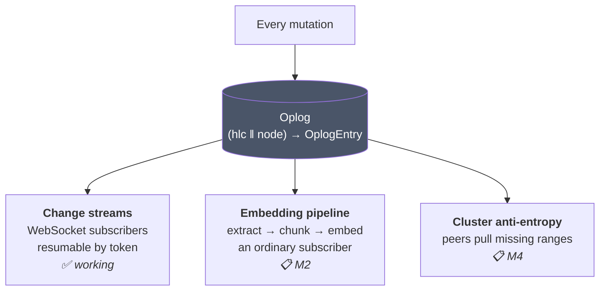

# The Oplog

[← Documentation index](README.md)

The operation log is the spine of KimmyDB. Understanding it explains most of the
system's shape.

Implemented in `kimmy-storage/src/engine.rs` and `kimmy-storage/src/codec.rs`.

---

## What it is

An append-only, totally-ordered record of every mutation. Each entry is written
in the **same redb transaction** as the change it describes:

```rust
docs.insert((coll_id, key), encode_doc_record(&record))?;
append_oplog(&txn, &entry)?;
txn.commit()?;          // both, or neither
self.publish(vec![entry]);   // only after commit
```

There is no window in which a document is changed but unlogged, or logged but
not applied. That is what makes the log trustworthy enough to build on.

---

## Three consumers, one log



Build the log once, get three features. This is the central design bet, and it
pays out in specific ways:

**Change streams need no replica set.** The log is written whether or not the
node has ever seen a peer, so a single container has fully working change
streams. In MongoDB they are a byproduct of replication and therefore require
one.

**Auto-embeddings need no scheduler.** "Keep vectors in sync with documents"
becomes "consume the log", which is already solved. The embedding worker is a
change-stream subscriber with no special privileges.

**Replication needs no separate write path.** Anti-entropy pulls oplog ranges
and applies them through `apply_remote`, which routes conflict resolution
through the same `DocRecord::merge` that local writes use.

---

## Entry format

```
┌────────┬────────────┬──────────┬───────────┬──────────────┬────────────┐
│ ver(1) │ stamp(26)  │ kind(1)  │ coll(8)   │ doc_id opt   │ body opt   │
└────────┴────────────┴──────────┴───────────┴──────────────┴────────────┘
```

```rust
struct OplogEntry {
    stamp: Stamp,               // (Hlc, NodeId) — the total order
    kind: OpKind,               // Insert | Update | Replace | Delete | Collection
    collection: CollectionId,
    doc_id: Option<DocId>,      // absent for Collection ops
    body: Option<Vec<u8>>,      // full post-image; absent for deletes
}
```

### Full post-images, not diffs

Entries carry the whole document, not a delta. Three reasons:

1. **Idempotent application.** Applying an entry is "compare stamps, overwrite" —
   safe to repeat, which matters because peers resend overlapping ranges.
2. **Order independence.** A replica can apply entries out of order and still
   converge, because each is self-contained.
3. **`fullDocument` for free.** A change-stream subscriber gets the post-image
   without a second read.

The cost is size. A collection of large documents under heavy update produces a
large log — bounded by retention, but worth knowing.

### `Some(vec![])` is not `None`

Optional fields use `u32::MAX` as the absent sentinel rather than a zero length,
so an empty body stays distinct from no body. A replicated *replace with an
empty document* must not be applied as a *delete*. Covered by
`an_empty_body_is_distinct_from_no_body`.

---

## Keys and ordering

The oplog key is a flat 26-byte slice:

```
┌──────────────────┬─────────────────┐
│  Hlc (10 bytes)  │  NodeId (16)    │
└──────────────────┴─────────────────┘
```

Because both halves are order-preserving big-endian encodings, `memcmp` on this
key yields exactly the total write order `(wall_ms, counter, node_id)`. So:

- **Scanning the log forward** is a plain redb range scan.
- **"Everything since time T"** is a range from an encoded lower bound.
- **A resume token** is just a position in this key space.

```rust
pub fn read_oplog_from(&self, from: Hlc, limit: usize) -> Result<Vec<OplogEntry>>
```

---

## Resume tokens

A resume token is the opaque, URL-safe encoding of an entry's `(hlc, node)`:

```
base64url( hlc(10 bytes) ‖ node(16 bytes) )   →   35 characters
```

```rust
pub fn exclusive_start(self) -> Hlc {
    self.hlc.successor()      // resuming is EXCLUSIVE of the token itself
}
```

Returning the *successor* is what makes resumption deliver each event exactly
once. Resuming *at* the token would redeliver the last event the client already
acknowledged. `successor()` is property-tested to be the immediate next value,
so nothing can sort between a timestamp and its successor — a gap there would
silently skip an event.

Tokens serialize as plain JSON strings, so clients see an opaque blob rather
than a structure they might be tempted to interpret.

---

## Collection-level entries

DDL appends entries too, with `kind = Collection`, no `doc_id`, and no `body`.
They exist so that a future replica can learn about collections through the same
channel as documents.

> Consumers must filter these out when they expect document events. The
> WebSocket layer does (`kimmy-api/src/watch.rs`), and so does the change-stream
> test helper — which was itself a test bug at first: counting collection-create
> entries as document events made two tests fail confusingly.

---

## Retention

Configured by `storage.oplog_retention_secs` (default 24 h). Collection is
📋 **planned, not implemented** — the log currently grows without bound.

Retention will bound two things:

| Bounded thing | Consequence when exceeded |
|---|---|
| How long a disconnected subscriber can be away and still resume | `410 Gone`, must resubscribe |
| How far a peer can fall behind and still catch up incrementally | Full resync needed (M4) |

The expiry check exists already:

```rust
// A token NEWER than everything on disk is fine — nothing has happened since.
// Only a token OLDER than the oldest retained entry is expired.
if token.to_stamp() < oldest { return Err(ResumeTokenExpired) }
```

Returning `410 Gone` rather than silently restarting from the beginning is
deliberate: a silent restart would hide the fact that events were missed.

---

## Growth characteristics

Because entries carry full post-images:

| Workload | Log growth |
|---|---|
| Insert-heavy | ≈ data size |
| Update-heavy, large documents | ≈ document size × update count |
| Delete-heavy | Small (deletes carry no body) |

Until retention lands, plan disk accordingly. A collection of 10 KB documents
updated once a second produces roughly 860 MB of log per day.

---

## Replication (📋 M4)

The intended flow, with the primitives that already exist marked:

```mermaid
sequenceDiagram
    participant A as Node A
    participant B as Node B

    Note over A,B: gossip carries version vectors<br/>{node_id → max_hlc_applied}
    A->>B: SWIM message + version vector
    Note over B: B sees A has entries B lacks
    B->>A: open TCP, request range (from_hlc, limit)
    A-->>B: oplog entries
    loop each entry
        B->>B: apply_remote() ✅ implemented
        Note right of B: compare stamps via merge();<br/>strictly-greater wins;<br/>witness() advances the clock
    end
```

`apply_remote` is implemented and tested, including convergence of concurrent
writes applied in opposite orders on two engines. What is missing is the
transport.

> **Known sharp edge for M4.** An applied remote entry keeps its *originating*
> stamp, so it lands in the local oplog at its original position — which may be
> **behind** the local tail. A change-stream subscriber that has already read
> past that point will not see it. Local-only streams are unaffected; this
> matters when clustering lands, and the resolution is deferred to M4 by design
> rather than by oversight.

---

## Next

- [Change Streams](change-streams.md) — the log's first consumer, in detail
- [Time & Conflicts](time-and-conflicts.md) — what orders these entries
- [Storage](storage.md) — where the log physically lives
