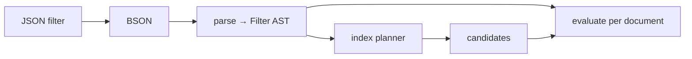

# Query Language

[← Documentation index](README.md)

MongoDB-style query and update documents. Implemented in `kimmy-query`.

> **Performance note.** Secondary indexes exist — see [Indexes](indexes.md). A
> query with no usable index is still a full collection scan.

---

## How a filter is evaluated

A filter document is parsed into an AST **once**, then evaluated per document —
rather than re-walking BSON for every candidate. The AST is also what the index
planner will read, so parsing is the shared representation, not just a speed-up.



---

## Filter operators

### Comparison

| Operator | Meaning |
|---|---|
| `$eq` `$ne` | Equal / not equal |
| `$gt` `$gte` `$lt` `$lte` | Ordered comparison, **within a type group** |
| `$in` `$nin` | Membership in a list |

```javascript
{ "qty": { "$gt": 4, "$lt": 100 } }     // both must hold
{ "status": { "$in": ["new", "paid"] } }
```

### Logical

| Operator | Meaning |
|---|---|
| `$and` `$or` `$nor` | Top-level, take arrays of filter documents |
| `$not` | Applied to a **field's** operators, not at the top level |

```javascript
{ "$or": [ { "qty": { "$lt": 5 } }, { "status": "urgent" } ] }
{ "qty": { "$not": { "$gt": 100 } } }
```

Top-level fields are implicitly `$and`-ed.

### Element and type

| Operator | Meaning |
|---|---|
| `$exists` | Field is present (an explicit `null` counts as present) |
| `$type` | BSON type, by alias (`"string"`) or numeric code (`2`) |
| `$regex` / `$options` | Pattern match against string values |

### Array

| Operator | Meaning |
|---|---|
| `$all` | Array contains every listed value |
| `$size` | Array has exactly this length |
| `$elemMatch` | **One** element satisfies all the conditions |

---

## The three rules that surprise people

Everything below is standard MongoDB behaviour, faithfully reproduced — and each
is the kind of thing that quietly produces wrong results if you assume
otherwise. All three are covered directly by tests.

### 1. `null` matches missing fields

```javascript
{ "a": null }
```

matches `{ "a": null }` **and** `{ "b": 1 }` — a document where `a` is absent
entirely. It does not match `{ "a": 1 }`.

Use `$exists` when you need the distinction:

```javascript
{ "a": { "$exists": true  } }   // present, possibly null
{ "a": { "$exists": false } }   // genuinely absent
```

`$ne` inherits this: `{ "a": { "$ne": 1 } }` matches documents with no `a` at
all.

### 2. Paths traverse into arrays

```javascript
// Document
{ "items": [ { "sku": "a", "qty": 1 }, { "sku": "b", "qty": 9 } ] }

{ "items.sku": "b" }        // ✓ matches — any element may satisfy it
{ "tags": "b" }             // ✓ matches { "tags": ["a","b","c"] }
{ "qty": { "$gt": 8 } }     // ✓ matches { "qty": [1, 5, 9] }
```

Which leads directly to the `$elemMatch` distinction:

```javascript
// ✓ matches — conditions satisfied by DIFFERENT elements
{ "items.sku": "a", "items.qty": 9 }

// ✗ does NOT match — requires ONE element to satisfy both
{ "items": { "$elemMatch": { "sku": "a", "qty": 9 } } }
```

`$elemMatch` also has a scalar form for arrays of primitives:

```javascript
{ "n": { "$elemMatch": { "$gt": 5, "$lt": 10 } } }
// ✓ [1, 7, 20]  — 7 is inside the range
// ✗ [1, 20]     — they straddle it, but neither is inside
```

### 3. Comparisons do not cross type groups

```javascript
{ "a": { "$gt": 1 } }        // ✗ does NOT match { "a": "text" }
{ "a": { "$lt": "m" } }      // ✗ does NOT match { "a": 5 }
```

Strings sort after numbers in canonical order (used for *sorting*), but
comparison operators are type-restricted. Equality, by contrast, *does* span
numeric types — `5`, `5i64`, and `5.0` are all equal.

---

## Update operators

An update is **either** operators **or** a whole replacement document, never
both — mixing them is rejected rather than guessed at.

| Operator | Behaviour |
|---|---|
| `$set` `$unset` | Set / remove, at any dot path |
| `$inc` `$mul` | Arithmetic; a missing field starts at `0` |
| `$min` `$max` | Set only if smaller / larger |
| `$push` | Append; `{"$each": [...]}` appends several |
| `$addToSet` | Append only if not already present |
| `$pull` `$pop` | Remove matching elements / one end |
| `$rename` | Move a field |
| `$currentDate` | Set to the server's current time |

```javascript
{ "$inc": { "qty": -1 }, "$push": { "history": "shipped" } }
```

### Integers stay integral

```javascript
{ "$inc": { "n": 1 } }   //  on n = 9007199254740992 (2^53)
                          //  →  9007199254740993, exactly
```

Arithmetic stays in `i64` when both operands are integers. On overflow it
**refuses** with an error rather than silently widening to `f64` — widening
loses precision quietly, which is worse than failing.

### `_id` is immutable

`_id` is identity, not content. Neither operators nor replacements can move a
document:

```javascript
// Rejected at parse time
{ "$set": { "_id": 2 } }

// Accepted, but the existing _id is preserved — the document is not relocated
{ "_id": 999, "item": "widget" }
```

---

## `find_and_modify` — atomic claim-and-return

`POST /v1/db/{db}/coll/{coll}/find_and_modify` finds one document, changes it,
and returns it — **atomically**. It is the primitive behind job queues,
counters and claim-a-row patterns.

```javascript
{ "filter":  { "status": "pending" },
  "sort":    { "created": 1 },              // which one, when several match
  "update":  { "$set": { "status": "claimed" } },
  "returnDocument": "before",               // or "after"; "before" is default
  "upsert":  false,
  "remove":  false,
  "projection": { "payload": 1 } }
```

```javascript
// -> matched 0 or 1; document is null when nothing matched
{ "document": { "_id": 2, "status": "pending", ... }, "matched": 1 }
```

**Why this exists rather than read-then-write.** Two clients running
`find` then `update` both see the same pending job and both claim it. Here the
match happens **inside the write transaction**, and redb has a single writer —
so nothing can take the document between the match and the commit. Draining a
queue never hands out the same job twice.

### The rules

- **`update` or `remove: true`, not both**, and not neither. `update` takes
  operators or a whole replacement document, exactly as `/update` does.
- **`remove` cannot be combined with `upsert`**, and cannot ask for
  `returnDocument: "after"` — there is no document after a removal.
- **`sort` decides which match wins.** Without it the choice is the scan's own
  order, which is [unspecified](deviations.md). A FIFO queue wants a sort.
- **`upsert` seeds the filter's equalities.** `{filter: {_id: "hits", scope:
  "global"}, update: {$inc: {n: 1}}, upsert: true}` creates
  `{_id: "hits", scope: "global", n: 1}`. An equality inside `$or` is **not**
  seeded, because a match does not imply it.
- **A removal is an ordinary delete** in the change stream and to replication.

### The cost, stated plainly

The writer is held for the *match* as well as the commit, and matches are
materialised so they can be sorted. That is the price of atomicity on a single
writer:

| Filter | Writer held |
|---|---|
| Index-backed | ~0.003 ms + commit |
| Collection scan, 10,000 documents | ~8 ms + commit |

**More than 10,000 matches is refused**, not truncated — choosing from a prefix
would return a document the sort did not pick, with no way for a caller to tell.
Narrow the filter, or add an index.

`update` and `delete` plan too, so an index applies to all three. Pass
`"explain": true` on any of `find`, `count`, `update` or `delete` to see which
access path was chosen.

---

## Sort and projection

```javascript
{ "sort": { "qty": -1, "name": 1 } }
```

`1` ascending, `-1` descending; anything else is rejected. A missing field sorts
as `null`, putting absent values at one end rather than in arbitrary positions.
Sorting by an array field uses its elements.

```javascript
{ "projection": { "item": 1, "qty": 1 } }          // inclusion (+ _id)
{ "projection": { "item": 1, "_id": 0 } }          // inclusion, drop _id
{ "projection": { "internal_notes": 0 } }          // exclusion
```

Inclusion and exclusion cannot be mixed — the result would be ambiguous about
unnamed fields — except for `_id`, the documented exception. Projection reaches
nested paths (`"a.b": 1`).

---

## Regex compatibility

Patterns are compiled with the Rust [`regex`](https://docs.rs/regex) crate,
**not** PCRE.

| | |
|---|---|
| ✅ Supported | Character classes, anchors, quantifiers, groups, alternation; flags `i` `m` `s` `x` |
| ⛔ Not supported | Backreferences (`\1`), lookahead/lookbehind (`(?=)`, `(?<=)`) |

The tradeoff is deliberate: `regex` guarantees linear-time matching, so a
pathological pattern cannot become a denial of service against the database.

An invalid pattern **matches nothing** rather than failing the query — a single
bad pattern in an `$or` should not take down the whole request.

---

## Not implemented

| Feature | Status |
|---|---|
| Index-backed `$in` (union of point lookups) | 📋 Planned |
| Aggregation pipeline (`$match`, `$group`, `$unwind`, …) | 📋 Planned |
| `$vectorSearch` | 📋 Planned — vector search works, but as [its own endpoint](vectors.md), not a pipeline stage |
| `$where`, JavaScript execution | ⛔ Never — an obvious injection surface |
| Geospatial operators | ⛔ Not planned |
| Text indexes / `$text` | ⛔ Superseded by [vector and hybrid search](vectors.md) |

---

## Paging

`find` defaults to **100** documents and caps at **10,000**, so an unbounded
query cannot accidentally pull an entire collection into memory.

**Both are silent.** Omitting `limit` returns 100 documents, not all of them,
and asking for more than 10,000 is *clamped rather than refused* — the request
succeeds and returns fewer than were asked for. A client that reads an
unlimited `find` as "the whole collection" processes a prefix and is told
nothing. `count` has no cap, because a count that stopped early would be a
wrong number rather than a short list.

```json
{ "filter": {}, "limit": 50, "skip": 100 }
```

> **Sharp edge.** `skip` is O(n) even with an index: skipped documents are still
> visited. Deep paging over a large collection is expensive — **use a cursor
> instead.**
>
> **Order without a sort is unspecified.** Which documents a `limit` returns can
> differ between an index-backed query and a scan, because they visit documents
> in different orders. Add an explicit `sort` when the subset matters — this
> matches MongoDB.

An unsorted query can stop scanning once it has `skip + limit` matches. A sorted
one must see every match before it can page.

### Cursors

A full page comes back with a **`nextCursor`**. Send it as `cursor` to get the
page after it, and keep going until no cursor comes back.

```javascript
// first request — no cursor
{ "filter": { "status": "active" }, "limit": 100 }

// -> { "documents": [ ... ], "count": 100,
//      "nextCursor": "AoAAAAAAAAAq" }

// next request
{ "filter": { "status": "active" }, "limit": 100,
  "cursor": "AoAAAAAAAAAq" }
```

**A cursor costs the size of the page, not the size of everything before it.**
Where `skip` re-visits every document it steps over, a cursor is a range bound
handed to storage — so walking a whole collection is linear in the collection
rather than quadratic in it.

| Paging 1,000,000 documents at 100 per page | Total documents visited |
|---|---:|
| `skip` | ~5,000,000,000 |
| `cursor` | ~1,000,000 |

### What a cursor is, and what it is not

- **Opaque.** It is the encoded key of the page's last document, base64url —
  the same convention change-stream resume tokens use. Do not parse it; the
  encoding is free to change.
- **Portable between nodes**, and this is *tested* rather than argued: a
  cluster-harness test walks a collection changing node on every page and
  requires the walk to see every document exactly once. It carries no server
  state, so a page fetched from one node continues correctly on another — which
  matters because [`/v1/topology`](http-api.md#topology) exists to make clients
  round-robin across a leaderless cluster.
- **`_id` order, always.** `sort` other than `{"_id": 1}` is refused with a
  cursor, and a query carrying one gets **no `nextCursor`** rather than a token
  that would silently page in a different order from the one asked for. Sorting
  by another field still uses `skip`.
- **Not a snapshot.** A document inserted ahead of the cursor is seen; one
  inserted behind it is not. What is guaranteed is that a document present for
  the whole walk is returned exactly once — never skipped, never repeated.
- **`skip` and `cursor` cannot be combined**; both claim to say where to resume.
- **A position, not a query.** The token encodes a key, so sending it with a
  *different* filter resumes that filter after the same key. The server does
  not check that a token came from the query it is used with, and a client
  should not expect it to.
- **It does not expire**, and nothing on the server holds it. There is no
  session to keep alive and none to lose.

`nextCursor` appears when the page filled *and* the query is one a cursor can
continue.

> **End the walk on a short or empty page, not on a missing token.** A
> collection of exactly 200 documents read 100 at a time hands back a token on
> the second page too — the server cannot know it is the last without looking
> further, and looking further is work the caller did not ask for. The next
> request returns zero documents and no token.

---

## Next

- [HTTP API](http-api.md) — how to send these
- [Key Encoding](key-encoding.md) — the ordering these comparisons rest on
- [Roadmap](roadmap.md) — indexes and the aggregation pipeline
