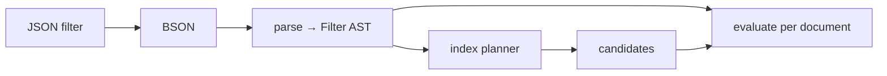

# Query Language

[← Documentation index](README.md)

MongoDB-style query and update documents. Implemented in `kimmy-query`.

> **Performance note.** Secondary indexes exist — see [Indexes](indexes.md). A
> query with no usable index is still a full collection scan.

---

## How a filter is evaluated

A filter document is parsed into an AST **once**, then evaluated per document —
rather than re-walking BSON for every candidate. The AST is also what the index
planner will read, so parsing is the shared representation, not just a speed-up.



---

## Filter operators

### Comparison

| Operator | Meaning |
|---|---|
| `$eq` `$ne` | Equal / not equal |
| `$gt` `$gte` `$lt` `$lte` | Ordered comparison, **within a type group** |
| `$in` `$nin` | Membership in a list |
| `$mod` | `[divisor, remainder]` — a numeric value leaves this remainder |

```javascript
{ "qty": { "$gt": 4, "$lt": 100 } }     // both must hold
{ "status": { "$in": ["new", "paid"] } }
{ "seq": { "$mod": [4, 0] } }           // every fourth
```

### Logical

| Operator | Meaning |
|---|---|
| `$and` `$or` `$nor` | Top-level, take arrays of filter documents |
| `$not` | Applied to a **field's** operators, not at the top level |
| `$expr` | Top-level, takes an [aggregation expression](aggregation.md#expressions); matches when it is truthy |

```javascript
{ "$or": [ { "qty": { "$lt": 5 } }, { "status": "urgent" } ] }
{ "qty": { "$not": { "$gt": 100 } } }
```

Top-level fields are implicitly `$and`-ed.

### Element and type

| Operator | Meaning |
|---|---|
| `$exists` | Field is present (an explicit `null` counts as present) |
| `$type` | BSON type, by alias (`"string"`), numeric code (`2`), or an array of either — see [`$type`](#type) |
| `$regex` / `$options` | Pattern match against string values |

### Array

| Operator | Meaning |
|---|---|
| `$all` | Array contains every listed value |
| `$size` | Array has exactly this length |
| `$elemMatch` | **One** element satisfies all the conditions |

### `$expr` — comparing fields of the same document

Every operator above compares a field with a **constant**. `$expr` takes an
expression from the [aggregation language](aggregation.md#expressions) instead,
evaluates it against the whole document, and matches when the result is truthy
— `false`, `null`, `0` and a missing field are false, everything else is true.
That makes it the one clause that can put two fields on either side of a
comparison:

```javascript
{ "$expr": { "$gt": ["$spent", "$budget"] } }                          // over budget
{ "$expr": { "$gt": [ { "$multiply": ["$qty", "$price"] }, 100 ] } }   // line total over 100
{ "status": "open", "$expr": { "$gt": ["$spent", "$budget"] } }        // beside ordinary clauses
```

It goes anywhere a filter clause goes: top level, inside `$and` / `$or` /
`$nor`, and in `$match`. Negation is the expression's own `$not`; the filter
`$not` applies to a field's operators and has nothing to wrap here.

> **Two comparison semantics in one document.** `$gt` inside `$expr` is the
> *expression* `$gt`, not the filter one, and the two disagree in exactly the
> places [rule 3](#3-comparisons-do-not-cross-type-groups) below describes:
>
> - it compares in the **canonical cross-type order** — null below numbers
>   below strings below documents below arrays — so `{$expr: {$lt: ["$a", 0]}}`
>   matches a document with **no** `a`, where `{a: {$lt: 0}}` does not;
> - it compares an array **as a whole**, never element by element, so
>   `{$expr: {$eq: ["$tags", "b"]}}` does not find `"b"` inside `["a", "b"]`,
>   where `{tags: "b"}` does.
>
> The rule of thumb: write `{field: {$op: constant}}` whenever you can, and
> reach for `$expr` when the right-hand side is itself a field or a
> computation.

**Never indexed.** An expression names no field the planner can put bounds on,
so a filter that is only `$expr` is a collection scan. An equality or range
beside it — `{account: "acme", $expr: …}` — still uses the index on `account`,
and the expression is applied to each candidate. `explain` shows which.

**An evaluation error is "no match".** A type violation inside the expression
— `{$add: ["$name", 1]}` where `name` is a string — makes that document fail
the filter rather than failing the request, the same way an unusable `$regex`
matches nothing. MongoDB fails the query; the difference is recorded in
[Deviations](deviations.md).

### `$mod`

```javascript
{ "n": { "$mod": [4, 1] } }     // n % 4 == 1
```

Exactly two numbers, `[divisor, remainder]`. MongoDB's rules, all of them
tested:

- **Numeric values only.** A string, a null or a missing field never matches —
  and `$not` inverts that, so `{ "$not": { "$mod": [4, 0] } }` matches them.
- **Doubles are truncated toward zero**, on both sides: `8.5` satisfies
  `[4, 0]`, and `[4.9, 0.7]` means `[4, 0]`. A value with no integer at all —
  `NaN`, infinity, past 2^63 — is a `400` in the argument and a non-match in a
  document.
- **The remainder keeps the dividend's sign**, as in C: `-7` satisfies
  `[3, -1]`, not `[3, 2]`.
- **A zero divisor is a `400`** at parse, rather than a filter that quietly
  matches nothing. So is an array of the wrong length.
- **Arrays match element-wise**, like the comparison operators: `[1, 10, 3]`
  satisfies `[5, 0]` through the `10`.

`$mod` is never index-eligible. A remainder is not a range, so the planner
leaves it to the residual re-check every candidate goes through; an equality or
range beside it still uses the index.

### `$type`

```javascript
{ "mixed": { "$type": "int" } }
{ "mixed": { "$type": 16 } }                  // the same, by code
{ "mixed": { "$type": ["int", "string"] } }   // either — the array unions
```

The argument is an **alias, a numeric BSON code, or an array of them**. An
array is a union: the document matches when the value is any one of the listed
types, and aliases and codes may be mixed in it. An empty array lists no type
and so matches nothing. Anything else — a double, a bool, a nested array — is
a `400` at parse.

| Kind | Alias and code |
|---|---|
| Numbers | `int` 16, `long` 18, `double` 1, `decimal` 19 |
| Text and bytes | `string` 2, `binData` 5 |
| Structure | `object` 3, `array` 4 |
| Identity and time | `objectId` 7, `date` 9, `timestamp` 17 |
| Other | `bool` 8, `null` 10, `regex` 11, `javascript` 13, `undefined` 6, `minKey` −1, `maxKey` 127 |

`javascript` covers both code forms; `symbol` and `dbPointer` are accepted as
names for the two legacy types that have no code here. There is no `number`
meta-alias covering the numeric types — list them: `["int", "long",
"double"]`. And **`int` and `long` are different types**, so a value written
as `{"$numberLong": "42"}` is not matched by `{"$type": "int"}`; see [The JSON
boundary](http-api.md#the-json-boundary) for which one a plain JSON number
becomes.

**An unknown *code* is refused and an unknown *alias* is not.** `{"$type":
999}` is a `400` — `unknown $type code 999`; `{"$type": "nosuchtype"}` is
`200` with no matches, because any string is taken as a type name and no
stored value ever reports that name. Names are **case-sensitive and exactly
as spelled above**, so `"Int"`, `"bindata"` and `"boolean"` are each a `200`
and an empty result rather than a refusal, indistinguishable from a genuine
"nothing is that type".

An alias is not the only word a filter takes without checking:
[`$regex`'s `$options`](#regex-compatibility) drops a flag it does not know
by the same rule and with the same consequence. Both are worth singling out
because the general rule is refusal — a misspelt operator is `unsupported
operator "$typo"`, a bad sort direction and a bad `$size` are each a `400` —
so a `200` here reads as an answer rather than as a mistake. Send the code
rather than the alias wherever the spelling is not being read by a person.

**`$type` is applied to array elements as well as to the value**, which
follows from [rule 2](#2-paths-traverse-into-arrays) and is the consequence
worth stating: `{"mixed": [1, 2, 3]}` matches `{"$type": "array"}` **and**
`{"$type": "int"}` at once. So `$type` does not partition a collection —
summing the counts of every type over a field double-counts every
array-valued document. The descent is one level: an element of an element is
not examined, so `{"mixed": [[1]]}` is an `array` and not an `int`. Use
`$elemMatch` when the question is about one element rather than any of them.

A **missing** field matches no type at all, `"null"` included; `{"$type":
"null"}` is how an explicit `null` is told apart from an absent field, where
`{"mixed": null}` matches both ([rule 1](#1-null-matches-missing-fields)).

`$type` is never index-eligible — a type is not a key range — so it is left
to the residual re-check, exactly as `$mod` is.

---

## The three rules that surprise people

Everything below is standard MongoDB behaviour, faithfully reproduced — and each
is the kind of thing that quietly produces wrong results if you assume
otherwise. All three are covered directly by tests.

### 1. `null` matches missing fields

```javascript
{ "a": null }
```

matches `{ "a": null }` **and** `{ "b": 1 }` — a document where `a` is absent
entirely. It does not match `{ "a": 1 }`.

Use `$exists` when you need the distinction:

```javascript
{ "a": { "$exists": true  } }   // present, possibly null
{ "a": { "$exists": false } }   // genuinely absent
```

`$ne` inherits this: `{ "a": { "$ne": 1 } }` matches documents with no `a` at
all.

### 2. Paths traverse into arrays

```javascript
// Document
{ "items": [ { "sku": "a", "qty": 1 }, { "sku": "b", "qty": 9 } ] }

{ "items.sku": "b" }        // ✓ matches — any element may satisfy it
{ "tags": "b" }             // ✓ matches { "tags": ["a","b","c"] }
{ "qty": { "$gt": 8 } }     // ✓ matches { "qty": [1, 5, 9] }
```

Which leads directly to the `$elemMatch` distinction:

```javascript
// ✓ matches — conditions satisfied by DIFFERENT elements
{ "items.sku": "a", "items.qty": 9 }

// ✗ does NOT match — requires ONE element to satisfy both
{ "items": { "$elemMatch": { "sku": "a", "qty": 9 } } }
```

`$elemMatch` also has a scalar form for arrays of primitives:

```javascript
{ "n": { "$elemMatch": { "$gt": 5, "$lt": 10 } } }
// ✓ [1, 7, 20]  — 7 is inside the range
// ✗ [1, 20]     — they straddle it, but neither is inside
```

A numeric segment is read both ways: `{"items.0.sku": "a"}` matches when the
first element's `sku` is `"a"` *or* when any element has a field named `0`
whose `sku` is. That is a filter rule only — in an aggregation expression
`$items.0.sku` is a field name and never a position; see
[aggregation.md](aggregation.md#arrays).

### 3. Comparisons do not cross type groups

```javascript
{ "a": { "$gt": 1 } }        // ✗ does NOT match { "a": "text" }
{ "a": { "$lt": "m" } }      // ✗ does NOT match { "a": 5 }
```

Strings sort after numbers in canonical order (used for *sorting*), but
comparison operators are type-restricted. Equality, by contrast, *does* span
numeric types — `5`, `5i64`, and `5.0` are all equal.

**A `Decimal128` cannot be a filter operand.** The canonical order has no
exact place for one — it ranks equal to every other number, and the key
encoder refuses it ([Key encoding](key-encoding.md#decimal128-is-refused)) —
so `{"v": {"$numberDecimal": "1.5"}}` would match every numeric `v` and
could never use an index. It is refused instead, `400` with a message saying
a Decimal128 *cannot be compared in a filter*: as a bare equality, under
`$eq`, `$ne`, `$gt`, `$gte`, `$lt`, `$lte`, `$in`, `$nin` and `$all`, inside
a document or array literal, under `$not` and `$elemMatch`, and as an `_id`.
A literal anywhere in a `$expr` expression is refused too, but by the
expression parser, so that message is the one every expression gives — *a
Decimal128 literal is not supported in an expression* ([HTTP API](http-api.md#the-json-boundary),
[Aggregation](aggregation.md#not-supported)). `$type: "decimal"` and
`$exists` compare nothing and find such documents as ever. The refusal is
deliberate: through 0.24.0 the same filter was refused only by accident, as
`unsupported operator "$numberDecimal"`, because the JSON edge did not read
the wrapper.

---

## Update operators

An update is **either** operators **or** a whole replacement document, never
both — mixing them is rejected rather than guessed at.

| Operator | Behaviour |
|---|---|
| `$set` `$unset` | Set / remove, at any dot path |
| `$setOnInsert` | Set only when an upsert inserts; ignored on a match |
| `$inc` `$mul` | Arithmetic; a missing field starts at `0` |
| `$min` `$max` | Set only if smaller / larger, in the [canonical order](#3-comparisons-do-not-cross-type-groups); a `Decimal128` operand is refused, because that order cannot compare one |
| `$push` | Append; `{"$each": [...]}` appends several, with `$position`, `$sort`, `$slice` |
| `$addToSet` | Append only if not already present (canonical equality); takes `$each`. A `Decimal128` operand is refused: it would compare equal to every number and add nothing |
| `$pull` `$pop` | Remove matching elements / one end. A `$pull` operand holding a `Decimal128` is refused: it would compare equal to every number and remove them all |
| `$pullAll` | Remove every element equal to **any** value in a list; a `Decimal128` in the list is refused for the same reason |
| `$rename` | Move a field |
| `$currentDate` | Set to the server's current time |
| `$[]` / `$[<identifier>]` in a path | Address array elements — see [Positional updates](#positional-updates) |

```javascript
{ "$inc": { "qty": -1 }, "$push": { "history": "shipped" } }
{ "$pullAll": { "tags": ["draft", "stale"] } }
```

`$pull` and `$pullAll` match by **canonical equality** — `2` removes `2.0`, and
a document matches whole, field order included. `$pullAll` on a field that is
missing does nothing; on a field that is not an array it is a `400`, because
the caller believes the field is an array and it is not.

### `$push` modifiers

With `$each`, `$push` takes the three modifiers that turn an append into a
bounded, ordered list. They apply in a fixed order — **`$position`, then
`$sort`, then `$slice`** — so the last one always decides what is kept:

```javascript
// A capped history: add an event, keep the newest 100 in time order
{ "$push": { "events": {
    "$each":  [ { "t": 1725000000, "kind": "shipped" } ],
    "$sort":  { "t": 1 },
    "$slice": -100 } } }
```

| Modifier | Meaning |
|---|---|
| `$position: n` | Insert the `$each` values at index `n`; negative counts from the end; past either end clamps to it |
| `$sort: 1 \| -1` | Order whole elements, in the [canonical order](#3-comparisons-do-not-cross-type-groups) |
| `$sort: {field: 1 \| -1, …}` | Order elements that are documents by these fields, dotted paths allowed; an element missing a field sorts as `null`, and a path that reaches several values inside an element is reduced the way [a sort key is](#sort-and-projection) |
| `$slice: n` | Keep the first `n` elements; negative keeps the last `n`; `0` empties the array |

A modifier without `$each` is an error, as is a clause `$push` does not know —
a document argument with any `$`-prefixed key is read as modifiers, never
pushed as a value. `{"$each": []}` with `$sort` or `$slice` reshapes the array
without adding to it. `$addToSet` takes `$each` and no other modifier: a set
has no order to sort or position in.

### `$setOnInsert`

Written only to the document an upsert *creates*; on a match the operator does
nothing and the field keeps whatever it held. The inserted document is built as
the filter's equalities, then `$setOnInsert`, then every other operator:

```javascript
// find_and_modify with upsert: true
{ "filter": { "_id": "hits" },
  "update": { "$setOnInsert": { "created_at": 1725000000 }, "$inc": { "n": 1 } } }
// first call creates { _id: "hits", created_at: 1725000000, n: 1 }
// every later call increments n and leaves created_at alone
```

A `$setOnInsert` path that another operator in the same update also writes —
the same path, or one inside the other, counting a `$rename`'s destination — is
**rejected at parse time**, as MongoDB rejects it: the two would disagree about
the inserted document. Other operator pairs are not checked against each other
and apply in the order written — the order the keys arrive in the request body,
so an encoder that reorders map keys decides it (see
[Deviations](deviations.md)).

### Positional updates

A path may address the elements of an array, not only the array itself or a
numeric index into it. `$[]` names every element; `$[<identifier>]` names the
elements an `arrayFilters` entry on the request selects. This is how one line
item is changed without replacing the order — and without losing whatever a
concurrent update did to the order's other fields:

```javascript
// POST /v1/db/shop/coll/orders/update — mark one line shipped, touch nothing else
{
  "filter": { "_id": 42 },
  "update": { "$set": { "items.$[line].shipped": true } },
  "arrayFilters": [ { "line.sku": "gasket" } ]
}

// Every element
{ "$inc": { "items.$[].qty": 1 } }

// Nested: one order's one line, with one filter per identifier
{ "$set": { "orders.$[o].items.$[i].qty": 0 } }      // arrayFilters: [ { "o.id": 2 }, { "i.sku": "b" } ]
```

The rules, which are MongoDB's:

- **One identifier per filter document.** Every top-level field of an
  `arrayFilters` entry starts with the same identifier, and the filter is
  evaluated against each element with that prefix removed: `{"line.qty":
  {"$gt": 5}}` tests `{"qty": {"$gt": 5}}` against each element. Any filter
  operator works, and several fields test the same element, as `$elemMatch`
  would. A bare `{"line": {"$gte": 80}}` tests the element itself, which is
  how an array of scalars is addressed. `$and`, `$or` and `$nor` may group
  conditions on the identifier.
- **Every identifier used needs exactly one filter, and every filter must be
  used.** An identifier without a filter, a filter no path uses, or two filters
  for one identifier is a `400`. A filter nothing refers to is almost always a
  misspelt identifier, and applying the update regardless would change
  elements the caller never selected.
- **Identifiers** start with a lowercase letter and contain only letters and
  digits.
- **There must be an array to select from.** A positional segment where the
  field is missing, or holds something other than an array, is an error for
  that document and the request fails. It does not create an array or treat a
  scalar as a one-element one.
- **No element selected is not an error.** The operator has nothing to do; the
  document is written back as it was, and `modified` counts it, as it counts
  [every write](#modified-counts-writes-not-changes).
- **Every operator that takes a path accepts one**, except `$rename`, whose
  source and destination are fixed places. `$unset` of an element leaves
  `null` in its position rather than closing the gap, so the other elements
  keep their indices — the same rule as `$unset` of `items.1`.

**`$` — MongoDB's "the element the query matched" — is not implemented.** It
depends on the filter reporting *which* element satisfied it, which the
matcher does not track, and `$[<identifier>]` says the same thing without
depending on the query: `{"items.sku": "gasket"}` with `items.$.shipped` is
`items.$[line].shipped` with `[{"line.sku": "gasket"}]` — and the second form
reaches every gasket line rather than only the first. An update that uses `$`
is refused with a message that says so. Recorded in
[Deviations](deviations.md); the reasoning is ADR-104.

### Integers stay integral

```javascript
{ "$inc": { "n": 1 } }   //  on n = 9007199254740992 (2^53)
                          //  →  9007199254740993, exactly
```

Arithmetic stays in `i64` when both operands are integers. On overflow it
**refuses** with an error rather than silently widening to `f64` — widening
loses precision quietly, which is worse than failing.

### `_id` is immutable

`_id` is identity, not content. Neither operators nor replacements can move a
document:

```javascript
// Rejected at parse time
{ "$set": { "_id": 2 } }

// Accepted, but the existing _id is preserved — the document is not relocated
{ "_id": 999, "item": "widget" }
```

### `modified` counts writes, not changes

An update that sets a field to the value it already holds is still a write, and
still counts:

```javascript
// Both documents already have g: "x"
{ "matched": 2, "modified": 2 }
```

**This is where the register differs from MongoDB**, whose `nModified` excludes
documents that were already in the requested state. The two disagree on exactly
the question a caller tends to ask — "did anything actually change?" — so an
update ported from MongoDB gets a number that looks right and is not.

To ask that question here, compare `matched` with a `count` whose filter
describes the state you want; that works in either database and does not depend
on how a write is counted. Recorded in [Deviations](deviations.md).

---

## `find_and_modify` — atomic claim-and-return

`POST /v1/db/{db}/coll/{coll}/find_and_modify` finds one document, changes it,
and returns it — **atomically**. It is the primitive behind job queues,
counters and claim-a-row patterns.

```javascript
{ "filter":  { "status": "pending" },
  "sort":    { "created": 1 },              // which one, when several match
  "update":  { "$set": { "status": "claimed" } },
  "returnDocument": "before",               // or "after"; "before" is default
  "upsert":  false,
  "remove":  false,
  "projection": { "payload": 1 } }
```

```javascript
// -> matched 0 or 1; document is null when nothing matched
{ "document": { "_id": 2, "status": "pending", ... }, "matched": 1 }
```

**Why this exists rather than read-then-write.** Two clients running
`find` then `update` both see the same pending job and both claim it. Here the
match happens **inside the write transaction**, and redb has a single writer —
so nothing can take the document between the match and the commit. Draining a
queue never hands out the same job twice.

### The rules

- **`update` or `remove: true`, not both**, and not neither. `update` takes
  operators or a whole replacement document, exactly as `/update` does.
- **`remove` cannot be combined with `upsert`**, and cannot ask for
  `returnDocument: "after"` — there is no document after a removal.
- **`sort` decides which match wins.** Without it the choice is the scan's own
  order, which is [unspecified](deviations.md). A FIFO queue wants a sort.
- **`upsert` seeds the filter's equalities.** `{filter: {_id: "hits", scope:
  "global"}, update: {$inc: {n: 1}}, upsert: true}` creates
  `{_id: "hits", scope: "global", n: 1}`. An equality inside `$or` is **not**
  seeded, because a match does not imply it. `$setOnInsert` fields are added
  to that seed before the other operators run, and only on the insert.
- **A removal is an ordinary delete** in the change stream and to replication.
- **`if_stamp` makes it conditional** on the chosen document being at that
  version — `409 stale` and nothing written otherwise. Cannot be combined
  with `upsert`. The response's `stamp` is the version the write produced,
  so a loop of read → decide → `find_and_modify` needs no separate read
  ([ADR-084](decisions.md)).

### The cost, stated plainly

The writer is held for the *match* as well as the commit, and matches are
materialised so they can be sorted. That is the price of atomicity on a single
writer:

| Filter | Writer held |
|---|---|
| Index-backed | ~0.003 ms + commit |
| Collection scan, 10,000 documents | ~8 ms + commit |

**More than 10,000 matches is refused**, not truncated — choosing from a prefix
would return a document the sort did not pick, with no way for a caller to tell.
Narrow the filter, or add an index.

`update` and `delete` go through the same in-transaction path since ADR-083,
so the same table applies to each chunk of them. The ceiling does not: a
`multi: true` request commits in chunks of `storage.multi_chunk_docs`
documents, releasing the writer between chunks, so any number of matches is
allowed and the response reports `commits` (ADR-086).

`update` and `delete` plan too, so an index applies to all three. Pass
`"explain": true` on any of `find`, `count`, `update` or `delete` to see which
access path was chosen.

---

## Sort and projection

```javascript
{ "sort": { "qty": -1, "name": 1 } }
```

`1` ascending, `-1` descending; anything else is rejected — `sort direction
for "qty" must be 1 or -1`. A direction is read as a **number**, the same way a
projection value is (below), so a whole double equal to either passes: `1.0`
and `-1.0` sort exactly as `1` and `-1` do, which is what an encoder that
renders every JSON number as a float produces. `1.5`, `2`, `true` and the
string `"1"` are all refused. A missing field sorts as `null`, putting absent
values at one end rather than in arbitrary positions.

**Sorting by an array uses its elements, and the element it uses is the
smallest — in both directions.** A sort key names a field rather than
computing one, so a path that reaches several values is reduced to a single
key before anything is compared, and that key is the least of them in
[canonical order](#3-comparisons-do-not-cross-type-groups). The two ways of
reaching several values behave alike: `{"tags": 1}` over `tags: ["c", "a"]`
sorts by `"a"`, and `{"items.qty": 1}` over `items: [{qty: 9}, {qty: 1}]`
sorts by `1`. **`-1` reverses the comparison, not the choice of element** — a
descending sort still reduces each document to its smallest element and puts
the largest of those first, so `[2, 3]` comes before `[1, 100]` and the `100`
never enters it. An empty array has no element to use and is compared as the
array itself, at the rank arrays hold in the [type
ordering](key-encoding.md#type-ordering) — not at either end of it. One
comparison serves `find`, `find_and_modify` and the pipeline's
[`$sort`](aggregation.md#stages), so the three order a collection identically.
It is not the rule `$lookup` follows for a join key, which reads the *first*
element of a path that crosses an array rather than the least
([Aggregation](aggregation.md#lookup)).

**A matching document holding a `Decimal128` at a sort path refuses the
query.** The canonical order ranks a Decimal128 equal to every other number,
which is not an order a sort can use: the document would land somewhere among
the numbers that depended on which of them it happened to be compared with.
So `find`, `find_and_modify` and an aggregation `$sort` check every document
they would order before ordering any, and answer `400` — `cannot sort by
"v": document 3 holds a Decimal128 there` — naming the document rather than
placing it. `$push`'s `$sort` refuses the same value once the elements are
spliced in: its by-fields form gives that same message behind a `$push $sort`
prefix, and its whole-element form gives `$push $sort cannot order an element
holding a Decimal128`. Either
way the update is refused and nothing is written. Only the documents the
filter matched are checked:
narrow the filter past them, sort by another field, or store the value as a
double or a long. The same applies to `$min`, `$max`, `$addToSet`, `$pull`
and `$pullAll`, which compare their operand and refuse a Decimal128 one.

```javascript
{ "projection": { "item": 1, "qty": 1 } }          // inclusion (+ _id)
{ "projection": { "item": 1, "_id": 0 } }          // inclusion, drop _id
{ "projection": { "internal_notes": 0 } }          // exclusion
```

Inclusion and exclusion cannot be mixed — the result would be ambiguous about
unnamed fields — with one exception, and it runs **one way only**: `_id` may
be *excluded* beside inclusions (`{"item": 1, "_id": 0}`), because `_id` is
included by default and this is how to turn that off. The other direction,
`{"_id": 1, "note": 0}`, is refused — `a projection cannot mix inclusion and
exclusion (except excluding _id)` — since an exclusion projection already
keeps `_id`, and naming it adds an inclusion to a list of exclusions.
Projection reaches nested paths (`"a.b": 1`).

A value is read as a flag, not as the literal `0` or `1`: any non-zero number
or `true` includes, `0`, `0.0` and `false` exclude, and a string, `null`, an
array or a document is refused `400` — `projection value for "x" must be 0 or
1`. A document whose key is an operator — `{"items": {"$slice": 3}}`,
`{"items": {"$elemMatch": {…}}}` — is refused by name: `projection operator
$slice is not supported for "items"; a projection value must be 0 or 1`. There
are no projection operators; reshape an array in an
[aggregation](aggregation.md) pipeline, where `$slice` exists as an expression.

**`$` in a find projection path is not the positional operator.** A projection
path is read literally, so `{"items.$": 1}` names a field called `$` inside
`items`, finds none, and projects nothing: the request succeeds and the field
is simply absent from the result. The refusal of `$` under [positional
updates](#positional-updates) is a rule about *update* paths and does not
reach projections.

---

## Regex compatibility

Patterns are compiled with the Rust [`regex`](https://docs.rs/regex) crate,
**not** PCRE.

| | |
|---|---|
| ✅ Supported | Character classes, anchors, quantifiers, groups, alternation; flags `i` `m` `s` `x` |
| ⛔ Not supported | Backreferences (`\1`), lookahead/lookbehind (`(?=)`, `(?<=)`) |

The tradeoff is deliberate: `regex` guarantees linear-time matching, so a
pathological pattern cannot become a denial of service against the database.

An invalid pattern **matches nothing** rather than failing the query — a single
bad pattern in an `$or` should not take down the whole request.

**`$options` is read flag by flag, and a flag it does not know is dropped
silently.** The four above are the whole set; anything else in the string is
passed over and the pattern compiles without it. That is the same shape as a
misspelt [`$type` alias](#type), and it bites the same way: `$options` is
case-sensitive, so `"I"` is not `"i"` — `{"$regex": "S", "$options": "I"}`
answers `200` having compiled a *case-sensitive* pattern, and finds none of
the `"s"` a caller expected it to. `"iz"` sets `i` and swallows the `z`.
There is no refusal to notice, so check the flags rather than the result.

---

## Not implemented

| Feature | Status |
|---|---|
| `$vectorSearch` | 📋 Planned — vector search works, but as [its own endpoint](vectors.md), not an [aggregation](aggregation.md) stage |
| `$bit` | 📋 Planned — the next tier of update-operator compatibility |
| `$` positional update operator (`items.$.qty`) | ⛔ Not planned — the matcher does not report which element a filter matched, and `$[<identifier>]` with `arrayFilters` expresses the same thing without depending on the query; see [Positional updates](#positional-updates) |
| `$where`, JavaScript execution | ⛔ Never — an obvious injection surface |
| `$pull` with a query condition (`{ "$pull": { "scores": { "$gte": 6 } } }`) | 📋 Not built — `$pull` and `$pullAll` match literal values only, so a condition document is compared as a document and removes nothing |
| `$bitsAllSet` `$bitsAnySet` `$bitsAllClear` `$bitsAnyClear` | 📋 Not built |
| `$jsonSchema` | 📋 Not built |
| Geospatial operators | ⛔ Not planned |
| Text indexes / `$text` | ⛔ Superseded by [vector and hybrid search](vectors.md) |

---

## Paging

`find` defaults to **100** documents and caps at **10,000**, so an unbounded
query cannot accidentally pull an entire collection into memory.

**Both are silent.** Omitting `limit` returns 100 documents, not all of them,
and asking for more than 10,000 is *clamped rather than refused* — the request
succeeds and returns fewer than were asked for. A client that reads an
unlimited `find` as "the whole collection" processes a prefix and is told
nothing. `count` has no cap, because a count that stopped early would be a
wrong number rather than a short list. `limit: 0` is a **window of nothing**,
not a request for the default: an empty page with no `nextCursor`, on every
access path and every sort order.

```json
{ "filter": {}, "limit": 50, "skip": 100 }
```

> **Sharp edge.** `skip` is O(n) even with an index: skipped documents are still
> visited. Deep paging over a large collection is expensive — **use a cursor
> instead.**
>
> **Order without a sort is unspecified.** Which documents a `limit` returns can
> differ between an index-backed query and a scan, because they visit documents
> in different orders. Add an explicit `sort` when the subset matters — this
> matches MongoDB.

An unsorted query — or one sorted by `{"_id": 1}`, the order every access path
already delivers — stops scanning once it has `skip + limit` matches and holds
only the page: what it skips is counted past, not kept. A sorted query must see
every match before it can page, but it holds only the `skip + limit` least of
them, and **that window may not exceed 10,000**. A sorted `find` asking for
more is refused with `400` rather than clamped — a clamped `skip` would return
a different page and say nothing. To go deeper through a sorted order, narrow
the filter on the sort field to where the last page ended, which costs a page
instead of everything before it; or sort by `_id` and use a cursor
([ADR-098](decisions.md)).

### Cursors

A full page comes back with a **`nextCursor`**. Send it as `cursor` to get the
page after it, and keep going until no cursor comes back.

```javascript
// first request — no cursor
{ "filter": { "status": "active" }, "limit": 100 }

// -> { "documents": [ ... ], "count": 100,
//      "nextCursor": "AoAAAAAAAAAq" }

// next request
{ "filter": { "status": "active" }, "limit": 100,
  "cursor": "AoAAAAAAAAAq" }
```

**A cursor costs the size of the page, not the size of everything before it.**
Where `skip` re-visits every document it steps over, a cursor is a range bound
handed to storage — so walking a whole collection is linear in the collection
rather than quadratic in it.

| Paging 1,000,000 documents at 100 per page | Total documents visited |
|---|---:|
| `skip` | ~5,000,000,000 |
| `cursor` | ~1,000,000 |

### What a cursor is, and what it is not

- **Opaque.** It is the encoded key of the page's last document, base64url —
  the same convention change-stream resume tokens use. Do not parse it; the
  encoding is free to change.
- **Portable between nodes**, and this is *tested* rather than argued: a
  cluster-harness test walks a collection changing node on every page and
  requires the walk to see every document exactly once. It carries no server
  state, so a page fetched from one node continues correctly on another — which
  matters because [`/v1/topology`](http-api.md#topology) exists to give a client
  somewhere else to go when a node stops answering mid-walk.
- **`_id` order, always.** `sort` other than `{"_id": 1}` is refused with a
  cursor, and a query carrying one gets **no `nextCursor`** rather than a token
  that would silently page in a different order from the one asked for. Sorting
  by another field still uses `skip`.
- **Not a snapshot.** A document inserted ahead of the cursor is seen; one
  inserted behind it is not. What is guaranteed is that a document present for
  the whole walk is returned exactly once — never skipped, never repeated.
- **`skip` and `cursor` cannot be combined**; both claim to say where to
  resume. A page reached by a non-zero `skip` also carries **no
  `nextCursor`**, full or not: `skip` is for jumping to an offset and a
  cursor is for walking, and a client that mixed the two would be paging
  from a position it did not choose. Start a walk at `skip: 0`, or jump with
  `skip` and treat that page as a one-off.
- **A position, not a query.** The token encodes a key, so sending it with a
  *different* filter resumes that filter after the same key. The server does
  not check that a token came from the query it is used with, and a client
  should not expect it to.
- **It does not expire**, and nothing on the server holds it. There is no
  session to keep alive and none to lose.

`nextCursor` appears when the page filled, `skip` is `0`, *and* the query is
one a cursor can continue — no sort, or `{"_id": 1}`. All three: a full page
in `_id` order asked for with `skip: 5` carries no token.

> **End the walk on a short or empty page, not on a missing token.** A
> collection of exactly 200 documents read 100 at a time hands back a token on
> the second page too — the server cannot know it is the last without looking
> further, and looking further is work the caller did not ask for. The next
> request returns zero documents and no token.

---

## Next

- [HTTP API](http-api.md) — how to send these
- [Key Encoding](key-encoding.md) — the ordering these comparisons rest on
- [Roadmap](roadmap.md) — indexes and the aggregation pipeline
