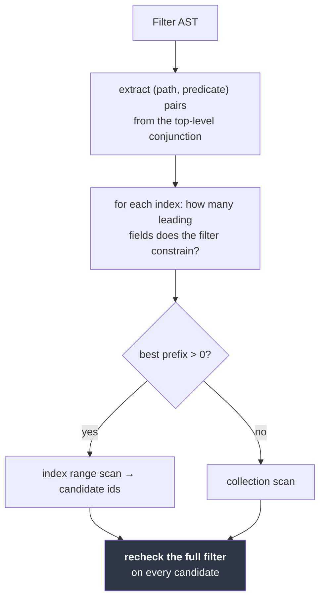
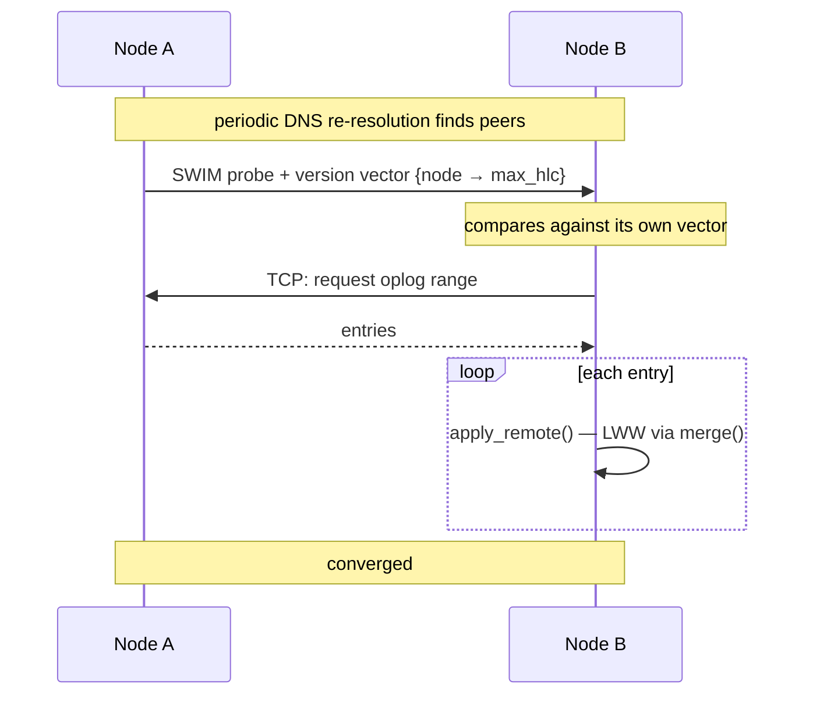

# Roadmap

[← Documentation index](README.md)

Milestone status, and the planned design for what remains. This document exists
so that development can be picked up later without re-deriving decisions.

---

## Status


| Milestone | Scope | Status |
|---|---|---|
| **M0** | Workspace, core types, HLC, config, Docker, CI | ✅ Complete |
| **M1** | Storage, CRUD, query, oplog, change streams, auth, HTTP API | ✅ Except indexes |
| **M2** | Auto-embeddings, HNSW, vector and hybrid search | 📋 Planned |
| **M3** | Built-in MCP server | 📋 Planned |
| **M4** | Gossip membership, discovery, anti-entropy replication | 📋 Planned |
| **M5** | Backup, TLS, rate limiting, CLI, benchmarks | 📋 Planned |

Ordering note: vectors and MCP come **before** clustering, deliberately. The
AI-facing features are the differentiator and are useful on a single node;
clustering is the largest and riskiest piece.

---

## Remaining in M1: secondary indexes

The only unfinished M1 item. Groundwork already in place:

- `index_entries` table, keyed `(collection_id, index_id, encoded_key, encoded_id)`
- `IndexMeta` / `IndexField` with a monotonic, non-reusing id counter
- `keyenc::encode_compound` for multi-field keys
- The filter AST the planner needs to read

### What is left

**1. Descending fields in the encoder.** Invert every byte of a component's
encoding. This works *because* the encoding is prefix-free — for a prefix-free
code, flipping all bytes exactly reverses order. Needs its own property test.

**2. Index maintenance in the write path.** The delicate part. Index entries must
be updated in the **same transaction** as the document, or an index will
silently disagree with the data:

```rust
// insert / replace / delete, all inside one txn
for index in &coll.indexes {
    if let Some(old) = previous_document {
        index_entries.remove(key_for(index, old, doc_id))?;
    }
    if let Some(new) = new_document {
        index_entries.insert(key_for(index, new, doc_id), ())?;
    }
}
```

Multikey handling: a field holding an array produces **one entry per element**,
which is what makes `{tags: "b"}` index-answerable.

**3. Rule-based planner.** No cost model. Extract equality and range predicates
from the top-level `$and` chain, pick the index with the longest matching
prefix, fall back to a collection scan.



**The recheck is not optional.** An index answers "which documents *might*
match"; only the filter decides. Skipping the recheck is how index-backed
queries start returning documents that do not match.

**4. API surface.** `POST/GET/DELETE /v1/db/{db}/coll/{coll}/indexes`, plus
`explain` so users can tell whether an index was used.

**5. Backfill.** Creating an index on a non-empty collection must populate it.
Simplest correct approach: build inside one transaction, and document that it
blocks writes for the duration.

### Why it was deferred

The failure mode is *silent wrong query results*, the same class as the key
encoder — which is why the encoder got mutation testing. That work deserves a
fresh start rather than the tail of a long session.

---

## M2 — Vectors and auto-embeddings

Per-collection configuration creates a shadow collection `{coll}.__vectors`:

```json
{ "vector": {
    "enabled": true,
    "fields": ["title", "body"],
    "provider": "local",
    "model": "bge-small-en-v1.5",
    "dim": 384,
    "metric": "cosine",
    "chunk": { "max_tokens": 512, "overlap": 64 }
}}
```


The worker being a plain change-stream subscriber is the payoff from the oplog
design: "keep vectors in sync" reduces to "consume the log", which already
works, including resume-after-restart.

**Off the write path.** Writes must never block on model inference. The API
returns as soon as the oplog entry is durable; embedding happens behind it. Each
vector record carries its source document's HLC, so staleness is detectable and
re-embedding is idempotent — if a document's HLC exceeds its vector's, it is
queued.

| Piece | Plan |
|---|---|
| Providers | `EmbeddingProvider` trait; `fastembed` (local ONNX, no network) is the zero-config default; OpenAI / Voyage / Ollama / custom HTTP |
| Index | `VectorIndex` trait; HNSW via `hnswlib-rs` — it decouples the graph from vector storage, so redb stays the source of truth, and supports tombstoned deletes |
| Persistence | Periodic graph snapshot plus replay of newer vector entries on startup |
| Deletes | Tombstone in the graph; background rebuild past a tombstone-ratio threshold |
| Search | `POST .../vector_search` (k-NN + filter) and `.../hybrid_search` (keyword + vector fused by Reciprocal Rank Fusion) |
| Replication | Vectors ride the oplog as data — recomputing per node is wasteful and, with remote providers, not deterministic |

Open questions: pre-filter versus post-filter selection for filtered k-NN;
whether to ship a slim image variant without the bundled ONNX model (it adds
hundreds of MB).

---

## M3 — Built-in MCP server

`rmcp` with `transport-streamable-http-server`, mounted at `/mcp` on the same
axum router, sharing storage handles directly — no separate process, no loopback
hop.

**Every tool call runs as the authenticated principal**, through the same
`Principal::can()` the REST routes use. Write tools exist but simply fail
authorization for a read-only token: capability is controlled by the role, not
by build flags or a second permission system.

| Tools | |
|---|---|
| Read | `list_databases`, `list_collections`, `describe_collection`, `find`, `count`, `aggregate` |
| Search | `vector_search`, `hybrid_search` |
| Write | `insert`, `update`, `delete`, `create_collection`, `create_index` |

`describe_collection` does sampled schema inference — high value for an agent
that has never seen your data. Collections are also exposed as MCP *resources*
with inferred schema and samples.

---

## M4 — Gossip clustering

The largest remaining piece. Membership via [`foca`](https://github.com/caio/foca)
(SWIM + suspicion) over UDP, with TCP for oversized payloads.



Already implemented and tested: `apply_remote`, conflict resolution, convergence
of concurrent writes applied in opposite orders on two engines, and discovery
string parsing. **Missing: the transport.**

### Known problem to solve

An applied remote entry keeps its *originating* stamp, so it lands in the oplog
**behind** the local tail. A change-stream subscriber past that point will not
see it. Options, none yet chosen:

1. A second index over "local arrival order" for streams to follow.
2. Stamp replicated entries with local arrival time, losing origin ordering.
3. Document it: cluster-wide streams are eventually complete, not ordered.

### Uniqueness violation detection — committed for M4

Unique indexes carry an `enforcement` mode. The `local` default enforces on the
accepting node only; two nodes can each accept a conflicting write during a
partition, and last-writer-wins would otherwise discard one **silently**.

M4 must therefore detect violations at merge time and surface them:

- a `uniqueViolation` change-stream event naming the index and the colliding ids
- the losing document recorded rather than lost, so it can be reconciled
- a metric, so the condition is visible without watching a stream

This does not *prevent* the violation — that is provably impossible without
coordination (see [ADR-020](decisions.md)) — but it converts silent corruption
into an actionable event, which is most of the value.

`coordinated` enforcement (value-ownership routing, real cluster-wide guarantee,
CP for those writes) stays reserved and is refused at index-creation time until
it exists.

Also open: whether `drop_collection` should replicate as a tombstone (a
partitioned peer could otherwise resurrect a dropped collection), and how to
handle a node whose tombstones were collected while it was partitioned.

---

## M5 — Hardening

| | |
|---|---|
| Backup / restore | Online snapshot, point-in-time restore from the oplog |
| TLS | Native termination |
| Rate limiting | Especially `/v1/auth/login` |
| Oplog & tombstone GC | Currently ⛔ unbounded growth |
| Aggregation pipeline | `$match`, `$group`, `$unwind`, `$project`, `$sort`, `$limit` |
| `kimmy` CLI | Interactive shell |
| Benchmarks | Criterion; establish a regression baseline |
| Audit log | Structured, of authorization decisions |
| Richer metrics | Request rates, latency, oplog lag, storage size |

---

## Explicitly not planned

| | Why |
|---|---|
| Multi-document transactions | Requires coordination — the thing a leaderless design forgoes |
| `$where` / JavaScript execution | An obvious injection surface |
| MongoDB wire protocol | Considered and rejected; see [Decisions](decisions.md) |
| Geospatial indexes | Out of scope |
| Field-level encryption | Use an encrypted volume |
| Full-text indexes | Superseded by vector and hybrid search |

---

## Next

- [Decisions](decisions.md) — the choices already settled
- [Testing](testing.md) — the invariants any change must preserve
