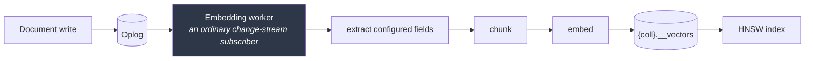
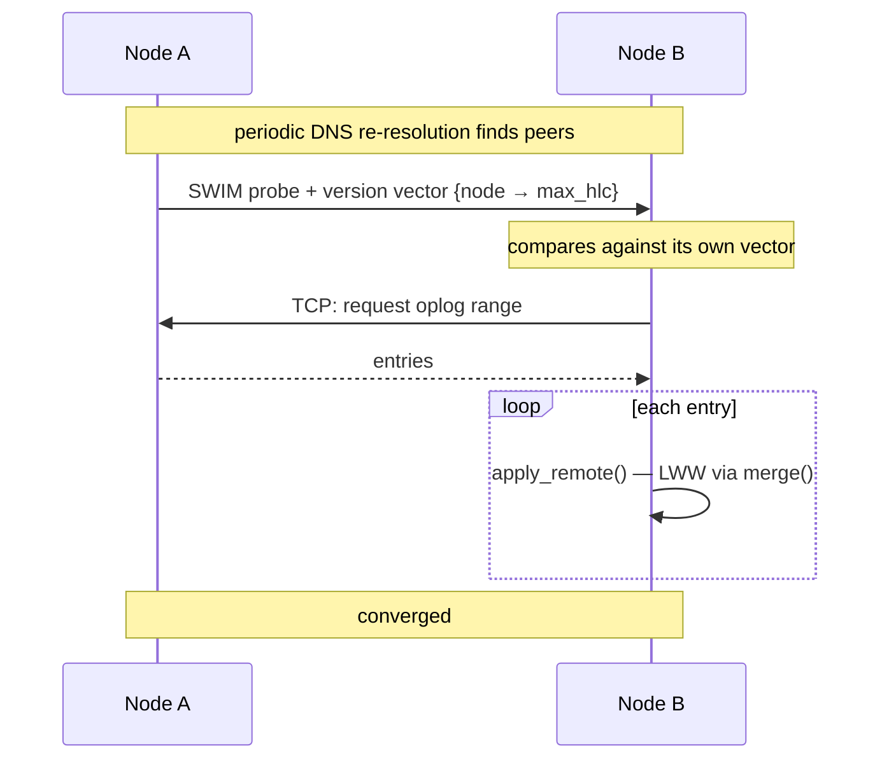
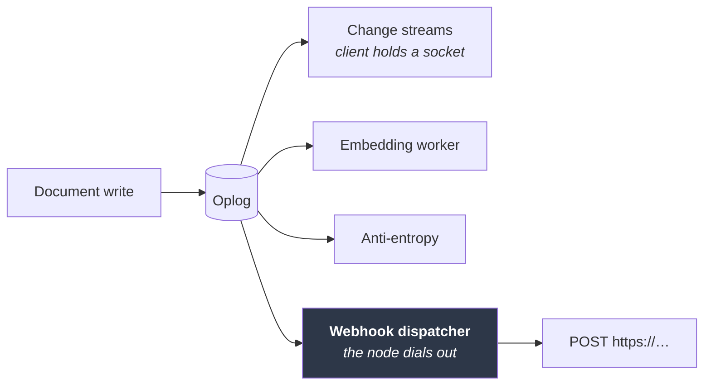

# Roadmap

[← Documentation index](README.md)

Milestone status, and the planned design for what remains. This document exists
so that development can be picked up later without re-deriving decisions.

---

## Status

| Milestone | Scope | Status |
|---|---|---|
| **M0** | Workspace, core types, HLC, config, Docker, CI | ✅ Complete |
| **M1** | Storage, CRUD, query, indexes, oplog, change streams, auth, HTTP API | ✅ Complete |
| **M2** | Auto-embeddings, HNSW, vector and hybrid search | ✅ Complete |
| **M3** | Built-in MCP server | ✅ Complete |
| **M4** | Discovery, replication transport, anti-entropy, snapshot resync, peer health, SWIM membership | ✅ Complete |
| **M5** | Rate limiting, TLS both fronts, benchmarks, aggregation, backup and point-in-time restore, audit log, metrics, CLI | ✅ Complete |
| **M6** | Webhooks — registration and push delivery of change events | ✅ Complete |
| **M7** | Query engine completion — the planner's carried gaps, and the M6 review findings | ✅ Complete |
| **M8** | Prove, persist, polish — the cluster harness, vector durability, observability, and the API ergonomics backlog | 🚧 Planned |

Ordering note: vectors and MCP come **before** clustering, deliberately. The
AI-facing features are the differentiator and are useful on a single node;
clustering is the largest and riskiest piece.

---

## M1 complete

Secondary indexes landed last: compound and descending keys, multikey arrays,
unique constraints, a blocking backfill, a rule-based planner, and `explain`.
See [Indexes](indexes.md).

Two deliberate gaps carried forward:

- **`$in` does not use an index.** It needs a union of point lookups rather than
  a single range. Common enough to be worth doing.
- **A range on a descending field falls back to the equality prefix.** Correct
  but less selective; doing it properly needs its own property test, since the
  failure mode is a range that is too narrow.

Neither affects correctness — an unused index only costs time.

---

## M2 — Vectors and auto-embeddings ✅

**Built.** Full detail in [Vectors](vectors.md); this section records what the
plan said and where the build departed from it.

Enabling embedding on a collection creates a shadow collection
`{coll}.__vectors`, maintained by a worker that is an ordinary change-stream
subscriber:

The worker being a plain change-stream subscriber was the payoff from the oplog
design, and it held: "keep vectors in sync" reduced to "consume the log", which
already worked, including resume-after-restart and backfill of a collection that
predates the configuration.

**Off the write path,** as planned. The API returns as soon as the oplog entry
is durable. Each vector record carries its source document's HLC, so staleness
is a comparison rather than a state machine, and re-embedding is idempotent.

| Piece | Planned | Built |
|---|---|---|
| Providers | `fastembed` local ONNX as the zero-config default | ✅ trait + OpenAI / Ollama / custom HTTP. **`byo` is the default; local is feature-gated** — its native ONNX + OpenSSL dependencies would undo the pure-Rust property ([Deviations](deviations.md)) |
| Index | HNSW via `hnswlib-rs` | ✅ HNSW via **`hnsw_rs`** — `hnswlib-rs` requires nightly Rust (`#![feature(f16)]` in a dependency) |
| Index selection | — | ✅ `IndexCache` chooses approximate above **500** vectors (originally 2000, lowered once measured — [Benchmarks](benchmarks.md)), exact below, with a 30 s rebuild interval |
| Persistence | Snapshot the graph, replay newer entries on startup | ⛔ **Not built.** In-memory only; a restart rebuilds lazily. Correctness does not depend on it |
| Deletes | Tombstone in the graph, rebuild past a ratio threshold | ✅ Handled differently: the graph supplies candidates only, and a candidate whose record is gone is skipped. No tombstoning needed |
| Search | `vector_search` + `hybrid_search` with RRF | ✅ Both, with filter composition against the query language |
| Replication | Vectors ride the oplog as data | 📋 M4 — the records are stored like any document, so this needs no vector-specific work |
| `$vectorSearch` stage | A pipeline stage | ⛔ Not built; search is its own endpoint |

**Resolved open questions.** Filtered k-NN post-filters, widening the graph
search 8× to compensate — a pre-filter would need the graph to know about
document state it deliberately does not track. The slim-image question dissolved
once local embeddings became opt-in: the default image carries no model at all.

**The one thing that surprised.** `anndists::DistDot` asserts `1 - dot >= 0`,
which only holds for unit vectors — a real embedding would have aborted the
process. Dot-product collections take the exact path. Found by testing the
metric rather than trusting it.

---

## M3 — Built-in MCP server ✅

**Built.** Full detail in [MCP](mcp.md); this section records what the plan said
and where the build departed from it.

`rmcp` with `transport-streamable-http-server`, mounted at `/mcp` on the same
axum router, sharing storage handles directly — no separate process, no loopback
hop. That held exactly as planned.

**Every tool call runs as the authenticated principal**, through the same
`Principal::can()` the REST routes use. Write tools exist but simply fail
authorization for a read-only token: capability is controlled by the role, not
by build flags or a second permission system.

| Piece | Planned | Built |
|---|---|---|
| Transport | `rmcp` streamable HTTP at `/mcp` | ✅ **Stateless** — no MCP session, so an expired token stops working immediately rather than riding a session opened while it was valid |
| Read tools | `list_databases`, `list_collections`, `describe_collection`, `find`, `count`, `aggregate` | ✅ all six — `aggregate` landed with the pipeline in M5 |
| Search tools | `vector_search`, `hybrid_search` | ✅ Both, with filter composition |
| Write tools | `insert`, `update`, `delete`, `create_collection`, `create_index` | ✅ All five |
| Resources | Collections with inferred schema and samples | ✅ `kimmy://{db}/{coll}`, grant-filtered, **excluding `__kimmy` and shadow collections** ([ADR-027](decisions.md)) |
| Enforcement | One `Principal::can()`, shared with REST | ✅ Stronger than planned — both edges share `kimmy_api::exec`, so the check is *inside* each operation rather than repeated beside it ([ADR-024](decisions.md)) |

**The dependency arrow was inverted.** The crate graph had `kimmy-api` depending
on `kimmy-mcp`, from a placeholder written at M0. It is now the other way. The
milestone's stated constraint — "there must not be a second, weaker enforcement
point" — is not achieved by co-location alone, only made possible by it; sharing
the executor is what makes the check unskippable. The REST handlers collapsed
into thin adapters in the same change, which is the evidence the extraction was
real rather than shaped around MCP.

**Two things were found by driving a real server, not by tests.**
`describe_collection` reported a `presence` of 2.0 — above 1.0, and meaningless
— because array elements were counted per element rather than per document. And
the first `resources/list` offered `kimmy://__kimmy/__users`, the password-hash
collection, as attachable context. Neither had a test, because neither had
occurred to anyone.

**One deliberate deviation from the SDK's default.** `rmcp` enables a `Host`
allow-list as DNS-rebinding protection; it is off by default here, because the
attack needs an unauthenticated server and `/mcp` verifies a bearer token before
the transport runs. Keeping the default would have refused every client
connecting by a real hostname. [ADR-026](decisions.md).

---

## M4 — Clustering and replication ✅

The largest remaining piece. Membership via [`foca`](https://github.com/caio/foca)
(SWIM + suspicion) over UDP, with TCP for oversized payloads.

Already implemented and tested: `apply_remote`, conflict resolution, convergence
of concurrent writes applied in opposite orders on two engines, and discovery
string parsing. **Missing: the transport.**

### Solved: replicated writes reaching change streams ✅

An applied remote entry keeps its *originating* stamp, so it lands in the oplog
**behind** the local tail, and a subscriber past that point would never see it.
Resolved with option 1 — a second index over local arrival order, which streams
follow while replication keeps origin order. See [Oplog](oplog.md).

### Solved: collection identity across nodes ✅

Not in the original plan, and found while starting the transport. Collection
ids came from a **node-local counter**, and every oplog entry names its
collection by id — so two nodes that created the same collection in a different
order disagreed about which collection an entry referred to, and a replicated
write would land in the wrong one. Silently, and only for peers whose creation
order differed.

Ids are now derived from `(database, name)`, so every node computes the same
answer with no coordination. [ADR-031](decisions.md).

### Built: version vectors and anti-entropy ✅

`oplog_versions` tracks `{node → max_hlc}`, maintained on every oplog append and
rebuilt on open if it disagrees with the log. `VersionVector::behind` answers
"where must a peer start sending", `entries_for_peer` produces the range, and
`apply_batch` merges it. Unique-violation entries are excluded, as they must be.

All of it is **transport-free** and tested between engines in one process:
two-node convergence, three-node transitive convergence through a middle peer,
conflicting writes agreeing on a winner, deletes replicating, and a stable
second round that transfers nothing.

### Built: DDL replication ✅

Five entry kinds — `CreateCollection`, `DropCollection`, `CreateIndex`,
`DropIndex`, `ConfigureVectors` — each with its own payload and its own
idempotency rule. Operations rather than a metadata snapshot, so two nodes
adding *different* indexes during a partition both keep theirs.
[ADR-033](decisions.md).

### Built: the replication transport ✅

TCP, length-prefixed BSON, mutually authenticated with `cluster_secret`. Every
node periodically asks every discovered peer what it holds and pulls what it
lacks. Verified between two real daemons: a collection, a unique index and a
document replicated with no configuration beyond a seed address; writes
converged in both directions; a partition healed; and a cross-node unique
violation left both documents in place while both nodes reported it.
[ADR-035](decisions.md).

### Built: snapshot resync ✅

A peer below the sender's retention horizon is told so and sent current state
instead of history. Without it, a node added to a cluster older than
`oplog_retention_secs` received nothing it could apply and retried forever —
which, at the default retention, is any node added to a running cluster.
[ADR-036](decisions.md).

### Built: SWIM membership, over local peer health ✅

Two layers. Local bookkeeping — exponential backoff for peers that fail, and a
fixed fanout per round — keeps this node's costs bounded. SWIM via `foca` over
UDP gives the *cluster* a shared opinion about who is alive, with suspicion and
indirect probing, and learns members that were never configured.
[ADR-037](decisions.md).

Verified on three daemons: the third was told only about the first and learned
the second by gossip; killing one had both survivors agree it was down within
milliseconds of each other.

### Still missing
- **SRV discovery** — `dns-srv:` parses but does not resolve; SRV records need a
  DNS resolver that can read record types the standard library does not expose.
  `dns:` and `k8s:` both work.

### Resolved: dropped collections leave a tombstone ✅

They were protected only by the `DropCollection` oplog entry, so past
`oplog_retention_secs` a rejoining partitioned peer resurrected the collection
and every document in it. Now `collections_dropped` records the drop's stamp
and is collected under `tombstone_retention_secs`, matching how document
deletes already worked. [ADR-034](decisions.md).

**Still inherent:** a peer partitioned for longer than
`tombstone_retention_secs` can still resurrect, for collections and documents
alike. That is the documented trade of tombstone-based deletion in an
eventually-consistent store, not a bug — but it is why the setting must exceed
your worst tolerable partition.

### Uniqueness violation detection — committed for M4

Unique indexes carry an `enforcement` mode. The `local` default enforces on the
accepting node only; two nodes can each accept a conflicting write during a
partition, and last-writer-wins would otherwise discard one **silently**.

M4 must therefore detect violations at merge time and surface them:

- a `uniqueViolation` change-stream event naming the index and the colliding ids — ✅ **built**
- the losing document recorded rather than lost, so it can be reconciled — ✅ **moot, see below**
- a metric, so the condition is visible without watching a stream — ✅ **built** (`kimmy_unique_violations`)

**Correction found while building it: there is no losing document.** The two
colliding documents have different `_id`s, so last-writer-wins never runs on
them — both are applied and both survive. Only the constraint is broken. So
nothing needs recording to avoid being lost; what needed deciding was what to
do when maintaining the index at merge finds the key already held. The answer
is to add the entry anyway and report: skipping it would keep the index
formally unique at the cost of an index-backed query being unable to find a
document that exists, trading a reported problem for a silent wrong answer.

**Still to do in M4:** `OpKind::UniqueViolation` entries are a node's own
observation, not replicated facts — every node detects the same collision when
it merges. Anti-entropy must **exclude them** when shipping oplog ranges to
peers, or the same violation is reported once per node.

This does not *prevent* the violation — that is provably impossible without
coordination (see [ADR-020](decisions.md)) — but it converts silent corruption
into an actionable event, which is most of the value.

`coordinated` enforcement (value-ownership routing, real cluster-wide guarantee,
CP for those writes) stays reserved and is refused at index-creation time until
it exists.

Also open: whether `drop_collection` should replicate as a tombstone (a
partitioned peer could otherwise resurrect a dropped collection), and how to
handle a node whose tombstones were collected while it was partitioned.

---

## M5 — Hardening ✅

| | |
|---|---|
| Backup / restore | ✅ Done — online snapshot over `GET /v1/admin/backup`, offline `kimmyd restore`. [ADR-041](decisions.md). Point-in-time restore rewinds a restored backup with `--until`, refusing what the oplog cannot reconstruct — [ADR-044](decisions.md) |
| TLS | ✅ Done, both fronts. Clients: — `axum-server` over `rustls` on the `ring` provider already in the build, enabled by naming a cert and key. [ADR-039](decisions.md). Node↔node: TLS bound to `cluster_secret` by channel binding rather than to certificates, so there is no PKI to run — [ADR-040](decisions.md) |
| Rate limiting | ✅ Done for `/v1/auth/login` — token bucket per caller, checked *before* the Argon2 verify it exists to bound. [ADR-038](decisions.md). Other routes deliberately deferred to the benchmark work below |
| Oplog & tombstone GC | ✅ Done — background pass, `storage.gc_interval_secs`. [ADR-028](decisions.md) |
| Aggregation pipeline | ✅ Done — those six plus `$skip`, `$count` and `$lookup`, with a hard document ceiling on blocking stages. Also lands the MCP `aggregate` tool. [Aggregation](aggregation.md) |
| `kimmy` CLI | ✅ Done — one-shot subcommands over the HTTP API, JSON on stdout. An interactive shell was considered and deferred: it is the same command surface plus a terminal UI. [CLI](cli.md) |
| Benchmarks | 🚧 Vector index, write path and query planner measured. No crossover existed, so `MIN_VECTORS_FOR_INDEX` dropped 2,000 → 500; and every write costs one durable commit, which makes secondary indexes free on the write path. [Benchmarks](benchmarks.md) |
| Audit log | ✅ Done — emitted from the single authorization point, four modes, `kimmy::audit` target. [ADR-042](decisions.md) |
| Richer metrics | ✅ Mostly — request rates, response classes, storage size, denial and rate-limit counters. **Latency histograms and oplog lag are not built**, and are documented as such rather than guessed. [ADR-043](decisions.md) |

---

## M6 — Webhooks: registration and push ✅

A developer registers a URL and the cluster **pushes** change events to it.
Change streams already carry these events, but the client must open and hold a
WebSocket; this is for consumers that cannot — serverless functions, queues,
other services.

### The dispatcher is another oplog consumer

| Need | Already exists |
|---|---|
| Durable resume point | `Engine::consumer_position`, as the embedding worker uses |
| Crash redelivers rather than skips | Position recorded **after** the work |
| A globally unique event id | `Stamp { hlc, node }` on every entry |
| A registry that replicates, backs up, restores | A collection in `__kimmy`, like `__users` |
| Who is alive right now | SWIM — `Members::snapshot()` ([ADR-037](decisions.md)) |
| "What has not been delivered yet?" | `VersionVector::behind` — the same question anti-entropy asks |

### The problem, and the way out

Two obvious designs both fail, in opposite directions:

- **The originating node delivers.** Exactly one delivery — until that node dies
  before dispatching, and then *nobody* delivers, because its peers hold the
  data but consider it not theirs. A client silently never gets an event.
- **Every node delivers.** Nothing is lost, and a five-node cluster fires five
  identical requests for every write.

Both treat *which node delivers* as fixed in advance. The way out is to stop
fixing it and make **delivery progress replicated state**:

> Each node records, per subscription, a `VersionVector` of what it has
> delivered — "for origin node X, delivered through HLC H". A node writes only
> **its own** record, so there are no write conflicts and nothing to merge by
> last-writer-wins. Any node reads the union to know what the cluster as a whole
> has already sent.

Once progress converges like any other data, *any* node can deliver and every
node knows what is already gone. The question shrinks to "who goes first", which
has a cheap answer that survives a death.

### Who goes first: a derived owner

`owner(subscription) = rendezvous_hash(subscription_id, live_members)`.

A pure function of the SWIM member set. **This is not leader election** — there
is no vote, no term, no consensus, and no cluster-wide coordinator. Each node
computes the same answer independently, different subscriptions land on
different nodes, and a disagreement produces a duplicate rather than a split
brain.

When the owner dies, SWIM removes it, every node recomputes, and the new owner
**resumes from the union of progress** rather than from the beginning. Failover
costs roughly what SWIM detection costs — measured in milliseconds during M4.

**So: does a client miss an event when a node dies?** No. The only way an event
is never delivered is if the write never replicated off the node that accepted
it — in which case the data itself is gone from the database too, and webhooks
are not the thing that failed.

### The guarantee, stated plainly

**At-least-once, ordered per subscription.** Exactly-once is not achievable over
a network by any design, and pretending otherwise would set an expectation the
system cannot keep.

What makes duplicates harmless is that every delivery carries a stable,
globally unique id — the originating `Stamp` — in the body and in a header, so
deduplicating is a set-membership test. Duplicates should be rare (a membership
disagreement, or a redelivery after a crash) rather than routine.

Ordering holds per subscription per origin node. There is no total order across
nodes, which is what the leaderless design says everywhere else.

### Decisions taken

| Decision | Chosen | Why |
|---|---|---|
| Who delivers | Derived owner via rendezvous hash over SWIM members, with replicated progress | Leaderless, loses nothing on node death, one delivery in the normal case |
| Egress | Private ranges blocked by default; `webhooks.allowed_hosts` to permit | Closes the SSRF hole while letting public endpoints work with no configuration |
| Registering requires | A new **`webhook`** action | Handing out an egress path should be explicit, not bundled into reading |

The cost, stated: one small progress write per delivered batch, which
replicates. That is the price of not losing events, and it is why progress is a
high-water mark per batch rather than a record per event.

### Tasks

| # | Task | Notes |
|---|---|---|
| 1 | ✅ **`webhook` RBAC action** | Add to `Action`, decide implication: `admin` implies it; `read`/`write`/`watch` do **not**. Independent, like `watch` ([ADR-014](decisions.md)) |
| 2 | ✅ **Subscription registry** | `__kimmy.__webhooks`: url, collection, operation filter, secret, state, created-by. A collection, so it replicates, backs up and restores unchanged |
| 3 | ✅ **Progress records** | `__kimmy.__webhook_progress`, `_id = {subscription}:{node}`, holding a `VersionVector`. Written only by its own node, so conflict-free by construction |
| 4 | ✅ **Registration API** | `POST/GET/DELETE /v1/db/{db}/coll/{coll}/webhooks`, gated on `webhook`. Deliberately **no MCP tool** at first: registering an egress path is not a reading act |
| 5 | ✅ **Ownership** | Rendezvous hash over `Members::snapshot()`. Must degrade correctly with clustering off — a single node owns everything — and when membership is momentarily empty |
| 6 | ✅ **Dispatcher worker** | One per node. Computes owned subscriptions, reads union progress, uses `VersionVector::behind` to find undelivered entries, batches by size and max delay so a bulk load is not one request per document |
| 7 | ✅ **Delivery** | HTTP POST, change-stream event shape, timeout, `X-Kimmy-Event-Id` and `X-Kimmy-Signature` headers |
| 8 | ✅ **Signing** | HMAC-SHA256 over the body with a per-subscription secret, plus a timestamp against replay. `hmac`/`sha2` are already in the build for the cluster handshake |
| 9 | ✅ **Egress policy** | Resolved address checked, not the name; every address, not the first; redirects refused; loopback, link-local, RFC1918, carrier NAT and reserved ranges blocked unless allowlisted. Enforced at registration **and** before each delivery |
| 10 | ✅ **Failure handling** — per-subscription backoff, and invalidation when progress falls past retention | Exponential backoff; invalidate the subscription when its progress falls past `oplog_retention_secs`, exactly as a lagging change-stream consumer gets `410` |
| 11 | ✅ **Observability** | `kimmy_webhook_deliveries_total{outcome}`, `kimmy_webhook_events_total`, `kimmy_webhook_subscriptions{state}` and `kimmy_webhook_backlog_seconds` — the last is the one an operator alerts on. Plus audit records on register, remove and invalidate |
| 12 | ✅ **Tests** | Against a local receiver over a real socket: delivery, signature verification and tampering, retry after failure, per-subscription backoff, invalidation past retention, no history replay, ownership standing down, egress refused at delivery, batching under load, removal stopping delivery, the concurrency bound, and the payload cap |
| 13 | ✅ **Docs and ADRs** — [Webhooks](webhooks.md), ADR-045 | One ADR for derived ownership plus replicated progress — including why it is not leader election — and one for the egress policy |
| 14 | ✅ **Delivery limits** | `webhooks.max_concurrent_deliveries` and `webhooks.max_payload_bytes`. Bounded concurrency rather than a serial pass, and an oversized document delivered without `fullDocument` rather than dropped |

### Open questions, settled

| Question | Answer |
|---|---|
| **Payload cap** — what happens to a single event that exceeds it | Delivered with `fullDocument` omitted and `fullDocumentOmitted` set. The receiver still learns the change happened; dropping it would leave a gap it could never detect |
| **Per-node delivery cap** | `max_concurrent_deliveries`, default 8 — **but the question was wrong as asked.** See below |
| **Does the registry replicate?** | Yes, being a collection — which is what lets any node take ownership. Confirmed as wanted |
| **Rendezvous input** | Still `SocketAddr`. Hashing node ids would be stabler across a re-address; it needs a member → node-id mapping and has not been worth it. Carried in [Deviations](deviations.md) |

#### Correction: the delivery cap answered a risk that did not exist

This section asked for a cap "so a webhook on a hot collection cannot saturate a
node's outbound connections". **It could not.** The dispatcher delivered inside
a `for` loop with one `.await` per subscription, so the node held at most one
HTTP request in flight at a time regardless of how many subscriptions existed.
There was nothing to cap.

The serial loop caused the opposite problem instead, and a worse one: one
endpoint that stopped answering held the whole pass for the ten-second delivery
timeout and delayed every subscription behind it — a webhook nobody controlled
deciding when the rest fired.

Bounded concurrency fixes that and makes the original request meaningful at the
same time, so the task landed as written even though its stated motivation was
not real. The full account, including why the premise survived three branches
unchallenged, is in [Deviations](deviations.md).

---

## M7 — Query engine completion ✅

The planner carried three known gaps since M1, one of them the register's
only 🔴. Each was *correct but slow* — deliberately, because the wrong
version of each is *fast but silently wrong*. M7 made them fast **and**
correct, and the register now holds zero 🔴.

Chosen over operational maturity and API ergonomics on 2026-08-10; those two
themes remain the leading candidates for M8. Completed 2026-08-11.

### Why these gaps exist, so the fix is not re-derived

All three trace to one fact: **an index key range over a multikey (array)
field cannot use both bounds.** `{a: [2, 0]}` matches `{$gte: 1, $lte: 1}`
because *different elements* satisfy each bound — intersecting the bounds into
one range excluded the document. That was a real bug, found by property
testing; the fix was to use one bound and keep the range a superset.

But the superset penalty is only *necessary* for fields that hold arrays.
MongoDB's answer, and ours: track multikey-ness per index, and give the
scalar-only majority both bounds back.

### Tasks

| # | Task | Notes |
|---|---|---|
| 1 | ✅ **Warm-up: the M6 review findings** | Webhook payloads shipped `"database": ""` and `"collection": ""` — now filled from the subscription and asserted on the wire. `Backoff` entries pruned against the registry each pass |
| 2 | ✅ **Egress: check and dial must share one resolution** | `EgressPolicy::check` resolved the host, then `reqwest` re-resolved to dial — a rebinding attacker with a zero TTL passed the check and flipped the record before the connection. Closed by `CheckedResolver`: the delivery client's `dns_resolver` runs `permits_addrs` inside resolution, so the addresses checked are exactly the addresses dialled. Also caught: the client's `unwrap_or_default()` fallback would have silently shed the redirect refusal; the dispatcher now refuses to start without its client |
| 3 | ✅ **Multikey tracking per index** | `IndexMeta::multikey`, set in the same transaction as the entries — by write, backfill, replication apply, and rewind. One-way. Also covers path fan-out (`a.b` over an array of documents), which is multikey with no array value |
| 4 | ✅ **Both bounds on non-multikey indexes** | The 🔴 closes. A both-bounds plan re-validates the flag **in the same snapshot as the scan** and falls back to a collection scan if it flipped — the plan's metadata was already stale when the scan began. Found and fixed alongside: maintenance trusted the caller's index list, so a write through a stale handle skipped a just-created index entirely — no entries, no unique check. Definitions are now re-read inside the write's transaction |
| 5 | ✅ **Ranges on descending fields** | The swap: a descending component's inverted bytes reverse order, so the value-space lower bound caps the key-space top. Encoded-key planner tests, engine equivalence + selectivity tests (including ascending-prefix + descending-range compounds), and the original equivalence property test began exercising the path the moment the planner stopped refusing it |
| 6 | ✅ **`$in` uses the index** | `IndexPlan` generalized to a list of ranges: one per distinct `$in` value (deduplicated on the encoded key), each carrying the equality prefix. Candidates unioned and deduplicated by document key. Equality probes are sound on multikey indexes, so no flag interaction. `explain` reports `indexUnion` with a probe count |
| 7 | ✅ **Mutation testing** | `cargo-mutants` (now installed; the hand-rolled harness era is over): full runs on `plan.rs` (29 mutants) and `keyenc.rs` (21), plus a diff-scoped run over everything M7 changed (81). **Ten escapes, nine killed with new tests, one proven equivalent** — see [Testing](testing.md) for the account |
| 8 | ✅ **Docs** | [Indexes](indexes.md) rewritten where behaviour changed; the 🔴 and both 🟡 planner entries in [Deviations](deviations.md) moved to 🟢; [Handoff](handoff.md) replaced |

### Deliberately out of scope

`$vectorSearch` as a pipeline stage stays unbuilt — it is an API-surface
decision, not a planner gap, and belongs with the ergonomics theme. Rate
limiting beyond login still waits on the benchmark work, as agreed in M5.

---

## M8 — Prove, persist, polish 🚧

Everything both declined M7 themes held, plus the two questions that shaped
the milestone: *is the gossip protocol actually maintaining cluster state,
provably?* and *is the vector story finished?* Chosen as one milestone rather
than two on 2026-08-11 — roughly twice M7's size, deliberately.

Three workstreams, ordered so that verification lands first and everything
cluster-adjacent afterwards can be proven with it.

### Why the cluster harness leads

SWIM works — verified by hand on three daemons in M4, down to survivors
agreeing a killed node was dead within 17 ms. But **nothing automated has
ever started two nodes.** The suite's convergence tests are deliberately
transport-free, and the two worst cluster bugs to date were both found only
by hand-driving real processes: the compose file that left every node
advertising loopback so gossip silently never formed, and the collection-id
encoding that broke replication for ~48% of collection names. A risk asserted
nowhere was hiding in both. The harness makes that class of discovery
repeatable instead of heroic.

**Shape:** an integration crate (`kimmy-harness` or `tests/cluster.rs` in
`kimmyd`) that spawns real `kimmyd` processes on scratch ports and asserts:
membership converges; an unseeded member is learned through gossip; a killed
node is declared down by every survivor; a `SIGSTOP`ped node — alive but
unresponsive, which is what a partition looks like to SWIM — is suspected and
then declared down, and recovers on `SIGCONT` without a restart; replication
converges through gossip-discovered (not seeded) peers; and a webhook owned
by a killed node is delivered by its successor. Slow tests, marked
`#[ignore]` for the default run, executed in CI and by the gate.

### Tasks

| # | Workstream | Task | Notes |
|---|---|---|---|
| 1 | Prove | **Cluster verification harness** | As above. The two historical bugs become its first regression tests: assert gossip *formed* (not merely that replication converged), and assert a high-hashing collection name replicates |
| 2 | Prove | **Latency histograms + oplog lag** | The two metrics ADR-043 documented as missing rather than guessed. Lag follows the M6 lesson: measure undelivered work, not cursor age |
| 3 | Prove | **Benchmark baseline + concurrent writers** | The two gaps the M5 benchmark work left: batched and concurrent writes measured, and a recorded baseline a regression can be caught against |
| 4 | Persist | **HNSW snapshot persistence** | The M2 deferral. Snapshot the graph plus the generation it covers; startup loads the snapshot and rebuilds only if the generation disagrees. Correctness must never depend on it — the exact-scan fallback stays, and a corrupt snapshot is discarded, not trusted |
| 5 | Persist | **Vector reindex** | Changing model or dimension without the manual drop-and-re-enable. Backfills from the *collection*, not the oplog — the oplog may be collected; the documents are the durable source |
| 6 | Persist | **Provider dialect audit** | Byo, OpenAI, Ollama, custom HTTP and local exist. Verify whether custom HTTP genuinely covers Voyage / Cohere / Gemini response shapes; add dialects only where it does not |
| 7 | Polish | **Bulk insert** | `POST /docs` takes one document per request. API shape is a public-surface decision, **reserved for the maintainer** (array body on the existing route vs. a dedicated endpoint) before it is built |
| 8 | Polish | **Certificate reload** | A renewed certificate currently needs a restart. Trigger is a design decision (SIGHUP vs. mtime poll) — ADR before code |
| 9 | Polish | **SRV discovery** | `dns-srv:` parses but does not resolve. Needs a resolver crate; **must not add a second native crypto stack** — the DNSSEC features that pull one stay off, and `check-native-deps.sh` is the arbiter |
| 10 | Polish | **Webhook ownership by node id** | Rendezvous currently hashes the `SocketAddr` SWIM publishes, so re-addressing a node reshuffles its subscriptions. Gossip the node id as member metadata and hash that. Verified with the harness from task 1; a mixed-version cluster produces duplicates, which at-least-once already tolerates |
| 11 | Polish | **Token revocation** | Deleting a user currently leaves issued tokens valid until expiry. Semantics are a design decision — ADR first; a per-user token version (bump to invalidate all outstanding) is the leading candidate over a replicated deny-list, because it adds no per-request lookup that can miss |
| 12 | Close | **Mutation pass + docs** | `cargo-mutants` diff-scoped over everything M8 changed — the M7 lesson says the escapes will be in the new callers, not the old layers. Deviations, handoff, and this section updated |

### Decisions reserved for the maintainer

Bulk insert's API shape (task 7), certificate reload's trigger (task 8), and
token revocation's semantics (task 11). Each is public surface or security
behaviour; the plan deliberately does not pre-decide them — they are settled
before the relevant branch starts.

### Explicitly still out of M8

Coordinated unique enforcement (reserved since M4), per-username rate
limiting defaults, and everything in the not-planned table below.

---

## Explicitly not planned

| | Why |
|---|---|
| Multi-document transactions | Requires coordination — the thing a leaderless design forgoes |
| `$where` / JavaScript execution | An obvious injection surface |
| MongoDB wire protocol | Considered and rejected; see [Decisions](decisions.md) |
| Geospatial indexes | Out of scope |
| Field-level encryption | Use an encrypted volume |
| Full-text indexes | Superseded by vector and hybrid search |

---

## Next

- [Decisions](decisions.md) — the choices already settled
- [Testing](testing.md) — the invariants any change must preserve
