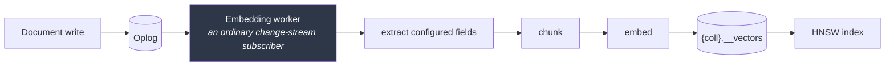
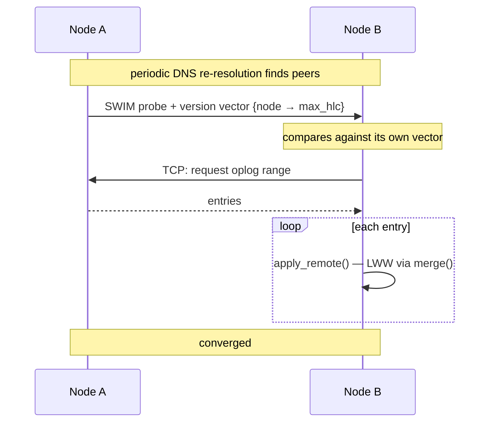
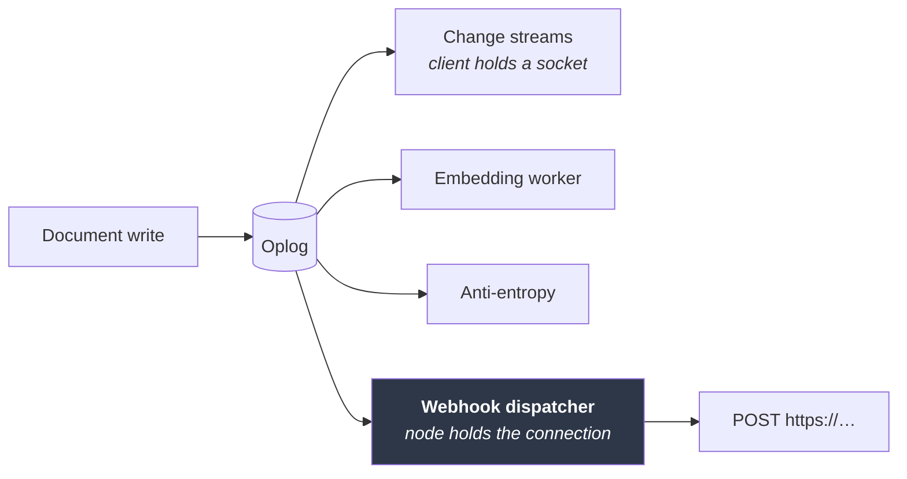

# Roadmap

[← Documentation index](README.md)

Milestone status, and the planned design for what remains. This document exists
so that development can be picked up later without re-deriving decisions.

---

## Status

```mermaid
graph LR
    M0["<b>M0</b> ✅<br/>skeleton · config<br/>container · CI"]
    M1["<b>M1</b> ✅<br/>storage · query<br/>streams · auth · API"]
    IDX["<b>indexes</b> ✅<br/>the last<br/>M1 item"]
    M2["<b>M2</b> ✅<br/>vectors and<br/>auto-embeddings"]
    M3["<b>M3</b> ✅<br/>built-in<br/>MCP server"]
    M4["<b>M4</b> ✅<br/>clustering and<br/>replication"]
    M5["<b>M5</b> ✅<br/>hardening"]
    M6["<b>M6</b> 📋<br/>webhooks"]

    M0 --> M1 --> IDX --> M2 --> M3 --> M4 --> M5 --> M6

    style M0 fill:#2f5d3a,color:#fff
    style M1 fill:#2f5d3a,color:#fff
    style IDX fill:#2f5d3a,color:#fff
    style M2 fill:#2f5d3a,color:#fff
    style M3 fill:#2f5d3a,color:#fff
    style M4 fill:#2f5d3a,color:#fff
    style M5 fill:#2f5d3a,color:#fff
```

| Milestone | Scope | Status |
|---|---|---|
| **M0** | Workspace, core types, HLC, config, Docker, CI | ✅ Complete |
| **M1** | Storage, CRUD, query, indexes, oplog, change streams, auth, HTTP API | ✅ Complete |
| **M2** | Auto-embeddings, HNSW, vector and hybrid search | ✅ Complete |
| **M3** | Built-in MCP server | ✅ Complete |
| **M4** | Discovery, replication transport, anti-entropy, snapshot resync, peer health, SWIM membership | ✅ Complete |
| **M5** | Rate limiting, TLS both fronts, benchmarks, aggregation, backup and point-in-time restore, audit log, metrics, CLI | ✅ Complete |
| **M6** | Webhooks — registration and push delivery of change events | 📋 Planned |

Ordering note: vectors and MCP come **before** clustering, deliberately. The
AI-facing features are the differentiator and are useful on a single node;
clustering is the largest and riskiest piece.

---

## M1 complete

Secondary indexes landed last: compound and descending keys, multikey arrays,
unique constraints, a blocking backfill, a rule-based planner, and `explain`.
See [Indexes](indexes.md).

Two deliberate gaps carried forward:

- **`$in` does not use an index.** It needs a union of point lookups rather than
  a single range. Common enough to be worth doing.
- **A range on a descending field falls back to the equality prefix.** Correct
  but less selective; doing it properly needs its own property test, since the
  failure mode is a range that is too narrow.

Neither affects correctness — an unused index only costs time.

---

## M2 — Vectors and auto-embeddings ✅

**Built.** Full detail in [Vectors](vectors.md); this section records what the
plan said and where the build departed from it.

Enabling embedding on a collection creates a shadow collection
`{coll}.__vectors`, maintained by a worker that is an ordinary change-stream
subscriber:

The worker being a plain change-stream subscriber was the payoff from the oplog
design, and it held: "keep vectors in sync" reduced to "consume the log", which
already worked, including resume-after-restart and backfill of a collection that
predates the configuration.

**Off the write path,** as planned. The API returns as soon as the oplog entry
is durable. Each vector record carries its source document's HLC, so staleness
is a comparison rather than a state machine, and re-embedding is idempotent.

| Piece | Planned | Built |
|---|---|---|
| Providers | `fastembed` local ONNX as the zero-config default | ✅ trait + OpenAI / Ollama / custom HTTP. **`byo` is the default; local is feature-gated** — its native ONNX + OpenSSL dependencies would undo the pure-Rust property ([Deviations](deviations.md)) |
| Index | HNSW via `hnswlib-rs` | ✅ HNSW via **`hnsw_rs`** — `hnswlib-rs` requires nightly Rust (`#![feature(f16)]` in a dependency) |
| Index selection | — | ✅ `IndexCache` chooses approximate above **500** vectors (originally 2000, lowered once measured — [Benchmarks](benchmarks.md)), exact below, with a 30 s rebuild interval |
| Persistence | Snapshot the graph, replay newer entries on startup | ⛔ **Not built.** In-memory only; a restart rebuilds lazily. Correctness does not depend on it |
| Deletes | Tombstone in the graph, rebuild past a ratio threshold | ✅ Handled differently: the graph supplies candidates only, and a candidate whose record is gone is skipped. No tombstoning needed |
| Search | `vector_search` + `hybrid_search` with RRF | ✅ Both, with filter composition against the query language |
| Replication | Vectors ride the oplog as data | 📋 M4 — the records are stored like any document, so this needs no vector-specific work |
| `$vectorSearch` stage | A pipeline stage | ⛔ Not built; search is its own endpoint |

**Resolved open questions.** Filtered k-NN post-filters, widening the graph
search 8× to compensate — a pre-filter would need the graph to know about
document state it deliberately does not track. The slim-image question dissolved
once local embeddings became opt-in: the default image carries no model at all.

**The one thing that surprised.** `anndists::DistDot` asserts `1 - dot >= 0`,
which only holds for unit vectors — a real embedding would have aborted the
process. Dot-product collections take the exact path. Found by testing the
metric rather than trusting it.

---

## M3 — Built-in MCP server ✅

**Built.** Full detail in [MCP](mcp.md); this section records what the plan said
and where the build departed from it.

`rmcp` with `transport-streamable-http-server`, mounted at `/mcp` on the same
axum router, sharing storage handles directly — no separate process, no loopback
hop. That held exactly as planned.

**Every tool call runs as the authenticated principal**, through the same
`Principal::can()` the REST routes use. Write tools exist but simply fail
authorization for a read-only token: capability is controlled by the role, not
by build flags or a second permission system.

| Piece | Planned | Built |
|---|---|---|
| Transport | `rmcp` streamable HTTP at `/mcp` | ✅ **Stateless** — no MCP session, so an expired token stops working immediately rather than riding a session opened while it was valid |
| Read tools | `list_databases`, `list_collections`, `describe_collection`, `find`, `count`, `aggregate` | ✅ all six — `aggregate` landed with the pipeline in M5 |
| Search tools | `vector_search`, `hybrid_search` | ✅ Both, with filter composition |
| Write tools | `insert`, `update`, `delete`, `create_collection`, `create_index` | ✅ All five |
| Resources | Collections with inferred schema and samples | ✅ `kimmy://{db}/{coll}`, grant-filtered, **excluding `__kimmy` and shadow collections** ([ADR-027](decisions.md)) |
| Enforcement | One `Principal::can()`, shared with REST | ✅ Stronger than planned — both edges share `kimmy_api::exec`, so the check is *inside* each operation rather than repeated beside it ([ADR-024](decisions.md)) |

**The dependency arrow was inverted.** The crate graph had `kimmy-api` depending
on `kimmy-mcp`, from a placeholder written at M0. It is now the other way. The
milestone's stated constraint — "there must not be a second, weaker enforcement
point" — is not achieved by co-location alone, only made possible by it; sharing
the executor is what makes the check unskippable. The REST handlers collapsed
into thin adapters in the same change, which is the evidence the extraction was
real rather than shaped around MCP.

**Two things were found by driving a real server, not by tests.**
`describe_collection` reported a `presence` of 2.0 — above 1.0, and meaningless
— because array elements were counted per element rather than per document. And
the first `resources/list` offered `kimmy://__kimmy/__users`, the password-hash
collection, as attachable context. Neither had a test, because neither had
occurred to anyone.

**One deliberate deviation from the SDK's default.** `rmcp` enables a `Host`
allow-list as DNS-rebinding protection; it is off by default here, because the
attack needs an unauthenticated server and `/mcp` verifies a bearer token before
the transport runs. Keeping the default would have refused every client
connecting by a real hostname. [ADR-026](decisions.md).

---

## M4 — Clustering and replication ✅

The largest remaining piece. Membership via [`foca`](https://github.com/caio/foca)
(SWIM + suspicion) over UDP, with TCP for oversized payloads.

Already implemented and tested: `apply_remote`, conflict resolution, convergence
of concurrent writes applied in opposite orders on two engines, and discovery
string parsing. **Missing: the transport.**

### Solved: replicated writes reaching change streams ✅

An applied remote entry keeps its *originating* stamp, so it lands in the oplog
**behind** the local tail, and a subscriber past that point would never see it.
Resolved with option 1 — a second index over local arrival order, which streams
follow while replication keeps origin order. See [Oplog](oplog.md).

### Solved: collection identity across nodes ✅

Not in the original plan, and found while starting the transport. Collection
ids came from a **node-local counter**, and every oplog entry names its
collection by id — so two nodes that created the same collection in a different
order disagreed about which collection an entry referred to, and a replicated
write would land in the wrong one. Silently, and only for peers whose creation
order differed.

Ids are now derived from `(database, name)`, so every node computes the same
answer with no coordination. [ADR-031](decisions.md).

### Built: version vectors and anti-entropy ✅

`oplog_versions` tracks `{node → max_hlc}`, maintained on every oplog append and
rebuilt on open if it disagrees with the log. `VersionVector::behind` answers
"where must a peer start sending", `entries_for_peer` produces the range, and
`apply_batch` merges it. Unique-violation entries are excluded, as they must be.

All of it is **transport-free** and tested between engines in one process:
two-node convergence, three-node transitive convergence through a middle peer,
conflicting writes agreeing on a winner, deletes replicating, and a stable
second round that transfers nothing.

### Built: DDL replication ✅

Five entry kinds — `CreateCollection`, `DropCollection`, `CreateIndex`,
`DropIndex`, `ConfigureVectors` — each with its own payload and its own
idempotency rule. Operations rather than a metadata snapshot, so two nodes
adding *different* indexes during a partition both keep theirs.
[ADR-033](decisions.md).

### Built: the replication transport ✅

TCP, length-prefixed BSON, mutually authenticated with `cluster_secret`. Every
node periodically asks every discovered peer what it holds and pulls what it
lacks. Verified between two real daemons: a collection, a unique index and a
document replicated with no configuration beyond a seed address; writes
converged in both directions; a partition healed; and a cross-node unique
violation left both documents in place while both nodes reported it.
[ADR-035](decisions.md).

### Built: snapshot resync ✅

A peer below the sender's retention horizon is told so and sent current state
instead of history. Without it, a node added to a cluster older than
`oplog_retention_secs` received nothing it could apply and retried forever —
which, at the default retention, is any node added to a running cluster.
[ADR-036](decisions.md).

### Built: SWIM membership, over local peer health ✅

Two layers. Local bookkeeping — exponential backoff for peers that fail, and a
fixed fanout per round — keeps this node's costs bounded. SWIM via `foca` over
UDP gives the *cluster* a shared opinion about who is alive, with suspicion and
indirect probing, and learns members that were never configured.
[ADR-037](decisions.md).

Verified on three daemons: the third was told only about the first and learned
the second by gossip; killing one had both survivors agree it was down within
milliseconds of each other.

### Still missing
- **SRV discovery** — `dns-srv:` parses but does not resolve; SRV records need a
  DNS resolver that can read record types the standard library does not expose.
  `dns:` and `k8s:` both work.

### Resolved: dropped collections leave a tombstone ✅

They were protected only by the `DropCollection` oplog entry, so past
`oplog_retention_secs` a rejoining partitioned peer resurrected the collection
and every document in it. Now `collections_dropped` records the drop's stamp
and is collected under `tombstone_retention_secs`, matching how document
deletes already worked. [ADR-034](decisions.md).

**Still inherent:** a peer partitioned for longer than
`tombstone_retention_secs` can still resurrect, for collections and documents
alike. That is the documented trade of tombstone-based deletion in an
eventually-consistent store, not a bug — but it is why the setting must exceed
your worst tolerable partition.

### Uniqueness violation detection — committed for M4

Unique indexes carry an `enforcement` mode. The `local` default enforces on the
accepting node only; two nodes can each accept a conflicting write during a
partition, and last-writer-wins would otherwise discard one **silently**.

M4 must therefore detect violations at merge time and surface them:

- a `uniqueViolation` change-stream event naming the index and the colliding ids — ✅ **built**
- the losing document recorded rather than lost, so it can be reconciled — ✅ **moot, see below**
- a metric, so the condition is visible without watching a stream — ✅ **built** (`kimmy_unique_violations`)

**Correction found while building it: there is no losing document.** The two
colliding documents have different `_id`s, so last-writer-wins never runs on
them — both are applied and both survive. Only the constraint is broken. So
nothing needs recording to avoid being lost; what needed deciding was what to
do when maintaining the index at merge finds the key already held. The answer
is to add the entry anyway and report: skipping it would keep the index
formally unique at the cost of an index-backed query being unable to find a
document that exists, trading a reported problem for a silent wrong answer.

**Still to do in M4:** `OpKind::UniqueViolation` entries are a node's own
observation, not replicated facts — every node detects the same collision when
it merges. Anti-entropy must **exclude them** when shipping oplog ranges to
peers, or the same violation is reported once per node.

This does not *prevent* the violation — that is provably impossible without
coordination (see [ADR-020](decisions.md)) — but it converts silent corruption
into an actionable event, which is most of the value.

`coordinated` enforcement (value-ownership routing, real cluster-wide guarantee,
CP for those writes) stays reserved and is refused at index-creation time until
it exists.

Also open: whether `drop_collection` should replicate as a tombstone (a
partitioned peer could otherwise resurrect a dropped collection), and how to
handle a node whose tombstones were collected while it was partitioned.

---

## M5 — Hardening ✅

| | |
|---|---|
| Backup / restore | ✅ Done — online snapshot over `GET /v1/admin/backup`, offline `kimmyd restore`. [ADR-041](decisions.md). Point-in-time restore rewinds a restored backup with `--until`, refusing what the oplog cannot reconstruct — [ADR-044](decisions.md) |
| TLS | ✅ Done, both fronts. Clients: — `axum-server` over `rustls` on the `ring` provider already in the build, enabled by naming a cert and key. [ADR-039](decisions.md). Node↔node: TLS bound to `cluster_secret` by channel binding rather than to certificates, so there is no PKI to run — [ADR-040](decisions.md) |
| Rate limiting | ✅ Done for `/v1/auth/login` — token bucket per caller, checked *before* the Argon2 verify it exists to bound. [ADR-038](decisions.md). Other routes deliberately deferred to the benchmark work below |
| Oplog & tombstone GC | ✅ Done — background pass, `storage.gc_interval_secs`. [ADR-028](decisions.md) |
| Aggregation pipeline | ✅ Done — those six plus `$skip`, `$count` and `$lookup`, with a hard document ceiling on blocking stages. Also lands the MCP `aggregate` tool. [Aggregation](aggregation.md) |
| `kimmy` CLI | ✅ Done — one-shot subcommands over the HTTP API, JSON on stdout. An interactive shell was considered and deferred: it is the same command surface plus a terminal UI. [CLI](cli.md) |
| Benchmarks | 🚧 Vector index, write path and query planner measured. No crossover existed, so `MIN_VECTORS_FOR_INDEX` dropped 2,000 → 500; and every write costs one durable commit, which makes secondary indexes free on the write path. [Benchmarks](benchmarks.md) |
| Audit log | ✅ Done — emitted from the single authorization point, four modes, `kimmy::audit` target. [ADR-042](decisions.md) |
| Richer metrics | ✅ Mostly — request rates, response classes, storage size, denial and rate-limit counters. **Latency histograms and oplog lag are not built**, and are documented as such rather than guessed. [ADR-043](decisions.md) |

---

## M6 — Webhooks: registration and push 📋

A developer registers a URL with KimmyDB and the node **pushes** change events
to it. Change streams already deliver the same events, but the client has to
open and hold a WebSocket; this is the other direction, for consumers that
cannot hold a connection — serverless functions, queues, other services.

### It is another oplog consumer

The design falls out of the spine rather than being bolted beside it. A
dispatcher is an ordinary consumer of the oplog, exactly like the embedding
worker:

Everything it needs already exists:

| Need | Already there |
|---|---|
| Durable per-consumer position | `Engine::consumer_position` — what the embedding worker uses |
| Resume after restart | Same; position is recorded **after** the work, so a crash redelivers |
| Which node accepted a write | `Stamp { hlc, node }` on every entry |
| A durable, replicated, backed-up registry | A collection in `__kimmy`, like `__users` |
| Backpressure and lag recovery | The oplog itself; a consumer that falls behind replays from disk |

### Decisions taken

Recorded here because they shape everything below, and two of them were chosen
against the recommendation — deliberately, and the reasoning belongs with the
plan rather than in a commit message.

| Decision | Chosen | Consequence accepted |
|---|---|---|
| Which node delivers | **Every node**, receiver deduplicates | An N-node cluster sends N deliveries per event. Every endpoint must deduplicate on the event id or do its work N times. In exchange, losing a node loses no deliveries and there is no leader |
| Egress restrictions | **None by default** | A registered URL is dialled as given. See the security note below |
| Registering requires | **`watch` on the collection** | The same grant that opens a change stream. A webhook outlives the token that created it and sends data somewhere the grant does not name |

> ⚠️ **Security note, stated plainly.** `watch`-gated registration with
> unrestricted egress means any principal with `watch` on any collection can
> make the node issue outbound HTTP to an address of their choosing — including
> loopback, RFC1918 ranges, and the cloud metadata endpoint at
> `169.254.169.254`. That is a server-side request forgery primitive available
> to the lowest-privilege read role. It is a deliberate choice for
> operability; `webhooks.allowed_hosts` exists, empty by default, so an
> operator can close it without a code change.

### Delivery semantics

**At-least-once.** The position is recorded after a delivery succeeds, so a
crash mid-flight redelivers. Combined with every-node delivery, a receiver will
see duplicates in normal operation, not just after a fault.

**Every event carries a stable id** — the originating `Stamp`, which is
`(hlc, node)` and globally unique — in the payload and in a header, so
deduplicating is a set membership test rather than a heuristic.

**Ordering is per subscription, and only within one node's stream.** Each node
delivers in oplog order; across nodes there is no global order, which is the
same thing the leaderless design says everywhere else.

**A failing endpoint backs off and eventually invalidates.** Retries with
exponential backoff; if the subscription's position falls behind
`oplog_retention_secs` it is marked invalidated and stops, exactly as a lagging
change-stream consumer gets `410 resume_token_expired`. A dead endpoint must
not stall the node or grow a queue without bound.

### Tasks

| # | Task | Notes |
|---|---|---|
| 1 | **Subscription registry** | `__kimmy.__webhooks`: url, collection, operation filter, secret, state, created-by. A collection, so it replicates, backs up and restores for free |
| 2 | **Registration API** | `POST/GET/DELETE /v1/db/{db}/coll/{coll}/webhooks`, gated on `watch`. Plus the MCP surface question — probably not a tool, since an agent registering an egress path is a different thing from an agent reading |
| 3 | **Dispatcher worker** | An oplog consumer per node, resuming from `consumer_position`. Batches events per subscription with a size and a max delay, so a bulk load does not become one request per document |
| 4 | **Delivery** | HTTP POST, JSON body in the change-stream event shape, timeout, `X-Kimmy-Event-Id` and `X-Kimmy-Signature` headers |
| 5 | **Signing** | HMAC-SHA256 over the body with a per-subscription secret, so a receiver can tell a genuine delivery from anything else that can reach it. `hmac`/`sha2` are already in the build for the cluster handshake |
| 6 | **Failure handling** | Exponential backoff, attempt counter, invalidation when the position falls past retention. Failures visible on `/metrics`, not only in a log |
| 7 | **Egress policy** | `webhooks.allowed_hosts`, empty by default meaning unrestricted, per the decision above |
| 8 | **Observability** | `kimmy_webhook_deliveries_total{outcome}`, `kimmy_webhook_subscriptions`, and an audit record when a subscription is registered or removed — registering one is an access-granting act |
| 9 | **Tests** | A local receiver over a real socket: delivery, batching, signature verification, retry after a failure, invalidation past retention, and that a deleted subscription stops firing |
| 10 | **Docs and ADRs** | An ADR for the every-node delivery model and one for the egress decision, since both are choices a future reader will otherwise want to reverse |

### Open questions, to settle before or during

- **Should `__kimmy.__webhooks` replicate?** It is a collection, so it will by
  default — which is what makes every node deliver. Worth confirming that is
  wanted, since it also means a URL registered on one node is dialled by all.
- **Payload size.** `fullDocument` on a large document, batched, could produce
  a very large POST. A cap, and what to do when a single event exceeds it.
- **Should there be a cluster-wide delivery cap** so a webhook registered
  against a hot collection cannot saturate a node's outbound connections.

---

## Explicitly not planned

| | Why |
|---|---|
| Multi-document transactions | Requires coordination — the thing a leaderless design forgoes |
| `$where` / JavaScript execution | An obvious injection surface |
| MongoDB wire protocol | Considered and rejected; see [Decisions](decisions.md) |
| Geospatial indexes | Out of scope |
| Field-level encryption | Use an encrypted volume |
| Full-text indexes | Superseded by vector and hybrid search |

---

## Next

- [Decisions](decisions.md) — the choices already settled
- [Testing](testing.md) — the invariants any change must preserve
