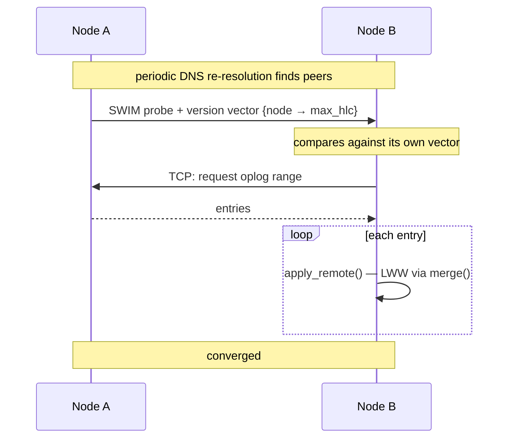

# Roadmap

[← Documentation index](README.md)

Milestone status, and the planned design for what remains. This document exists
so that development can be picked up later without re-deriving decisions.

---

## Status

| Milestone | Scope | Status |
|---|---|---|
| **M0** | Workspace, core types, HLC, config, Docker, CI | ✅ Complete |
| **M1** | Storage, CRUD, query, indexes, oplog, change streams, auth, HTTP API | ✅ Complete |
| **M2** | Auto-embeddings, HNSW, vector and hybrid search | ✅ Complete |
| **M3** | Built-in MCP server | ✅ Complete |
| **M4** | Gossip membership, discovery, anti-entropy replication | 📋 Planned |
| **M5** | Backup, TLS, rate limiting, CLI, benchmarks | 📋 Planned |

Ordering note: vectors and MCP come **before** clustering, deliberately. The
AI-facing features are the differentiator and are useful on a single node;
clustering is the largest and riskiest piece.

---

## M1 complete

Secondary indexes landed last: compound and descending keys, multikey arrays,
unique constraints, a blocking backfill, a rule-based planner, and `explain`.
See [Indexes](indexes.md).

Two deliberate gaps carried forward:

- **`$in` does not use an index.** It needs a union of point lookups rather than
  a single range. Common enough to be worth doing.
- **A range on a descending field falls back to the equality prefix.** Correct
  but less selective; doing it properly needs its own property test, since the
  failure mode is a range that is too narrow.

Neither affects correctness — an unused index only costs time.

---

## M2 — Vectors and auto-embeddings ✅

**Built.** Full detail in [Vectors](vectors.md); this section records what the
plan said and where the build departed from it.

Enabling embedding on a collection creates a shadow collection
`{coll}.__vectors`, maintained by a worker that is an ordinary change-stream
subscriber:

The worker being a plain change-stream subscriber was the payoff from the oplog
design, and it held: "keep vectors in sync" reduced to "consume the log", which
already worked, including resume-after-restart and backfill of a collection that
predates the configuration.

**Off the write path,** as planned. The API returns as soon as the oplog entry
is durable. Each vector record carries its source document's HLC, so staleness
is a comparison rather than a state machine, and re-embedding is idempotent.

| Piece | Planned | Built |
|---|---|---|
| Providers | `fastembed` local ONNX as the zero-config default | ✅ trait + OpenAI / Ollama / custom HTTP. **`byo` is the default; local is feature-gated** — its native ONNX + OpenSSL dependencies would undo the pure-Rust property ([Deviations](deviations.md)) |
| Index | HNSW via `hnswlib-rs` | ✅ HNSW via **`hnsw_rs`** — `hnswlib-rs` requires nightly Rust (`#![feature(f16)]` in a dependency) |
| Index selection | — | ✅ `IndexCache` chooses approximate above 2000 vectors, exact below, with a 30 s rebuild interval |
| Persistence | Snapshot the graph, replay newer entries on startup | ⛔ **Not built.** In-memory only; a restart rebuilds lazily. Correctness does not depend on it |
| Deletes | Tombstone in the graph, rebuild past a ratio threshold | ✅ Handled differently: the graph supplies candidates only, and a candidate whose record is gone is skipped. No tombstoning needed |
| Search | `vector_search` + `hybrid_search` with RRF | ✅ Both, with filter composition against the query language |
| Replication | Vectors ride the oplog as data | 📋 M4 — the records are stored like any document, so this needs no vector-specific work |
| `$vectorSearch` stage | A pipeline stage | ⛔ Not built; search is its own endpoint |

**Resolved open questions.** Filtered k-NN post-filters, widening the graph
search 8× to compensate — a pre-filter would need the graph to know about
document state it deliberately does not track. The slim-image question dissolved
once local embeddings became opt-in: the default image carries no model at all.

**The one thing that surprised.** `anndists::DistDot` asserts `1 - dot >= 0`,
which only holds for unit vectors — a real embedding would have aborted the
process. Dot-product collections take the exact path. Found by testing the
metric rather than trusting it.

---

## M3 — Built-in MCP server ✅

**Built.** Full detail in [MCP](mcp.md); this section records what the plan said
and where the build departed from it.

`rmcp` with `transport-streamable-http-server`, mounted at `/mcp` on the same
axum router, sharing storage handles directly — no separate process, no loopback
hop. That held exactly as planned.

**Every tool call runs as the authenticated principal**, through the same
`Principal::can()` the REST routes use. Write tools exist but simply fail
authorization for a read-only token: capability is controlled by the role, not
by build flags or a second permission system.

| Piece | Planned | Built |
|---|---|---|
| Transport | `rmcp` streamable HTTP at `/mcp` | ✅ **Stateless** — no MCP session, so an expired token stops working immediately rather than riding a session opened while it was valid |
| Read tools | `list_databases`, `list_collections`, `describe_collection`, `find`, `count`, `aggregate` | ✅ all but **`aggregate`**, which has nothing to expose: the pipeline itself is M5 |
| Search tools | `vector_search`, `hybrid_search` | ✅ Both, with filter composition |
| Write tools | `insert`, `update`, `delete`, `create_collection`, `create_index` | ✅ All five |
| Resources | Collections with inferred schema and samples | ✅ `kimmy://{db}/{coll}`, grant-filtered, **excluding `__kimmy` and shadow collections** ([ADR-027](decisions.md)) |
| Enforcement | One `Principal::can()`, shared with REST | ✅ Stronger than planned — both edges share `kimmy_api::exec`, so the check is *inside* each operation rather than repeated beside it ([ADR-024](decisions.md)) |

**The dependency arrow was inverted.** The crate graph had `kimmy-api` depending
on `kimmy-mcp`, from a placeholder written at M0. It is now the other way. The
milestone's stated constraint — "there must not be a second, weaker enforcement
point" — is not achieved by co-location alone, only made possible by it; sharing
the executor is what makes the check unskippable. The REST handlers collapsed
into thin adapters in the same change, which is the evidence the extraction was
real rather than shaped around MCP.

**Two things were found by driving a real server, not by tests.**
`describe_collection` reported a `presence` of 2.0 — above 1.0, and meaningless
— because array elements were counted per element rather than per document. And
the first `resources/list` offered `kimmy://__kimmy/__users`, the password-hash
collection, as attachable context. Neither had a test, because neither had
occurred to anyone.

**One deliberate deviation from the SDK's default.** `rmcp` enables a `Host`
allow-list as DNS-rebinding protection; it is off by default here, because the
attack needs an unauthenticated server and `/mcp` verifies a bearer token before
the transport runs. Keeping the default would have refused every client
connecting by a real hostname. [ADR-026](decisions.md).

---

## M4 — Gossip clustering

The largest remaining piece. Membership via [`foca`](https://github.com/caio/foca)
(SWIM + suspicion) over UDP, with TCP for oversized payloads.

Already implemented and tested: `apply_remote`, conflict resolution, convergence
of concurrent writes applied in opposite orders on two engines, and discovery
string parsing. **Missing: the transport.**

### Known problem to solve

An applied remote entry keeps its *originating* stamp, so it lands in the oplog
**behind** the local tail. A change-stream subscriber past that point will not
see it. Options, none yet chosen:

1. A second index over "local arrival order" for streams to follow.
2. Stamp replicated entries with local arrival time, losing origin ordering.
3. Document it: cluster-wide streams are eventually complete, not ordered.

### Uniqueness violation detection — committed for M4

Unique indexes carry an `enforcement` mode. The `local` default enforces on the
accepting node only; two nodes can each accept a conflicting write during a
partition, and last-writer-wins would otherwise discard one **silently**.

M4 must therefore detect violations at merge time and surface them:

- a `uniqueViolation` change-stream event naming the index and the colliding ids
- the losing document recorded rather than lost, so it can be reconciled
- a metric, so the condition is visible without watching a stream

This does not *prevent* the violation — that is provably impossible without
coordination (see [ADR-020](decisions.md)) — but it converts silent corruption
into an actionable event, which is most of the value.

`coordinated` enforcement (value-ownership routing, real cluster-wide guarantee,
CP for those writes) stays reserved and is refused at index-creation time until
it exists.

Also open: whether `drop_collection` should replicate as a tombstone (a
partitioned peer could otherwise resurrect a dropped collection), and how to
handle a node whose tombstones were collected while it was partitioned.

---

## M5 — Hardening

| | |
|---|---|
| Backup / restore | Online snapshot, point-in-time restore from the oplog |
| TLS | Native termination |
| Rate limiting | Especially `/v1/auth/login` |
| Oplog & tombstone GC | Currently ⛔ unbounded growth |
| Aggregation pipeline | `$match`, `$group`, `$unwind`, `$project`, `$sort`, `$limit` |
| `kimmy` CLI | Interactive shell |
| Benchmarks | Criterion; establish a regression baseline |
| Audit log | Structured, of authorization decisions |
| Richer metrics | Request rates, latency, oplog lag, storage size |

---

## Explicitly not planned

| | Why |
|---|---|
| Multi-document transactions | Requires coordination — the thing a leaderless design forgoes |
| `$where` / JavaScript execution | An obvious injection surface |
| MongoDB wire protocol | Considered and rejected; see [Decisions](decisions.md) |
| Geospatial indexes | Out of scope |
| Field-level encryption | Use an encrypted volume |
| Full-text indexes | Superseded by vector and hybrid search |

---

## Next

- [Decisions](decisions.md) — the choices already settled
- [Testing](testing.md) — the invariants any change must preserve
