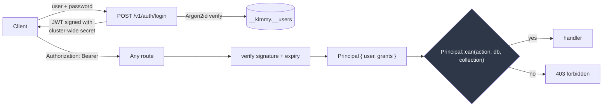
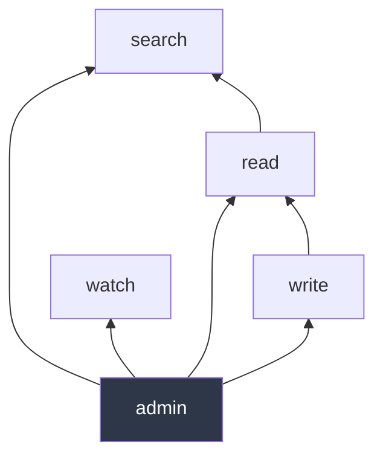
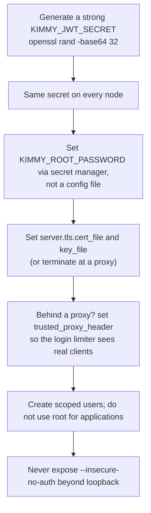

# Security

[← Documentation index](README.md)

Authentication, authorization, and an honest account of what is and is not
defended against. Implemented in `kimmy-auth`.

---

## Model



**One authorization decision point.** `Principal::can()` in
`kimmy-auth/src/rbac.rs`. Both the HTTP API and the MCP server call it.
A second enforcement path is exactly how an MCP tool ends up quietly more
permissive than the REST route beside it.

**Authorization is an extractor, not middleware.** A route that needs a
principal takes an `Auth` parameter; a route that does not is visibly public.
Middleware makes "which routes are protected?" a question you answer by reading
a registration list.

---

## Passwords

Argon2id via the `argon2` crate, with a fresh random salt per password, stored
as a PHC string:

```
$argon2id$v=19$m=19456,t=2,p=1$<salt>$<digest>
```

The PHC format carries the algorithm and parameters alongside the digest, so
work factors can be raised later without stranding existing hashes.

- A **malformed stored hash verifies as `false`** rather than erroring, so a
  corrupt record is indistinguishable from a wrong password.
- The plaintext never appears in the hash, and hashes are never returned by any
  endpoint.
- Minimum 8 characters, enforced in the handler so every path that creates a
  user is held to it.

> `argon2` is pinned to stable **0.5**, not the 0.6 release candidate. Password
> hashing is not the place to run ahead of a stable release.

---

## Tokens

HS256 JWTs signed with a **cluster-wide** secret.

```rust
struct Claims {
    sub: String,        // user name
    exp: u64, iat: u64, // seconds since the epoch
    grants: Vec<Grant>, // embedded, not looked up per request
}
```

**Why cluster-wide.** In a leaderless cluster a request may land on any node,
not the one that logged the user in. A per-node key would produce intermittent
401s that only appear under load balancing. `KIMMY_JWT_SECRET` must be identical
on every node — startup refuses to enable clustering without it.

**Why grants are embedded.** Verification stays a pure function of the token —
no store lookup on the hot path, and no cross-node consistency requirement for
authorization. The cost is that **a revoked or edited role only takes effect
when the token expires.** Hence the one-hour default lifetime.

> ⚠️ There is **no revocation list**. Deleting a user or narrowing their grants
> does not invalidate tokens already issued. To cut off access immediately you
> must rotate `KIMMY_JWT_SECRET`, which invalidates every token cluster-wide.

Minimum secret length is 16 bytes, enforced at construction — the whole cluster
shares this value, so a weak one is a cluster-wide weakness.

Attacks covered by tests: `alg=none` unsigned tokens, payload tampering to
escalate grants, wrong-secret signatures, expired tokens, and malformed input.

---

## RBAC

A grant is a set of actions over a set of collections:

```json
{ "db": "sales", "collection": "orders*", "actions": ["read", "watch"] }
```

| Action | Covers |
|---|---|
| `read` | Get, find, count, list |
| `write` | Insert, replace, update, delete |
| `watch` | Open a change stream |
| `search` | Vector and hybrid search. Implied by `read` but grantable alone, so an agent can search without reading raw documents |
| `webhook` | Register an endpoint the node pushes change events to |
| `admin` | Create/drop collections, manage users |

### Implication



- **`write` implies `read`** — an update must read the document it modifies.
  Requiring both separately would make every writer role wrong by default.
- **`read` implies `search`** — vector search is a read.
- **`admin` implies everything.**
- **`watch` is independent.** A subscriber sees every change to a collection
  continuously, which is a materially different exposure from point reads, so it
  must be granted explicitly. `read` does **not** imply `watch`.
- **`webhook` is independent too, and `watch` does not imply it.** They carry
  the same events, but a change stream ends when the client disconnects and dies
  with the token that opened it, while a webhook keeps sending to an address the
  grant never named long after that token expires. Handing out an egress path is
  a different act from being allowed to read, so it is granted separately. Only
  `admin` implies it.

### Patterns

`collection` supports a single trailing `*`, or `*` alone. `db` likewise.

```json
{ "db": "sales", "collection": "orders*" }   // orders, orders_2024, orders_eu
{ "db": "*", "collection": "*", "actions": ["admin"] }   // superuser
```

Deliberately not a full glob. `orders*` and `*` cover the real cases, and richer
syntax invites patterns whose blast radius is hard to eyeball during an audit.

### Database-wide operations

An operation spanning a whole database (`collection: None` internally) is only
satisfied by a grant covering the whole database:

```json
// This does NOT authorize dropping the "sales" database
{ "db": "sales", "collection": "orders", "actions": ["admin"] }
```

### Managing users requires `admin` over `*`

Otherwise a database-scoped administrator could mint a principal with wider
reach than their own.

---

## Properties enforced, and why

| Property | Rationale |
|---|---|
| Login returns identical responses for wrong password and unknown user | Otherwise login is a user-enumeration oracle |
| The unknown-user path still hashes a dummy | Otherwise it is a *timing* oracle |
| 403 is checked before the collection is resolved | A 404 would let a caller probe for collections they cannot access |
| Listing filters through the same check as access | Enumeration must not leak what access denies |
| Storage errors return a generic message | Their text can name on-disk paths and internals |
| Password hashes never leave the crate | — |
| Metrics expose counts, not names | Naming collections leaks the schema to an unauthenticated endpoint |
| The last user cannot be deleted | Otherwise the server becomes unadministrable |
| Backup requires `admin` over `*` | It is every document on the node; a database-scoped admin must not read past their own grants |

Each of these has a test that would fail if the property were lost.

---

## Bootstrap

On first start the server creates a superuser from `KIMMY_ROOT_USER` /
`KIMMY_ROOT_PASSWORD`.

**Only when the user store is empty.** Restarting with a different
`KIMMY_ROOT_PASSWORD` does **not** reset the account — otherwise a stale
environment variable becomes a privilege grant, and anyone who can influence the
environment can take over an existing database.

Change the root password through the API, not by editing the environment.

---

## `--insecure-no-auth`

Disables authentication entirely; every request runs as a superuser.

**Refused on any non-loopback bind address.** The server will not start with
`--insecure-no-auth` and `--bind 0.0.0.0:7878`. This is a startup error, not a
runtime surprise.

The resulting principal is flagged `unauthenticated: true` and named
`insecure-no-auth`, so audit output can distinguish "root did this" from "auth
was off" — and `/v1/auth/whoami` reports `"authenticated": false`.

---

## What is NOT defended against

Stated plainly, because a security model you have to infer is worse than none.

| Gap | Status | Mitigation today |
|---|---|---|
| **Client TLS** | ✅ Built | Native termination — see [TLS](#tls). A reverse proxy still works if you prefer it |
| **Node↔node TLS** | ✅ Built | Bound to `cluster_secret` via channel binding — see below |
| **No client certificates** | Not planned | The server proves itself to clients; clients authenticate with a bearer token |
| **No token revocation** | Not planned | Short TTLs; rotate the secret to revoke everything |
| **Rate limiting covers login only** | ✅ login · 📋 the rest | See [Login rate limiting](#login-rate-limiting). Every other route is unbounded; limit at a proxy if you need it |
| **Audit log** | ✅ Built | Authorization decisions at the `kimmy::audit` target; `audit.mode` selects how much. See [Operations](operations.md#the-audit-log) |
| **No field-level security** | Not planned | Collection is the finest granularity |
| **No encryption at rest** | Not planned | Use an encrypted volume |
| **No inter-node auth yet** | 📋 M4 | `cluster_secret` is validated at config time but nothing transports data yet |
| **Grants are not validated against reality** | By design | A grant may name a database that does not exist |

### Denial of service

Partially addressed. Regex is linear-time by construction (the `regex` crate),
so patterns cannot be pathological. `find` caps at 10,000 documents. Login is
rate-limited, which also closes an amplification vector — see below. But there
is no limit on the authenticated routes, no request size limit beyond axum's
default, and no query timeout — a collection scan over a large collection will
run to completion.

---

## TLS

The HTTP, WebSocket and MCP listener terminates TLS itself. Point it at a
certificate and a key:

```toml
[server.tls]
cert_file = "/etc/kimmy/tls/server.crt"   # PEM chain, leaf first
key_file  = "/etc/kimmy/tls/server.key"   # PKCS#8, PKCS#1 or SEC1
```

or `--tls-cert` / `--tls-key`, or `KIMMY_TLS_CERT` / `KIMMY_TLS_KEY`.

**There is no on/off switch.** TLS is on when both are set. Setting exactly one
is refused at startup, because the alternative is serving plaintext on a port an
operator believes is encrypted. So is a path that does not exist, or a file that
is not a usable certificate — all three stop the node with a message naming the
file, rather than becoming a handshake failure for whoever connects first.

One listener, one port. There is no plaintext half and no HTTP→HTTPS redirect:
a port is either encrypted or it is not.

**In a container, the key must be readable by uid 10001.** The image runs as a
non-root user, so a key at mode `0600` owned by you stops the node at startup
with `Permission denied` naming the file. That is the right failure — but it is
the first thing to check when a TLS container will not start.

**Plaintext on a public bind warns but still starts.** Terminating at a proxy or
a service mesh is a legitimate deployment and refusing to start would break it.
But nothing about a successful request reveals that the token authorising it
crossed the wire in the clear, so the node says so once at startup:

```
WARN serving plaintext HTTP on a non-loopback address; tokens and passwords
     cross the wire unencrypted
```

Loopback binds do not warn.

### What this does and does not cover

| | |
|---|---|
| Clients → this node | ✅ Encrypted, and the node proves its identity |
| Change streams (WebSocket) | ✅ `wss://`, verified against a running node |
| MCP at `/mcp` | ✅ Same listener, same certificate |
| **Node → node replication** | ❌ Still plaintext. `cluster_secret` authenticates peers; it does not hide what they exchange |
| **Client certificates (mTLS)** | ❌ Not planned. Clients authenticate with a bearer token |
| **Certificate reload** | ❌ A renewed certificate needs a restart |

### Notes

TLS 1.3 and HTTP/2 are negotiated where the client supports them. WebSocket
still works when a client offers `h2` in ALPN — axum's upgrade is HTTP/1.1-only,
but hyper serves HTTP/1.1 on any connection that does not open with the HTTP/2
preface. Checked against a real node rather than assumed.

`rustls` on the `ring` provider, which was already in the build. See
[ADR-039](decisions.md) for why not the `aws-lc-rs` default.

---

## TLS between nodes

Replication runs over TLS, always. There is no setting: `cluster_secret` must
already match cluster-wide, and a second setting that must also match is another
way to misconfigure a cluster — one whose failure mode is silent plaintext.

**Certificates are generated per node at startup and are not verified.** That
sounds alarming and would be, on its own: unverified TLS stops a passive
eavesdropper, but an active attacker terminates two sessions and relays between
them, reading everything.

What stops that is **channel binding**. The mutual HMAC handshake, which already
proved both sides hold `cluster_secret` without transmitting it, now also signs
the TLS session's exported keying material:

```
proof = HMAC(cluster_secret, len(nonce) || nonce || len(exporter) || exporter)
```

A man-in-the-middle holds two TLS sessions whose exporters differ, so the proof
it relays is computed over the wrong value — and it cannot recompute one without
the secret. The connection dies.

This is tested with a relay that genuinely terminates TLS on both sides and can
read the frames: removing the binding makes that test fail while a control with
nobody in the middle still passes.

| | |
|---|---|
| Confidentiality | ✅ TLS 1.3 |
| Man-in-the-middle | ✅ via channel binding |
| Node identity | ❌ beyond "holds `cluster_secret`" — which is what the secret always meant |
| PKI required | ❌ none |

**Upgrade note.** A node speaking TLS cannot talk to one speaking plaintext, so
a cluster cannot be upgraded to this version one node at a time. See
[Operations](operations.md).

---

## Login rate limiting

`/v1/auth/login` is limited by a token bucket per client address. Over the
limit, it answers `429` with a `Retry-After` in seconds.

**Why this route and not the others.** Everywhere else a limit would be a
capacity control, and a capacity number picked without measurement is a guess.
Here it is a security control, for two reasons:

- the route is unauthenticated by necessity, so nothing else stands between a
  guesser and the password;
- every attempt runs a full Argon2id verification **including for a user that
  does not exist** — that is deliberate, and is what stops timing from revealing
  whether an account exists (`UserStore::authenticate`). At the configured work
  factor it is ~19 MB and milliseconds of CPU that an anonymous caller can spend
  at will.

The second is why the limit is checked *before* authentication rather than
after. Checking afterwards would return the same `429` while still doing all the
work the limit exists to prevent.

**Only failures count.** A caller presenting correct credentials is not the
threat, and a fleet re-authenticating on a short `token_ttl_secs` must not be
throttled for succeeding. A successful login spends nothing.

### Settings

```toml
[server.rate_limit]
login_per_ip = 10              # failed logins per address per window; 0 disables
login_per_ip_window_secs = 60
login_per_user = 0             # per username, across all addresses; 0 disables
login_per_user_window_secs = 300
trusted_proxy_header = "X-Forwarded-For"   # omit to use the socket peer address
max_tracked_keys = 100000
```

### Three things worth knowing before you tune it

**A shared egress shares a budget.** Keying on the peer address means callers
behind one NAT draw on one bucket, and an address over its budget is refused
even with correct credentials. On a shared egress, raise `login_per_ip` or set
`trusted_proxy_header`.

**`trusted_proxy_header` is off by default, and must stay off unless a proxy you
control rewrites it.** A forwarded header is client-supplied data. Trusting one
that nothing rewrites lets any caller mint a fresh budget per request by varying
a header — worse than no limiter, because it would look like one was working.
When it is set, the **last** value is used: a proxy appends the peer it saw, so
the rightmost entry is the only one the client did not choose.

**`login_per_user` defaults to off, and enabling it is a trade.** It is the only
defence against a guess spread across many addresses, which per-address limiting
cannot see. It also lets anyone who can reach the endpoint spend a *named* user's
budget and keep the legitimate holder out for the window. Which risk matters more
depends on your deployment, so it is not something a default should assume.

With `--insecure-no-auth` the limiter is off entirely: there is no login to
protect and every request is already a superuser.

---

## Deployment checklist



---

## Next

- [HTTP API](http-api.md) — the endpoints these rules protect
- [Operations](operations.md) — configuration and deployment
- [Decisions](decisions.md) — why JWT rather than sessions
