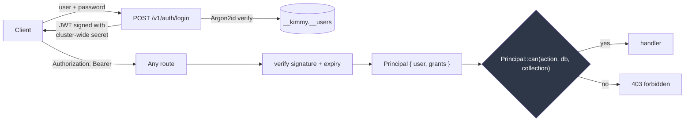
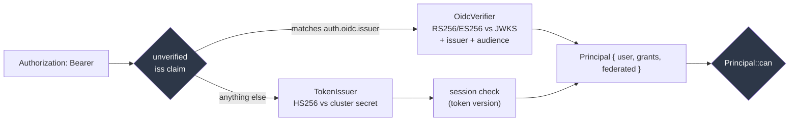
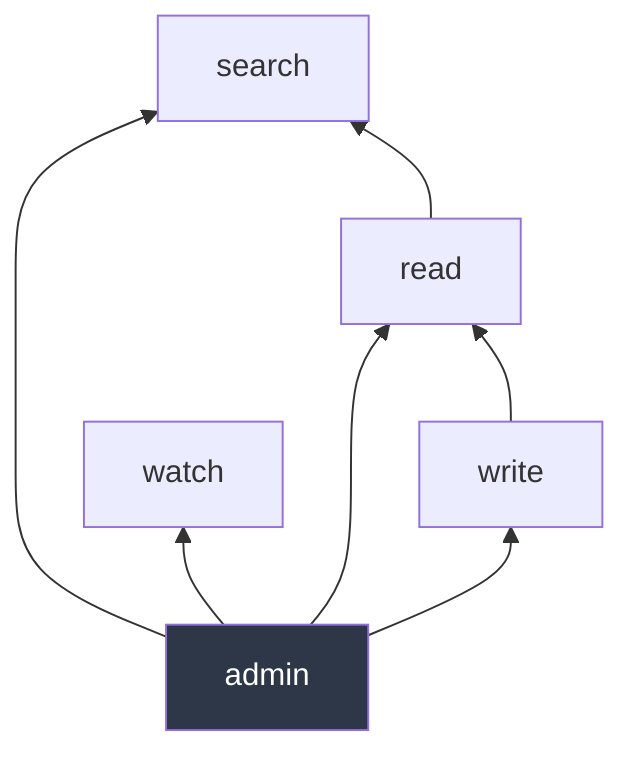
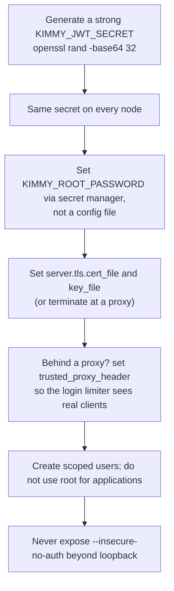

# Security

[← Documentation index](README.md)

Authentication, authorization, and an honest account of what is and is not
defended against. Implemented in `kimmy-auth`.

---

## Model



**One authorization decision point.** `Principal::can()` in
`kimmy-auth/src/rbac.rs`. Both the HTTP API and the MCP server call it.
A second enforcement path is exactly how an MCP tool ends up quietly more
permissive than the REST route beside it.

**Authorization is an extractor, not middleware.** A route that needs a
principal takes an `Auth` parameter; a route that does not is visibly public.
Middleware makes "which routes are protected?" a question you answer by reading
a registration list.

---

## Two ways in, one decision

A node can accept **local** tokens it issued itself, **federated** tokens from
an external OpenID Connect provider, or both at once. The difference stops at
the extractor: everything after it — `Principal::can`, RBAC, MCP, the audit
log, the search-without-read grant — treats the two identically.



**Routing on an unverified claim is safe because of what it decides:** which
verifier gets to say yes, never whether the answer is yes. Each verifier pins
its own algorithm list and its own key, so a forged `iss` sends a token to a
verifier that refuses it, and an omitted one sends it to the local verifier,
which refuses it just as firmly.

**A token is offered to exactly one verifier.** That is what leaves no
algorithm-confusion surface: the classic attack needs one verifier that reads
the algorithm out of the header and picks a key to match, and neither of these
does. An HS256 token claiming the external issuer is refused; an RS256 header on
the local path is refused. Both have tests ([ADR-064](decisions.md)).

### Configuring it

```toml
[auth.oidc]
issuer = "https://auth.example.com"          # https only; discovery starts here
audience = "https://kimmydb.example.com"     # required — and see "Naming this node" below
roles_claim = "roles"                        # "groups" for Entra ID

[[auth.oidc.role_mappings]]
claim_value = "kimmydb-analyst"
grants = [{ db = "sales", collection = "orders*", actions = ["read", "search"] }]
```

Also settable as `KIMMY_OIDC_ISSUER`, `KIMMY_OIDC_AUDIENCE`,
`KIMMY_OIDC_ROLES_CLAIM`. The mappings have no per-mapping flags — a grant is
a structure, and a command line is where structures go to be mistyped — but a
deployment that configures the node through an environment block (compose,
swarm, kubernetes) can pass the whole list as one JSON document instead:

```sh
KIMMY_OIDC_ROLE_MAPPINGS='[{"claim_value":"developer","role":"analyst"}]'
```

When set, the variable **replaces** the file's list rather than merging with it,
and every refusal in the table below applies unchanged (ADR-078).

Refused at startup, each because of what it would otherwise break:

| Refusal | What it prevents |
|---|---|
| An issuer with no audience | A provider signs for every application that trusts it; without an audience a token minted for the company wiki authenticates here |
| An audience with no issuer | Nothing to match `iss` against and nowhere to fetch keys — every federated token would be refused |
| A non-`https` issuer | Discovery and the JWKS are fetched from it; over plaintext anyone on the path substitutes their own signing keys |
| An `http://` audience | An https resource identifier with the scheme mistyped; over plaintext a client could be pointed at a different authorization server and send its credentials there |
| An audience with a fragment | RFC 8707 §2 forbids one, and `aud` is matched byte for byte, so it could only ever fail to match |
| A mapping naming `admin` | See below |
| A mapping naming an unknown action | Caught while the file is parsed — the error names the bad value and lists the valid ones |
| `auth.oidc` together with `--insecure-no-auth` | Every request is already a superuser, so the mappings would enforce nothing while appearing to |

### Naming this node: the audience is the resource identifier

A provider signs tokens for everything that trusts it, so `audience` is what
stops a token minted for the company wiki from working here. **But an audience
only narrows anything if the provider can actually mint a token for *this*
node** — and asking for one is RFC 8707, where a client sends a `resource`
parameter naming the resource server it wants a token for.

That parameter needs a name for this node, and this is it:

```toml
audience = "https://kimmydb.example.com"
```

**There is deliberately no separate `resource_identifier` setting.** Two values
that must always be equal are one value, and the startup refusal for them
disagreeing would be a failure mode invented by the design. So the audience
decides. Written as an `https` URL it *is* the resource identifier, and the
node then:

- publishes [protected resource metadata](http-api.md#protected-resource-metadata)
  at `/.well-known/oauth-protected-resource`, naming itself and its issuer;
- points at that document from every 401, via `resource_metadata`;
- lets `kimmy login --url https://kimmydb.example.com` work with nothing
  else configured, because the CLI reads both values off the node.

The identifier is **not a free choice**. RFC 9728 §3 puts the metadata at
`<identifier>/.well-known/oauth-protected-resource`, so it has to be the public
base URL clients reach this node at.

It also has to agree with the provider, in three places that are compared byte
for byte:

| Where | What |
|---|---|
| The provider's list of resource servers | e.g. `oauth.protected_resources` |
| The client registration asking for a token | e.g. `allowed_resources` |
| This node | `auth.oidc.audience` |

Get one of them wrong and the provider answers `invalid_target`, or issues a
token whose `aud` this node then refuses. Both are the system working.

#### When the audience is not a URL

`audience = "kimmydb"` keeps working exactly as it always has. So does Entra
ID's `api://<guid>`, and a `urn:` value — neither is dereferenceable, so
neither can be a resource identifier, and refusing them would break canonical
deployments of providers this supports. What you give up is only the metadata
document and the `resource` parameter: tokens then carry whatever audience the
provider defaults to, **shared with every other resource that trusts it**,
which is the thing an audience restriction exists to prevent. The node says
which mode it is in at startup, and `kimmyd check-config` says so too.

Only `http://` is refused, because that is an https identifier with the scheme
mistyped rather than a different kind of value ([ADR-071](decisions.md)).

### What a federated token has to satisfy

| Check | Rule |
|---|---|
| `alg` | `RS256` or `ES256`. Asymmetric only — the provider signs with a key nobody here holds. |
| Signature | Against the JWK the token's `kid` names. |
| `iss` | Equals `auth.oidc.issuer`, exactly. **Required to be present.** |
| `aud` | Equals `auth.oidc.audience`, exactly. **Required to be present.** |
| `sub` | Required to be present; becomes the principal's name. |
| `exp` | Not past, allowing 60 seconds. **Required to be present.** |
| `nbf` | Not future, allowing 60 seconds. *Optional* — a token without one is fine. |
| `typ` | `at+jwt`, only when `require_at_jwt = true`. Off by default. |

`iss`, `aud`, `exp` and `sub` are required to be **present**, not merely
checked when they happen to appear. A token that simply omits its audience
would otherwise sail past the audience restriction, which is the whole reason
the audience is configured.

The 60 seconds of leeway covers `exp` and `nbf` alike. The local HS256 path
allows none: cluster nodes are expected to agree about the time and are run by
whoever runs the database, whereas an identity provider's clock is somebody
else's, and a fleet whose NTP has drifted by seconds must not read as an
outage.

#### `require_at_jwt`, and why it ships off

RFC 9068 §4 says an access token carries `typ: at+jwt`, and the check exists so
an **ID token** from the same issuer cannot be presented as an access token. It
still defaults to `false`, because **Entra ID stamps `typ: JWT` on its v2
access tokens** — turning it on by default would refuse every token from a
provider this federation exists to support.

If your `audience` is an `https` URL, the confusion this guards against is
**already closed**: an ID token's `aud` is the client id, which can never also
be this node's resource identifier, so such a token is refused on the audience
before `typ` is consulted. The setting is defence in depth for you. With an
opaque audience it is the only check of its kind, so turn it on — after
decoding a real token from your provider and confirming what it stamps
([ADR-072](decisions.md)).

### Refusals say how to authenticate

Every 401 and 403 carries `WWW-Authenticate`, as RFC 6750 §3 requires. A
request that offered **no** credentials is told only how to authenticate and
deliberately carries no `error` code — `invalid_token` means "refresh and
retry", which is the wrong advice for a client that has not tried yet. A bad or
expired token gets `invalid_token`; a 403 gets `insufficient_scope`.

The 403 challenge is byte-identical whether the target exists or not, so it
adds nothing to the uniform-403 property described under
[RBAC](#rbac). `POST /v1/auth/login` carries no challenge at all: it is where a
token comes from, not a bearer-protected resource.

### `admin` is not federatable

**A role mapping that grants the `admin` action stops the node at startup.**
Administration — creating and dropping collections, managing indexes, managing
users, taking a backup — is reachable only through a local account.

This is a break-glass boundary. Federation makes an external system a dependency
of authentication; a compromised provider that can mint a reader is bad, and one
that can mint a superuser over the database is unrecoverable from inside it.
Keeping `admin` local means the answer to "the IdP has been taken over" is still
"log in as root and turn federation off" ([ADR-067](decisions.md)).

Every other action — `read`, `write`, `watch`, `search`, `webhook` — maps freely.

**`auth.oidc.allow_federated_admin` is what changes this**, and it defaults to
`false`, which is exactly the behaviour above. It exists because the absolute
refusal makes a large deployment impossible rather than merely awkward: an
organisation running joiner-mover-leaver has auditors who specifically flag
privileged local accounts living outside the IdP — which the rule requires.
MinIO, Vault, Grafana and Elasticsearch all allow mapping a group to admin; the
canonical pattern is to allow it and *separately* keep an emergency local
account, not to forbid it ([ADR-074](decisions.md)).

With the flag off the boundary is enforced in two places, because there are two
ways to ask for it: an inline mapping naming `admin` stops the node at startup,
and a **stored role** that resolves to `admin` has that action dropped when the
role is resolved. The second check cannot live at startup — a role is editable
while the node runs — and it drops the action rather than failing the request,
because the same role is shared with local users who legitimately hold `admin`.

Turning it on is not quiet: the node names it in the startup summary every time.

### A role that maps to nothing

...is a principal with **zero grants**, not a refusal. It authenticated; it is
simply not authorized here, and `Principal::can` already answers `false` to
every question such a principal asks. Refusing at the door would report "your
login is broken" for what is really "your administrator has not given you
access to this database" ([ADR-066](decisions.md)).

### Signing keys, and what happens when they rotate

The provider's JWKS is fetched through
`{issuer}/.well-known/openid-configuration` every five minutes and swapped in
whole. A token naming a `kid` the node has not seen triggers **one**
rate-limited refetch — the recovery for a rotation between two ticks — and the
rate limit is not politeness: a `kid` is attacker-controlled, so an unlimited
one would be a way to make this node hammer its own identity provider.

**The document must name the issuer it was fetched for**, and the `jwks_uri` it
names must be `https` — a discovery document that fails either is refused and
no keys are installed. OpenID Connect Discovery §4.3 and RFC 8414 §3.3 both
require this, and it is what ties the metadata to the provider you configured:
without it, anything able to answer for the well-known path chooses the
`jwks_uri`, and therefore the signing keys every federated token is checked
against. Matching `iss` on each token does not cover that — an attacker who
supplies the key set is also minting the tokens, so the `iss` check passes too.

The comparison is byte for byte, exactly as `iss` is matched. **A trailing
slash is a mismatch**, and it is the usual way this fails in practice: set
`issuer` to whatever the provider's own document says in its `issuer` member,
not to what you typed into the provider's console. The refusal names both
values, because a one-character difference is otherwise invisible:

```
the discovery document at https://auth.example.com/.well-known/openid-configuration
says its issuer is "https://auth.example.com/", not "https://auth.example.com"
```

Plain `http` to a **loopback** address is exempt from the `https` requirement,
the same exemption RFC 8252 §7.3 makes for native applications: there is no
network path to be on between a process and itself. The host is parsed, not
prefix-matched, so `http://127.0.0.1.attacker.example` is not loopback and
neither is `http://127.0.0.1@attacker.example`, where the real host is what
follows the `@`.

**Boot does not wait for it.** A briefly unreachable provider must not stop a
database from restarting — during an incident, both are being restarted — so the
fetch retries in the background and local users keep working throughout. Until
it lands, federated tokens get a 401.

That trade has a failure mode worth watching: a node that has *stopped* being
able to reach its provider keeps verifying perfectly against the keys it already
holds, until the provider rotates and every federated caller is refused at once.
Nothing about a working request reveals it. Two things do:

```bash
kimmyd check-config          # does a live discovery + JWKS fetch, and fails if it cannot
curl -s localhost:7878/metrics | grep jwks_refresh
# kimmy_jwks_refresh_total{outcome="ok"} 288
# kimmy_jwks_refresh_total{outcome="failed"} 0
```

### Revoking a federated session

Token-version revocation is for local users. A federated identity has **no
record in `__users`**, and the absence of a record is exactly how that check
refuses a deleted account — so the check is skipped for federated principals
outright. Without the skip every federated request would be refused; worse, a
local user who happened to share the asserted name would silently decide whether
the federated caller could connect.

So the session ends where it began: at the provider, and at the moment the
current token expires. **Keep federated token lifetimes short.**
`/v1/auth/refresh` refuses a federated principal rather than issuing a
replacement — minting a local token from a federated identity would shed the
origin flag and outlive the provider's say in it ([ADR-065](decisions.md)).

### Telling them apart

The principal carries `federated: true`, and the audit record carries it beside
`unauthenticated`:

```
user=ada@example.com unauthenticated=false federated=true action=Read db=sales collection=orders decision=allow
```

A name cannot do this job: nothing stops a provider from asserting a subject
called `root`. `/v1/auth/whoami` reports the same flag.

### Getting a token

When the node names itself as a resource, the client id is the only thing the
CLI cannot work out for itself:

```bash
export KIMMY_URL=https://kimmydb.example.com
export KIMMY_OIDC_CLIENT_ID=kimmy-cli

export KIMMY_TOKEN=$(kimmy login)                     # RFC 8628 device flow, the default
export KIMMY_TOKEN=$(kimmy login --client-credentials)  # a service; secret from
                                                        # KIMMY_OIDC_CLIENT_SECRET
```

The issuer and the resource come from the node's own metadata document. Set
`--issuer`/`KIMMY_OIDC_ISSUER` or `--resource`/`KIMMY_OIDC_RESOURCE` to override
either, and set both when the node publishes nothing:

```bash
export KIMMY_OIDC_ISSUER=https://auth.example.com
export KIMMY_OIDC_RESOURCE=https://kimmydb.example.com
```

Both flows send the resource as an RFC 8707 `resource` parameter — the device
flow on the authorization request *and* the token request, since a token
request may narrow a grant and never widen it. Omitted when there is no
resource to name, which is the well-defined "your default audience" every
provider predating RFC 8707 implements.

**The CLI checks the provider's metadata the same way the node does.** A
discovery document that does not name the issuer it was fetched for is refused,
and every endpoint the CLI reads out of it must be `https` — loopback excepted.
The stake here is different from the node's: these endpoints are where a
**client secret** is sent and where an access token is collected, so a document
nominating somewhere else for either is the whole attack. Neither check
substitutes for the other, which is why both exist ([ADR-072](decisions.md)).

The device flow rather than a redirect, for the reason `gh auth login` uses it:
a redirect needs a browser and a loopback listener on the same machine, and a
database CLI is run over SSH and inside containers. The code and URL go to
**stderr** so the bare token on stdout stays capturable.

**Nothing is stored on disk unless `--cache-token` asks for it**, and **a
refresh token is never requested or stored at all**. Without the flag an
environment variable answers for the token's permissions, its lifetime and its
cleanup by not existing afterwards. With it, the access token is kept in a
`0600` file under `$XDG_CACHE_HOME/kimmy`, keyed by issuer, client and
resource, and reused until it is within a minute of expiring — the same thing
`gh` and `aws` do, made a decision rather than a default because storing a
bearer token is a responsibility ([ADR-075](decisions.md)). Applications get a
fresh token the same way, through the Rust client's `token_provider` callback
([Clients](clients.md)).

The refresh token is where the line is drawn, and not arbitrarily: an access
token is short-lived and audience-restricted to one node, while a refresh token
outlives the session and mints more. Caching the first has a worst case that
expires on its own.

**Client authentication uses HTTP Basic** when the provider advertises
`client_secret_basic`, falling back to the request body only when the provider
takes the body and not Basic — RFC 6749 §2.3.1 makes Basic mandatory for a
server and the body optional. The id and secret are form-encoded before the
header is built, as §2.3.1 requires, which matters as soon as a secret contains
a `:`, a `+`, a space or a non-ASCII character.

---

## Passwords

Argon2id via the `argon2` crate, with a fresh random salt per password, stored
as a PHC string:

```
$argon2id$v=19$m=19456,t=2,p=1$<salt>$<digest>
```

The PHC format carries the algorithm and parameters alongside the digest, so
work factors can be raised later without stranding existing hashes.

- A **malformed stored hash verifies as `false`** rather than erroring, so a
  corrupt record is indistinguishable from a wrong password.
- The plaintext never appears in the hash, and hashes are never returned by any
  endpoint.
- Minimum 8 characters, enforced in the handler so every path that creates a
  user is held to it.

> `argon2` is pinned to stable **0.5**, not the 0.6 release candidate. Password
> hashing is not the place to run ahead of a stable release.

---

## Tokens

Local tokens: HS256 JWTs signed with a **cluster-wide** secret. (Federated
tokens are the provider's, signed RS256/ES256 — see
[Two ways in](#two-ways-in-one-decision). Everything in this section is about
the local half.)

```rust
struct Claims {
    sub: String,        // user name
    exp: u64, iat: u64, // seconds since the epoch
    grants: Vec<Grant>, // embedded, not looked up per request
}
```

**Why cluster-wide.** In a leaderless cluster a request may land on any node,
not the one that logged the user in. A per-node key would produce intermittent
401s that only appear under load balancing. `KIMMY_JWT_SECRET` must be identical
on every node — startup refuses to enable clustering without it.

**Why grants are embedded.** Signature verification stays a pure function of
the token — no store lookup to check a signature, and no cross-node consistency
requirement for authorization.

### Revoking a token

A signature proves a token was issued by this cluster and has not expired. It
cannot prove the account still exists. So the user record carries a
**token version**, the token carries the value it was issued under, and a
request is refused when they disagree ([ADR-052](decisions.md)).

Four things end a session, and none of them needs you to rotate the cluster
secret:

| | |
|---|---|
| Deleting the user | No record, no version — the absence is the revocation |
| Disabling the user | `disabled` is now checked on every request, not only at login |
| Changing the password | Bumps the version, so sessions the old password opened end |
| Changing grants | Bumps the version, so a **narrowed** permission takes effect at once |

That last row is the one that mattered: grants ride inside the token, so before
this a permission you took away kept working for the rest of the token's hour.

```bash
# End every session this user holds, on every node.
curl -XPOST localhost:7878/v1/users/ada/password -H "$A" -d '{"password":"..."}'
```

**It is a per-user switch, not a per-session one.** Revoking ends *all* of that
user's tokens; there is no way to kill one session and leave another. That is
deliberate — a deny-list of individual tokens fails open when an entry has not
reached the node handling the request, whereas a version mismatch fails closed.

**None of it applies to a federated identity**, which has no record here to
carry a version. See [Revoking a federated
session](#revoking-a-federated-session).

**Cluster-wide, at replication speed.** The edit is an ordinary write, so it
replicates like any other and each node drops its cached view when it arrives.
Measured on two nodes: the node taking the change refuses immediately, the
other within about two seconds. Refusals are **not** distinguished — deleted,
disabled and logged-out all return the same 401, because telling them apart
reports on an account to whoever is holding a stale token for it.

Rotating `KIMMY_JWT_SECRET` still works and is still the bigger hammer: it
invalidates every token for every user at once.

Minimum secret length is 16 bytes, enforced at construction — the whole cluster
shares this value, so a weak one is a cluster-wide weakness.

Attacks covered by tests: `alg=none` unsigned tokens, payload tampering to
escalate grants, wrong-secret signatures, expired tokens, and malformed input.

---

## RBAC

Role-based, and that is where authorization stops — the collection is the
finest unit of protection, and there is no attribute-based layer or policy
engine beneath it. See [How far authorization goes](#how-far-authorization-goes)
for what that rules out and why ([ADR-076](decisions.md)).

A grant is a set of actions over a set of collections:

```json
{ "db": "sales", "collection": "orders*", "actions": ["read", "watch"] }
```

| Action | Covers |
|---|---|
| `read` | Get, find, count, list |
| `write` | Insert, replace, update, delete |
| `watch` | Open a change stream |
| `search` | Vector and hybrid search. Implied by `read` but grantable alone, so an agent can search without reading raw documents |
| `webhook` | Register an endpoint the node pushes change events to |
| `admin` | Create/drop collections, manage users |

### Named roles

A grant can be written straight onto a user record, and it can also live in a
**role** — one named set of grants that several principals point at:

```bash
curl -XPOST localhost:7878/v1/roles -H "$A" -d '{
  "name": "analyst",
  "grants": [{"db":"sales","collection":"orders*","actions":["read","search"]}]
}'
curl -XPOST localhost:7878/v1/users/ada/roles -H "$A" -d '{"roles":["analyst"]}'
```

A federated principal reaches the same role by naming it in a mapping rather
than repeating its grants:

```toml
[[auth.oidc.role_mappings]]
claim_value = "developer"
role = "analyst"
```

**Role grants and direct grants are a union, always.** Effective permission is
everything a principal holds directly plus everything its roles carry; a role
never replaces or narrows a direct grant. A user holding no roles gets exactly
what it got before roles existed ([ADR-073](decisions.md)).

**Editing or deleting a role revokes the live tokens of every local user
holding it**, and the response says how many accounts that was. Without it a
*narrowing* edit would take effect only as each token expired, which would
quietly break the revocation promise that setting a user's grants has always
made. Creating a role cannot narrow anything, so it revokes nothing.

**Federated principals are the opposite case, and both halves matter:**

- Their grants are resolved from the role store on **every request**, so an edit
  to a role applies on their next call with no restart and no revocation needed.
- Their *membership* is not. The `roles` claim is frozen in the provider's
  access token and this database makes no introspection call, so if the provider
  revokes someone's membership, this node honours the old claim until that token
  expires. Short access-token lifetimes are the mitigation.

**Deleting a role leaves its name on holders' records**, where it resolves to
nothing — as does a mapping naming a role that was never created. The
alternative is rewriting every user record on a delete, and a name that grants
nothing is the safe direction to fail in.

Managing roles requires `admin` over `*`, the same bar as managing users:
whoever may edit a role may hand out everything it names.

**What roles do not change.** They govern *who holds* a permission and how it is
administered. They do not move the ceiling above — the collection is still the
finest unit of protection, and named roles do not add document- or field-level
security. See [How far authorization goes](#how-far-authorization-goes).

### Implication



- **`write` implies `read`** — an update must read the document it modifies.
  Requiring both separately would make every writer role wrong by default.
- **`read` implies `search`** — vector search is a read.
- **`admin` implies everything.**
- **`watch` is independent.** A subscriber sees every change to a collection
  continuously, which is a materially different exposure from point reads, so it
  must be granted explicitly. `read` does **not** imply `watch`.
- **`webhook` is independent too, and `watch` does not imply it.** They carry
  the same events, but a change stream ends when the client disconnects and dies
  with the token that opened it, while a webhook keeps sending to an address the
  grant never named long after that token expires. Handing out an egress path is
  a different act from being allowed to read, so it is granted separately. Only
  `admin` implies it.

### Patterns

`collection` supports a single trailing `*`, or `*` alone. `db` likewise.

```json
{ "db": "sales", "collection": "orders*" }   // orders, orders_2024, orders_eu
{ "db": "*", "collection": "*", "actions": ["admin"] }   // superuser
```

Deliberately not a full glob. `orders*` and `*` cover the real cases, and richer
syntax invites patterns whose blast radius is hard to eyeball during an audit.

#### A trailing `*` on `db` is wider than it reads

The same prefix rule applies to the **database** name, and it matches a prefix
rather than a path segment. So:

```json
{ "db": "sales*", "collection": "*", "actions": ["read"] }
```

covers `sales`, and also `sales_archive`, `salesforce`, `sales_2019_backup` —
**including databases that do not exist yet**. A grant written on Monday keeps
covering whatever is created on Friday with a name that happens to start the
same way. That is not a bug, and it is the same rule as `orders*` on a
collection; it is simply easy to read `sales*` as "the sales databases" when it
means "every database whose name starts with `sales`".

Two habits make it safe:

- **Name the database exactly** unless you specifically want a family of them.
  `{ "db": "sales" }` is almost always what was meant.
- **When you do want a family, give it a separator you control** — `sales_*`
  rather than `sales*` — so a future `salesforce` does not join it by accident.

There is deliberately **no startup warning** for a `db` pattern ending in `*`.
It is a legitimate and useful grant, `{ "db": "*" }` for an administrator is
the commonest one in existence, and a warning on every start for something
correct is a warning nobody reads by the second week. The audit log names the
database each decision was made against, which is the thing that actually
answers "what did this grant end up covering".

### Database-wide operations

An operation spanning a whole database (`collection: None` internally) is only
satisfied by a grant covering the whole database:

```json
// This does NOT authorize dropping the "sales" database
{ "db": "sales", "collection": "orders", "actions": ["admin"] }
```

### Managing users requires `admin` over `*`

Otherwise a database-scoped administrator could mint a principal with wider
reach than their own.

---

## Properties enforced, and why

| Property | Rationale |
|---|---|
| Login returns identical responses for wrong password and unknown user | Otherwise login is a user-enumeration oracle |
| The unknown-user path still hashes a dummy | Otherwise it is a *timing* oracle |
| 403 is checked before the collection is resolved | A 404 would let a caller probe for collections they cannot access |
| Listing filters through the same check as access | Enumeration must not leak what access denies |
| Storage errors return a generic message | Their text can name on-disk paths and internals |
| Password hashes never leave the crate | — |
| Metrics expose counts, not names | Naming collections leaks the schema to an unauthenticated endpoint |
| The last user cannot be deleted | Otherwise the server becomes unadministrable |
| Backup requires `admin` over `*` | It is every document on the node; a database-scoped admin must not read past their own grants |

Each of these has a test that would fail if the property were lost.

---

## Bootstrap

On first start the server creates a superuser from `KIMMY_ROOT_USER` /
`KIMMY_ROOT_PASSWORD`.

**Only when the user store is empty.** Restarting with a different
`KIMMY_ROOT_PASSWORD` does **not** reset the account — otherwise a stale
environment variable becomes a privilege grant, and anyone who can influence the
environment can take over an existing database.

Change the root password through the API, not by editing the environment.

---

## `--insecure-no-auth`

Disables authentication entirely; every request runs as a superuser.

**Refused on any non-loopback bind address.** The server will not start with
`--insecure-no-auth` and `--bind 0.0.0.0:7878`. This is a startup error, not a
runtime surprise.

The resulting principal is flagged `unauthenticated: true` and named
`insecure-no-auth`, so audit output can distinguish "root did this" from "auth
was off" — and `/v1/auth/whoami` reports `"authenticated": false`.

---

## What is NOT defended against

Stated plainly, because a security model you have to infer is worse than none.

| Gap | Status | Mitigation today |
|---|---|---|
| **Client TLS** | ✅ Built | Native termination — see [TLS](#tls). A reverse proxy still works if you prefer it |
| **Node↔node TLS** | ✅ Built | Bound to `cluster_secret` via channel binding — see below |
| **No client certificates** | Not planned | The server proves itself to clients; clients authenticate with a bearer token |
| **Per-session revocation** | Not planned | Revocation is per user: all of that user's tokens, or none. See above |
| **Enterprise SSO** | ✅ OIDC | One external issuer, RS256/ES256, inline role mappings — see [Two ways in](#two-ways-in-one-decision). SAML and LDAP are not planned |
| **Revoking a federated session from here** | Not possible | There is no local record to revoke. Revoke at the provider and keep token lifetimes short |
| **Federated `admin`** | By design | `admin` is local-only, so a compromised identity provider cannot mint a superuser ([ADR-067](decisions.md)) |
| **Rate limiting covers login only** | ✅ login · 📋 the rest | See [Login rate limiting](#login-rate-limiting). Every other route is unbounded; limit at a proxy if you need it |
| **Audit log** | ✅ Built | Authorization decisions at the `kimmy::audit` target; `audit.mode` selects how much. See [Operations](operations.md#the-audit-log) |
| **No document- or field-level security** | Not planned | Collection is the finest granularity — see [How far authorization goes](#how-far-authorization-goes) |
| **No attribute-based access control** | By design | RBAC only. No policy engine, no OPA, no Cedar — see [How far authorization goes](#how-far-authorization-goes) |
| **No encryption at rest** | Not planned | Use an encrypted volume |
| **`/metrics` is unauthenticated on the main listener** | By design | Counts only, never names. Restrict it at the network or a proxy — see [The metrics endpoint](#the-metrics-endpoint) |
| **No inter-node auth yet** | 📋 M4 | `cluster_secret` is validated at config time but nothing transports data yet |
| **Grants are not validated against reality** | By design | A grant may name a database that does not exist |

### How far authorization goes

The ceiling is the **collection**. A principal that can read a collection can
read every document in it, and every field of every document. There is no
document-level filter, no field masking, no redaction, and no row-level
security.

**Named roles did not change this.** Roles are about who holds a permission and
how you administer that; they are not a finer unit of protection. They have
since arrived — see [Named roles](#named-roles) — and this entry reads exactly
as it did when they had not, which is the point of having written it in advance.
The ceiling is still the collection. It is written down here because the arrival
of roles is otherwise easy to mistake for having solved it.

Model around the boundary rather than under it: put data that different people
may see in **different collections**. That is the unit the system actually
enforces, and it is enforceable at one decision point instead of on every read
path.

**Authorization stops at RBAC**, deliberately:

- No attribute-based access control — no rules over document contents, request
  time, client address or caller attributes.
- No embedded policy engine, and no plan for one. Not OPA, not Cedar, not an
  expression language.

That boundary is a choice, not a gap waiting to be filled. Roles are the
vocabulary every compliance framework is already written in — access reviews,
joiner-mover-leaver, segregation of duties are all phrased in them — so roles
are what an enterprise buyer is actually asking about. A policy engine inside
the database would add a second place where access is decided, which is the
precise thing [one authorization decision point](#model) exists to prevent, and
it would put a language nobody can audit at a glance in front of every read.
Systems that need ABAC are better served by it living in an application in
front of this one, where it can see the request context this never will.

If you need document- or field-level security, this is not the database for
that job, and pretending otherwise in the docs would be the more expensive
answer.

### The metrics endpoint

`/metrics` is served **unauthenticated on the main listener**. It is
conventional for Prometheus, and it is safe here for a specific reason rather
than by assumption: the endpoint exposes **counts, never names**. No database,
collection, user or query text appears in it — a property with a golden test
over the whole render, so it cannot be lost quietly.

Binding it to a **separate listener** — a second port, typically on an internal
interface — is a recurring enterprise request, and it is **evaluated and not
built**. What it buys here is small: the usual argument for a second port is
that the metrics surface leaks operational detail, and this one does not carry
the detail that argument is about. What it costs is real: a second bind
address, its own TLS decision, its own refusal rules for a non-loopback bind,
and a new way to misconfigure a node such that Prometheus silently scrapes
nothing.

Restrict it where restrictions already live:

- a firewall or network policy, which is where "who may reach this port" is
  normally answered;
- a reverse proxy that serves `/metrics` only to your scrape range, if one is
  already in front of the node;
- the container network, if the scraper is a sidecar.

**This will be revisited if `/metrics` ever gains a label carrying a name.** At
that point the trade changes completely, and the second listener stops being
ceremony. Adding such a label and adding the listener are the same piece of
work.

### Denial of service

Partially addressed. Regex is linear-time by construction (the `regex` crate),
so patterns cannot be pathological. `find` caps at 10,000 documents. Login is
rate-limited, which also closes an amplification vector — see below. But there
is no limit on the authenticated routes, no request size limit beyond axum's
default, and no query timeout — a collection scan over a large collection will
run to completion.

---

## TLS

The HTTP, WebSocket and MCP listener terminates TLS itself. Point it at a
certificate and a key:

```toml
[server.tls]
cert_file = "/etc/kimmy/tls/server.crt"   # PEM chain, leaf first
key_file  = "/etc/kimmy/tls/server.key"   # PKCS#8, PKCS#1 or SEC1
```

or `--tls-cert` / `--tls-key`, or `KIMMY_TLS_CERT` / `KIMMY_TLS_KEY`.

**There is no on/off switch.** TLS is on when both are set. Setting exactly one
is refused at startup, because the alternative is serving plaintext on a port an
operator believes is encrypted. So is a path that does not exist, or a file that
is not a usable certificate — all three stop the node with a message naming the
file, rather than becoming a handshake failure for whoever connects first.

One listener, one port. There is no plaintext half and no HTTP→HTTPS redirect:
a port is either encrypted or it is not.

**In a container, the key must be readable by uid 10001.** The image runs as a
non-root user, so a key at mode `0600` owned by you stops the node at startup
with `Permission denied` naming the file. That is the right failure — but it is
the first thing to check when a TLS container will not start.

**Plaintext on a public bind warns but still starts.** Terminating at a proxy or
a service mesh is a legitimate deployment and refusing to start would break it.
But nothing about a successful request reveals that the token authorising it
crossed the wire in the clear, so the node says so once at startup:

```
WARN serving plaintext HTTP on a non-loopback address; tokens and passwords
     cross the wire unencrypted
```

Loopback binds do not warn.

### Renewing a certificate without a restart

A renewed certificate takes effect on a running node. Two triggers, one
reload ([ADR-049](decisions.md)):

```bash
kill -HUP $(pidof kimmyd)      # or: systemctl reload kimmyd
                               # or: docker kill -s HUP <container>
```

...and, with no signal at all, the node re-reads the pair **within 60 seconds**
of either file changing. That is the trigger that matters where a certificate
is rotated *by* something rather than by someone — cert-manager rewriting a
mounted Secret, where there is no convenient way to signal PID 1 of a pod.

The swap is free: the running listener holds the certificate behind a handle it
reads per handshake, so nothing rebinds and nothing is dropped. Connections
already in flight finish under the certificate they negotiated with; the next
handshake gets the new one.

**A bad new certificate cannot take the node down.** This is the opposite of
the startup rule above, and deliberately so: at startup there is nothing to
fall back to, and on a serving node there is. The pair is parsed *before* it is
adopted, so anything unparseable — a truncated file, a certificate whose key
has not landed yet — leaves the certificate already in use serving:

```
WARN could not reload the TLS certificate; keeping the one currently in use
     error=keys may not be consistent: KeyMismatch
```

That is also what absorbs the window between writing a new certificate and
writing its key: the mismatch is refused, and the next trigger — a second
SIGHUP, or the next poll — completes the rotation once both halves are on disk.

**Watch `kimmy_tls_reloads_total{outcome="failed"}`.** A reload that fails is
silent in every other way: the node keeps serving the old certificate
perfectly, right up until it expires and every client drops at once.

```
kimmy_tls_reloads_total{outcome="ok"} 2
kimmy_tls_reloads_total{outcome="failed"} 1
```

Note what this does *not* catch — a certificate nobody ever tried to rotate
reports nothing, because no reload was attempted. An expiry gauge would cover
that and is recorded as the follow-up in [Deviations](deviations.md).

### What this does and does not cover

| | |
|---|---|
| Clients → this node | ✅ Encrypted, and the node proves its identity |
| Change streams (WebSocket) | ✅ `wss://`, verified against a running node |
| MCP at `/mcp` | ✅ Same listener, same certificate |
| **Node → node replication** | ✅ TLS 1.3 always, with the handshake bound to the session — see [below](#tls-between-nodes). *(This row said "still plaintext" until it was checked against the code; it had been wrong since ADR-040.)* |
| **Node → node membership (SWIM)** | ⚠️ **Authenticated, not encrypted.** Every datagram carries an HMAC over `cluster_secret`, so an unauthenticated node cannot join the member set ([ADR-053](decisions.md)) — but the payload is readable, so membership topology is visible to anyone on the path |
| **Client certificates (mTLS)** | ❌ Not planned. Clients authenticate with a bearer token |
| **Certificate reload** | ✅ SIGHUP, or within 60s of the file changing. A bad new certificate is refused and the old one keeps serving |

### Notes

TLS 1.3 and HTTP/2 are negotiated where the client supports them. WebSocket
still works when a client offers `h2` in ALPN — axum's upgrade is HTTP/1.1-only,
but hyper serves HTTP/1.1 on any connection that does not open with the HTTP/2
preface. Checked against a real node rather than assumed.

`rustls` on the `ring` provider, which was already in the build. See
[ADR-039](decisions.md) for why not the `aws-lc-rs` default.

---

## TLS between nodes

Replication runs over TLS, always. There is no setting: `cluster_secret` must
already match cluster-wide, and a second setting that must also match is another
way to misconfigure a cluster — one whose failure mode is silent plaintext.

**Certificates are generated per node at startup and are not verified.** That
sounds alarming and would be, on its own: unverified TLS stops a passive
eavesdropper, but an active attacker terminates two sessions and relays between
them, reading everything.

What stops that is **channel binding**. The mutual HMAC handshake, which already
proved both sides hold `cluster_secret` without transmitting it, now also signs
the TLS session's exported keying material:

```
proof = HMAC(cluster_secret, len(nonce) || nonce || len(exporter) || exporter)
```

A man-in-the-middle holds two TLS sessions whose exporters differ, so the proof
it relays is computed over the wrong value — and it cannot recompute one without
the secret. The connection dies.

This is tested with a relay that genuinely terminates TLS on both sides and can
read the frames: removing the binding makes that test fail while a control with
nobody in the middle still passes.

| | |
|---|---|
| Confidentiality | ✅ TLS 1.3 |
| Man-in-the-middle | ✅ via channel binding |
| Node identity | ❌ beyond "holds `cluster_secret`" — which is what the secret always meant |
| PKI required | ❌ none |

**Upgrade note.** A node speaking TLS cannot talk to one speaking plaintext, so
a cluster cannot be upgraded to this version one node at a time. See
[Operations](operations.md).

---

## Login rate limiting

`/v1/auth/login` is limited by a token bucket per client address. Over the
limit, it answers `429` with a `Retry-After` in seconds.

**Why this route and not the others.** Everywhere else a limit would be a
capacity control, and a capacity number picked without measurement is a guess.
Here it is a security control, for two reasons:

- the route is unauthenticated by necessity, so nothing else stands between a
  guesser and the password;
- every attempt runs a full Argon2id verification **including for a user that
  does not exist** — that is deliberate, and is what stops timing from revealing
  whether an account exists (`UserStore::authenticate`). At the configured work
  factor it is ~19 MB and milliseconds of CPU that an anonymous caller can spend
  at will.

The second is why the limit is checked *before* authentication rather than
after. Checking afterwards would return the same `429` while still doing all the
work the limit exists to prevent.

**Only failures count.** A caller presenting correct credentials is not the
threat, and a fleet re-authenticating on a short `token_ttl_secs` must not be
throttled for succeeding. A successful login spends nothing.

### Settings

```toml
[server.rate_limit]
login_per_ip = 10              # failed logins per address per window; 0 disables
login_per_ip_window_secs = 60
login_per_user = 0             # per username, across all addresses; 0 disables
login_per_user_window_secs = 300
trusted_proxy_header = "X-Forwarded-For"   # omit to use the socket peer address
max_tracked_keys = 100000
```

### Three things worth knowing before you tune it

**A shared egress shares a budget.** Keying on the peer address means callers
behind one NAT draw on one bucket, and an address over its budget is refused
even with correct credentials. On a shared egress, raise `login_per_ip` or set
`trusted_proxy_header`.

**`trusted_proxy_header` is off by default, and must stay off unless a proxy you
control rewrites it.** A forwarded header is client-supplied data. Trusting one
that nothing rewrites lets any caller mint a fresh budget per request by varying
a header — worse than no limiter, because it would look like one was working.
When it is set, the **last** value is used: a proxy appends the peer it saw, so
the rightmost entry is the only one the client did not choose.

**`login_per_user` defaults to off, and enabling it is a trade.** It is the only
defence against a guess spread across many addresses, which per-address limiting
cannot see. It also lets anyone who can reach the endpoint spend a *named* user's
budget and keep the legitimate holder out for the window. Which risk matters more
depends on your deployment, so it is not something a default should assume.

With `--insecure-no-auth` the limiter is off entirely: there is no login to
protect and every request is already a superuser.

---

## What telemetry sends, and what it does not

Tracing is off unless `telemetry.endpoint` is set. When it is on, **spans omit
names by default** ([ADR-068](decisions.md)).

A span is named for the axum route *template* —
`/v1/db/{db}/coll/{coll}/docs` — or for the executor operation (`find`,
`insert`, `aggregate`). Neither is built from anything you stored, so the
default is private by construction rather than by redaction: there is nothing
in a span name to leak even if the gate were wrong. Attributes are the method,
the route, the status code and the client address.

Setting `telemetry.include_names = true` adds three attributes, and each one
publishes something:

| Attribute | What it exposes |
|---|---|
| `db.namespace` | Your database names |
| `db.collection.name` | Your collection names |
| `url.path` | The raw request path — which carries both, **and the document `_id`** |

That is your schema, sent to whatever holds the traces and readable by everyone
who can read it. A collector is a fan-out: it forwards to a vendor, it is
scraped by a platform team, and its retention is somebody else's policy. Turn
it on when you are debugging a specific collection and you have decided that
trade is fine; the reason it is a flag rather than a default is that names
already shipped cannot be un-shipped.

Three things are never sent, at any setting:

- **Log events.** Only spans are exported. `tracing-opentelemetry` would
  otherwise attach every log line inside a request to its span *with that
  line's own fields*, and this server's log lines carry `db`, `collection`,
  `user` and webhook `url`s — none of which was written with a collector in
  mind. Logs stay logs ([ADR-068](decisions.md)).
- **Audit records.** They carry principal names alongside collection names, and
  `include_names` was never meant to gate identities. The `kimmy::audit` target
  is refused by name as well as by the rule above, and stays reachable through
  `RUST_LOG` routing exactly as before.
- **Document contents, filters, and webhook URLs.** No span carries a document,
  a query, a token, or a subscription's endpoint. A webhook URL routinely has a
  secret in its path, which is why the delivery span names neither it nor the
  subscription id.

Outbound webhook deliveries carry a `traceparent` header so a receiver can
continue the trace. It is **not** covered by `x-kimmy-signature` — that signs
the body and the timestamp, which is what replay protection needs, and a header
a tracing-aware proxy is entitled to rewrite must not be able to fail a
delivery. Treat an inbound `traceparent` as a hint, never as evidence.

---

## Deployment checklist



---

## Next

- [Federation](federation.md) — provider-by-provider recipes for the machinery above
- [HTTP API](http-api.md) — the endpoints these rules protect
- [Operations](operations.md) — configuration and deployment
- [Decisions](decisions.md) — why JWT rather than sessions
