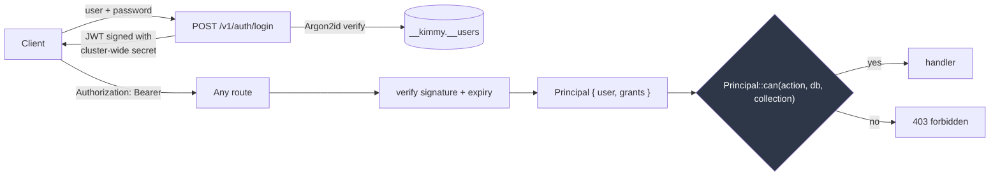
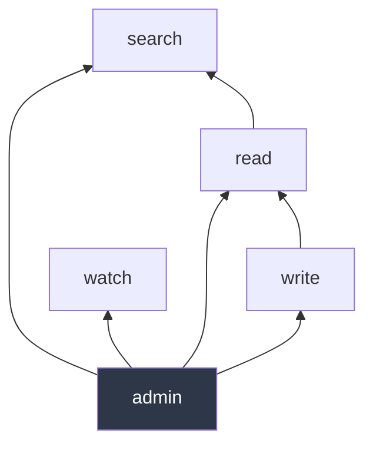
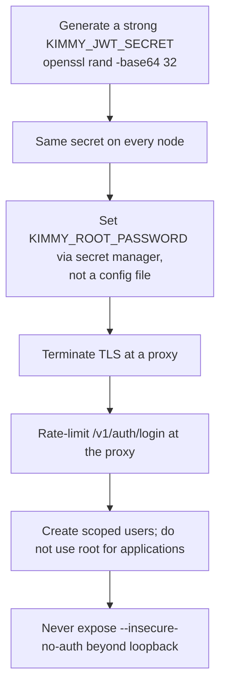

# Security

[← Documentation index](README.md)

Authentication, authorization, and an honest account of what is and is not
defended against. Implemented in `kimmy-auth`.

---

## Model



**One authorization decision point.** `Principal::can()` in
`kimmy-auth/src/rbac.rs`. Both the HTTP API and (in M3) the MCP server call it.
A second enforcement path is exactly how an MCP tool ends up quietly more
permissive than the REST route beside it.

**Authorization is an extractor, not middleware.** A route that needs a
principal takes an `Auth` parameter; a route that does not is visibly public.
Middleware makes "which routes are protected?" a question you answer by reading
a registration list.

---

## Passwords

Argon2id via the `argon2` crate, with a fresh random salt per password, stored
as a PHC string:

```
$argon2id$v=19$m=19456,t=2,p=1$<salt>$<digest>
```

The PHC format carries the algorithm and parameters alongside the digest, so
work factors can be raised later without stranding existing hashes.

- A **malformed stored hash verifies as `false`** rather than erroring, so a
  corrupt record is indistinguishable from a wrong password.
- The plaintext never appears in the hash, and hashes are never returned by any
  endpoint.
- Minimum 8 characters, enforced in the handler so every path that creates a
  user is held to it.

> `argon2` is pinned to stable **0.5**, not the 0.6 release candidate. Password
> hashing is not the place to run ahead of a stable release.

---

## Tokens

HS256 JWTs signed with a **cluster-wide** secret.

```rust
struct Claims {
    sub: String,        // user name
    exp: u64, iat: u64, // seconds since the epoch
    grants: Vec<Grant>, // embedded, not looked up per request
}
```

**Why cluster-wide.** In a leaderless cluster a request may land on any node,
not the one that logged the user in. A per-node key would produce intermittent
401s that only appear under load balancing. `KIMMY_JWT_SECRET` must be identical
on every node — startup refuses to enable clustering without it.

**Why grants are embedded.** Verification stays a pure function of the token —
no store lookup on the hot path, and no cross-node consistency requirement for
authorization. The cost is that **a revoked or edited role only takes effect
when the token expires.** Hence the one-hour default lifetime.

> ⚠️ There is **no revocation list**. Deleting a user or narrowing their grants
> does not invalidate tokens already issued. To cut off access immediately you
> must rotate `KIMMY_JWT_SECRET`, which invalidates every token cluster-wide.

Minimum secret length is 16 bytes, enforced at construction — the whole cluster
shares this value, so a weak one is a cluster-wide weakness.

Attacks covered by tests: `alg=none` unsigned tokens, payload tampering to
escalate grants, wrong-secret signatures, expired tokens, and malformed input.

---

## RBAC

A grant is a set of actions over a set of collections:

```json
{ "db": "sales", "collection": "orders*", "actions": ["read", "watch"] }
```

| Action | Covers |
|---|---|
| `read` | Get, find, count, list |
| `write` | Insert, replace, update, delete |
| `watch` | Open a change stream |
| `search` | Vector and hybrid search (M2) |
| `admin` | Create/drop collections, manage users |

### Implication



- **`write` implies `read`** — an update must read the document it modifies.
  Requiring both separately would make every writer role wrong by default.
- **`read` implies `search`** — vector search is a read.
- **`admin` implies everything.**
- **`watch` is independent.** A subscriber sees every change to a collection
  continuously, which is a materially different exposure from point reads, so it
  must be granted explicitly. `read` does **not** imply `watch`.

### Patterns

`collection` supports a single trailing `*`, or `*` alone. `db` likewise.

```json
{ "db": "sales", "collection": "orders*" }   // orders, orders_2024, orders_eu
{ "db": "*", "collection": "*", "actions": ["admin"] }   // superuser
```

Deliberately not a full glob. `orders*` and `*` cover the real cases, and richer
syntax invites patterns whose blast radius is hard to eyeball during an audit.

### Database-wide operations

An operation spanning a whole database (`collection: None` internally) is only
satisfied by a grant covering the whole database:

```json
// This does NOT authorize dropping the "sales" database
{ "db": "sales", "collection": "orders", "actions": ["admin"] }
```

### Managing users requires `admin` over `*`

Otherwise a database-scoped administrator could mint a principal with wider
reach than their own.

---

## Properties enforced, and why

| Property | Rationale |
|---|---|
| Login returns identical responses for wrong password and unknown user | Otherwise login is a user-enumeration oracle |
| The unknown-user path still hashes a dummy | Otherwise it is a *timing* oracle |
| 403 is checked before the collection is resolved | A 404 would let a caller probe for collections they cannot access |
| Listing filters through the same check as access | Enumeration must not leak what access denies |
| Storage errors return a generic message | Their text can name on-disk paths and internals |
| Password hashes never leave the crate | — |
| Metrics expose counts, not names | Naming collections leaks the schema to an unauthenticated endpoint |
| The last user cannot be deleted | Otherwise the server becomes unadministrable |

Each of these has a test that would fail if the property were lost.

---

## Bootstrap

On first start the server creates a superuser from `KIMMY_ROOT_USER` /
`KIMMY_ROOT_PASSWORD`.

**Only when the user store is empty.** Restarting with a different
`KIMMY_ROOT_PASSWORD` does **not** reset the account — otherwise a stale
environment variable becomes a privilege grant, and anyone who can influence the
environment can take over an existing database.

Change the root password through the API, not by editing the environment.

---

## `--insecure-no-auth`

Disables authentication entirely; every request runs as a superuser.

**Refused on any non-loopback bind address.** The server will not start with
`--insecure-no-auth` and `--bind 0.0.0.0:7878`. This is a startup error, not a
runtime surprise.

The resulting principal is flagged `unauthenticated: true` and named
`insecure-no-auth`, so audit output can distinguish "root did this" from "auth
was off" — and `/v1/auth/whoami` reports `"authenticated": false`.

---

## What is NOT defended against

Stated plainly, because a security model you have to infer is worse than none.

| Gap | Status | Mitigation today |
|---|---|---|
| **No TLS** | 📋 M5 | Terminate at a reverse proxy or service mesh. Tokens and passwords cross the wire in plaintext otherwise. |
| **No token revocation** | Not planned | Short TTLs; rotate the secret to revoke everything |
| **No rate limiting** | 📋 M5 | Login is brute-forceable at network speed. Rate-limit at the proxy. |
| **No audit log** | 📋 Planned | `tracing` output only |
| **No field-level security** | Not planned | Collection is the finest granularity |
| **No encryption at rest** | Not planned | Use an encrypted volume |
| **No inter-node auth yet** | 📋 M4 | `cluster_secret` is validated at config time but nothing transports data yet |
| **Grants are not validated against reality** | By design | A grant may name a database that does not exist |

### Denial of service

Partially addressed. Regex is linear-time by construction (the `regex` crate),
so patterns cannot be pathological. `find` caps at 10,000 documents. But there
is no rate limiting, no request size limit beyond axum's default, and no query
timeout — a collection scan over a large collection will run to completion.

---

## Deployment checklist



---

## Next

- [HTTP API](http-api.md) — the endpoints these rules protect
- [Operations](operations.md) — configuration and deployment
- [Decisions](decisions.md) — why JWT rather than sessions
