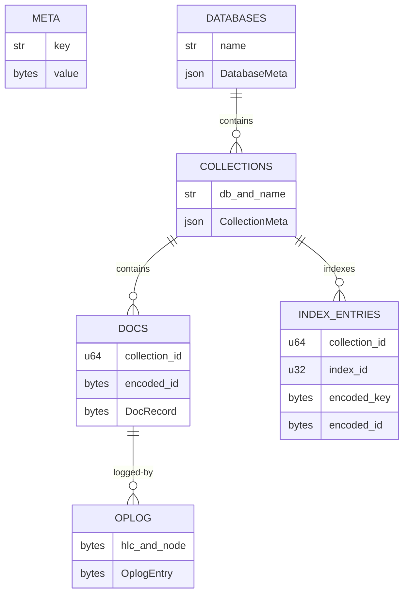
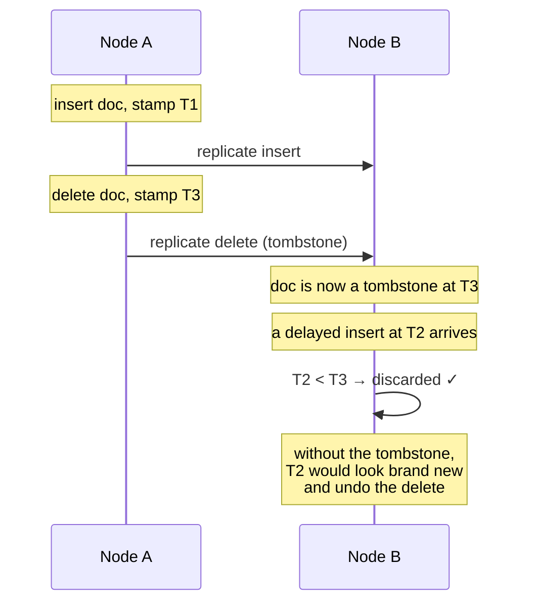

# Storage

[← Documentation index](README.md)

How KimmyDB lays out bytes on disk. Implemented in `kimmy-storage`.

---

## Engine

Everything lives in a single [redb](https://github.com/cberner/redb) file,
`kimmy.redb`, inside the configured data directory. redb is a pure-Rust
embedded ACID B-tree store with MVCC snapshots — one writer, many concurrent
readers.

```
/var/lib/kimmy/
└── kimmy.redb        documents, oplog, users, node identity — everything
```

> Node identity lives **inside** the database file, not beside it. Copying or
> restoring the file therefore carries identity with it. That matters because
> the node id is the tiebreak half of every write's stamp: a node that forgot
> its id would become a stranger to its own prior writes and could lose
> conflict resolutions it should have won.

---

## Tables

Defined in `kimmy-storage/src/tables.rs`.



| Table | Key | Value |
|---|---|---|
| `meta` | `&str` | Node id, schema version |
| `databases` | `&str` | `DatabaseMeta` as JSON |
| `collections` | `(&str, &str)` — (db, name) | `CollectionMeta` as JSON |
| `docs` | `(u64, &[u8])` — (collection id, encoded `_id`) | `DocRecord` |
| `index_entries` | `(u64, u32, &[u8], &[u8])` | `()` |
| `oplog` | `&[u8]` — 26 bytes (hlc \|\| node) | `OplogEntry` |
| `oplog_arrival` | `u64` — local arrival sequence | oplog key |
| `oplog_arrival_seq` | oplog key | `u64` |
| `oplog_versions` | node id (16 bytes) | highest `Hlc` from that node |
| `collections_dropped` | collection id | `Stamp` of the drop |

### Why the keys are shaped this way

**Collection id leads document and index keys.** A whole collection is then one
contiguous range, so scanning it is a single range read and dropping it is a
single `retain_in` — no key set has to be materialized in memory to delete a
large collection.

**Collections are keyed by integer id on disk, not by name.** Names appear once,
in the `collections` table, and index keys stay short.

**That id is *derived* from `(database, name)`, not allocated.** A counter is
node-local, so two nodes creating the same collection in a different order would
disagree about which collection an oplog entry refers to — and a replicated
write would land in the wrong one. Deriving it means every node computes the
same answer with no coordination at all. See [ADR-031](decisions.md).

One consequence follows from that and cannot be avoided: **dropping and
recreating a collection reuses its id**. "Same name means same id everywhere"
and "recreating yields a fresh id" are contradictory. So purging on drop is
load-bearing — a surviving document or index entry would be inherited by the new
collection — and `drop_collection` removes both in the same transaction.

**Index entries put the document id in the *key*, with an empty value.** A
non-unique index can then hold many documents under one value without needing a
multimap, and deleting one entry requires no read-modify-write.

**The oplog key is a flat 26-byte slice, not a tuple.** `hlc(10) || node(16)`
already sorts by `memcmp` in exactly the total write order, so no structure is
needed.

---

## Record formats

Hot-path records use a hand-rolled binary codec (`kimmy-storage/src/codec.rs`);
cold metadata uses JSON.

**Why hand-rolled.** A derive-based codec ties the on-disk layout to a
dependency's internal versioning, and the oplog format is *also* the
replication wire format for M4. Both are reasons to specify the bytes
explicitly and evolve them deliberately. Every record leads with a format
version so a mismatch is detected rather than misparsed.

**Why JSON for metadata.** Collection definitions are read on open and on DDL,
never in a query hot path. Being able to read them directly while diagnosing a
broken data directory is worth more than the bytes.

### DocRecord

```
┌────────┬──────────────┬─────────────┬─────────┬──────────────┐
│ ver(1) │  HLC (10)    │  node (16)  │ del(1)  │  BSON body   │
└────────┴──────────────┴─────────────┴─────────┴──────────────┘
 0        1              11            27        28          …
```

28-byte header, then the BSON document. The body needs no length prefix because
it runs to the end of the value.

```rust
struct DocRecord {
    stamp: Stamp,     // (Hlc, NodeId) — when and where this version was written
    deleted: bool,    // tombstone flag
    body: Vec<u8>,    // BSON; empty when deleted
}
```

### OplogEntry

```
┌────────┬───────────┬──────────┬──────────┬──────────────┬──────────────┐
│ ver(1) │ stamp(26) │ kind(1)  │ coll(8)  │ doc_id opt   │  body opt    │
└────────┴───────────┴──────────┴──────────┴──────────────┴──────────────┘
```

Optional fields are length-prefixed with `u32::MAX` as the "absent" sentinel, so
`Some(vec![])` and `None` stay distinguishable. That distinction matters: a
replicated replace with an empty document must not be applied as a delete.

`kind` is one of `Insert`, `Update`, `Replace`, `Delete`, `Collection`.

Entries carry the **full post-image**, not a diff. Full images make replication
application idempotent and order-independent — compare stamps, overwrite — and
let change-stream subscribers get `fullDocument` without a second read.

### Truncation and corruption

Every decoder bounds-checks. A truncated or corrupt record returns
`StorageError::Corrupt`, never panics — a single bad page must not take down the
server. This is tested exhaustively: `truncated_records_error_rather_than_panic`
cuts a valid entry at every possible offset and asserts a clean error each time.

---

## Tombstones

A delete does **not** remove the key. It writes a `DocRecord` with
`deleted = true` and a fresh stamp.



Without the tombstone there would be nothing at that key, so the late insert
would look like a first write and the delete would silently undo itself.

**Retention.** `storage.tombstone_retention_secs` (default 24 h) bounds how long
tombstones are kept; a background pass collects expired ones every
`storage.gc_interval_secs`. Only tombstones are collected — a live record is
data, however old — and the index entries were already removed when the delete
was applied, so nothing is left referring to the collected key.

**Dropped collections leave a tombstone too**, in `collections_dropped`, keyed
by collection id and collected on the same window. Without one, the
`DropCollection` oplog entry was the only record of the drop — bounded by
`oplog_retention_secs` rather than by tombstone retention — so a peer
partitioned across that window rejoined and the whole collection came back,
documents included. See [ADR-034](decisions.md).

> **Sharp edge.** The retention window must exceed the longest partition you are
> willing to tolerate. If a partitioned peer rejoins after tombstones have been
> collected here, documents it deleted — and collections it dropped — will
> resurrect. This is inherent to tombstone-based deletion in an
> eventually-consistent store, not a bug to be fixed later.

---

## Identifier allocation

Two counters live in the `meta` table and in `CollectionMeta`, both **monotonic
and never reused**.

```rust
// Allocated inside the same transaction as the insert, so a crash between
// the two cannot hand the same id to two collections.
let id = next_collection_id;
meta_table.insert(META_NEXT_COLLECTION_ID, id + 1);
```

Index ids use a stored counter rather than `max(existing) + 1`:

```rust
pub fn next_index_id(&self) -> u32 {
    let derived = self.indexes.iter().map(|i| i.id + 1).max().unwrap_or(0);
    self.index_id_counter.max(derived)   // the max() defends old metadata
}
```

> This started as `max(existing) + 1`, which reuses a dropped index's id. A
> dropped index's entries are removed lazily, so a new index inheriting the id
> would also inherit its stale entries — and return wrong results. A test caught
> the contradiction between the code and its own doc comment.

---

## Durability

| Property | Guarantee |
|---|---|
| Single-document write | Atomic and durable at commit |
| Document + its oplog entry | Same transaction — cannot diverge |
| Multi-document update/delete | **Each write individually atomic; the batch is not** |
| Crash mid-batch | Some documents updated, others not; the oplog reflects exactly what landed |

> **Sharp edge.** `POST .../update` and `POST .../delete` with `multi: true`
> collect matches, then write them one at a time. This is consistent with the
> no-multi-document-atomicity model, but it is a real behaviour rather than only
> a stated limitation: a crash partway leaves a partial result.

---

## Format versioning

`FORMAT_VERSION` is `1`. Two independent checks:

1. **On open** — `meta.format_version` must match, or `Engine::open` fails with
   `UnsupportedFormat` rather than misreading records.
2. **Per record** — every `DocRecord` and `OplogEntry` leads with its version.

Refusing to open is the right failure. Silently misinterpreting a data directory
written by a different build corrupts it further.

---

## Reading the log

```rust
// Used by change-stream replay and, in M4, by peer catch-up.
pub fn read_oplog_from(&self, from: Hlc, limit: usize) -> Result<Vec<OplogEntry>>
```

A range scan from an encoded lower bound. Because the key is
order-preserving, "everything since time T" is a plain byte range.

---

## Next

- [Key Encoding](key-encoding.md) — how values become sortable bytes
- [Oplog](oplog.md) — the log's role and consumers
- [Time & Conflicts](time-and-conflicts.md) — what `Stamp` means and how it resolves conflicts
