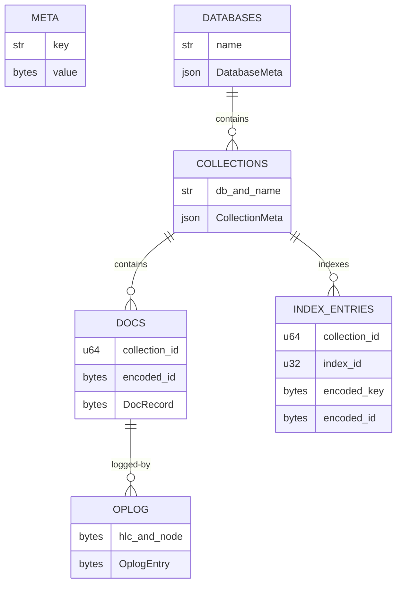
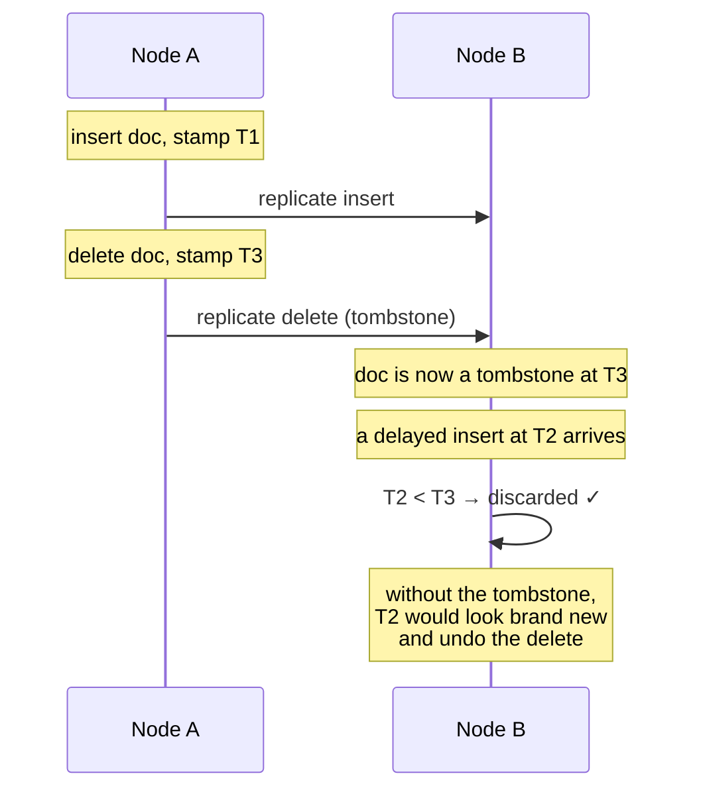

# Storage

[← Documentation index](README.md)

How KimmyDB lays out bytes on disk. Implemented in `kimmy-storage`.

---

## Engine

Everything lives in a single [redb](https://github.com/cberner/redb) file,
`kimmy.redb`, inside the configured data directory. redb is a pure-Rust
embedded ACID B-tree store with MVCC snapshots — one writer, many concurrent
readers.

```
/var/lib/kimmy/
├── kimmy.redb        documents, oplog, users, node identity — everything
└── kimmy.last-exit   how the last run ended; written on the way out, read and
                      removed by the next start ([Operations](operations.md#what-a-shutdown-logs-and-what-a-start-says-about-the-last-one))
```

> Node identity lives **inside** the database file, not beside it. Copying or
> restoring the file therefore carries identity with it. That matters because
> the node id is the tiebreak half of every write's stamp: a node that forgot
> its id would become a stranger to its own prior writes and could lose
> conflict resolutions it should have won.

---

## Tables

Defined in `kimmy-storage/src/tables.rs`.



| Table | Key | Value |
|---|---|---|
| `meta` | `&str` | Node id, schema version |
| `databases` | `&str` | `DatabaseMeta` as JSON |
| `collections` | `(&str, &str)` — (db, name) | `CollectionMeta` as JSON |
| `docs` | `(u64, &[u8])` — (collection id, encoded `_id`) | `DocRecord` |
| `index_entries` | `(u64, u32, &[u8], &[u8])` | `()` |
| `oplog` | `&[u8]` — 26 bytes (hlc \|\| node) | `OplogEntry` |
| `oplog_arrival` | `u64` — local arrival sequence | oplog key |
| `oplog_arrival_seq` | oplog key | `u64` |
| `oplog_versions` | node id (16 bytes) | highest `Hlc` covered from that node — **not** purely oplog-derived; a snapshot grants coverage too |
| `collections_dropped` | collection id | `Stamp` of the drop |
| `indexes_dropped` | `(u64, u32)` — (collection id, index id) | `Stamp` of the drop |
| `oplog_witnessed` | node id (16 bytes) | newest `Hlc` **processed** from that node, appended or not (ADR-054) |
| `oplog_collected` | node id (16 bytes) | highest `Hlc` retention has removed for that origin |
| `oplog_held` | oplog key | `()` — the entry was appended as **state**, not history (ADR-160) |

The last three are **node-local and absent from a backup**: each is re-derived
when the database is opened, so a restored node rebuilds them rather than
carrying them across. See [operations.md](operations.md) for what that means when
restoring during a snapshot.

### Why the keys are shaped this way

**Collection id leads document and index keys.** A whole collection is then one
contiguous range, so scanning it is a single range read and dropping it is a
single `retain_in` — no key set has to be materialized in memory to delete a
large collection.

**Collections are keyed by integer id on disk, not by name.** Names appear once,
in the `collections` table, and index keys stay short.

**That id is *derived* from `(database, name)`, not allocated.** A counter is
node-local, so two nodes creating the same collection in a different order would
disagree about which collection an oplog entry refers to — and a replicated
write would land in the wrong one. Deriving it means every node computes the
same answer with no coordination at all. See [ADR-031](decisions.md).

One consequence follows from that and cannot be avoided: **dropping and
recreating a collection reuses its id**. "Same name means same id everywhere"
and "recreating yields a fresh id" are contradictory. So purging on drop is
load-bearing — a surviving document or index entry would be inherited by the new
collection. A drop is two stages ([ADR-158](decisions.md)): a short burial that
removes the definition and records the tombstone, after which the collection is
gone to everything that asks, and a purge of what it held, which the drop purger
runs after the drop has answered, a chunk per commit
([ADR-189](decisions.md)). Until the purge is done, creating the name again is
refused rather than allowed to stand over the rows.

**Index entries put the document id in the *key*, with an empty value.** A
non-unique index can then hold many documents under one value without needing a
multimap, and deleting one entry requires no read-modify-write.

**Reads consume index entries as a stream.** The key is `(collection, index,
key, document key)`, so the entries under one complete key are already in
document order, and a read that pins one — an equality, a `$in` probe — is a
seek and a walk that stops when the caller does. Entries under a range of keys
are in key order, and a read that wants `_id` order across them keeps the
`skip + limit` smallest document keys of one pass rather than the whole range
sorted. Documents are fetched in the same read transaction as the entries, so
a query is one snapshot ([ADR-098](decisions.md)).

**The oplog key is a flat 26-byte slice, not a tuple.** `hlc(10) || node(16)`
already sorts by `memcmp` in exactly the total write order, so no structure is
needed.

---

## Record formats

Hot-path records use a hand-rolled binary codec (`kimmy-storage/src/codec.rs`);
cold metadata uses JSON.

**Why hand-rolled.** A derive-based codec ties the on-disk layout to a
dependency's internal versioning, and the oplog format is *also* the
replication wire format for M4. Both are reasons to specify the bytes
explicitly and evolve them deliberately. Every record leads with a format
version so a mismatch is detected rather than misparsed.

**Why JSON for metadata.** Collection definitions are read on open and on DDL,
never in a query hot path. Being able to read them directly while diagnosing a
broken data directory is worth more than the bytes.

### DocRecord

```
┌────────┬──────────────┬─────────────┬─────────┬──────────────┐
│ ver(1) │  HLC (10)    │  node (16)  │ del(1)  │  BSON body   │
└────────┴──────────────┴─────────────┴─────────┴──────────────┘
 0        1              11            27        28          …
```

28-byte header, then the BSON document. The body needs no length prefix because
it runs to the end of the value.

```rust
struct DocRecord {
    stamp: Stamp,     // (Hlc, NodeId) — when and where this version was written
    deleted: bool,    // tombstone flag
    body: Vec<u8>,    // BSON; empty when deleted
}
```

### OplogEntry

```
┌────────┬───────────┬──────────┬──────────┬──────────────┬──────────────┐
│ ver(1) │ stamp(26) │ kind(1)  │ coll(8)  │ doc_id opt   │  body opt    │
└────────┴───────────┴──────────┴──────────┴──────────────┴──────────────┘
```

Optional fields are length-prefixed with `u32::MAX` as the "absent" sentinel, so
`Some(vec![])` and `None` stay distinguishable. That distinction matters: a
replicated replace with an empty document must not be applied as a delete.

`kind` is one of `Insert`, `Update`, `Replace`, `Delete`, `Collection`.

Entries carry the **full post-image**, not a diff. Full images make replication
application idempotent and order-independent — compare stamps, overwrite — and
let change-stream subscribers get `fullDocument` without a second read.

### Truncation and corruption

Every decoder bounds-checks. A truncated or corrupt record returns
`StorageError::Corrupt`, never panics — a single bad page must not take down the
server. This is tested exhaustively: `truncated_records_error_rather_than_panic`
cuts a valid entry at every possible offset and asserts a clean error each time.

---

## Tombstones

A delete does **not** remove the key. It writes a `DocRecord` with
`deleted = true` and a fresh stamp.



Without the tombstone there would be nothing at that key, so the late insert
would look like a first write and the delete would silently undo itself.

**Retention.** `storage.tombstone_retention_secs` (default 24 h) bounds how long
tombstones are kept; a background pass collects expired ones every
`storage.gc_interval_secs`. Only tombstones are collected — a live record is
data, however old — and the index entries were already removed when the delete
was applied, so nothing is left referring to the collected key.

**What a pass costs, and what it never does.** A pass never holds the single
writer for a walk ([ADR-151](decisions.md)). Expired oplog entries are a key
range — the oplog is keyed by stamp — so nothing past the expired prefix is
read. Tombstones live in the one table with every live document and nothing
indexes them by age, so finding them is a walk: it runs under a read
transaction, visits at most 100,000 documents per pass, and resumes next pass
where it stopped, so a tombstone is collected within
`ceil(documents / 100,000)` passes of expiring. What either scan finds is
removed in chunks of 1,000 per commit, each a short write transaction, with the
writer released between chunks; a tombstone is removed only if it is still the
same record when the writer is held, so a document re-created at that key in
between is kept. A pass that takes longer than `gc_interval_secs` is logged at
`WARN`, and the next runs a full interval after it finished rather than at
once.

**Dropped collections leave a tombstone too**, in `collections_dropped`, keyed
by collection id and collected on the same window. Without one, the
`DropCollection` oplog entry was the only record of the drop — bounded by
`oplog_retention_secs` rather than by tombstone retention — so a peer
partitioned across that window rejoined and the whole collection came back,
documents included. See [ADR-034](decisions.md).

**Dropped indexes leave one as well**, in `indexes_dropped`, keyed by
collection id and index id — the id is derived from the index name, so the
`DropIndex` entry, which carries only the name, and the `CreateIndex` entry,
which carries the definition, compute the same key — and collected on the same
window. The `DropIndex` entry was the only record of the drop, and a peer
re-serves the window holding the creation as a matter of course, so once the
drop had aged out every replay rebuilt the index; and the rebuild backfills
over this node's *current* documents, which may hold what the definition
forbids, so it did not merely resurrect the index — it failed the round, for
ever. A creation stamped before the tombstone is history; one stamped after it
is a new index. See [ADR-123](decisions.md).

The tombstone answers "when was this name dropped"; the **index's own
`created` stamp** answers "when did the index now standing under it begin".
Both are needed: a replayed drop older than the index it names leaves it
alone and records its tombstone anyway, so a name that was created, dropped
and created again keeps its newest index rather than losing it to a re-served
window. See [ADR-132](decisions.md).

> **Sharp edge.** The retention window must exceed the longest partition you are
> willing to tolerate. If a partitioned peer rejoins after tombstones have been
> collected here, documents it deleted — and collections and indexes it
> dropped — will resurrect. This is inherent to tombstone-based deletion in an
> eventually-consistent store, not a bug to be fixed later.

---

## Identifier allocation

Two counters live in the `meta` table and in `CollectionMeta`, both **monotonic
and never reused**.

```rust
// Allocated inside the same transaction as the insert, so a crash between
// the two cannot hand the same id to two collections.
let id = next_collection_id;
meta_table.insert(META_NEXT_COLLECTION_ID, id + 1);
```

Index ids use a stored counter rather than `max(existing) + 1`:

```rust
pub fn next_index_id(&self) -> u32 {
    let derived = self.indexes.iter().map(|i| i.id + 1).max().unwrap_or(0);
    self.index_id_counter.max(derived)   // the max() defends old metadata
}
```

> This started as `max(existing) + 1`, which reuses a dropped index's id. A
> dropped index's entries are removed lazily, so a new index inheriting the id
> would also inherit its stale entries — and return wrong results. A test caught
> the contradiction between the code and its own doc comment.

---

## Durability

| Property | Guarantee |
|---|---|
| Single-document write | Atomic and durable at commit |
| Document + its oplog entry | Same transaction — cannot diverge |
| `update` / `delete` by filter | Operators applied **inside the write transaction**, on the image it holds; matched and written as one unit (ADR-083) |
| `update` / `delete` with `multi: true` | **Chunked**: one transaction per `storage.multi_chunk_docs` documents (default 1,000), each chunk all or nothing, the writer released between chunks (ADR-086) |
| Crash mid-request | Every chunk that committed stays; the chunk in flight is lost whole; the oplog reflects exactly what landed, and the response's `commits` says how many chunks did |
| A failure after the first chunk | The later chunks wait for the writer with no time limit, so a busy writer no longer splits a request; any failure after the first commit answers `500 partially_applied` with the committed chunks' counts (ADR-192) |
| `insert_many` | One transaction; all or nothing |
| A sync batch from a peer | One transaction per run of consecutive document entries, the witnessed vector in the last one; a schema change in the batch ends a run. A DDL-free batch is one commit and one fsync on the replica, as the bulk insert it carries was on the writer (ADR-119) |

> **Sharp edge.** A `multi: true` update or delete is atomic per *chunk*, not
> per request: a failure in the third chunk leaves the first two committed,
> and the response is `500 partially_applied`, `retry: verify`, whose
> `applied` counts them ([ADR-192](decisions.md)). It says how many, not
> which: a caller that needs to know which documents took the change reads
> the collection (or a change stream), or builds the request so that sending
> it again touches only what is not done yet
> ([HTTP API](http-api.md#a-request-that-was-partly-applied)). Set
> `storage.multi_chunk_docs` to 10,000 to make requests up to that size
> all-or-nothing again, at the price of holding the writer for the whole
> request. There are still no transactions *across* requests.

### Durability classes

How a commit reaches the disk is `storage.durability` ([ADR-088](decisions.md)),
and it is queryable: `GET /v1/version` reports it as `durability`, and a
collection's `describe` repeats it as `nodeDurability` — per node, whichever
collection is asked about.

| Class | Mechanism | Durable when the response returns? | What a crash can lose | Cost |
|---|---|---|---|---|
| `durable` (default) | Every commit fsyncs before it returns | Yes | Nothing acknowledged | One fsync per commit — the ~3 ms floor in [Benchmarks](benchmarks.md) |
| `coalesced` | A commit is written without its own fsync and **waits** for the next shared fsync, one per `commit_coalesce_ms` window (default 5) | Yes | Nothing acknowledged | Up to one window of latency per write; N concurrent writers share one fsync |

There is deliberately no third class. A "fast" class — respond before the
fsync — would make an acknowledged write losable, and because replication
and change streams read the oplog before the disk has it, a peer could hold
an entry this node then forgets. `/metrics` shows the effect of `coalesced`
as the gap between `kimmy_commits` and `kimmy_fsyncs`, and counts the shared
ones as `kimmy_commits_grouped_total`.

The per-operation view — every route, what it promises, and the test that
defends it — is the ["What each operation guarantees"](compatibility.md#what-each-operation-guarantees)
table in Compatibility. This table is the engine's side of the same facts.

---

## Format versioning

`FORMAT_VERSION` is `1`. Two independent checks:

1. **On open** — `meta.format_version` must match, or `Engine::open` fails with
   `UnsupportedFormat` rather than misreading records.
2. **Per record** — every `DocRecord` and `OplogEntry` leads with its version.

Refusing to open is the right failure. Silently misinterpreting a data directory
written by a different build corrupts it further.

---

## Reading the log

```rust
// Used by change-stream replay and, in M4, by peer catch-up.
pub fn read_oplog_from(&self, from: Hlc, limit: usize) -> Result<Vec<OplogEntry>>
```

A range scan from an encoded lower bound. Because the key is
order-preserving, "everything since time T" is a plain byte range.

---

## Next

- [Key Encoding](key-encoding.md) — how values become sortable bytes
- [Oplog](oplog.md) — the log's role and consumers
- [Time & Conflicts](time-and-conflicts.md) — what `Stamp` means and how it resolves conflicts
