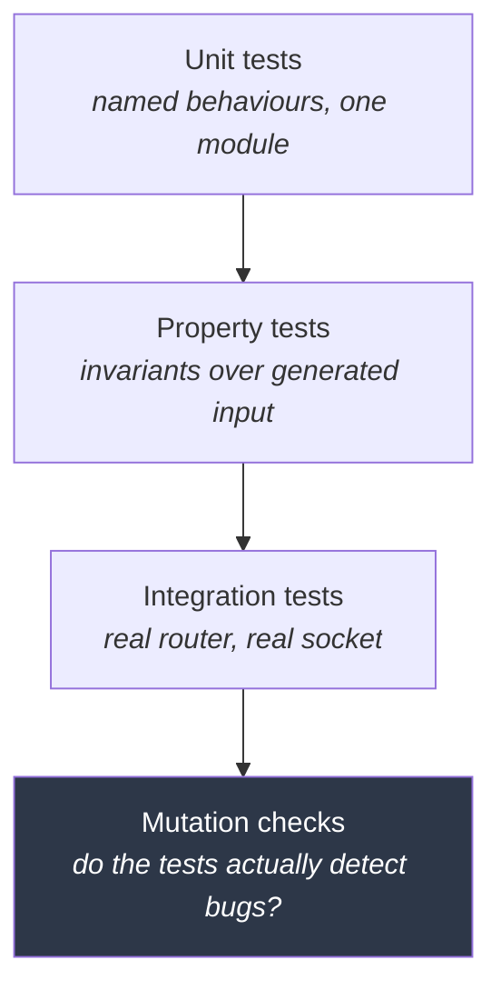

# Testing

[← Documentation index](README.md)

What is tested, how, and — more usefully — *why those particular things*.

---

## Current state

```
871 tests passing · 0 failures · clippy clean at -D warnings
```

| Crate | Tests | Focus |
|---|---|---|
| `kimmy-core` | 126 | HLC, key encoding, comparison, LWW merge, resume tokens, vector metadata and provider configs |
| `kimmy-storage` | 214 | Codecs, engine lifecycle, document CRUD, bulk insert, indexes, change streams, vector storage and fingerprints, retention, schema migration, anti-entropy |
| `kimmy-query` | 113 | Filter, update, sort, projection semantics |
| `kimmy-vector` | 72 | Providers, chunking, the embedding worker and its backfill, HNSW recall, index-cache policy |
| `kimmy-auth` | 43 | Passwords, tokens, RBAC, user store |
| `kimmy-api` | 181 | Unit (JSON boundary, errors, schema inference, rate limiting, audit modes, metrics, ownership, session revocation) plus end-to-end over a real socket and webhook delivery against a real receiver |
| `kimmy-mcp` | 22 | 5 unit (resource URIs, internal-object filter) + 17 end-to-end JSON-RPC over a real socket |
| `kimmyd` | 33 | Config layering and validation, TLS termination, certificate reload, and the serving stack |
| `kimmy-cli` | 5 | Target parsing, JSON argument errors, and that no `--password` flag exists |
| `kimmy-cluster` | 62 | Discovery including SRV resolution against a local DNS server, wire protocol, handshake, peer health, replication over real sockets, and SWIM membership over real UDP |

---

## The principle

**Test the things whose failure is silent.**

A panic announces itself. A wrong query result does not — it propagates into
someone's report, weeks later, on data you cannot reproduce. So testing effort
is allocated by *how quietly a bug would fail*, not by how much code there is.

That is why the key encoder gets 2,000-case property tests plus a third
independent oracle plus mutation testing, while the CLI argument parser gets a
handful of examples.

---

## Layers



---

## The load-bearing invariants

These nine carry disproportionate weight. Anything that breaks one produces
wrong answers, or a silently weakened defence, rather than a crash.

### 1. Key encoding order

```
encode(a).cmp(encode(b))  ==  canonical_cmp(a, b)
```

Indexes are redb key ranges compared with `memcmp`. Break this and range scans
quietly miss documents.

- `encoding_order_matches_canonical_order` — 2,000 generated pairs
- `equal_values_encode_identically` — an index lookup for `5` must find `5.0`
- `compound_encoding_matches_lexicographic_component_order`

The generator concentrates on boundaries where order-preserving encodings
actually break: type edges, `i64::MIN`/`MAX`, `2^53 ± 1`, subnormals, NaN, ±∞,
NUL bytes in strings, empty documents and arrays.

### 2. Numeric order against an independent oracle

The encoder cross-check has a hole: `keyenc` encodes numbers *through*
`cmp::decompose`, so the two are not independent for numeric values. A bug there
corrupts both identically and the property test passes.

So `numeric_order_matches_an_independent_oracle` (4,000 cases) checks against a
third implementation sharing no code with either — comparing integers as
integers, and mixed int/double pairs by splitting the double into floor plus
remainder, never rounding the integer.

Plus `ordering_is_transitive` and `ordering_is_antisymmetric`, because sorts and
range scans over a non-total order are undefined.

### 3. HLC monotonicity

No sequence of physical timestamps, however adversarial, may produce a
non-increasing clock.

- `tick_is_strictly_monotonic` — arbitrary time sequences including backwards jumps
- `observe_dominates_local_and_remote` — interleaved local and peer timestamps
- `successor_is_immediate` — nothing sorts between a timestamp and its successor,
  which is what makes resume-after exact
- `encoding_preserves_order` — the oplog range-scans by raw bytes

### 4. LWW convergence

Merge must be commutative and idempotent, or replicas will not converge.

`concurrent_writes_converge_regardless_of_arrival_order` applies the same two
conflicting writes in opposite orders on **two separate engines** and asserts
byte-identical results.

### 5. Change-stream continuity

`resuming_under_continuous_writes_has_no_gaps_and_no_duplicates` — 500 writes on
a background thread while a subscriber reads a prefix, disconnects, and resumes
from its token. Asserts the delivered sequence is exactly `0..500`, in order.

This is the test that justifies the subscribe-then-replay ordering. Also
`a_lagging_consumer_recovers_from_the_oplog_without_losing_events` (2,500 events
with nobody reading).

### 6. The approximate search path agrees with the exact one

```
approximate[0] == exact[0]        // same document, same score, bit for bit
```

Two search paths exist — an exhaustive scan and an HNSW walk — and a caller
cannot choose between them. If they disagree, an index cache has silently
changed what a search *means*, which no user-facing error would reveal.

The exact scan is the oracle. It is O(n) and has no recall loss, so it is by
construction the right answer to measure against.

- `the_approximate_path_agrees_with_the_exact_one` — same nearest neighbour,
  byte-identical score, because both paths score from the *stored* vector rather
  than from graph distances
- `recall_against_exact_search_is_high` — ≥ 90% recall at k=10, **measured, not
  assumed**. **This test looked flaky and was not.** It failed CI once at 0.865
  and was reporting real data loss: about one HNSW build in 250 orphaned 10–24%
  of the collection, so those documents could not be returned by any search at
  any `k`. `HnswIndex::build` now verifies a graph can retrieve its own data and
  rebuilds one that cannot, and the assertion is back to a single graph with the
  same bar — minimum 0.9600 over 1,500 builds, against 0.5350 before. The whole
  investigation is in [Deviations](deviations.md).
- `the_top_result_matches_exact_search` — approximation is acceptable in the
  tail, not at rank 1
- `scores_match_the_exact_path_exactly` — the graph's own distances never reach
  a result
- `dot_is_refused_rather_than_panicking` — the metric with no index takes the
  exact path instead of aborting the process

Score equality is asserted exactly rather than within a tolerance, and that is
deliberate: an approximate *ranking* is the design, an approximate *score* would
mean the graph's distances had leaked into the result.

### 7. Every edge enforces the same authorization

```
mcp_tool(principal, op)  denied  ⟺  rest_route(principal, op)  denied
```

Two edges now reach the same engine — the REST router and the MCP server — and
a caller cannot tell which one a given deployment exposes. If they disagree, an
agent tool is a privilege escalation path around the API's grants, and nothing
in the response would say so.

The structural defence is that both call `kimmy_api::exec`, which checks
*inside* each operation ([ADR-024](decisions.md)). The tests exist because
structure is an argument, not a proof:

- `mcp_requires_a_token` — rejection comes from the transport, before any tool
  runs, so a new tool cannot forget
- `a_read_only_token_can_read_but_not_write` — and asserts the collection is
  **unchanged afterwards**, not merely that an error was returned
- `grants_are_scoped_per_collection` — a grant on one collection does not reach
  its neighbour
- `search_can_be_granted_without_read` — `search` alone permits `vector_search`
  and refuses `find`; the action split has to survive both edges or it means
  nothing
- `listing_hides_what_the_caller_cannot_read` — enumeration does not leak
  existence
- `reading_a_resource_the_caller_cannot_reach_is_refused` — a URI can be
  guessed, so the read itself checks rather than relying on the filtered list
- `the_user_store_is_never_offered_as_a_resource` — even to a superuser

The last one is a different kind of invariant from the rest: not "may this
principal", but "should this ever be handed to a language model as context".
See [ADR-027](decisions.md).

### 8. A rate limit cannot be cleared by anything a caller controls

A limiter is only worth having if none of the things an attacker can vary — a
header, a reconnection, the passage of time under a clock they can influence —
returns a fresh budget. Each of these is a way that could quietly stop being
true while the limiter still *looks* like it is working, which is the failure
mode this document keeps arriving at.

- `a_backwards_clock_does_not_clear_the_limit` — a naive `now - last` on `u64`
  underflows to an enormous elapsed time and refills the bucket completely. NTP
  steps backwards; the saturating subtraction is what stops a clock correction
  from being a reset
- `refill_never_exceeds_the_burst` — otherwise an idle key banks credit and the
  burst stops being a cap
- `keys_do_not_share_a_budget` — one exhausted caller must not lock out the rest
- `an_unseen_key_is_allowed_without_being_tracked` — a bare check must not
  allocate, or checking is itself a way to fill the map
- `the_tracked_key_count_stays_bounded` and
  `eviction_prefers_keys_that_have_recovered` — the key space is
  attacker-controlled, so the defence must not become a denial of service, and
  what it forgets first must be the buckets carrying no information
- `a_successful_login_does_not_spend_the_budget` — over a real socket; a
  security control that throttles correct credentials is a capacity control
- `the_limit_does_not_leak_whether_a_user_exists` — a 429 for a real name beside
  a 401 for an invented one would rebuild the enumeration oracle that
  `a_wrong_password_does_not_reveal_whether_the_user_exists` removes
- `limiting_by_username_is_off_unless_configured` — asserts the default rather
  than trusting it, because that default is a deliberate trade
  ([ADR-038](decisions.md))

Time is a parameter throughout ([ADR-007](decisions.md)), so none of these
sleeps.

### 9. The serving stack does not lose the caller

```
handler sees a real peer address   —  with TLS and without it
```

Adding TLS meant a second serving stack (`axum-server` for TLS, `axum::serve`
without), and one property they must agree on fails *silently*: if
`into_make_service_with_connect_info` is dropped, requests keep succeeding and
the only symptom is that every caller shares one rate-limit bucket. Nothing in a
response would say so.

- `tls_serves_requests_and_still_reports_the_caller` — a real TLS handshake
  against a generated certificate, then a handler that echoes what it saw
- `the_plaintext_path_still_reports_the_caller` — the same assertion on the
  other branch, so adding TLS cannot quietly change the unencrypted path
- `a_plaintext_client_is_refused_by_a_tls_listener` — a misconfigured client
  must fail rather than send credentials in the clear to a port believed
  encrypted

Certificates are generated per run with `rcgen` rather than checked in: a
private key in the repository trips secret scanners and eventually expires.

---

## Mutation testing

A passing property test proves nothing if it cannot detect a bug. Two faults
were injected into the encoder deliberately, and both were caught with minimal
counterexamples:

| Injected fault | Caught by | Counterexample |
|---|---|---|
| Removed negative-number byte inversion | encoder cross-check | `Int32(-1)` vs `Int32(-2)` |
| Changed exponent normalization `63 → 62` | numeric oracle | `Double(2^53)` vs `Int64(2^53)` |

Worth repeating whenever a new invariant is added: break it on purpose, confirm
the suite goes red, revert.

### The rate limiter, seven for seven

Every rule in the limiter was broken deliberately before the branch landed, and
each one turned a named test red:

| Injected fault | Caught by |
|---|---|
| `saturating_sub` → `wrapping_sub` in refill (the release-mode underflow) | `a_backwards_clock_does_not_clear_the_limit` |
| Dropped the `.min(burst)` clamp on refill | `refill_never_exceeds_the_burst` |
| Inverted the eviction predicate, so recovered buckets are kept and drained ones dropped | `eviction_prefers_keys_that_have_recovered` |
| `check_at` allocates a bucket for an unseen key | `an_unseen_key_is_allowed_without_being_tracked` |
| Record the attempt before authenticating, so success also spends | `a_successful_login_does_not_spend_the_budget` |
| Never emit the `Retry-After` header | `repeated_failed_logins_are_rate_limited` |
| Key every limiter on a constant instead of the caller | `keys_do_not_share_a_budget` |

### Webhook failure handling, five for five

| Injected fault | Caught by |
|---|---|
| Backoff ignored, so a failing endpoint is retried every tick | `a_failing_endpoint_backs_off_without_stalling_another` |
| Backoff shared, so a healthy endpoint waits behind a failing one | same test |
| No invalidation past retention | `a_subscription_that_falls_past_retention_is_invalidated_not_silently_gapped` |
| An invalidated subscription keeps dialling | same test |
| Progress not seeded, so a new subscription replays history | `a_new_subscription_does_not_replay_history` |

### Webhook delivery, six for six

| Injected fault | Caught by |
|---|---|
| Progress recorded before the endpoint accepts | `a_failed_delivery_does_not_advance_progress` |
| Progress never recorded | `nothing_is_delivered_twice` |
| Ownership ignored, so every node delivers | `a_node_that_does_not_own_a_subscription_delivers_nothing` |
| Egress not re-checked at delivery | `the_egress_policy_is_enforced_at_delivery_not_only_at_registration` |
| The signature omits the timestamp | `a_signature_covers_the_timestamp_as_well_as_the_body` |
| Ownership by iteration order rather than hash | the `ownership` suite |
| A pass delivers serially, so one dead endpoint delays the rest | `a_slow_endpoint_does_not_hold_up_another_subscription` |
| The concurrency bound does not bind | `the_concurrency_bound_is_real` |
| An oversized document is dropped rather than sent without itself | `an_oversized_document_is_delivered_without_it_rather_than_dropped` |
| A batch is sent over the payload cap | `a_batch_is_trimmed_to_the_payload_cap` |
| A bulk load becomes one request per document, or loses events | `a_bulk_load_is_batched_and_every_event_arrives_exactly_once` |
| A removed subscription keeps delivering, or leaks its progress records | `removing_a_subscription_stops_delivery_and_clears_its_progress` |
| The retention horizon overtakes a healthy subscription | `a_caught_up_subscription_survives_garbage_collection`, `a_webhook_on_a_quiet_collection_does_not_fall_past_retention` |
| The position is written forward every pass, so an idle node writes forever | `the_position_is_written_forward_on_a_heartbeat_not_every_pass` |
| Backlog measured from the resume point, so an idle webhook looks lagging | `a_caught_up_subscription_reports_no_backlog`, `backlog_is_the_age_of_the_event_not_of_the_resume_point` — **added after this escaped** |
| A peer's progress covering ours reads as "resume from zero" | `progress_from_a_peer_that_is_ahead_does_not_invalidate_this_node` — **added after this escaped** |

### M7: `cargo-mutants` replaces the hand-rolled harness

The runner is now [`cargo-mutants`](https://mutants.rs), which removes the two
failure modes the hand-rolled era needed habits for — a mutation that fails to
compile is reported `unviable` rather than reading as an escape, and there is
no shell quoting to get wrong. Three runs closed M7: `plan.rs` whole (29
mutants), `keyenc.rs` whole (21), and a diff of everything M7 changed with the
full `kimmy-storage` + `kimmy-api` suites (81). **131 mutants, ten escapes,
nine killed with new tests, one proven equivalent:**

| Escape | Why it survived | Killed by |
|---|---|---|
| `>` → `>=` in `choose` — a tie between equally-covering indexes goes to the *last* listed | Either winner answers correctly; only `explain`'s stability changes | `a_tie_between_indexes_goes_to_the_first_listed` |
| Both guards in `QueryStats::to_json` (`indexUnion`, the probe count) | Nothing asserted the rendered explain JSON | `explain_names_the_strategy_by_its_shape`, `explain_reports_a_probe_count_only_for_unions` — five mutants, two tests |
| `both_bounds` guard in `collect_matching` forced **true** — a `$in` union scans `ranges[0]` only and **loses matches** | No test ran a union through `collect_matching`; the equivalence suite lives a layer down, against the engine | `a_union_scans_every_probe_not_just_the_first` |
| The same guard forced **false** — a stale both-bounds plan takes the unchecked scan | The checked-scan test drove the engine method, not `exec`'s routing to it | `a_stale_both_bounds_plan_falls_back_rather_than_scanning_narrow` |
| `dispatch::run` replaced with `()` — the webhook dispatcher never runs | Every webhook test drives `dispatch_once` by hand | `the_dispatcher_loop_delivers_without_being_driven` |
| `+` → `-` in `encode_numeric`'s exponent bias | **Equivalent, not a gap**: `(exp + 32768) as u16` and `(exp - 32768) as u16` are identical — ±32768 are congruent mod 2¹⁶ under the truncating cast. No test can kill it |

The pattern across the killable eight: each lived in a **routing or rendering
layer above the one the strong tests guard**. The engine's equivalence suite
is thorough, and none of these mutants could touch it — they sat in `exec`'s
choice of which engine call to make, or in what `explain` prints about it.
When a well-tested layer gains a caller, the caller needs its own tests.

Delivery is tested against a **receiver on a real socket** rather than by
calling the delivery function: a webhook *is* an outbound HTTP request, and the
signature a consumer must verify, the headers it reads, and whether the egress
policy lets it out at all only exist on the wire. The test recomputes the HMAC
exactly as a real consumer would, and a sibling test confirms a tampered body
fails it — without that, the signature is decoration.

### M8: 227 mutants over the whole milestone diff

`cargo-mutants --in-diff` over everything M8 changed, run per crate so each
mutant is scored against a fast, relevant suite rather than the whole
workspace. **227 mutants, 47 escapes.** Seventeen new tests killed 31, one
restructuring removed another by construction, and the remaining 15 are
accounted for below rather than left as a number.

| Crate | Tested | Escaped | After |
|---|---:|---:|---:|
| `kimmy-vector` | 65 | 6 | 3 |
| `kimmy-api` | 63 | 7 | **0** |
| `kimmy-cluster` | 38 | 10 | 7 |
| `kimmy-storage` | 26 | 9 | 1 |
| `kimmyd` | 16 | 6 | 3 |
| `kimmy-auth` | 10 | 1 | 1 |
| `kimmy-core` | 9 | 8 | **0** |

The four that mattered most, and what they would have cost:

| Escape | What it meant | Killed by |
|---|---|---|
| `^=` → `\|=` in `config_fingerprint` | The reindex idempotency check. Mixing config bytes with `\|` saturates towards all-ones, so different configurations fingerprint alike and **a reconfigured collection is never re-embedded** | `a_changed_configuration_changes_its_fingerprint` |
| `is_retryable` forced either way in `backfill_from_entry` | Forced **true**, a permanent failure retries forever and the whole scan stalls on one document; forced **false**, a blip silently drops a document. The fake provider could only fail *retryably*, so neither was reachable | `a_permanent_failure_skips_a_document_instead_of_retrying_it_forever`, `a_transient_failure_during_a_backfill_is_retried_rather_than_skipped` |
| `vector_fingerprint` → `Ok(None)`, and `fingerprint_key` → a constant | Nothing read a fingerprint back, and nothing checked the key carried the collection — a constant key would mark **every** collection backfilled when one was configured | `a_recorded_fingerprint_reads_back`, `fingerprints_do_not_collide_between_collections` |
| `delete !` in `count_request` | ADR-046's exclusion inverted: health probes enter the latency histogram and real traffic does not. Nothing asserted either half | `health_probes_are_counted_but_not_timed` |

**`kimmy-core` scored 8 escapes out of 9** — the worst ratio by far, and all of
them in the provider dialects added by task 6. The dialects were verified
against documented shapes with fixtures in `kimmy-vector`, so the *config* type
beside them — its wire tags, its default key variables, its validation — had no
tests at all. Three tests took it to 9 caught out of 9.

Once again the escapes clustered in **new callers rather than new logic**:
`backfill_from_entry` inherited a retry classification written for the
streaming path, and got it wrong in the one direction that hangs.

#### Left alive, with reasons

- **Provably equivalent (2).** `hlc > held` → `>=` in `lag_behind_ms`: when the
  two are equal the term contributes `wall_ms − wall_ms` = 0, which cannot
  change a `max()` over non-negative values that defaults to 0. And in
  `win_addr_conflict`, `self.incarnation > adversary.incarnation` → `>=` sits
  behind a `!=` guard that already excludes equality. Neither can be killed.
- **Arbitrary by design (2).** The node-id tiebreak in `win_addr_conflict`
  flipped to `<` or `>=`. The direction is deliberately unspecified — what
  matters is that every node computes the *same* answer, which the test asserts
  and both mutants preserve. Pinning a direction would test the code against
  itself.
- **Test-support helpers (3).** `Members::insert_for_test`,
  `Members::remove_for_test`, `UserStore::replace_for_test`. Public only
  because another crate's tests need them; a mutant here breaks a test for
  reasons unrelated to the product.
- **Covered by the harness or a live drive, not by `cargo test` (4).**
  `node::run` → `Ok(())`, the `!` in `spawn_cluster`, and `peers::replicate`
  → `()` are top-level wiring that the cluster harness exercises on real
  processes — but the harness is `#[ignore]`d, so a per-crate mutant run does
  not see it. `resolve_srv`'s one-line delegation to `resolve_srv_with` is
  likewise proven by the two-node SRV drive. Recorded rather than papered over: these are only defended in CI.
- **Genuinely uncovered (4).** `Hangup::recv` → `()` and the surrounding cert
  reload loop, plus `HttpProvider::embed` → `Ok(vec![])` and its `name`. Each
  needs a running loop or a live HTTP endpoint to reach. The *decisions* inside them are now
  tested — `should_reload` was extracted from the loop for exactly that reason,
  and the `!` at its call site was removed by restructuring rather than by a
  test — but the loops themselves are driven only by hand.

### Webhook registration, six for six after one escape

| Injected fault | Caught by |
|---|---|
| The listing serialises the stored document whole | `registering_a_webhook_returns_the_secret_exactly_once` |
| `watch` implies `webhook` | `registering_needs_the_webhook_action_and_watch_is_not_enough` |
| The egress policy is not consulted at registration | `a_webhook_pointed_at_the_metadata_endpoint_is_refused` |
| An IPv4-mapped IPv6 address bypasses the IPv4 rules | `an_ipv4_mapped_ipv6_address_cannot_smuggle_a_private_target` |
| A subscription can be deleted through any collection | `a_webhook_can_only_be_removed_through_the_collection_it_belongs_to` |
| **Only the first resolved address is checked** | `one_private_address_among_public_ones_refuses_the_whole_host` — **added after this escaped** |

The escape is the interesting one, and it was in the security check. A host can
answer with several addresses, and an attacker controls what theirs answers
with; checking only the first lets `[93.184.216.34, 169.254.169.254]` through on
the strength of the address that was never going to be dialled. Nothing tested
it, because a unit test cannot make DNS return a chosen pair.

The fix was to make the rule testable rather than to test around it:
`permits_addrs` takes the resolved list, so the loop can be exercised without a
resolver. Something untestable in place tends to stay untested.

### Point-in-time restore, and the mutation that found a real gap

| Injected fault | Caught by |
|---|---|
| Silently skip documents whose earlier value was collected | `a_document_whose_earlier_value_was_collected_is_refused_not_guessed` |
| Ignore a schema change after the target | `a_schema_change_after_the_target_is_refused_without_writing` |
| Leave the undone future in the oplog | `the_undone_future_leaves_the_oplog` |
| Skip index maintenance during the rewind | `indexes_follow_the_rewind` |
| Leave the version vector high after the oplog shrinks | `the_undone_future_leaves_the_oplog` |

**The first one escaped on the first run**, and it is the most important refusal
in the feature: without it a rewind leaves an unrecoverable document at its
*later* value, producing a database that looks restored and is not. Nothing
covered that path — every existing test used documents whose history was still
in the window.

Writing the missing test then hit the trap this document keeps describing. The
first version collected the oplog and expected a refusal, but retention never
collects the newest entry ([ADR-028](decisions.md)), so the document's insert
was still the tail and the rewind cheerfully *removed* the document instead. The
fixture had not built the condition it was named for. Only after adding writes
to push the insert off the tail does removing the check turn it red.

### The cluster's channel binding

| Injected fault | Caught by |
|---|---|
| Drop the TLS exporter from the handshake proof (pre-TLS behaviour) | `a_man_in_the_middle_cannot_relay_the_handshake` |

The mutation is the interesting part. Removing the binding makes the relay
succeed — the attacker terminates TLS on both sides, forwards the handshake, and
replication runs straight through it. The control,
`the_same_two_nodes_converge_when_nobody_is_in_the_middle`, keeps passing, so
the failure is specifically the relay rather than replication being broken.

A control matters here more than usual: a bug that broke *all* replication would
make the man-in-the-middle test pass for entirely the wrong reason, which is the
trap this suite has fallen into before.

### TLS and the serving stack, four for four

| Injected fault | Caught by |
|---|---|
| Dropped connect info from the plaintext path | `the_plaintext_path_still_reports_the_caller` |
| TLS-configured listener serves plaintext instead | `a_plaintext_client_is_refused_by_a_tls_listener` |
| Half-configured TLS passes validation | `tls_needs_both_halves_or_neither` |
| Certificate file existence not checked | `a_missing_certificate_is_refused_at_startup` |

Run with a deliberate **no-op mutation first**, as a control — it reported
"escaped", confirming the harness still detects the case where nothing changed.
That is the check whose absence caused the false result recorded below.

**A fifth was caught without being injected.** The first version of the TLS path
called `set_nonblocking(false)` on the listener handed to `axum-server`. Tokio
panics when a blocking socket is registered with the runtime — at the *first TLS
connection*, not at startup, so the process would have come up healthy and died
on first contact. `tls_serves_requests_and_still_reports_the_caller` failed on
its first run with the panic message. A smoke test that only checked the process
was listening would have passed.

**Two of them appeared to escape, and the harness was the bug.** The runner was
invoked as `run "<name>" <filter> --test api`, which shell-splits into four
arguments where three were expected — so `cargo test --test <filter>` ran against
a target that does not exist, produced no `test result: FAILED` line, and was
scored as "escaped". Both mutants were caught immediately once the call was
fixed. Worth recording because it is the same failure this document keeps
describing from the other side: a green result that means nothing because the
thing it claims to have run never ran.

---

### A fourth: one fixture is not a sample when the value is a hash

`CollectionId` is derived by hashing `(database, name)`, so it uses the whole
`u64` range. BSON has no unsigned 64-bit type. Roughly **half** of all
collection names therefore produced an id that could not be encoded at all —
and the entire replication suite used a single name, `"shop"."orders"`, which
lands in the low half.

Thirteen tests exercised replication over real sockets, including DDL payloads,
and every one of them passed while half the input space was broken. The suite
was not weak; it was *narrow* in a dimension nobody had noticed was a dimension.

The regression tests are written accordingly:
`every_derived_id_encodes_regardless_of_which_half_it_lands_in` walks 2,000
generated names and asserts both halves are actually exercised, so a future
change that quietly restricts the range fails rather than passes on a lucky
fixture. `a_collection_whose_id_is_above_i64_max_replicates` pins the
end-to-end case over a real socket, and asserts its own fixture is still in the
high half — a test whose premise has silently stopped holding is the thing this
document keeps rediscovering.

**Ask, when a fixture is a constant: what property of this particular value am
I relying on, and does the test know?**

---

### A third: an empty value round-trips under any encoding

The wire protocol's round-trip test serialized a `VersionVector` — and used an
**empty** one. An empty map encodes identically everywhere, so the test proved
nothing about the thing that actually mattered: `NodeId` is a map *key*, BSON
keys must be strings, and `uuid`'s serde picks its representation from whether
the format calls itself human-readable — which BSON answers differently when
writing than when reading.

The first real two-node sync failed instantly with a decode error. The fix was
to give `NodeId` one fixed representation rather than let each format choose,
and to populate the fixture. Empty collections, zero-length strings and default
structs all make cheerful, worthless test data.

---

### Two tests that passed for the wrong reason

`a_partitioned_peer_cannot_resurrect_a_dropped_collection` was written, passed,
and was wrong — twice.

**First**, it never attempted the resurrection. The dropping node was ahead of
the partitioned peer on every node in its version vector, so it asked for
nothing and the dangerous path never ran. Disabling the tombstone check left it
green. The peer has to keep *writing* while partitioned for the dropper to fall
behind it, request from the beginning, and receive the peer's copy of the
original `CreateCollection`.

**Then**, with that fixed, it advanced the clock past *both* retention windows,
so the tombstone it was testing had been collected along with the oplog entry.
It failed for a reason unrelated to what it was checking.

Only after both fixes does removing the check turn it red. The lesson is the one
this document keeps arriving at: a test that has never been seen to fail is a
test whose value is unmeasured.

---

### A mutation check that found a real testing gap

Worth recording because it changed a test rather than the code.

`VersionVector::behind` returns the **lowest** point this node is behind at, so
one request covers every peer it is behind on. Replacing `min` with `max` was
caught immediately by the unit tests in `kimmy-core` — and **not at all** by the
convergence tests in `kimmy-storage`, which passed unchanged.

The reason is that those tests never built the situation that distinguishes the
two: a node behind on two peers where what it is missing from one is stamped
*earlier* than what it already holds from the other. Every scenario they set up
happened to have the missing entries at the end.

`a_node_behind_on_two_peers_at_different_points_receives_both` constructs that
case deliberately, and now fails under the mutant with the exact message it was
written for. The first version of it did not — it was written and commented as
if verified before being checked, and the check is what caught that.

---

## Integration tests

`crates/kimmy-api/tests/api.rs` drives the **real router over a real TCP
socket** — not handler functions directly — so routing, extractors, status
codes, and the JSON boundary are exercised the way a client meets them. Each
test binds port 0 so they run in parallel without collision.

Security properties are asserted as behaviour, not assumed:

| Property | Test |
|---|---|
| Login does not reveal whether a user exists | `a_wrong_password_does_not_reveal_whether_the_user_exists` |
| RBAC blocks writes, DDL, and user admin | `rbac_is_enforced_on_every_route` |
| A failed batch inserts nothing at all | `a_bulk_insert_with_a_duplicate_id_inserts_nothing` |
| A bad new certificate does not take down a serving node | `an_unreadable_certificate_leaves_the_one_in_use_serving` |
| A deleted account's token stops working at once | `a_deleted_users_token_stops_working_at_once` |
| A narrowed grant takes effect before the token expires | `narrowing_a_grant_takes_effect_without_waiting_for_the_token_to_expire` |
| A revoked token does not say why it was revoked | `a_revoked_token_does_not_say_why` |
| Refresh cannot revive a deleted account's session | `refresh_cannot_revive_a_revoked_session` |
| A changed grant stops refresh rather than being carried forward | `a_changed_grant_stops_refresh_rather_than_being_carried_forward` |
| An expired token cannot be refreshed | `an_expired_token_cannot_be_refreshed` |
| 403 does not leak existence | same test — a nonexistent collection also returns 403 |
| Listing hides unreadable collections | `listing_hides_what_the_caller_cannot_read` |
| `2^53 + 1` round-trips exactly | `extended_json_types_survive_the_boundary` |
| The last user cannot be deleted | `the_last_user_cannot_be_deleted` |

### The protocol contract

`crates/kimmy-api/tests/openapi.rs` holds `docs/openapi.yaml` to the server it
describes ([ADR-056](decisions.md)). It is the only test here whose subject is
a *document*.

| Property | Test |
|---|---|
| Every registered route is specified, and every specified operation registered | `the_specification_and_the_router_describe_the_same_operations` |
| Every documented operation answers, and its response validates against the declared schema | `every_documented_operation_answers_as_the_specification_says` |
| Every documented operation is actually exercised | the coverage assertion closing that test |
| Refusals use the documented envelope and status | `documented_refusals_use_the_documented_envelope` |
| A 429 carries `Retry-After` | `a_rate_limited_login_matches_its_documented_response` |
| Every route is in the prose reference too | `every_route_is_in_the_http_reference` |
| The specification's own `$ref`s resolve | `the_specification_is_well_formed` |
| The server's error codes and the specification's are the same set, with the same retry class | `every_error_code_is_specified_with_the_retry_class_the_server_uses` |
| A wrong-shaped body carries the envelope on a route that is not `/bulk` | inside `documented_refusals_use_the_documented_envelope` |
| A non-upgrade request to `/watch` carries the envelope | same test |
| Every versioned route is under `/v1/`, and the server, the routes and `info.version` agree | `every_versioned_route_carries_the_protocol_major` |
| No response schema forbids unknown properties, so adding a field stays additive | `no_response_schema_forbids_the_fields_it_has_not_seen` |
| The advertised capabilities are the documented ones, each with an explanation | `the_capability_set_is_the_documented_one` |
| Topology lists the answering node, which the member set never contains | `topology_lists_this_node_even_though_the_member_set_never_contains_it` |
| A registered peer reads `unknown` until membership sees it | `a_registered_peer_is_reported_unknown_until_membership_sees_it` |

The coverage assertion is the load-bearing part: it means a route cannot be
added to the router and the specification without also being driven here. A
specification entry nothing executes is the failure mode this whole file exists
to prevent — a claim with no mechanism behind it.

| A cursor's refusals — with `skip`, with a foreign `sort`, malformed | inside `documented_refusals_use_the_documented_envelope` |
| An unlimited `find` is a page, not the collection | `an_unlimited_find_returns_a_page_and_not_the_collection` |
| A final full page still offers a token, and the next page is empty | `a_full_last_page_still_offers_a_cursor_and_the_next_page_is_empty` |

**Two of those rows belong to a claim only the cluster harness can settle.**
`every_node_can_tell_a_client_about_every_node` boots three real nodes and
requires each to list all three as `live` with its real address — including one
whose seed list never named it, which only replication explains — then uses a
token from one node at every advertised address, then kills a node and requires
it to be reported `unknown` rather than to vanish. The in-process tests prove
the assembly is right; the harness proves the assembled thing is true, which is
the distinction M8 task 1 was built on.

`a_page_from_one_node_continues_on_another` is the other: it walks a collection
across three nodes, changing node on every page, and requires the walk to see
every document exactly once and in order. A third,
`a_replicated_drop_ends_a_stream_on_another_node`, watches on one node and
drops on another — the only arrangement that could have shown that replicated
schema changes were appended without being published. Cursor portability had been argued
from the encoding and inherited from resume tokens; the protocol now tells
clients to round-robin, so it needed to be a measurement.

---

## Tests that caught real bugs

Worth recording, because each one shows the test doing its job:

| Bug | Consequence | Found by |
|---|---|---|
| `apply_remote` treated an equal stamp as a win | Redelivered oplog entries republished duplicate change events — and peers resend overlapping ranges routinely | `applying_the_same_remote_entry_twice_is_idempotent` |
| Index ids derived from `max(existing) + 1` | A new index would inherit a dropped index's stale entries | `index_ids_are_never_reused` |
| `$options` parsed as an independent operator | Regex flags silently dropped, so `$regex` + `$options: "i"` was case-sensitive | `regex_honours_sibling_options` |
| `$elemMatch` scalar form did not parse | `{$elemMatch: {$gt: 5}}` errored on arrays of numbers | `elem_match_works_on_arrays_of_scalars` |
| Intersecting both ends of a range on a multikey index | **Wrong results.** `{a: [2, 0]}` matches `{$gte: 1, $lte: 1}` — different array elements satisfy each bound — but the intersected key range excluded it | the two-sided-range proptest generator |
| `anndists::DistDot` asserts `1 - dot >= 0` | **Process abort.** Valid only for unit vectors; any real embedding would have crashed the server mid-search | exercising every metric against the index rather than assuming they all worked |
| Schema inference counted array elements, not documents | `presence` reported 2.0 — a fraction above 1.0, which is meaningless — for any array field | driving `describe_collection` against a running server; **no test looked, because nobody thought to** |
| MCP published `kimmy://__kimmy/__users` as a resource | The password-hash collection offered to an agent as attachable context | the first `resources/list` against a real node |
| `apply_remote` never maintained secondary indexes | A replicated document would be invisible to every index-backed query — present in a scan, missing from an index-backed `find` | reading the merge path while designing violation detection, which needs an index write to detect anything |
| Collection ids came from a node-local counter | **Silent cross-node corruption.** Every oplog entry names its collection by id, so two nodes that created collections in a different order would apply each other's writes to the wrong collection — and it works whenever creation order happens to match, which is what a two-node smoke test does | writing a throwaway two-engine probe while starting the transport, rather than trusting the roadmap's "missing: the transport" |
| Applying a replicated schema change also minted a local one | **Unbounded amplification.** The peer pulls the local copy back, applies it, mints another — the same change traded forever, the oplog growing every round | two convergence tests failing on the second half of a create-then-drop sequence; the cause was only found by asking why the drop did not stick |
| A node could not join a cluster older than its oplog retention | It received nothing it could apply, never advanced its version vector, and retried forever. At the default retention, that is any node added to a running cluster | writing a throwaway probe against the retention horizon before starting SWIM, rather than trusting that "full resync" was an optimisation |
| `NodeId` could be written to BSON but not read back | Replication failed on the first frame carrying a version vector. `uuid`'s serde chooses its representation from `is_human_readable()`, which BSON answers inconsistently | the first two-node sync over a real socket; the protocol round-trip test had used an *empty* vector and so never encoded a node id |
| A collection id above `i64::MAX` could not be encoded | **Silent replication loss.** BSON has no unsigned 64-bit type, so ~48% of collection names — it is a coin flip per name — produced an id that no oplog entry could carry. The collection and every document in it never replicated; the write succeeded locally and the peer logged one warning per round. The suite passed throughout because the replication tests use `"shop"."orders"`, which happens to hash into the low half | running three containers and noticing `c.t` would not converge while `repl.items` had; **no test looked, because every test used one name** |
| Change streams de-duplicated by comparing stamps | Dropped any entry stamped at or below the high-water mark — exactly what a replicated entry looks like — and, separately, would have reordered two concurrent writers that published out of commit order | designing the arrival index; the second half was latent and unrelated to replication |
| Retention collecting the oplog tail | **Silent data loss.** The clock resumes from the tail, so an idle node would restart at `Hlc::ZERO` and every later write would lose to its own older version | writing the invariant into `the_clock_still_resumes_after_an_aggressive_collection` *before* the collector, then confirming a mutant that removes the guard fails three tests |

In the first two cases the test encoded the *intended* invariant and the
implementation was wrong — which is the right way round.

The multikey bug is the one worth studying: hundreds of property cases passed
before the generator was taught to emit *two-sided* ranges. The invariant was
right and the implementation was wrong, and the only thing standing between
that and production was whether the generator happened to produce the shape
that exposed it. Mutation testing is what found the generator gap.

---

## Verified by hand

Some things are only convincing against a running server. These were driven
manually and are recorded so they can be repeated:

| Check | Result |
|---|---|
| Full CRUD + query + update over HTTP | ✅ |
| Live change stream over WebSocket, single node | ✅ 3 events with `fullDocument` |
| Resume after a token | ✅ no redelivery of the acknowledged event |
| Ancient resume token | ✅ `410 resume_token_expired` |
| RBAC for a scoped analyst | ✅ read allowed; write, DDL, user admin all 403 |
| Restart durability | ✅ data, users, node identity all survived |
| `docker stop` | ✅ exit 0 in ~20 ms |
| MCP `initialize`, `tools/list`, `tools/call` over JSON-RPC | ✅ |
| MCP with no token | ✅ 401 from the transport |
| MCP RBAC for a real scoped user | ✅ read allowed; write, cross-collection read, user-store read, and DDL all refused |
| `resources/list` as superuser | ✅ user data only — no `__kimmy`, no shadow collections |
| `--no-mcp` | ✅ `/mcp` 404s, REST unaffected |
| Two-node cluster, seeded by one address | ✅ collection, unique index and document replicated with no other configuration |
| Writes on each node | ✅ converged in both directions |
| Partition (`SIGSTOP`) and heal | ✅ both nodes reached the same document count |
| Same unique value written on each side of a partition | ✅ both documents survived, availability preserved, and **both nodes reported the violation** — ADR-020 end to end |
| Empty node joining a cluster whose history was collected | ✅ detected the horizon, fell back to a snapshot, received all 30 documents and the unique index |
| A cluster with a dead seed alongside a live peer | ✅ replication converged, and the dead peer produced **one** warning rather than one per round |
| Three daemons, the third told only about the first | ✅ it learned the second **by gossip** — the capability discovery cannot provide |
| Killing a node in that cluster | ✅ both survivors independently declared it down, within milliseconds of each other |
| That node afterwards | ✅ **exactly one** snapshot across many rounds, then ordinary incremental replication in both directions |
| Schema 1 → 2 migration on two real databases | ✅ 3 collections and 11 oplog entries repointed in one, 2 and 1 in the other; login still works (the user store moves too), documents and their exact values survived |
| Retention pass on a live node | ✅ 45 oplog entries and 15 tombstones collected; 15 live documents untouched |
| Restart after an aggressive collection | ✅ clock resumed from the retained tail; a post-restart update took effect rather than losing to LWW |
| File size across a collection pass | ✅ measured — 52.7 MB → 105.4 MB → 53.3 MB after refill ([Operations](operations.md)) |
| Login limit on a live node | ✅ three 401s within a burst of 3, then `429` with `Retry-After: 18` |
| Recovery against a **real** clock | ✅ the unit tests inject time; after ~22s of a 3-per-60s bucket, a correct login returned 200 |
| A spoofed `X-Forwarded-For`, header untrusted | ✅ varying it across three addresses stayed `429` — the default cannot be bypassed |
| A prepended `X-Forwarded-For`, header trusted | ✅ `9.9.9.9, 10.0.0.77` against a drained peer still `429`; the rightmost entry is what counts |
| Per-username limiting spread across addresses | ✅ the third address trying the same name was refused; a different name from a fourth was not |
| A correct password while the address is over budget | ✅ `429` — the check necessarily precedes authentication ([Deviations](deviations.md)) |
| Rate-limit config errors | ✅ zero window, zero `max_tracked_keys`, empty `trusted_proxy_header`, and a typo'd key all refused at startup |
| `kimmy.example.toml` still parses | ✅ `check-config` valid with `KIMMY_ROOT_PASSWORD` **and** `KIMMY_JWT_SECRET` set — both secrets stay commented in the file, and auth-on now requires the signing key. `deny_unknown_fields` makes this a real check |
| `--insecure-no-auth` | ✅ limiter off; no login to protect |
| HTTPS with a verified certificate | ✅ TLS 1.3, `ssl_verify_result=0`, ALPN `h2` |
| A client that does not trust the certificate | ✅ refused (curl exit 60) |
| Login and an authenticated request over TLS | ✅ token issued, `/v1/databases` 200 |
| **Change stream over `wss://`** | ✅ 101, then a live insert event — with ALPN unset, `http/1.1`, **and `h2`** |
| MCP over TLS without a token | ✅ 401 from the transport, unchanged |
| Rate limiting over TLS | ✅ 429 after the burst; no "no connection info" warning, so the peer address is reaching the limiter |
| SIGTERM on a TLS node | ✅ drained and exited in **52 ms** (plaintext measured ~20 ms) |
| Half-configured TLS, missing file, and a file that is not a certificate | ✅ all three refused at startup, each naming the file |
| Plaintext on `0.0.0.0` | ✅ warned; loopback did not |
| The native-dependency check | ✅ all three paths driven: passes on the current tree, fails with the dependency chain when a crate is unallowlisted, and reports an allowlist entry the build no longer has |
| The `kimmy` CLI against a live node | ✅ every command driven: login, ping, insert from an argument and from stdin, find with sort, count, aggregate from stdin, update, delete, describe, backup-then-restore, and RBAC refusing a scoped user. Exit codes checked directly rather than through a pipeline, which had masked them |
| Webhook delivery on a live node | ✅ four events (three inserts and a delete) reached a Python receiver with correct types and document keys; a second subscription's deliveries verified its HMAC as **VALID** while the first subscription's delivery to the same port read **INVALID**, which is per-subscription secrets working; an insert-only filter sent no deletes |
| Webhook registration on a live node | ✅ a public endpoint registered and the secret returned once; the metadata endpoint, loopback and RFC1918 refused with an explanatory message; listing showed no secret; a `webhook`-granted user could register but not write, and a `watch`-granted user could not register at all; both registrations produced audit records |
| Point-in-time restore, end to end | ✅ five documents wrecked by a bulk update, a backup taken after the incident, restored with `--until` a mark before it: all five back to their previous value, and the restored node served them |
| The audit log at `mode=writes` | ✅ on a live node: the two admin actions and the write recorded, the denial recorded, and the `find` correctly absent |
| The audit log at `mode=denials` | ✅ the same traffic produced exactly one record — the refusal |
| Metrics against real traffic | ✅ `kimmy_authz_denied_total 1` matched the single 403, storage size and uptime populated |
| Backup and restore, end to end | ✅ 223 records taken from a **serving** node over HTTP, restored with the CLI into a fresh directory: original password worked, 39 of 40 documents (the deleted one stayed deleted), the unique index still served an index-backed query, and the node id was preserved |
| Two daemons replicating over TLS | ✅ TLS 1.3 on the replication port (confirmed with `openssl s_client`), a document replicated, and the cluster converged |
| Aggregation on a live server | ✅ `$match`/`$group`/`$sort`, `$unwind`+`$count`, `$avg`/`$min`/`$max`/`$addToSet`, and `$lookup` joining one document while another got an empty array |
| `$lookup` as a caller without read on the joined collection | ✅ uniform 403, and the joined data did not appear in the response |
| **The full image, built and driven** | ✅ 106 MB; CRUD, query, indexes with `explain`, change streams, vector and hybrid search, RBAC, MCP, metrics, rate limiting and TLS all exercised in a container |
| Restart of a container | ✅ data, users, indexes, vectors and node identity survived; `docker stop` exit 0 in 290 ms |
| Three-node cluster in containers | ✅ collection, unique index and documents replicated to all three, bidirectionally; one JWT valid on every node; writes accepted and converged with a node down |
| **`c.t` — the collection that would not replicate** | ✅ after the id fix, converged to both peers in 8 s with zero malformed-frame warnings |
| SWIM under the compose defaults | ✅ **after** pinning each node's cluster bind: both survivors logged `member down` within 17 ms of each other. Before it, every node advertised `127.0.0.1` and no node was ever declared down |
| Bulk insert on a live node | ✅ 500 documents in **0.16 s** against **11.6 s** as 500 requests; an intra-batch duplicate and a collision with stored state each 409'd naming the position with the collection unchanged; 1001 refused and 1000 accepted; a 2.4 MB body `413`; a unique index broken inside one batch left nothing behind and still served an index-backed query afterwards; 25 change events for 25 documents |
| **Certificate reload by SIGHUP** | ✅ the served certificate changed from one to another on signal, with requests still 200 through the swap |
| **Certificate reload by the poll, no signal sent** | ✅ picked up **~58 s** after the files changed — the trigger that matters where cert-manager rotates a mounted Secret |
| A corrupt certificate on a serving node | ✅ still served the previous certificate, still healthy, process alive, `kimmy_tls_reloads_total{outcome="failed"} 1` |
| A half-rotated pair (new certificate, old key) | ✅ refused with `KeyMismatch`, kept serving the old pair, and the retry after the key landed completed the rotation |
| SIGTERM on a node with the reloader running | ✅ still drained and exited cleanly |
| **Cluster-wide token revocation** | ✅ two nodes: one token worked on both, changing the password on node A refused it **immediately** there (synchronous evict) and on node B within ~2s (replication + oplog consumer); the new password worked on both; deleting the user then revoked the fresh token the same way; root was unaffected throughout |
| **Re-addressing a live node** | ✅ node C moved from cluster port 8203 to 8303 with the same data directory: its node id survived, **all 12 subscriptions kept their owner**, all three nodes reported `kimmy_cluster_members 2` again, and a write on A was readable on the moved C. Under the old address hashing this would have moved about half of them |
| **SRV discovery between two real nodes** | ✅ two daemons on **7911 and 7922** — neither the 7900 default — seeded only by `dns-srv:` against a real dnsmasq zone, in a network namespace so DNS could own port 53. Each declared the other `member up` at the port its SRV record named, a write on one was readable on the other, and neither logged a warning. The non-default ports are the point: on 7900 an implementation that ignored the record's port would look identical |

The two M3 bugs in the table above were both found here rather than by the
suite, which is the argument for keeping this section: the failures a test
suite misses are the ones nobody thought to look for, and looking is what
driving a real server is.

A minimal WebSocket client was written for this (`scratchpad/wsclient.py`) since
none was installed — worth keeping for future manual verification. It grew a
TLS variant for the change-stream checks above, with a settable ALPN list,
which is what made the `h2` question answerable by evidence rather than by
reading hyper's source.

---

## Conventions

**Test names are sentences.** `a_lagging_consumer_recovers_from_the_oplog_without_losing_events`
says what must be true. A failure list then reads as a list of broken
properties.

**Comments explain the *why*, not the *what*.**

```rust
// Distinguishing them would turn login into a user-enumeration oracle.
assert_eq!(wrong_password.to_string(), no_such_user.to_string());
```

**Assertions carry messages** where the failure would otherwise be cryptic.

**Determinism.** Time is a parameter, so no test sleeps waiting for a clock.
Async tests use explicit timeouts and fail with progress information rather than
hanging.

**A test whose result depends on the host's network is `#[ignore]`d**, with the
command to run it in the doc comment. `an_unroutable_peer_cannot_stall_a_sync_round`
in `crates/kimmy-cluster/tests/replication.rs` is the current one: it dials
TEST-NET-1 to prove the connect is bounded, which only means anything on a
network that *drops* packets to it. A sandbox with no network refuses instantly
and the test passes without proving anything, so it does not belong in a default
run:

```
cargo test -p kimmy-cluster --test replication -- --ignored
```

Its in-process half, `a_silent_peer_cannot_stall_a_sync_round`, is not ignored —
a listener that accepts and stays silent needs no network to be unreachable, and
that is what a default run relies on.

---

## The client is tested against a real server

`crates/kimmy-client/tests/client.rs` runs a node in-process and talks to it
over a socket. Nothing calls a handler directly: the client's whole job is to
be correct about what comes back over a connection, so a test that skipped the
connection would exercise the half that was never in doubt.

| Property | Test |
|---|---|
| A client with credentials logs in and the token works | `a_client_built_with_credentials_holds_a_token` |
| An expired token is replaced without the caller noticing | `an_expired_token_is_replaced_without_the_caller_noticing` |
| A dead first endpoint does not stop the client — including at login | `an_unreachable_node_is_skipped_for_one_that_answers` |
| A write is not moved to another node automatically | `a_write_is_not_retried_elsewhere_automatically` |
| A walk sees every document exactly once, in order | `paging_walks_the_whole_collection` |
| A walk ends on an empty page, not a missing token | `a_walk_ends_on_an_empty_page_not_a_missing_token` |
| A refusal arrives with its code and retry class | `a_refusal_arrives_typed` |
| A change stream resumes from where it stopped | `a_change_stream_resumes_from_where_it_stopped` |
| The crate depends on no server crate | `the_shipped_crate_depends_on_no_kimmy_crate` |

The last one is a manifest check rather than a behaviour, and it is the one
that keeps the rest meaningful: a client sharing a type with the server could
rely on something the specification never promised, and the tests would still
pass.

Two of these found real defects on their first run — a login that could not
fail over, and a public API that forced consumers to depend on `reqwest`.

---

## The Python client, tested the same way

`clients/python/tests` spawns a real `kimmyd` and talks to it over a socket —
the same arrangement as the Rust client's tests, and deliberately the **same
scenario list**. Two clients that pass the same scenarios independently are
evidence about the protocol; two clients tested differently are two opinions.

```bash
cargo build --release            # the tests drive a real node
cd clients/python && uv run --extra dev pytest
```

Seventeen tests, about nine seconds. `pytest-timeout` caps a test at 60 s,
which is not a formality: a change stream that never delivers hangs rather than
fails, and the first version of the invalidate test ran for ten minutes before
anyone learned anything.

Two of these found real defects on their first run — a change stream that
connected lazily and so missed everything written before the first read, and
the discovery that **a dropped collection left a stream open and silent**. The
second was a server behaviour rather than a client one, and fixing it turned up
a third: a replicated schema change was never published, so a drop ended
streams on the node that performed it and nowhere else. Both are closed, both
are tested at three levels, and the cluster harness is what caught the second
one — see [Deviations](deviations.md).

---

## The Go client, tested the same way again

`clients/go/kimmydb` spawns a real `kimmyd` and talks to it over a socket — the
third suite to do so, running deliberately the **same scenario list** as the
Rust and Python ones.

```bash
cargo build --release
cd clients/go && go test ./...
```

Eighteen tests, about five seconds, each bounded by a `context.WithTimeout` so
a change stream that never delivers fails rather than stalling the package.

It found nothing new, which is the point: the roadmap put Go third because it
was least likely to surface a gap the other two had missed, and that turned out
to be true. Three independent implementations agreeing about one specification
is the evidence the conformance suite is built on.

---

## M10: a mutation pass over the client, and what it left

`cargo mutants --in-diff` over the milestone's diff, split by test scope
because the client's suite runs in seconds while the storage suite runs in
minutes — running every client mutant against the storage tests was a
nine-hour job and a twenty-minute one after the split.

**The client: 190 mutants, 133 caught, 34 missed, 20 unviable, 3 timeouts** —
after new tests. The first pass caught 101 and missed 66; what the difference
bought is worth naming, because it was not subtle:

- **Seven convenience methods had no test at all.** `find`, `update`,
  `delete`, `aggregate`, `replace_document`, `delete_document` and `download`
  could each be replaced with a stub returning a default and nothing failed —
  the suite reached the server through `pages`, `insert`, `count` and
  `request`. Wrappers are exactly where a wrong path or verb hides, because
  each is one line and looks obviously right.
- **Topology filtering was untested.** With one node and nothing advertised
  there is nothing to filter, so inverting every comparison in
  `refresh_topology` changed nothing observable. It has three nodes to choose
  between now.
- **Thirteen of the seventeen error codes were never produced**, so each could
  have been renamed silently. They are public surface.
- **The query builders and `collect_all` were unreachable** from any test.

### The server-side pass was started and abandoned

The M10 diff also touches `kimmy-api`, `kimmy-storage` and `kimmy-auth` — 90
mutants. That pass was **not completed**, and the reason is worth recording so
the next person does not repeat it.

Run against all three crates' suites, each mutant costs a build plus a ~78s
test run. At `-j 8` on a machine already busy, the wall time per mutant blew
through the 300s cap: after 47 mutants the result was **3 caught, 0 missed and
15 timeouts** — nearly no information, and every timeout was a mutant whose
`cargo test` had not finished linking, not a hang in the code.

**The lesson is the same one that made the client pass cheap: scope the tests
to the mutant.** A `kimmy-api` mutant does not need `kimmy-storage`'s suite to
run. `-- -p kimmy-api` alone, at `-j 4`, with a timeout set from a *contended*
baseline rather than an idle one.

These crates had full mutation passes in M7 and M8, and the M10 diff over them
is small next to the client and specification work. Redoing it properly is
worth an hour of someone's time, not an emergency.

### Redone properly

**2026-08-14.** The scope splits 76 `kimmy-api` / 12 `kimmy-storage` / 2
`kimmy-auth` — exactly the 90 recorded. All three are done.

| Crate | Result |
|---|---|
| `kimmy-auth` | 2 caught. Both first read as misses; both were scoping artefacts |
| `kimmy-storage` | 10 caught, 2 unviable, 0 missed. One real gap, now fixed |
| `kimmy-api` | 36 caught, 32 unviable, 8 missed. Six were real and are fixed; two are artefacts |

**"Missed" turned out to be three different things**, and telling them apart
was most of the value:

| | What it means | What to do |
|---|---|---|
| **A real gap** | No test anywhere produces the behaviour | Write the test |
| **Covered only by an `#[ignore]`d test** | The cluster harness has it, but a mutation run — like `cargo test --workspace` — never sees it | Decide whether the property is local enough to test in process. Often part of it is |
| **A cross-crate artefact** | The killer lives in a crate outside the test scope | Widen the scope, re-run, classify. Do not chase |

**The `kimmy-api` gaps, in order of how much they mattered:**

- **`capabilities()` could return `vec![]` and every check passed.** The
  contract test compared the wire against the same function that produced it,
  then asserted the list does *not* contain `local-embeddings` — vacuous when
  the list is empty. ADR-058 makes capabilities the thing clients branch on
  instead of a version number, so a node silently claiming to support nothing
  is precisely the failure the mechanism exists to prevent. The
  unconditionally-present capabilities are now named and required, and the
  fixture is asserted non-empty so it cannot go vacuous again.
- **`register` claimed to be silent when nothing changed, and nothing tested
  it.** The docstring says a node restarting twice an hour must not append to a
  replicated log — and the harness structurally cannot check it, because it
  starts each node once and never restarts one on an unchanged address. Now
  covered in process, along with the `me_seen` bookkeeping that was dead code
  in the whole default suite because no in-process test had ever called
  `register` at all.
- **`render` stays uncovered in this crate, deliberately.** The contract test
  checks the `101` handshake and never reads a frame; the Rust, Python and Go
  client suites and the conformance runner all drive it. Confirmed by re-running
  with `-p kimmy-client` in scope, where both mutants die.

**Run the verification twice when the tree moved under you.** The first widened
run here was confounded — the test files were edited while it was in flight, so
it could not separate "the wider scope caught it" from "the new tests caught
it". The clean re-run at the natural scope is what established the result.

**The real gap was `InvalidateReason::as_str`**, which could return `""` or
`"xyzzy"` unnoticed. The method exists so that renaming a variant cannot
silently rename a value clients branch on — and yet the strings were asserted
only downstream (three client suites, the cluster harness, the conformance
scenarios) and only for `CollectionDropped`. The other two reasons were held by
prose in `docs/openapi.yaml`. All three are pinned now in the crate that
chooses them, exhaustively, so a new variant does not compile until its wire
name is decided.

**Scoping to the mutant's crate hides cross-crate killers, and that cuts both
ways.** It is what makes these runs affordable, but both `kimmy-auth` "misses"
were caught the moment `-p kimmy-api` joined the scope: `ttl_secs` is asserted
by its consumer, not its owner. **A miss in a crate whose surface another crate
consumes may only mean the test lives one crate up — widen the scope and re-run
before believing it.** The local test was added anyway, on the principle that a
crate's public accessor should not rely on a consumer to pin it.

**And the contention lesson repeated itself, in the other direction.** Running
the `kimmy-api` pass beside an ordinary `cargo test --workspace` stretched that
suite from ~2 minutes to over 10. Contention does not only ruin the mutation
run; it ruins whatever shares the machine with it. Run these alone.

### What is left, and why it is left

| Class | Count | |
|---|---:|---|
| Change-stream reconnect internals | 17 | Attempt counters and backoff arithmetic. Killing them needs a server that refuses a controlled number of times — which **now exists**: `Stalling` was built to close the `wait` row below and is the same shape. Still open, but no longer blocked on a harness. The *observable* behaviour — reconnect resumes, an expired token is not retried — is tested |
| ~~The `retry: wait` path in `send`~~ | ~~4~~ | **Closed.** All nine mutants in the branch are caught. Writing the test found the branch was also *wrong* — it failed over instead of waiting, so `wait` and `elsewhere` behaved alike; see [Deviations](deviations.md). The lesson generalizes: an untested branch is not only unverified, it is where a claim goes to stop being true |
| Genuinely equivalent | ~6 | `promote`'s early return when the endpoint is already first; the far-future expiry a supplied token gets, where `*`, `+` and `/` are all still far future |
| Renewal arithmetic | 1 | The one-second-lifetime test clamps to the floor either way, so `-` and `+` agree there |

The rule from M7 holds: **some escapes are equivalent mutants no test can kill
— prove it, do not chase it.** The ones above that are *not* equivalent are
named rather than absorbed, which is the difference between a residue and a
blind spot.

---

## Conformance: the only test that compares clients

`clients/conformance/run.py` is the one place where the three clients are held
to the *same* claims rather than to three sets of their own.

```bash
cargo build --release --bin kimmyd
cargo build --release --example conformance -p kimmy-client
(cd clients/go && go build -o conformance-driver ./conformance)
./clients/conformance/run.py
```

Sixteen scenarios, three clients, forty-eight runs, about two minutes. Each
scenario gets a **fresh node**, so nothing inherits another's data — a lesson
learned by not doing it, when a reused work directory made every client appear
to fail at creating a collection.

Two checks:

| | |
|---|---|
| **Coverage** | Every declared scenario must be implemented by every driver. A client that quietly stops covering one fails rather than falls silent |
| **Behaviour** | Observations must match what is declared. This is what a per-language suite cannot do: three suites can each have a `failover` test and disagree about what failover means |

**It has been shown to go red.** Breaking the Python driver so its walk stopped
one page early produced `documents_seen: expected 250, observed 200` while the
other two passed. A suite that has never failed is a suite nobody has tested,
which is the same reason the route scanner asserts it matched something.

**And it found a defect on its first full run:** the specification had claimed
collection creation was idempotent since M10 task 1, while the server has
always returned `409`. Nothing had caught it because **nothing ever created a
collection twice** — the contract test's coverage assertion checks that every
operation is exercised, not that every documented outcome is.

---

## Benchmarks are not tests, and one of them drives the server

`cargo bench -p kimmyd --bench http` is the odd one out: it spawns the shipped
`kimmyd` binary and drives it with concurrent HTTP clients, so it exercises the
same surface the integration tests do — but it asserts nothing. It is a
measurement, recorded by hand in [Benchmarks](benchmarks.md), and deliberately
not a gate: a threshold on a shared runner produces failures people learn to
ignore.

It is listed here because it is the only thing in the repository that answers
"how fast is this from a client's seat", and because it found something no test
did — a single write costs about twice as much through the daemon as at the
engine, which is recorded as an open question rather than explained.

---

## Running

```bash
cargo test --workspace
cargo clippy --workspace --all-targets -- -D warnings
cargo fmt --all --check

cargo test -p kimmy-core keyenc          # one module
cargo test -p kimmy-api --test api       # integration only
PROPTEST_CASES=10000 cargo test -p kimmy-core   # deeper property search
```

CI runs fmt, clippy, and tests, then the cluster harness in its own job, then
builds the Docker image and smoke-tests it with `check-config`.

**Caches are written only from `main`.** A GitHub Actions cache is scoped to the
ref that wrote it, and a pull request can already read the base branch's — so
saving from PR branches too wrote a second copy of a cache byte-identical to
main's under `refs/pull/N/merge`. The repo sat at exactly the 10 GiB ceiling
with 87% of it duplicate Rust caches, which meant eviction was removing *main's*
entries to make room for copies of them. `save-if` on the Rust cache and a
conditional `cache-to` on the Docker build fix that; `cache-cleanup.yml` removes
a pull request's caches when it closes.

Worth knowing if the Docker job ever looks slow: the Dockerfile builds under
`--mount=type=cache`, and **BuildKit cache mounts are not exported by
`type=gha`**. The `cargo build --release` layer therefore misses on every run
regardless of caching, because `COPY crates ./crates` changes with every commit.
What the registry cache buys is the base images and the apt layer, which is why
it is `mode=min`.

---

## Gaps

Honest list of what is not covered. Worth reading next to
[the list of things verified by hand](#verified-by-hand): several properties
this project relies on have been *observed* on a running node without being
*pinned* by a test, and the difference matters — an observation is true once,
a test stays true.

| Gap | Notes |
|---|---|
| Benchmarks do not gate | The vector index, the write path, batched writes, concurrent writers and the planner are all measured against a recorded baseline ([Benchmarks](benchmarks.md)) — but `bench-baseline.py check` is advisory and nothing fails a build on a regression |
| No fuzzing | The codecs are the obvious target |
| **Nothing runs for long, or at scale** | Every test finishes in seconds against thousands of documents. Nothing has run for hours, and nothing has been tested near the sizes a real deployment reaches. Bugs that need time or volume to appear — leaks, unbounded growth, degradation as a collection grows — would not be caught by anything here |
| No crash-consistency tests | Nothing kills a node mid-write and checks what survived. redb is *trusted* for durability rather than verified |
| Multi-node tests are pairwise and short-lived | 19 integration tests over real sockets and real UDP cover convergence, the handshake, snapshot resync and SWIM. What they do not cover: topologies larger than a pair, partitions healing, or a cluster under sustained write load. Those were driven **by hand** on three daemons and in containers ([verified by hand](#verified-by-hand)), which is not the same as being in the suite |
| No concurrent-writer stress test | Two tests write concurrently — `resuming_under_continuous_writes_has_no_gaps_and_no_duplicates` and `a_backup_is_consistent_while_writes_continue` — but neither is a stress test, and redb allows one writer, so contention behaviour is unmeasured |
| Property tests use default case counts | 256 unless overridden; the critical ones raise it explicitly |
| **The login limit is not proven to run *before* Argon2** | It is the reason the limit exists ([ADR-038](decisions.md)) and the only difference a moved check makes is latency, which no deterministic test can assert. Defended by structure and a comment, not by a test. Closing it honestly needs a counter on the authentication path |

---

## Adding a test

Ask: **if this broke, would anything notice?**

- Would it panic? Lower priority — it announces itself.
- Would it return a wrong answer? **Highest priority.** Property-test it.
- Would it leak information? Assert the observable behaviour, not the code path.
- Is it an invariant rather than an example? Property test, then break it on
  purpose to confirm the test has teeth.

---

## Next

- [Key Encoding](key-encoding.md) — the most heavily tested component
- [Decisions](decisions.md) — the choices these tests defend
