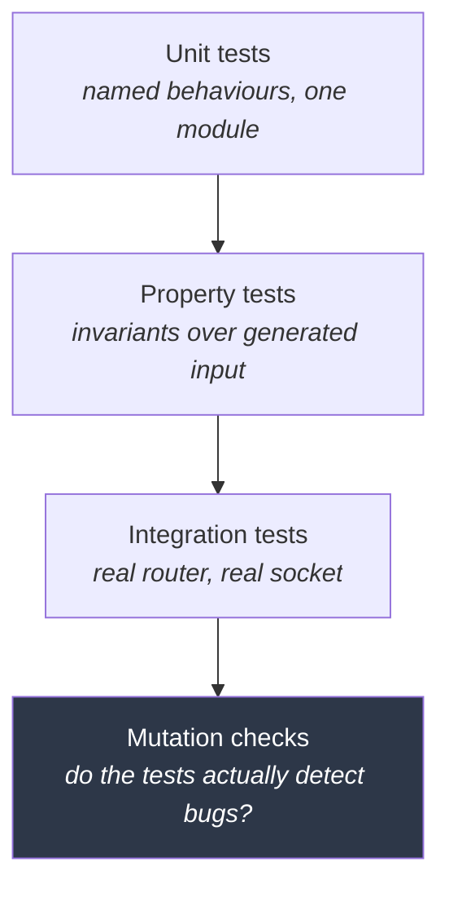

# Testing

[← Documentation index](README.md)

What is tested, how, and — more usefully — *why those particular things*.

---

## Current state

```
546 tests passing · 0 failures · clippy clean at -D warnings
```

| Crate | Tests | Focus |
|---|---|---|
| `kimmy-core` | 114 | HLC, key encoding, comparison, LWW merge, resume tokens, vector metadata |
| `kimmy-storage` | 149 | Codecs, engine lifecycle, document CRUD, indexes, change streams, vector storage, retention, schema migration, anti-entropy |
| `kimmy-query` | 85 | Filter, update, sort, projection semantics |
| `kimmy-vector` | 55 | Providers, chunking, the embedding worker, HNSW recall, index-cache policy |
| `kimmy-auth` | 43 | Passwords, tokens, RBAC, user store |
| `kimmy-api` | 58 | 31 unit (JSON boundary, errors, schema inference) + 27 end-to-end over a real socket |
| `kimmy-mcp` | 20 | 5 unit (resource URIs, internal-object filter) + 15 end-to-end JSON-RPC over a real socket |
| `kimmyd` | 17 | Config layering and validation |
| `kimmy-cluster` | 5 | Discovery string parsing |

---

## The principle

**Test the things whose failure is silent.**

A panic announces itself. A wrong query result does not — it propagates into
someone's report, weeks later, on data you cannot reproduce. So testing effort
is allocated by *how quietly a bug would fail*, not by how much code there is.

That is why the key encoder gets 2,000-case property tests plus a third
independent oracle plus mutation testing, while the CLI argument parser gets a
handful of examples.

---

## Layers



---

## The load-bearing invariants

These seven carry disproportionate weight. Anything that breaks one produces
wrong answers rather than crashes.

### 1. Key encoding order

```
encode(a).cmp(encode(b))  ==  canonical_cmp(a, b)
```

Indexes are redb key ranges compared with `memcmp`. Break this and range scans
quietly miss documents.

- `encoding_order_matches_canonical_order` — 2,000 generated pairs
- `equal_values_encode_identically` — an index lookup for `5` must find `5.0`
- `compound_encoding_matches_lexicographic_component_order`

The generator concentrates on boundaries where order-preserving encodings
actually break: type edges, `i64::MIN`/`MAX`, `2^53 ± 1`, subnormals, NaN, ±∞,
NUL bytes in strings, empty documents and arrays.

### 2. Numeric order against an independent oracle

The encoder cross-check has a hole: `keyenc` encodes numbers *through*
`cmp::decompose`, so the two are not independent for numeric values. A bug there
corrupts both identically and the property test passes.

So `numeric_order_matches_an_independent_oracle` (4,000 cases) checks against a
third implementation sharing no code with either — comparing integers as
integers, and mixed int/double pairs by splitting the double into floor plus
remainder, never rounding the integer.

Plus `ordering_is_transitive` and `ordering_is_antisymmetric`, because sorts and
range scans over a non-total order are undefined.

### 3. HLC monotonicity

No sequence of physical timestamps, however adversarial, may produce a
non-increasing clock.

- `tick_is_strictly_monotonic` — arbitrary time sequences including backwards jumps
- `observe_dominates_local_and_remote` — interleaved local and peer timestamps
- `successor_is_immediate` — nothing sorts between a timestamp and its successor,
  which is what makes resume-after exact
- `encoding_preserves_order` — the oplog range-scans by raw bytes

### 4. LWW convergence

Merge must be commutative and idempotent, or replicas will not converge.

`concurrent_writes_converge_regardless_of_arrival_order` applies the same two
conflicting writes in opposite orders on **two separate engines** and asserts
byte-identical results.

### 5. Change-stream continuity

`resuming_under_continuous_writes_has_no_gaps_and_no_duplicates` — 500 writes on
a background thread while a subscriber reads a prefix, disconnects, and resumes
from its token. Asserts the delivered sequence is exactly `0..500`, in order.

This is the test that justifies the subscribe-then-replay ordering. Also
`a_lagging_consumer_recovers_from_the_oplog_without_losing_events` (2,500 events
with nobody reading).

### 6. The approximate search path agrees with the exact one

```
approximate[0] == exact[0]        // same document, same score, bit for bit
```

Two search paths exist — an exhaustive scan and an HNSW walk — and a caller
cannot choose between them. If they disagree, an index cache has silently
changed what a search *means*, which no user-facing error would reveal.

The exact scan is the oracle. It is O(n) and has no recall loss, so it is by
construction the right answer to measure against.

- `the_approximate_path_agrees_with_the_exact_one` — same nearest neighbour,
  byte-identical score, because both paths score from the *stored* vector rather
  than from graph distances
- `recall_against_exact_search_is_high` — ≥ 90% recall at k=10, **measured, not
  assumed**
- `the_top_result_matches_exact_search` — approximation is acceptable in the
  tail, not at rank 1
- `scores_match_the_exact_path_exactly` — the graph's own distances never reach
  a result
- `dot_is_refused_rather_than_panicking` — the metric with no index takes the
  exact path instead of aborting the process

Score equality is asserted exactly rather than within a tolerance, and that is
deliberate: an approximate *ranking* is the design, an approximate *score* would
mean the graph's distances had leaked into the result.

### 7. Every edge enforces the same authorization

```
mcp_tool(principal, op)  denied  ⟺  rest_route(principal, op)  denied
```

Two edges now reach the same engine — the REST router and the MCP server — and
a caller cannot tell which one a given deployment exposes. If they disagree, an
agent tool is a privilege escalation path around the API's grants, and nothing
in the response would say so.

The structural defence is that both call `kimmy_api::exec`, which checks
*inside* each operation ([ADR-024](decisions.md)). The tests exist because
structure is an argument, not a proof:

- `mcp_requires_a_token` — rejection comes from the transport, before any tool
  runs, so a new tool cannot forget
- `a_read_only_token_can_read_but_not_write` — and asserts the collection is
  **unchanged afterwards**, not merely that an error was returned
- `grants_are_scoped_per_collection` — a grant on one collection does not reach
  its neighbour
- `search_can_be_granted_without_read` — `search` alone permits `vector_search`
  and refuses `find`; the action split has to survive both edges or it means
  nothing
- `listing_hides_what_the_caller_cannot_read` — enumeration does not leak
  existence
- `reading_a_resource_the_caller_cannot_reach_is_refused` — a URI can be
  guessed, so the read itself checks rather than relying on the filtered list
- `the_user_store_is_never_offered_as_a_resource` — even to a superuser

The last one is a different kind of invariant from the rest: not "may this
principal", but "should this ever be handed to a language model as context".
See [ADR-027](decisions.md).

---

## Mutation testing

A passing property test proves nothing if it cannot detect a bug. Two faults
were injected into the encoder deliberately, and both were caught with minimal
counterexamples:

| Injected fault | Caught by | Counterexample |
|---|---|---|
| Removed negative-number byte inversion | encoder cross-check | `Int32(-1)` vs `Int32(-2)` |
| Changed exponent normalization `63 → 62` | numeric oracle | `Double(2^53)` vs `Int64(2^53)` |

Worth repeating whenever a new invariant is added: break it on purpose, confirm
the suite goes red, revert.

---

### A mutation check that found a real testing gap

Worth recording because it changed a test rather than the code.

`VersionVector::behind` returns the **lowest** point this node is behind at, so
one request covers every peer it is behind on. Replacing `min` with `max` was
caught immediately by the unit tests in `kimmy-core` — and **not at all** by the
convergence tests in `kimmy-storage`, which passed unchanged.

The reason is that those tests never built the situation that distinguishes the
two: a node behind on two peers where what it is missing from one is stamped
*earlier* than what it already holds from the other. Every scenario they set up
happened to have the missing entries at the end.

`a_node_behind_on_two_peers_at_different_points_receives_both` constructs that
case deliberately, and now fails under the mutant with the exact message it was
written for. The first version of it did not — it was written and commented as
if verified before being checked, and the check is what caught that.

---

## Integration tests

`crates/kimmy-api/tests/api.rs` drives the **real router over a real TCP
socket** — not handler functions directly — so routing, extractors, status
codes, and the JSON boundary are exercised the way a client meets them. Each
test binds port 0 so they run in parallel without collision.

Security properties are asserted as behaviour, not assumed:

| Property | Test |
|---|---|
| Login does not reveal whether a user exists | `a_wrong_password_does_not_reveal_whether_the_user_exists` |
| RBAC blocks writes, DDL, and user admin | `rbac_is_enforced_on_every_route` |
| 403 does not leak existence | same test — a nonexistent collection also returns 403 |
| Listing hides unreadable collections | `listing_hides_what_the_caller_cannot_read` |
| `2^53 + 1` round-trips exactly | `extended_json_types_survive_the_boundary` |
| The last user cannot be deleted | `the_last_user_cannot_be_deleted` |

---

## Tests that caught real bugs

Worth recording, because each one shows the test doing its job:

| Bug | Consequence | Found by |
|---|---|---|
| `apply_remote` treated an equal stamp as a win | Redelivered oplog entries republished duplicate change events — and peers resend overlapping ranges routinely | `applying_the_same_remote_entry_twice_is_idempotent` |
| Index ids derived from `max(existing) + 1` | A new index would inherit a dropped index's stale entries | `index_ids_are_never_reused` |
| `$options` parsed as an independent operator | Regex flags silently dropped, so `$regex` + `$options: "i"` was case-sensitive | `regex_honours_sibling_options` |
| `$elemMatch` scalar form did not parse | `{$elemMatch: {$gt: 5}}` errored on arrays of numbers | `elem_match_works_on_arrays_of_scalars` |
| Intersecting both ends of a range on a multikey index | **Wrong results.** `{a: [2, 0]}` matches `{$gte: 1, $lte: 1}` — different array elements satisfy each bound — but the intersected key range excluded it | the two-sided-range proptest generator |
| `anndists::DistDot` asserts `1 - dot >= 0` | **Process abort.** Valid only for unit vectors; any real embedding would have crashed the server mid-search | exercising every metric against the index rather than assuming they all worked |
| Schema inference counted array elements, not documents | `presence` reported 2.0 — a fraction above 1.0, which is meaningless — for any array field | driving `describe_collection` against a running server; **no test looked, because nobody thought to** |
| MCP published `kimmy://__kimmy/__users` as a resource | The password-hash collection offered to an agent as attachable context | the first `resources/list` against a real node |
| `apply_remote` never maintained secondary indexes | A replicated document would be invisible to every index-backed query — present in a scan, missing from an index-backed `find` | reading the merge path while designing violation detection, which needs an index write to detect anything |
| Collection ids came from a node-local counter | **Silent cross-node corruption.** Every oplog entry names its collection by id, so two nodes that created collections in a different order would apply each other's writes to the wrong collection — and it works whenever creation order happens to match, which is what a two-node smoke test does | writing a throwaway two-engine probe while starting the transport, rather than trusting the roadmap's "missing: the transport" |
| Change streams de-duplicated by comparing stamps | Dropped any entry stamped at or below the high-water mark — exactly what a replicated entry looks like — and, separately, would have reordered two concurrent writers that published out of commit order | designing the arrival index; the second half was latent and unrelated to replication |
| Retention collecting the oplog tail | **Silent data loss.** The clock resumes from the tail, so an idle node would restart at `Hlc::ZERO` and every later write would lose to its own older version | writing the invariant into `the_clock_still_resumes_after_an_aggressive_collection` *before* the collector, then confirming a mutant that removes the guard fails three tests |

In the first two cases the test encoded the *intended* invariant and the
implementation was wrong — which is the right way round.

The multikey bug is the one worth studying: hundreds of property cases passed
before the generator was taught to emit *two-sided* ranges. The invariant was
right and the implementation was wrong, and the only thing standing between
that and production was whether the generator happened to produce the shape
that exposed it. Mutation testing is what found the generator gap.

---

## Verified by hand

Some things are only convincing against a running server. These were driven
manually and are recorded so they can be repeated:

| Check | Result |
|---|---|
| Full CRUD + query + update over HTTP | ✅ |
| Live change stream over WebSocket, single node | ✅ 3 events with `fullDocument` |
| Resume after a token | ✅ no redelivery of the acknowledged event |
| Ancient resume token | ✅ `410 resume_token_expired` |
| RBAC for a scoped analyst | ✅ read allowed; write, DDL, user admin all 403 |
| Restart durability | ✅ data, users, node identity all survived |
| `docker stop` | ✅ exit 0 in ~20 ms |
| MCP `initialize`, `tools/list`, `tools/call` over JSON-RPC | ✅ |
| MCP with no token | ✅ 401 from the transport |
| MCP RBAC for a real scoped user | ✅ read allowed; write, cross-collection read, user-store read, and DDL all refused |
| `resources/list` as superuser | ✅ user data only — no `__kimmy`, no shadow collections |
| `--no-mcp` | ✅ `/mcp` 404s, REST unaffected |
| Schema 1 → 2 migration on two real databases | ✅ 3 collections and 11 oplog entries repointed in one, 2 and 1 in the other; login still works (the user store moves too), documents and their exact values survived |
| Retention pass on a live node | ✅ 45 oplog entries and 15 tombstones collected; 15 live documents untouched |
| Restart after an aggressive collection | ✅ clock resumed from the retained tail; a post-restart update took effect rather than losing to LWW |
| File size across a collection pass | ✅ measured — 52.7 MB → 105.4 MB → 53.3 MB after refill ([Operations](operations.md)) |

The two M3 bugs in the table above were both found here rather than by the
suite, which is the argument for keeping this section: the failures a test
suite misses are the ones nobody thought to look for, and looking is what
driving a real server is.

A minimal WebSocket client was written for this (`scratchpad/wsclient.py`) since
none was installed — worth keeping for future manual verification.

---

## Conventions

**Test names are sentences.** `a_lagging_consumer_recovers_from_the_oplog_without_losing_events`
says what must be true. A failure list then reads as a list of broken
properties.

**Comments explain the *why*, not the *what*.**

```rust
// Distinguishing them would turn login into a user-enumeration oracle.
assert_eq!(wrong_password.to_string(), no_such_user.to_string());
```

**Assertions carry messages** where the failure would otherwise be cryptic.

**Determinism.** Time is a parameter, so no test sleeps waiting for a clock.
Async tests use explicit timeouts and fail with progress information rather than
hanging.

---

## Running

```bash
cargo test --workspace
cargo clippy --workspace --all-targets -- -D warnings
cargo fmt --all --check

cargo test -p kimmy-core keyenc          # one module
cargo test -p kimmy-api --test api       # integration only
PROPTEST_CASES=10000 cargo test -p kimmy-core   # deeper property search
```

CI runs fmt, clippy, and tests, then builds the Docker image and smoke-tests it
with `check-config`.

---

## Gaps

Honest list of what is not covered:

| Gap | Notes |
|---|---|
| No benchmarks | 📋 M5. No regression baseline exists |
| No fuzzing | The codecs are the obvious target |
| No multi-node tests | Nothing to test until M4 |
| No crash-consistency tests | redb is trusted for durability |
| No concurrent-writer stress test | Only the change-stream test writes concurrently |
| Property tests use default case counts | 256 unless overridden; the critical ones raise it explicitly |

---

## Adding a test

Ask: **if this broke, would anything notice?**

- Would it panic? Lower priority — it announces itself.
- Would it return a wrong answer? **Highest priority.** Property-test it.
- Would it leak information? Assert the observable behaviour, not the code path.
- Is it an invariant rather than an example? Property test, then break it on
  purpose to confirm the test has teeth.

---

## Next

- [Key Encoding](key-encoding.md) — the most heavily tested component
- [Decisions](decisions.md) — the choices these tests defend
