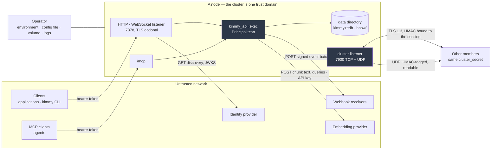

# Threat model

[← Documentation index](README.md)

What a node holds that is worth protecting, who can reach it across which
boundary, what is done about each threat and where in the tree that control
lives — and, stated just as plainly, what is not defended and what the
deployment is assumed to provide. [Security](security.md) explains the
mechanisms; this document is the map that says which threat each mechanism
answers. Where the two disagree, the code is right and both are wrong; file
references are given as `crate/src/file.rs` so they can be checked.

A control that is merged or in review but not yet released is marked **next
release** and named by the setting it introduces, so that this document is
correct for the release it ships with. Those markers are cleared as part of
cutting a release and a test refuses a dated release that still carries one —
an unswept marker reads as a control the operator does not have yet, which is
the more dangerous direction for a threat model to be wrong in. A claim marked
*verify* is one the author could not settle from the code alone.

---

## Assets

| Asset | Where it lives | Notes |
|---|---|---|
| **Documents** | `kimmy.redb` under `storage.data_dir` | BSON, plaintext on disk. Every mutation also lands in the oplog as a full post-image, so a document is on disk at least twice until retention collects the entry |
| **Vectors and chunk text** | The `<collection>.__vectors` shadow collection in the same file; HNSW graphs under `<data_dir>/hnsw/` | The shadow holds the *text* of each chunk beside its vector ([Vectors](vectors.md)), so anyone who can read the shadow can read the embedded fields even without `read` on the source collection — the shadow is a collection and is authorized as one |
| **The oplog** | Same file | Full post-images of every write, replicated to every member and served to change streams and webhooks. Retained for `storage.oplog_retention_secs` |
| **Root password** | The environment or config file, once, at first start; then only as an Argon2id hash in `__kimmy.__users` | Bootstrap reads it when the user store is empty and never again ([Security › Bootstrap](security.md#bootstrap)) |
| **User credentials** | `__kimmy.__users`: Argon2id PHC strings, token versions, roles | Never returned by any endpoint; reachable by `admin`, or by a grant naming `__kimmy` exactly — a wildcard never reaches it (ADR-079) |
| **JWT signing secret** | `auth.jwt_secret` / `KIMMY_JWT_SECRET`, held in process memory | Identical on every member. Whoever holds it can mint any local principal, `root` included |
| **Cluster secret** | `cluster.cluster_secret` / `KIMMY_CLUSTER_SECRET`, in process memory | Whoever holds it is a full peer: the entire oplog to read, and writes that win last-writer-wins |
| **Provider API keys** | Environment variables named by `api_key_env` in a collection's vector configuration, or by a `[vector.providers.<name>]` profile | Read at provider construction (`kimmy-vector/src/provider.rs`, `read_key`), and only for a name the provider policy admits (`kimmy-vector/src/policy.rs`, ADR-115); never stored in collection metadata or returned |
| **Webhook signing secrets** | `__kimmy.__webhooks`, one per subscription, in the clear | Shown to the registrant once ([Webhooks](webhooks.md)). Stored plaintext, so a backup and an `admin` read both contain them |
| **Local tokens** | In clients; in the CLI's `0600` cache under `$XDG_CACHE_HOME/kimmy` | A signed, readable grant list: anyone holding one can read its claims and use it until `exp` or revocation |
| **Cluster membership** | The SWIM member set in memory; `__kimmy.__nodes`; `GET /v1/topology` (authenticated) | Addresses, node ids and liveness. Also visible to anyone who can capture UDP on the cluster network (see below) |
| **The audit log** | The `kimmy::audit` tracing target, wherever the log pipeline sends it | Principal, action, database, collection, decision. Not tamper-evident: its integrity is the log pipeline's |
| **Backups** | Wherever `GET /v1/admin/backup` is saved | Everything above that is on disk, including password hashes, webhook secrets and the node identity. Protect one like the database |

`/metrics` is deliberately not an asset: it carries counts and never names
([Security › The metrics endpoint](security.md#the-metrics-endpoint)).

---

## Actors and trust boundaries

| Actor | Trusted with | Not trusted with |
|---|---|---|
| **Client** (a person or application holding a token) | Exactly what its grants say, at collection granularity | Anything else on the node, including the existence of collections it cannot access |
| **MCP client** (an agent) | The same: it *is* a client, authenticated the same way | Nothing more — MCP has no privilege of its own ([MCP](mcp.md)) |
| **Another member** | Everything: the full oplog, and writes that any node will apply | — A member is inside the trust boundary, not at it |
| **Identity provider** | Asserting *who* a caller is | Asserting `admin` (unless `auth.oidc.allow_federated_admin`), and anything about *what* they may do, which the role mappings decide |
| **Embedding provider** | The text of the fields it is configured to embed, and every search query | The rest of the document; any credential but its own key |
| **Webhook receiver** | Every event on the subscribed collection, post-image included | Anything it was not subscribed to; it never talks back except with a status code |
| **Operator** | The host, the environment, the data directory, the logs | — The operator is the root of trust; nothing below defends against one |

The unit of trust is the cluster. Every member holds the same signing secret,
the same cluster secret and a full copy of the data, and a request may land on
any of them. There is no member that is less trusted than another, and no
tenant boundary inside a deployment: **one deployment per trust domain.**

---

## Boundaries, threats and controls

### Clients → the HTTP and WebSocket listener

Everything under `/v1` except `login`, `refresh` and `version`, and every
change stream. Authentication is the `Auth` extractor in
`kimmy-api/src/state.rs`; a route that takes it is protected, a route that does
not is visibly public ([Security › Model](security.md#model)).

| Threat | Control | Where |
|---|---|---|
| Password guessing | A token bucket per client address on `POST /v1/auth/login`, spent only by failures and checked *before* the Argon2id verification, so a refused attempt costs the node nothing; optionally a second bucket per user name | `kimmy-api/src/ratelimit.rs`; `server.rate_limit.login_*` ([Security › Login rate limiting](security.md#login-rate-limiting)) |
| Enumerating accounts through login | Identical responses for a wrong password and an unknown user, and a dummy hash on the unknown-user path so timing does not tell them apart | `kimmy-auth/src/users.rs`, `UserStore::authenticate` |
| Forging or altering a local token | HS256 over a shared secret of at least 32 bytes (`MIN_SECRET_LEN`, ADR-093); `alg=none` and any non-HS256 header refused; `exp` enforced with **no** leeway | `kimmy-auth/src/token.rs` |
| A weak or placeholder signing secret | Refused at startup below the floor, and a value from this repository's own examples (`PLACEHOLDER_SECRETS`) is refused whenever the node binds off loopback (ADR-093) | `kimmyd/src/config.rs`, `Config::validate` |
| Rotating the secret without ending every session | `auth.jwt_previous_secret` verifies tokens from the old key while new ones are signed with the current key; the window closes one `token_ttl_secs` later (ADR-101) | `kimmy-auth/src/token.rs`, `TokenIssuer::with_previous` |
| A revoked, disabled or narrowed account keeping its token | A per-user token version, checked on every request and bumped by a password change, a grant change, a role edit or disabling the account; a deleted user has no version and is refused (ADR-052). Replicates as an ordinary write | `kimmy-api/src/sessions.rs`, applied in the `Auth` extractor |
| Reaching data outside a grant | One authorization decision point, `Principal::can`, called inside every executor operation rather than beside it; `admin` implies everything, `write` implies `read`, `read` implies `search`, nothing else is implied | `kimmy-auth/src/rbac.rs`; `kimmy-api/src/exec.rs` |
| Probing for collections through status codes | 403 is decided before the collection is resolved, listings filter through the same check, and the `WWW-Authenticate` challenge on a 403 is byte-identical whether the target exists | `kimmy-api/src/exec.rs`; ([Security › Properties enforced](security.md#properties-enforced-and-why)) |
| A wildcard grant reaching the user store | `__kimmy` never matches a pattern; only `admin` or a grant naming it exactly opens it (ADR-079) | `kimmy-auth/src/rbac.rs` |
| Passwords and tokens on the wire | Native TLS on the listener when `server.tls.cert_file` and `key_file` are set, hot-reloaded on SIGHUP or file change; plaintext on a non-loopback bind starts with a warning because a proxy in front is legitimate | `kimmyd/src/node.rs` ([Security › TLS](security.md#tls)) |
| Minting a local token from an untrusted network | `auth.local.login = loopback_only` or `disabled` decides where `login` and `refresh` answer, judged on the TCP peer and never on a forwarded header (ADR-100) | `kimmy-api/src/local_login.rs` |
| An authenticated caller exhausting the node | `find` stops at 10,000 documents, regex is linear-time, aggregation has a hard memory ceiling; `server.request_timeout_secs` is a deadline on pending requests (answered `503 timeout`), `server.max_body_bytes` is the 2 MiB body ceiling axum always applied and now yours to set, and `server.rate_limit.per_principal` is keyed on the verified principal (ADR-099). None of these is a query timeout: storage work runs to completion | `kimmy-api/src/limits.rs`, `routes.rs` |
| Running without authentication by accident | `--insecure-no-auth` is refused on any non-loopback bind; the resulting principal is flagged `unauthenticated` in every audit record; federation is refused alongside it | `kimmyd/src/config.rs` |
| Taking over an existing database through the environment | The root account is created only when the user store is empty; a changed `KIMMY_ROOT_PASSWORD` on a later start changes nothing | ([Security › Bootstrap](security.md#bootstrap)) |
| A backup read by a database-scoped administrator | `GET /v1/admin/backup` requires `admin` over `*`; there is no grant-filtered backup | `kimmy-api/src/routes.rs`, `backup` |
| Learning the schema from an unauthenticated endpoint | `/metrics` renders counts and never names, held by a golden test over the whole output | `kimmy-api/src/metrics.rs` |

What is unauthenticated on this listener, by design: `/healthz`, `/readyz`,
`/metrics`, `/v1/version` (a version string), the two
`/.well-known/oauth-protected-resource` paths, `POST /v1/auth/login` and
`POST /v1/auth/refresh` (which authenticates by the token it is given).

### MCP clients → `/mcp`

The same listener, the same certificate, the same `Auth` extractor — run as
axum middleware *before* the MCP transport sees the request, so an
unauthenticated call is refused at the door rather than by each tool
(`kimmy-mcp/src/auth.rs`). Every tool calls `kimmy_api::exec`, where
`Principal::can` runs; a tool cannot skip the check because it never had the
option (ADR-024).

| Threat | Control | Where |
|---|---|---|
| A session outliving its token | The server is stateless: no MCP session, every POST authenticated on its own | `kimmy-mcp/src/auth.rs`, `NeverSessionManager` |
| Tool authorization drifting from REST | One executor for both edges; write tools are always listed and refused on call, so capability is a property of the role, not of the tool list (ADR-025) | `kimmy-mcp/src/tools.rs` |
| An agent reading raw documents when it only needs search | `search` is grantable without `read` | `kimmy-auth/src/rbac.rs` |
| Oversized requests | rmcp's own 4 MiB body limit | rmcp |
| DNS rebinding | `server.mcp_allowed_hosts`, off by default because the attack needs an unauthenticated server and this one refuses a missing token before the transport runs (ADR-026) | `kimmy-mcp/src/auth.rs` |

What the database cannot do for an agent: documents are data, and a document
may contain text written to steer a model that reads it. `find` returns
documents, a `kimmy://` resource hands an agent three whole ones, and
`describe_collection` quotes example values. Treat
what comes back from a tool call as untrusted input to the agent, as you would
a web page; nothing here can distinguish a hostile document from an ordinary
one.

### Members ↔ the cluster listener

Two protocols on `cluster.bind`, both authenticated with `cluster_secret` and
neither with a certificate anyone verifies.

**Replication, TCP.** TLS 1.3 always — there is no plaintext mode — over a
self-signed certificate each node generates at startup and neither side
checks. What makes that safe is channel binding: both sides prove they hold
`cluster_secret` with a mutual HMAC-SHA256 challenge, and the proof covers the
session's RFC 5705 exported keying material, so a relay that terminates two
sessions computes over the wrong value and is refused. The secret is never
transmitted and the comparison is constant-time
(`kimmy-cluster/src/tls.rs`, `protocol.rs`; [Security › TLS between
nodes](security.md#tls-between-nodes)).

**Membership, UDP.** Every SWIM datagram carries an HMAC-SHA256 tag over its
payload under the same secret, checked in constant time; a datagram from a
node with a different secret is dropped without reply, so it cannot join the
member set or take ownership of webhook subscriptions (ADR-053). **The payload
is readable** — membership topology is visible to anyone who can capture the
cluster network — and a captured datagram **can be replayed**; ADR-053 records
why that is out of scope for a liveness protocol.

| Threat | Control | Where |
|---|---|---|
| A stranger reading the oplog | Mutual authentication: the initiator checks the responder's proof *before* answering its challenge, so an unauthenticated peer learns nothing and is handed nothing | `kimmy-cluster/src/transport.rs`, `open_handshake` |
| An active relay on the path | Channel binding, tested with a relay that really terminates TLS on both sides | `kimmy-cluster/src/tls.rs` |
| A peer that connects and says nothing | 5 s to dial and to finish the TLS handshake, 10 s for the protocol handshake, 30 s per request | `transport.rs` constants |
| A frame sized to exhaust memory | The length prefix is checked against `MAX_FRAME` (64 MiB) before anything is allocated; batches are bounded by `MAX_BATCH` entries | `kimmy-cluster/src/protocol.rs` |
| Guessing the secret by comparing proofs | Constant-time comparison; a failed proof is answered with a terse fault | `protocol.rs`, `proof_is_valid` |
| Poisoned discovery (DNS, a headless Service) | Discovery only proposes addresses; a peer at one still has to prove the secret before it is served or believed | `kimmy-cluster/src/discovery.rs` |

What the secret does **not** do: distinguish one member from another. Every
holder is a full peer, able to read every database, inject writes that win
last-writer-wins on a chosen timestamp, and replicate a collection drop. That
is the design, not a gap, and it is why a compromised member is out of scope
below and why rotating `cluster_secret` is a stop-the-cluster operation
([Operations](operations.md#docker)).

### The node → embedding providers

The one part of the vector pipeline that leaves the process
(`kimmy-vector/src/provider.rs`). Off the write path: a slow or failing
provider delays embeddings, never a write.

**What leaves the node.** For each document, the text of the configured
`fields`, chunked, each chunk prefixed with `document_prefix`; for each
`vector_search` or `hybrid_search` with a text query, the query prefixed with
`query_prefix`; the model name and, for `open_ai`, `dimensions`. The request
body is `{"input": [texts…], "model": …}` or the dialect's equivalent — no
document id, no other fields, no filter, no database or collection name. The
key travels as `Authorization: Bearer` (or `x-goog-api-key` for Gemini). The
`byo` and `local` providers send nothing anywhere.

| Threat | Control | Where |
|---|---|---|
| Keys in collection metadata or responses | The configuration names an environment *variable*; the value is read when the provider is built and appears nowhere else | `provider.rs`, `read_key` |
| A `ddl` holder naming one of the node's own secrets as the key variable — `KIMMY_JWT_SECRET`, `KIMMY_CLUSTER_SECRET`, `KIMMY_ROOT_PASSWORD` — and receiving it at an endpoint they chose | A hard denylist no setting can relax: every `KIMMY_*` variable other than `KIMMY_PROVIDER_*` is refused by name, and an allowlist entry that would reach one is a configuration error. Beyond that, `vector.provider.allowed_key_env` — exact names or prefixes with one trailing `*`, defaulting to the three documented key variables and `KIMMY_PROVIDER_*` — and a variable outside it is refused by name. Checked at configure time (`400`) and again when the provider is built, because a configuration also arrives by replication (ADR-115) | `kimmy-vector/src/policy.rs`, `check_key_env`; `kimmy-api/src/vectors.rs`, `admit_provider`; `provider.rs`, `build` |
| Server-side request forgery through a provider endpoint | The address policy webhooks use, shared through `kimmy-egress`: loopback, link-local, RFC 1918, carrier-NAT and reserved ranges refused unless the host is in `vector.provider.allowed_hosts`; the endpoint — or the dialect's default — resolved and **every** address checked at configure time and at build time, and again inside the client's resolver at connect time; redirects not followed | `kimmy-egress/src/lib.rs`; `policy.rs`, `check_endpoint`; `provider.rs`, `http_client` |
| A `ddl` holder choosing where a collection's text goes at all | `vector.provider.endpoints_locked`: a collection may then name only a `[vector.providers.<name>]` profile the operator defined, `byo` or `local`. The profile's own definition is held to the key and address rules at startup and by `check-config` | `policy.rs`, `check_configure`; `kimmyd/src/config.rs` |
| A change to where text is sent going unrecorded | Configuring or disabling embeddings writes an audit record with the provider kind, the endpoint host or the profile name, and the key variable's *name* | `kimmy-api/src/audit.rs`, `record_vectors` |
| Eavesdropping on the provider call | HTTPS through `reqwest` on rustls. *Verify:* the trust roots are the compiled-in `webpki-roots` bundle (it is in `Cargo.lock`; `rustls-native-certs` is not), so a provider behind a private CA is not trusted whatever the image's `ca-certificates` holds |  `Cargo.toml`, `reqwest` features |
| A hung provider holding the worker | 10 s connect, 60 s request timeout, one in-client retry; the worker's own backoff after that | `provider.rs` constants |
| A provider returning the wrong shape | Every returned vector's width is checked against `dim` before it is stored (`DimensionMismatch`) | `kimmy-vector/src/provider.rs` |

The endpoint and the key variable are part of the collection's vector
configuration, so they are chosen by whoever holds `ddl` on that collection —
which is why the controls above exist, and why they are enforced twice.
A configuration is checked when it is accepted, where the person who typed it
gets a `400` naming the variable or the host; and it is checked again when the
provider is built, by the worker and by a search embedding a query, because a
configuration also arrives by replication from another member and never
passes this node's API. What a `ddl` holder can still choose is a public
endpoint and a listed variable — so a tenant with `ddl` on their own
collection can send that collection's text to a public provider under a key
the operator listed for the purpose. An operator who does not want even that
sets `endpoints_locked` and defines the providers themselves; the collection
then names a profile and nothing else.

### The node → webhook receivers

The node originates HTTP requests to addresses a principal supplied
(`kimmy-api/src/webhooks.rs`, `egress.rs`, delivery in `dispatch.rs`).

**What is sent.** A batch of events for one subscription: operation type,
database and collection name, `documentKey`, `clusterTime`, and the full
post-image unless it alone exceeds `webhooks.max_payload_bytes`, in which case
the event says so and omits it. Three headers: `X-Kimmy-Event-Id`,
`X-Kimmy-Timestamp`, and `X-Kimmy-Signature`, an HMAC-SHA256 over
`timestamp.body` under the subscription's secret. A `traceparent` header,
unsigned, when a trace context is available to inject.

| Threat | Control | Where |
|---|---|---|
| Server-side request forgery — making the node probe its own network or the cloud metadata address | Loopback, link-local, RFC 1918, carrier-NAT and reserved ranges are refused unless the host is in `webhooks.allowed_hosts`; the name is resolved and **every** address checked, at registration and again inside the HTTP client's resolver before each delivery; redirects are not followed | `egress.rs`; `dispatch.rs`, `Policy::none()` |
| A forged delivery at the receiver | The per-subscription secret, generated from the CSPRNG and shown once; the timestamp inside the signature so a capture cannot be replayed with a fresh one | `webhooks.rs`, `new_secret` |
| Handing out an egress path with a read grant | `webhook` is its own action; `watch` does not imply it and only `admin` does | `kimmy-auth/src/rbac.rs` |
| One dead endpoint starving the rest | Bounded concurrency (`max_concurrent_deliveries`), a 10 s delivery timeout, per-subscription backoff to five minutes, invalidation when the owed events have been collected | `dispatch.rs` |
| A subscription that outlives the token that made it | By design — that is the feature. Registering and removing one is written to the audit log so the grant of egress is on record | `webhooks.rs` |

A receiver is trusted with the data by definition; the registrant chose it. A
`webhook` grant on a collection is the ability to export that collection,
continuously, to any public host, over `http` if the registrant writes `http`:
the policy refuses non-public *addresses*, not plaintext.

### The node ↔ the identity provider

Optional; on when `auth.oidc.issuer` is set ([Federation](federation.md)).
Traffic in both directions is small and specific.

**Outbound.** `GET {issuer}/.well-known/openid-configuration` and `GET` of
the `jwks_uri` it names, every `refresh_interval_secs` and once, rate-limited,
on an unknown `kid`. Nothing about a user is ever sent: there is no
introspection call and no userinfo call.

**Inbound.** A bearer token whose unverified `iss` matches the configured
issuer is offered to the OIDC verifier and to nothing else
(`kimmy-auth/src/oidc.rs`, ADR-064).

| Threat | Control | Where |
|---|---|---|
| Substituted signing keys | The issuer must be `https` (loopback excepted); the discovery document must name the issuer it was fetched for and its `jwks_uri` must be `https`, or no keys are installed | `kimmyd/src/node.rs`, the discovery fetch |
| Algorithm confusion | `RS256` and `ES256` only on this path; HS256 only on the local path; each verifier pins its own list, and a token reaches exactly one of them | `oidc.rs`, `OIDC_ALGORITHMS`; `token.rs` |
| A token minted for another audience | `aud` must equal `auth.oidc.audience` byte for byte and must be **present**; likewise `iss`, `exp` and `sub` | `oidc.rs`, `OidcVerifier::verify` |
| An ID token presented as an access token | An `https` audience closes it by itself; `require_at_jwt` adds the `typ` check where the provider stamps it | `oidc.rs` |
| A provider that can mint a superuser | `admin` does not federate: an inline mapping naming it stops the node, a stored role resolving to it has the action dropped, unless `allow_federated_admin` is set and announced at startup (ADR-067, ADR-074) | `oidc.rs`, `OidcSettings::validate` |
| A revocation at the provider going unhonoured | **Not defended here, by decision.** Membership is frozen in the token and there is no introspection, so the exposure is the access-token lifetime the provider mints. Bounding it from this side was tried (ADR-096) and removed (ADR-112): the lifetime is set at the operator's identity provider, which is also where shortening it protects their other relying parties. Documented in `docs/security.md`; not refused and not warned about | the provider's configuration |
| Laundering a federated identity into a local one | `/v1/auth/refresh` refuses a federated principal; a federated token never produces a local token (ADR-065) | `kimmy-api/src/sessions.rs` |
| Making the node hammer its provider | The unknown-`kid` refetch is rate-limited, because `kid` is attacker-controlled | `kimmyd/src/node.rs` |
| A mutable claim becoming an identity | `auth.oidc.subject_claim` provides a *display* name only; `sub` remains the identity for every decision (ADR-100) | `oidc.rs` |

### The operator and the host

Inside the boundary. Listed so the responsibilities are explicit.

| Concern | What the node does | What is left to the operator |
|---|---|---|
| Secrets at rest | Reads them from the environment, the config file or a flag; redacts them in `check-config` output and the startup summary | File modes on the config file; not passing secrets as command-line flags, which `ps` shows |
| Secrets in memory | Holds them for the life of the process | Core-dump policy; who can `ptrace` the process |
| The data directory | Plain redb pages, plain HNSW snapshots. **No encryption at rest** | An encrypted volume; who can read the mount |
| The container | Runs as uid 10001 with no shell wrapper; the runtime image carries the binary and `ca-certificates`; every release publishes what is compiled into the binary ([Security › Software bill of materials](security.md#software-bill-of-materials)) | Checking a download before deploying it; what else runs in the pod |
| Logs | Application logs carry `db`, `collection`, `user` and webhook URLs; audit records carry principals. *Verify* for your version that no log line carries a document body or a filter | Where logs go and who reads them |
| Telemetry | Off unless `telemetry.endpoint` is set; names omitted from spans by default; audit records never exported ([Security › Telemetry](security.md#what-telemetry-sends-and-what-it-does-not)) | The collector, and `include_names` |

---

## Out of scope

Not defended against, stated so nobody infers otherwise. The
[not-defended table](security.md#what-is-not-defended-against) in the security
guide is the per-feature list; this is the list by adversary.

- **A compromised member.** Any holder of `cluster_secret` is a full peer with
  the whole oplog and the power to write anything, on any timestamp, to every
  other member. There is no per-member identity to revoke and no quorum to
  outvote it. The remedy is to stop the cluster, rotate the secret, and restore
  from a backup taken before the compromise.
- **A compromised host or operator.** Everything on the box is readable by
  whoever owns the box: the data directory, the environment, process memory.
- **A compromised identity provider**, beyond the `admin` boundary. It can
  mint any principal the role mappings can express, for as long as a token
  lives; it cannot mint `admin` unless the operator allowed that. Recovery is a
  local `root` login and turning federation off (ADR-067).
- **A malicious embedding provider.** It sees the embedded text and every
  query, and it chooses the vectors, so it decides what search returns. It is
  trusted with both.
- **A malicious webhook receiver.** It receives what it was subscribed to;
  that is the feature.
- **A `ddl` holder choosing a *public* provider endpoint** under a listed key
  variable, on a node without `endpoints_locked`. The policy above refuses the
  node's own secrets and the node's own network; it does not decide which
  public providers are acceptable. That is the lock's job, and it is off by
  default.
- **Network-layer denial of service.** SYN floods, volumetric UDP,
  exhausting file descriptors with idle connections. The limits above bound
  what an *authenticated* caller can spend; what reaches the socket is the
  network's problem.
- **Side channels** beyond the two comparisons made constant-time (cluster
  proofs and datagram tags) and the dummy hash on login. Cache timing,
  speculative execution and power analysis are not considered.
- **Physical access to the data directory or a backup.** Both are plaintext.
  **Encryption at rest is not provided** and is not planned; use an encrypted
  volume and protect backups as you would the database.
- **Replay of SWIM datagrams**, per ADR-053.
- **Document- or field-level access control, and attribute-based rules.** The
  collection is the finest unit of protection; anything finer belongs in an
  application in front of the database ([Security › How far authorization
  goes](security.md#how-far-authorization-goes)).
- **Multi-tenancy inside one deployment.** Tenants who must not trust each
  other's administrators need separate deployments.
- **The client's environment.** A token in a shell history, a CLI cache on a
  shared machine, an agent that pastes what it read into a prompt.
- **Adversarial documents against an agent.** Prompt injection through stored
  text is the agent's problem; the database returns what was stored.

---

## Operational assumptions

The controls above are sufficient only when these hold.

1. **TLS terminates somewhere you control**: on the node (`server.tls`) or at
   a proxy or mesh in front of it. A plaintext listener off loopback starts
   with a warning, not a refusal, precisely because the second arrangement is
   common — so the warning is yours to read.
2. **Behind a proxy, two settings follow from it.** `trusted_proxy_header`
   only when the proxy rewrites that header, or the login limiter is
   defeatable by anyone who sets it; and remember that
   `auth.local.login = loopback_only` judges the *TCP peer*, so a proxy on the
   same host makes every caller look local.
3. **Secrets arrive through the environment or a config file readable only by
   the service user** (mode `0600`; uid 10001 in the container), and are
   generated, not chosen: `openssl rand -base64 32` for each. Command-line
   flags exist for them and should not be used on a shared host.
4. **The cluster ports (`7900` TCP and UDP) are reachable only by members.**
   Replication is encrypted; membership is authenticated but readable and
   replayable. A firewall or network policy is the control for both.
5. **Clocks are synchronized.** Last-writer-wins resolves on a hybrid logical
   clock, so a member with a fast clock wins every conflict it is in; local
   tokens allow no expiry leeway. NTP on every member.
6. **One deployment per trust domain.** Members trust each other completely;
   RBAC separates collections, not administrators.
7. **Backups are protected like the database**, and a rewound restore is never
   rejoined to a cluster that still holds the writes it undid.
8. **Providers and receivers over the public internet are addressed with
   `https`**; the node will not insist.
9. **Someone reads the audit log** and watches
   `kimmy_auth_failures_total`, `kimmy_authz_denied_total`,
   `kimmy_rate_limited_total`, `kimmy_tls_reloads_total{outcome="failed"}` and
   `kimmy_jwks_refresh_total{outcome="failed"}`. Several failure modes here are
   silent on the request path by design and loud only there.

---

## Cryptography, and a note on FIPS

| Use | Primitive | Implementation |
|---|---|---|
| Passwords | Argon2id, `m=19456, t=2, p=1`, random salt, PHC string | `argon2` (RustCrypto) |
| Local tokens | HS256 | `jsonwebtoken` with the `rust_crypto` backend |
| Federated tokens | RS256, ES256 verification against a JWKS | `jsonwebtoken` |
| Cluster handshake, SWIM tags, webhook signatures | HMAC-SHA256, constant-time comparison | `hmac`, `sha2`, `subtle` (RustCrypto) |
| TLS, client and cluster | `rustls` defaults — TLS 1.2 and 1.3 offered; two rustls endpoints, as two members are, settle on 1.3 | `rustls` on the **`ring`** provider; `reqwest` on the same |
| Secrets the node generates | Node ids, webhook secrets | `uuid` v4 from the operating system's CSPRNG |

ADR-039 chose `ring` as the rustls provider, and ADR-016's correction set the
rule that survives: one native crypto stack, not two. **`aws-lc-rs` has a
FIPS 140-3 validated mode; `ring` does not, and it is not enabled here.**
Nothing in this build is FIPS-validated, and the RustCrypto crates used for
passwords and HMAC would remain outside a validated boundary even if the TLS
provider changed. KimmyDB makes no FIPS claim. A `fips` build feature that
swaps the rustls provider for `aws-lc-rs` in FIPS mode is a possible future,
with the CMake and C toolchain cost ADR-039 declined; ADR-039 stands until a
deployment needs it enough to pay for it.

---

## Reporting

A hole in this model, or in the code it describes, is a vulnerability report:
see [`SECURITY.md`](../SECURITY.md) at the repository root. Please do not open
a public issue.

---

## Next

- [Security](security.md) — the mechanisms, in depth
- [Federation](federation.md) — the identity-provider boundary, provider by provider
- [Operations](operations.md) — configuration, the audit log, backup
- [Decisions](decisions.md) — ADR-039 (TLS provider), ADR-040 and ADR-053 (cluster transport), ADR-064 through ADR-074 (federation), ADR-110 (this document)
