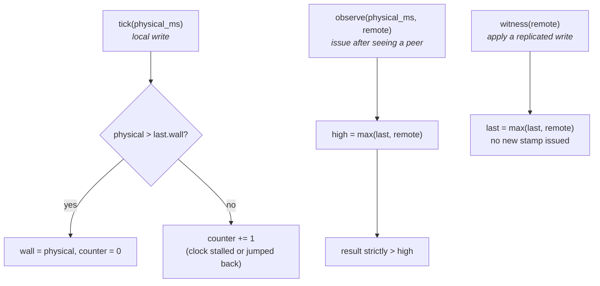
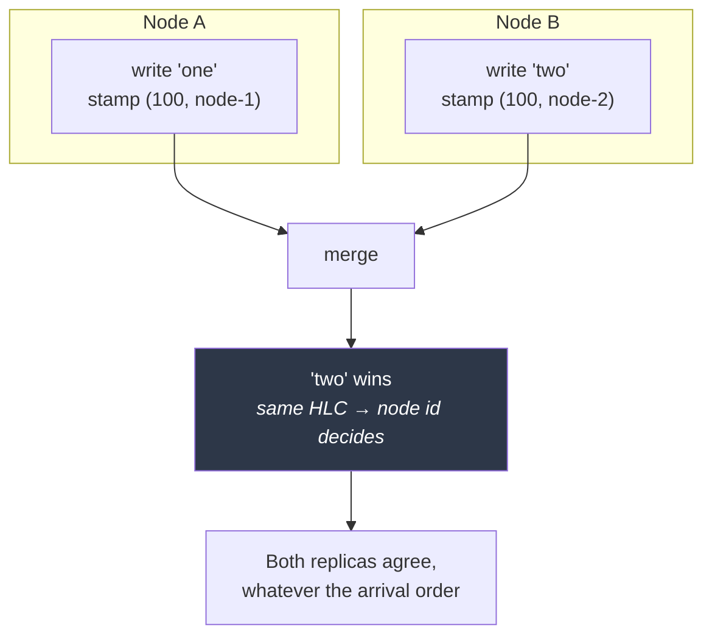
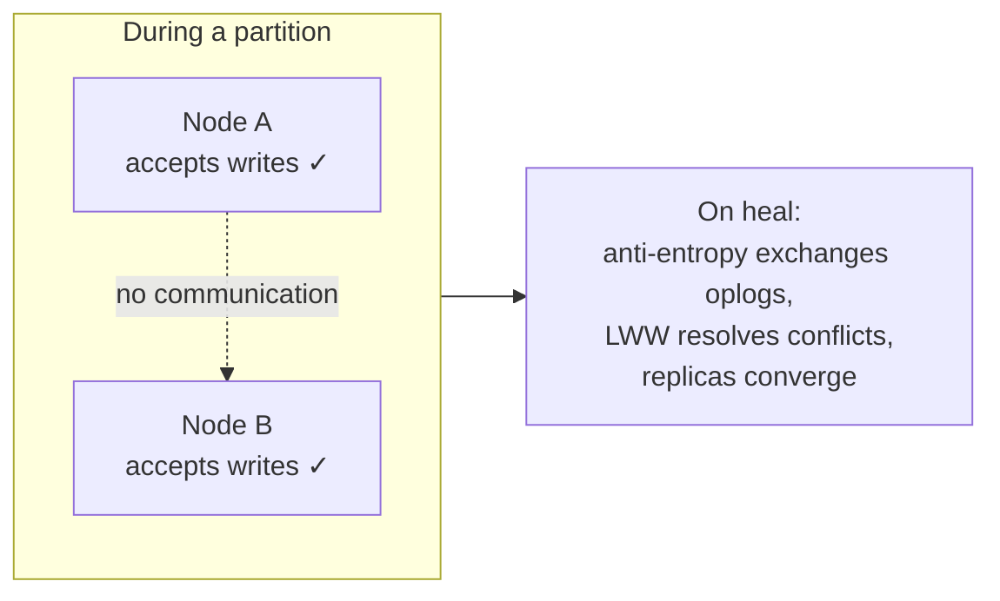

# Time & Conflicts

[← Documentation index](README.md)

How KimmyDB orders writes without a leader, and what that costs you.

Implemented in `kimmy-core/src/hlc.rs` and `kimmy-core/src/record.rs`.

---

## Why not wall-clock time

Last-writer-wins needs a total order over writes. Wall-clock timestamps look
like an order but are not one:

- Clocks on different machines disagree by milliseconds to seconds.
- NTP corrections move a clock **backwards**.
- Two writes in the same millisecond are indistinguishable.
- VM migration and suspend can jump a clock arbitrarily.

Any of these makes "latest wins" mean "whichever machine's clock was fast wins",
and a backwards jump can make a node lose to its *own* earlier write.

---

## Hybrid Logical Clocks

An HLC keeps a timestamp close to wall-clock time while guaranteeing strict
monotonicity and causal consistency.

```rust
struct Hlc {
    wall_ms: u64,   // physical: milliseconds since the Unix epoch
    counter: u16,   // logical: disambiguates within one millisecond
}
```

Three operations, in `kimmy-core/src/hlc.rs`:



- **`tick`** issues a timestamp for a local write. Strictly greater than
  everything previously issued *or observed*, whatever the physical clock does.
- **`observe`** folds in a peer's timestamp and issues one above both. Calling
  it on every inbound message is what makes causality transitive.
- **`witness`** advances past a remote timestamp without issuing one — used when
  applying a replicated write, which keeps its originating stamp.

### Physical time is a parameter

```rust
pub fn tick(&mut self, physical_ms: u64) -> Hlc
```

The clock never reads `SystemTime::now()` itself. Backwards jumps, stalls, and
counter exhaustion are exactly what an HLC exists to survive, and they are
nearly impossible to test against a real clock. As parameters they are ordinary
unit tests:

```rust
let a = clock.tick(5_000);
let b = clock.tick(4_000);   // NTP yanks the clock back a full second
assert!(b > a);              // still monotonic
```

`kimmy-storage::engine::physical_now_ms()` is the only place the wall clock is
read.

### Counter exhaustion

2¹⁶ writes in one millisecond on one node exhausts the counter. It rolls into
the next millisecond rather than wrapping — the clock runs slightly ahead of
physical time and catches up, which is always safe.

### Encoding

10 bytes: `wall_ms` big-endian (8) then `counter` big-endian (2). The byte order
matches `Ord`, so the storage layer range-scans the oplog by raw bytes. This is
property-tested, because the oplog scan silently depends on it.

---

## Stamps

An `Hlc` alone is not enough — two nodes can legitimately produce the same one.

```rust
struct Stamp {
    hlc: Hlc,
    node: NodeId,   // breaks ties deterministically
}
```

Ordering is `(wall_ms, counter, node_id)`: a **total order** over every write in
the cluster. The node id makes ties deterministic, so every replica picks the
same winner regardless of the order updates arrive in.

> This is why node identity must survive restarts, and why it lives inside the
> database file rather than beside it. A node that forgot its id would become a
> stranger to its own prior writes.

### Strictly greater wins

```rust
pub fn wins_over(&self, other: &Stamp) -> bool {
    self > other      // strict
}
```

The strictness is load-bearing. An equal stamp means *the same logical write*,
so re-applying it must be a no-op.

> A bug found by test: `apply_remote` originally decided by comparing the merge
> result's stamp to the incoming stamp, which cannot distinguish "incoming won"
> from "identical stamp, existing kept". Peers resend overlapping ranges
> routinely, so this re-published a duplicate change-stream event on every
> redelivery. Now it asks `wins_over` directly.

---

## Last-writer-wins

One function defines the merge rule, in `kimmy-core/src/record.rs`:

```rust
pub fn merge(self, incoming: DocRecord) -> DocRecord {
    if incoming.stamp.wins_over(&self.stamp) { incoming } else { self }
}
```

Local writes, replication, and repair all route through it, so they cannot
disagree.



Merge is **commutative** and **idempotent**, which is what makes replicas
converge. Both properties are tested directly, including applying the same two
conflicting writes in opposite orders on two separate engines and asserting
byte-identical results.

### Granularity: whole document

The losing write is **discarded, not merged**.

```javascript
// Starting from { name: "ada", email: "a@x.com" }
// Node A:  { $set: { email: "new@x.com" } }
// Node B:  { $set: { name: "Ada" } }      ← concurrent
// Result:  ONE of these. The other field change is lost.
```

Per-field LWW or a CRDT would preserve both. The tradeoff was made explicitly —
see [Decisions](decisions.md) — and `merge_policy` is the intended extension
point if the semantics need to change later.

---

## Tombstones

A delete writes a record with `deleted = true` rather than removing the key.

```mermaid
sequenceDiagram
    participant A as Node A
    participant B as Node B

    Note over A,B: doc exists, stamp T1
    Note over A: delete at T3 → tombstone
    A->>B: replicate tombstone T3
    Note over B: key holds tombstone T3

    Note over B: delayed insert at T2 arrives
    B->>B: T2 &lt; T3 → discarded ✓

    rect rgb(90, 40, 40)
        Note over B: Without the tombstone the key<br/>would be empty, T2 would look<br/>brand new, and the delete would<br/>silently undo itself.
    end
```

**Retention.** Tombstones are kept for `storage.tombstone_retention_secs`
(default 24 h). Collection is 📋 planned.

> **Sharp edge — resurrection.** If a partition outlasts the retention window,
> documents deleted during it resurrect when it heals. Set the window longer
> than any partition you would tolerate. This is inherent to tombstone-based
> deletion in an AP store, not a bug awaiting a fix.

---

## Clock resumption

On open, the engine reads the last oplog key and resumes the HLC from it:

```rust
let resumed = Self::last_oplog_hlc(&db)?;
HlcClock::resuming_from(resumed)
```

Without this, a restart would mint stamps *below* ones already on disk, and a
document rewritten after the restart could lose to its own older version.

---

## The consistency model

| Property | Guarantee |
|---|---|
| Single-document write | Atomic and durable on the accepting node |
| Read-your-writes | **Only on the node you wrote to** |
| Cross-node reads | No guarantee — a peer may not have converged yet |
| Conflict resolution | Whole-document LWW; losing write discarded |
| Multi-document atomicity | **None** |
| Convergence | Eventual, given the partition is shorter than tombstone retention |
| Monotonic reads | Not guaranteed across nodes |

### In CAP terms

KimmyDB is **AP**: available and partition-tolerant, not linearizable. Every
node accepts writes during a partition, and they merge on heal.



That is the right tradeoff for the use case — a document store where
availability matters more than strict ordering — but it means these are *not*
available: unique constraints across nodes, read-modify-write without lost
updates, counters that never lose an increment, or "check then act" logic.

If you need any of those, you need coordination, and coordination is exactly
what a leaderless design forgoes.

### Unique indexes are a per-index choice

Uniqueness is the sharpest example. It is a *global* invariant — legality
depends on what every other node is concurrently doing — and is provably not
maintainable without coordination. So it is an explicit per-index mode:

| `enforcement` | Reach | Availability |
|---|---|---|
| `local` (default) | The accepting node. Cross-node violations are **detected after merge**, not prevented | Full |
| `coordinated` (reserved, not implemented) | Cluster-wide, by reserving the value at its owning node | That value's writes fail while its owner is unreachable |

**`_id` needs none of this.** Two nodes inserting the same `_id` collide on the
same key and converge to one document, so primary-key uniqueness holds by
construction. The residue is that the losing insert's content is discarded
where a client might have expected a `409` — a lost-update, not a duplicate.

Full reasoning in [ADR-020](decisions.md).

---

## Status

Everything above is **implemented and tested**, including `apply_remote` and
convergence across two independent engines. What does not exist yet is the
**transport**: nothing currently carries oplog entries between nodes. The
conflict machinery is ready; M4 adds gossip and anti-entropy. See
[Roadmap](roadmap.md).

---

## Next

- [Oplog](oplog.md) — the log these stamps order
- [Storage](storage.md) — how records and tombstones are stored
- [Decisions](decisions.md) — why LWW rather than CRDTs
