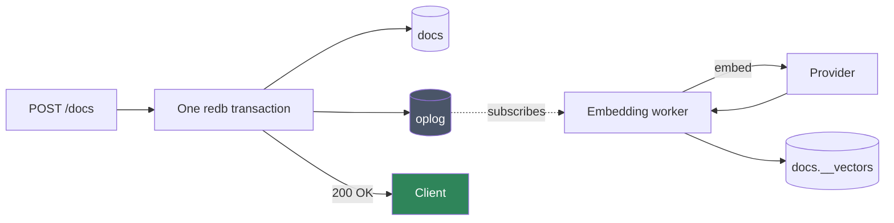
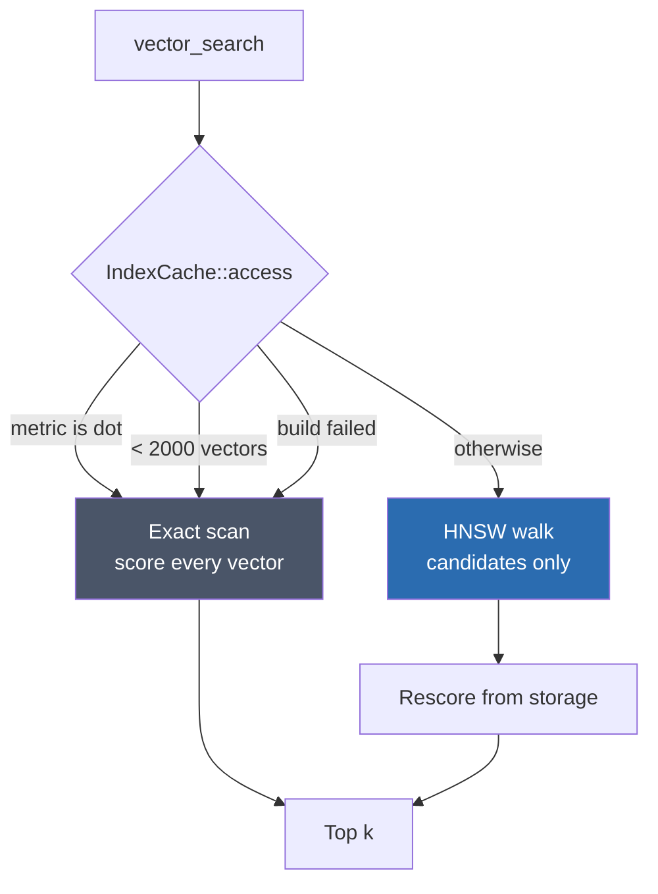

# Vectors and Auto-Embeddings

[← Documentation index](README.md)

Every collection can have embeddings maintained for it automatically. Enable it
once, and inserts, updates and deletes keep the vectors in step with no
pipeline, no scheduler, and nothing on the write path.

This document explains how that works, what it costs, and where it is
deliberately approximate.

---

## The idea

A vector-enabled collection gets a **shadow collection** — an ordinary
collection named `{coll}.__vectors`, stored the same way as any other, holding
one document per *chunk* of one source document.

Nothing special maintains it. A background worker subscribes to the oplog as an
ordinary change-stream consumer and reacts to what it sees:



Two properties fall out of that shape, and both matter:

**Writes never wait on a model.** The request returns as soon as the oplog entry
is durable. Embedding is *observed* work, not *inline* work. A slow or
unavailable provider delays search freshness; it cannot delay or fail a write.

**Backfill is not a special case.** The worker starts from its recorded oplog
position, or from the beginning of the log on first run. Enabling embedding on a
collection that already holds a million documents is the same code path as
embedding the next insert — the worker is simply behind.

This is the same reuse described in [Architecture](architecture.md): the oplog
was built for change streams, and the embedding pipeline is its second consumer.

---

## Enabling it

```http
POST /v1/db/{db}/coll/{coll}/vector
```

```json
{
  "fields": ["title", "body"],
  "provider": { "kind": "ollama",
                "model": "nomic-embed-text",
                "endpoint": "http://localhost:11434" },
  "dim": 768,
  "metric": "cosine",
  "chunk": { "max_chars": 2000, "overlap": 200 }
}
```

| Field | Meaning |
|---|---|
| `fields` | Which document paths to embed. Joined with a blank line, so a chunk boundary between two fields cannot glue unrelated sentences together |
| `provider` | Where vectors come from. A tagged object — `{"kind": "..."}` plus whatever that provider needs — because the remote ones carry an endpoint and a model name alongside the choice |
| `dim` | Vector width. Pinned here; changing it requires reconfiguring |
| `metric` | `cosine`, `euclidean`, or `dot` |
| `chunk` | How long documents are split |

`GET` returns the current configuration; `DELETE` disables embedding, with
`?drop_vectors=true` to discard the stored vectors as well as the config.

### Providers

| Provider | Needs | Notes |
|---|---|---|
| `byo` | nothing | **The default.** The client supplies vectors through [the ingest route](#supplying-your-own-vectors); the server never embeds |
| `openai` | an API key | Any OpenAI-compatible `/v1/embeddings` endpoint |
| `ollama` | a reachable Ollama | Local or remote |
| `custom_http` | an endpoint | Accepts `{"input": [...]}`, returns `{"embeddings": [[...]]}` |
| `local` | `--features local-embeddings` | In-process ONNX. **Not in the default build** — see below |

API keys are read from the environment by *variable name*. The name is stored in
collection metadata; the key itself never is, so a metadata dump cannot leak a
credential.

`local` is rejected at configuration time in a default build rather than
failing later on the first write — a misconfiguration should surface when you
make it, not when traffic arrives. The reason it is not the default at all is
recorded in [Deviations](deviations.md): its dependencies pull native ONNX
Runtime *and* OpenSSL, which would undo the pure-Rust property that motivated
choosing redb ([ADR-001](decisions.md)) and `rust_crypto` ([ADR-016](decisions.md)).

### Chunking

Long documents are split into overlapping windows, each embedded separately, so
a match can point at the passage that matched rather than the whole document.

Chunks overlap by `overlap` characters so a sentence spanning a boundary is
still wholly present in one of them.

The default is 2000 characters ≈ 512 tokens. **It counts characters, not
tokens** — a real token count depends on the model's tokenizer, which the
storage layer has no business knowing. Dense text can therefore overshoot the
model's window. Recorded in [Deviations](deviations.md).

---

## Supplying your own vectors

With `byo`, nothing populates the shadow collection unless you do. Embed
however you like, then store the result against the document it came from:

```bash
curl -XPUT localhost:7878/v1/db/shop/coll/orders/docs/42/vectors -H "$A" -d '[
  { "chunk": 0, "vector": [0.01, -0.22, …], "text": "first chunk of the document" },
  { "chunk": 1, "vector": [0.44,  0.10, …], "text": "second chunk" }
]'
```

```json
{ "stored": 2, "_id": "42" }
```

**The body is the complete set of chunks for that document.** Anything
previously stored under it and not named here is removed — the same replace-all
semantics the embedding worker uses, and the only ones that stop a shortened
document from leaving orphan chunks that still match text it no longer contains.

The server fills in the rest of each record: which document it belongs to, and
the document's current HLC. That second part is why staleness detection keeps
working for `byo` exactly as it does for a server-side provider — the version a
chunk was derived from is the document's own, not something a client could get
wrong.

| | |
|---|---|
| `GET` | Read back what is stored for one document |
| `PUT` | Replace the whole set |
| `DELETE` | Remove every chunk for that document |

Requires `write` on the collection — this is derived data about a document you
can already write, not an administrative act. The document must exist (there is
no HLC to attach otherwise, so a missing one is `404`), and every vector must
match the configured `dim` or the request is `400`.

---

## Staleness, and why re-embedding is idempotent

Each `VectorRecord` carries the **HLC of the source document** it was made from:

```rust
struct VectorRecord {
    source: DocId,     // the source document
    chunk: u32,        // which chunk
    source_hlc: Hlc,   // the version this was embedded from
    vector: Vec<f32>,
    text: String,
}
```

That one field does the work of a queue:

- **Staleness is a comparison, not a state machine.** If a document's current
  HLC exceeds its vectors' `source_hlc`, the vectors are stale. Nothing tracks
  pending work; the answer is derivable at any moment from what is stored.
- **Re-processing is free.** Replay the same oplog entry twice and the second
  pass sees vectors already at that HLC and does nothing. That is what makes the
  worker safe to restart, and safe to run behind an at-least-once log.

The worker records its oplog position **after** doing the work, never before.
Crashing mid-embed replays the entry; crashing after writing vectors but before
recording the position also replays it — and the HLC check makes that a no-op.
Recording the position first would silently skip documents instead.

A provider failure that could plausibly succeed on retry — a transport error, a
rate limit — retries the same entry after a delay rather than advancing past it.
A failure that will fail identically forever — a wrong dimension, a missing API
key — does not, because retrying it would stall every document queued behind it.

---

## Search

```http
POST /v1/db/{db}/coll/{coll}/vector_search
POST /v1/db/{db}/coll/{coll}/hybrid_search
```

```json
{
  "query": "how do I rotate a token",
  "k": 10,
  "filter": { "status": "published" },
  "per_document": 1
}
```

Send `query` text to have the server embed it, or `vector` to supply a
pre-computed one. A `byo` collection must send `vector` — the server has no
provider to embed the query with, and says so rather than returning an empty
result that looks like "no matches".

A collection with **no vectors stored at all** is refused with `409 no_vectors`
rather than returning an empty result. Those two are indistinguishable to a
caller, and the difference is between refining a query forever and learning that
ingestion never happened.

`filter` is an ordinary query-language document. It runs first, and its matching
ids restrict the search — which is what lets semantic search compose with
structured querying instead of being a separate world.

`per_document` caps how many chunks of one document may occupy result slots.
Without it, a single long document can fill every slot with its own chunks.

### Hybrid search

`hybrid_search` runs a dense (vector) and a lexical (keyword) search, then fuses
them with **Reciprocal Rank Fusion**:

```
score(d) = Σ  1 / (60 + rank_i(d))
```

RRF ranks by *position*, not raw score, which is what makes it work across two
signals whose scores are not comparable — a cosine similarity and a term-overlap
count have no shared scale.

Each half is retrieved 4× wider than `k` before fusing, so a document ranked
moderately by both can beat one ranked first by only one.

The lexical half is **term overlap, not BM25**. Since RRF only consumes the
ordering, the absolute scores need not be principled — but a real BM25 would
rank better on its own. Recorded in [Deviations](deviations.md).

### There is no minimum score

k-NN returns the `k` nearest vectors, and "nearest" does not mean "similar". A
query against wholly unrelated content still returns `k` results, with scores
near zero. **Callers must threshold themselves.**

---

## The two search paths

Search is either an exhaustive scan or an approximate graph walk. Callers do not
choose, and cannot tell which ran except by speed.



The exact path scores every stored vector — O(n), no recall loss, no index to
keep consistent. It is both the path small collections take and the **oracle**
the approximate path is tested against.

The approximate path walks an HNSW graph. Crucially, the graph only supplies
*candidates*: every candidate is then re-scored from the vector currently in
storage, and a candidate whose record no longer exists is skipped.

### When each is used

`kimmy_vector::IndexCache` owns that decision — one place, not scattered through
the search path. It is held in the server's shared state, so one graph serves
every request rather than being rebuilt per query.

| Rule | Threshold | Why |
|---|---|---|
| Minimum size | 2000 vectors | Below that, scanning beats building *and* walking a graph. Deliberately conservative, not a measured optimum |
| Staleness detection | a per-collection generation counter | Counting vectors would be O(n) per query, and a count cannot see a delete-then-add that leaves the total unchanged. A counter is exact and free |
| Rebuild interval | 30 s | Rebuilding per write would rebuild continuously under load, and each rebuild is O(n log n) |
| Build failure | fall back to exact | An optimisation that cannot be built must not fail a query |

The "too small" verdict is cached under the same rule as the graph. The count
behind it is O(n), so recomputing it per query would make the check that exists
to *avoid* a full scan perform one.

### Why a stale vector index is safe when a stale secondary index is not

A stale secondary index returns **wrong documents** — it is the source of truth
for what matched. A stale vector index does not, because of the two properties
above:

- **Scores are recomputed** from the current stored vector, never taken from the
  graph's distances. An updated document scores by its new vector.
- **Missing records are skipped.** A deleted document cannot surface, even
  though its node is still in the graph.

So the only effect of staleness is that a document written in the last 30
seconds may not be found yet. That is **bounded recall loss on new data, never
incorrect data** — which is what makes a rebuild interval an acceptable trade
rather than a silent correctness hole.

This asymmetry is the whole justification for the caching policy. If it did not
hold, the index would have to be maintained transactionally like a secondary
index, on the write path.

### The `dot` metric has no index

`anndists::DistDot` computes `1 - dot` and *asserts the result is
non-negative*, which only holds for unit-length vectors. A real embedding would
abort the process. Dot-product collections therefore always take the exact path.

Normalizing vectors on the way in would make it work, but would silently change
what a dot-product search means — so it is refused rather than redefined.

---

## What is not built

**No on-disk graph persistence.** The cache is in-memory only. After a restart,
the first search of a large collection pays a full O(n log n) build, and until
then queries take the exact path — slower, never wrong. The plan called for
snapshotting the graph and replaying newer vector-oplog entries on startup.

**No `$vectorSearch` aggregation stage.** Search is its own endpoint; it does
not yet compose inside a pipeline.

**No explicit reindex operation.** Changing the model or dimension requires
disabling with `?drop_vectors=true` and re-enabling, which backfills from the
oplog.

All tracked in [Deviations](deviations.md).

---

## How this is verified

The exact path is the oracle for everything approximate:

| Invariant | How |
|---|---|
| The graph finds what a scan finds | Recall measured, not assumed: ≥ 90% at k=10, and the nearest neighbour agrees with an exact scan exactly |
| Dispatch does not change results | `the_approximate_path_agrees_with_the_exact_one` asserts both paths return the same nearest neighbour with a **byte-identical score** |
| Re-embedding is idempotent | Replaying an oplog entry after vectors exist at that HLC is a no-op |
| A crash does not lose embeddings | The recorded position always trails completed work |
| Retry does not stall the queue | Retryable and terminal provider failures are distinguished and tested apart |

See [Testing](testing.md) for the philosophy behind measuring rather than
assuming.

---

## Related

- [Architecture](architecture.md) — why the oplog makes this need no scheduler
- [Oplog](oplog.md) — the log and its three consumers
- [Storage](storage.md) — how shadow collections are stored
- [HTTP API](http-api.md) — endpoint reference
- [Deviations](deviations.md) — every simplification named above, in one place
