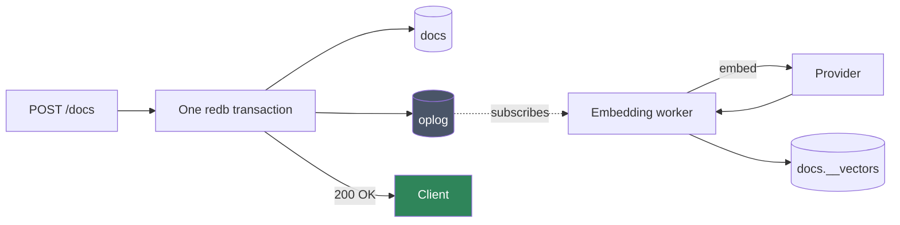

# Vectors and Auto-Embeddings

[← Documentation index](README.md)

Every collection can have embeddings maintained for it automatically. Enable it
once, and inserts, updates and deletes keep the vectors in step with no
pipeline, no scheduler, and nothing on the write path.

This document explains how that works, what it costs, and where it is
deliberately approximate.

---

## The idea

A vector-enabled collection gets a **shadow collection** — an ordinary
collection named `{coll}.__vectors`, stored the same way as any other, holding
one document per *chunk* of one source document.

Nothing special maintains it. A background worker subscribes to the oplog as an
ordinary change-stream consumer and reacts to what it sees:



Two properties fall out of that shape, and both matter:

**Writes never wait on a model.** The request returns as soon as the oplog entry
is durable. Embedding is *observed* work, not *inline* work. A slow or
unavailable provider delays search freshness; it cannot delay or fail a write.

**Backfill is not a special case.** The worker starts from its recorded oplog
position, or from the beginning of the log on first run. Enabling embedding on a
collection that already holds a million documents is the same code path as
embedding the next insert — the worker is simply behind.

This is the same reuse described in [Architecture](architecture.md): the oplog
was built for change streams, and the embedding pipeline is its second consumer.

---

## Enabling it

```http
POST /v1/db/{db}/coll/{coll}/vector
```

```json
{
  "fields": ["title", "body"],
  "provider": { "kind": "ollama",
                "model": "nomic-embed-text",
                "endpoint": "http://localhost:11434" },
  "dim": 768,
  "metric": "cosine",
  "chunk": { "max_chars": 2000, "overlap": 200 }
}
```

> An endpoint on `localhost` or a LAN address is refused unless the node lists
> the host in `vector.provider.allowed_hosts` — see
> [The provider policy](#the-provider-policy). The example above needs
> `allowed_hosts = ["localhost"]`.

| Field | Meaning |
|---|---|
| `fields` | Which document paths to embed. Joined with a blank line, so a chunk boundary between two fields cannot glue unrelated sentences together |
| `provider` | Where vectors come from. A tagged object — `{"kind": "..."}` plus whatever that provider needs — because the remote ones carry an endpoint and a model name alongside the choice |
| `dim` | Vector width. Pinned here; changing it requires reconfiguring |
| `metric` | `cosine`, `euclidean`, or `dot` |
| `chunk` | How long documents are split |
| `document_prefix` | Text put in front of every chunk before the provider sees it — the task marker many models are trained on (`passage: ` for E5 and BGE, `title: none \| text: ` for EmbeddingGemma, an instruction line for Nemotron). Never stored, never returned in a hit; changing it reindexes |
| `query_prefix` | The same for `query` text on a search (`query: `, `task: search result \| query: `). Not applied to a caller-supplied `vector` |

`GET` returns the current configuration; `DELETE` disables embedding, with
`?drop_vectors=true` to discard the stored vectors as well as the config.

### Providers

| Provider | Needs | Notes |
|---|---|---|
| `byo` | nothing | **The default.** The client supplies vectors through [the ingest route](#supplying-your-own-vectors); the server never embeds. "Nothing" is literal — `{"kind":"byo"}` takes no other field |
| `open_ai` | an API key | Any OpenAI-compatible `/v1/embeddings` endpoint. **Voyage is this** — `{"kind":"open_ai","model":"voyage-3","endpoint":"https://api.voyageai.com","api_key_env":"VOYAGE_API_KEY"}` |
| `ollama` | a reachable Ollama | Local or remote |
| `cohere` | an API key | Cohere `/v2/embed`. Sends `input_type: search_document`; accepts both v1 and v2 response shapes ([ADR-047](decisions.md)) |
| `gemini` | an API key | Google `:batchEmbedContents`. Key goes in the `x-goog-api-key` header ([ADR-047](decisions.md)) |
| `custom_http` | an endpoint | Accepts `{"input": [...]}`, returns `{"embeddings": [[...]]}`. The escape hatch for anything the named dialects miss |
| `local` | `--features local-embeddings` | In-process ONNX. **Not in the default build** — see below |
| `profile` | a `[vector.providers.<name>]` in the node's configuration | `{"kind":"profile","name":"corp"}`. The endpoint, model and key variable are the operator's; the collection carries the name and nothing else. The only remote kind accepted when the node sets `endpoints_locked` — see [The provider policy](#the-provider-policy) |

A `provider` object is closed, like the rest of the request body
([ADR-121](decisions.md)): a field the named `kind` does not define is refused
`422` and named. That holds for `byo` too, which defines none —
`{"kind":"byo","model":"text-embedding-3-small"}` is refused rather than
configured as a collection that embeds nothing, which is what it did before
([ADR-134](decisions.md)).

For `open_ai`, `endpoint` is a base URL and `/v1/embeddings` is appended —
unless the setting already names the embeddings route, in which case it is
used verbatim. That is how providers that mount the compatible API under a
prefix are reached: `"endpoint": "https://api.deepinfra.com/v1/openai/embeddings"`
or Azure's `…/openai/deployments/<name>/embeddings?api-version=…`.

`open_ai` also takes an optional `dimensions`, sent as the request field of
that name for Matryoshka-trained models (OpenAI `text-embedding-3-*`,
Nemotron-3-Embed, Qwen3-Embedding, EmbeddingGemma, Voyage): the provider
returns that width instead of the model's native one, and `dim` must equal
it. Left out, the model's native width is what comes back and `dim` must
match that. A provider that ignores the field fails the dimension check on
the first embed rather than storing the wrong shape.

Default key variables: `OPENAI_API_KEY`, `COHERE_API_KEY`, `GEMINI_API_KEY`;
override with `api_key_env`. The dialects were audited against each provider's
documented API shape and pinned with fixture tests ([ADR-047](decisions.md)),
which is where a shape drift shows up.

> **Cohere embeds asymmetrically.** The server always uses
> `input_type: search_document`, because it only ever embeds documents. If you
> embed a *query* to search with — client-side, since queries arrive here as
> raw vectors — use `search_query`, or recall suffers.

API keys are read from the environment by *variable name*. The name is stored in
collection metadata; the key itself never is, so a metadata dump cannot leak a
credential. Which names a provider may be given, and where it may be sent, is
the node's policy rather than the collection's — next.

### The provider policy

The provider sends the named variable's value to the named endpoint, and both
are chosen by whoever holds `ddl` on the collection. So the node decides what
it will accept ([ADR-115](decisions.md); the reasoning is in
[Security](security.md#embedding-providers)):

| Setting | Default | What it does |
|---|---|---|
| `vector.provider.allowed_key_env` | `["OPENAI_API_KEY", "COHERE_API_KEY", "GEMINI_API_KEY", "DEEPINFRA_API_KEY", "KIMMY_PROVIDER_*"]` | The variables a provider may be handed: exact names, or a prefix with one trailing `*`. An `api_key_env` outside the list is refused `400` by name. **Every `KIMMY_*` variable other than `KIMMY_PROVIDER_*` is refused whatever this says**, and listing one here stops the node at startup |
| `vector.provider.allowed_hosts` | `[]` | Hosts a provider may be sent to beyond the public internet, exactly as `webhooks.allowed_hosts`: loopback, link-local and private ranges are refused unless the host is named here, every resolved address is checked, and the client checks again at connect time. **An Ollama or llama.cpp on `localhost` or a LAN address needs its host listed** |
| `vector.provider.endpoints_locked` | `false` | Accept only `profile`, `byo` and `local` when a collection is configured. The places this node sends text are then the profiles below and no others |
| `[vector.providers.<name>]` | none | A provider defined server-side, with the same fields a collection's `provider` object takes (`kind`, `model`, `endpoint`, `api_key_env`, `dimensions`) as TOML keys. Held to the two rules above at startup and by `kimmyd check-config`, and closed the same way a request body is: a key the named `kind` does not define — including anything beside `kind = "byo"` — stops the node there. A collection uses it as `{"kind":"profile","name":"<name>"}` |

Keys for a provider are simplest under the `KIMMY_PROVIDER_` prefix — `KIMMY_PROVIDER_VOYAGE`, say — which the default allows without a line of configuration. A dialect's default endpoint (`api.openai.com`, `api.cohere.com`, `generativelanguage.googleapis.com`) is public and passes.

The policy is asked twice: when the configuration is accepted, and again when
the provider is built — by the worker for documents and by a search that
embeds a `query` — because a configuration also arrives by replication from
another member. A stored configuration this node refuses is a permanent
failure for that collection until it is reconfigured, logged once with the
variable's name or the host; a search that needs it answers `500 misconfigured`.
Every configure and disable writes an audit record with the provider kind, the
endpoint host or profile name, and the key variable's name.

`local` is rejected at configuration time in a default build rather than
failing later on the first write — a misconfiguration should surface when you
make it, not when traffic arrives. The reason it is not the default at all is
recorded in [Deviations](deviations.md): its dependencies pull native ONNX
Runtime *and* OpenSSL — hundreds of megabytes and a separate runtime. Note the
default build is **not** free of a native toolchain and has not been since M2;
that claim was corrected in [ADR-016](decisions.md). ONNX is still gated because
it is a different order of cost, not because the build is otherwise pristine.

### Chunking

Long documents are split into overlapping windows, each embedded separately, so
a match can point at the passage that matched rather than the whole document.

Chunks overlap by `overlap` characters so a sentence spanning a boundary is
still wholly present in one of them.

The default is 2000 characters ≈ 512 tokens. **It counts characters, not
tokens** — a real token count depends on the model's tokenizer, which the
storage layer has no business knowing — and that proxy assumes prose at about
four characters per token. Dense text runs at one to two: code, JSON, CJK.
Seen live: a chunk cut at 2000 characters came to 1073 tokens and was refused
by a provider with a 1024-token input limit, on every scan, with one `WARN`
per scan as the only trace.

`max_tokens` closes that gap. When set, a chunk is also cut once its
*estimated* token count reaches it, estimated as one token per two bytes of
UTF-8 — conservative for every common script (prose ≈ 4 bytes/token, code ≈
2.5, CJK ≈ 3), so the estimate errs toward shorter chunks. Set it to the
provider's per-input limit:

```json
{ "chunk": { "max_chars": 2000, "overlap": 200, "max_tokens": 1024 } }
```

Overlap stays in characters. Existing configurations without the field keep
the character rule alone, exactly as before. A document that still cannot be
embedded is skipped and named — database, collection and `_id` are on the
`WARN`, and `kimmy_embed_failures_total` counts it (with
`kimmy_embed_provider_errors_total{kind}` naming what failed to connect,
time out or reset) — rather than stalling the
rest of the collection.

### Batching

The worker does not call the provider once per document. It gathers the
chunks of consecutive documents from the same collection into one call,
bounded three ways ([ADR-095](decisions.md)): at most `vector.batch.max_chunks`
chunks (32), at most `vector.batch.max_tokens` estimated tokens (32 768, by
the same estimate `max_tokens` above cuts on), and at most
`vector.batch.max_wait_ms` (100 ms) of waiting for company once the stream is
idle. On a backlog the next document is already there, so a batch fills
without waiting; on a quiet collection one document waits out the timer and
goes alone. A backfill has no timer — the set is known — and sends each batch
as it fills.

Why it matters is arithmetic. Measured against a llama.cpp CPU server with
~43-character inputs, 32 calls of one input took 394 ms and one call of 32
inputs took 18 ms: a round trip, tokenisation and the server's own
scheduling are paid per *call*, and a one-chunk document was a call of one.
That put a floor of one round trip under every document, and a stream of
writes arriving slightly faster than the floor allows grows its backlog
without bound — Little's law, and what a live ingest showed. Batching removes
the floor.

What batching does not change: the storage write is still per document.
`put_vectors` replaces one document's chunks, staleness is one document's
HLC, and the oplog position is recorded once the batch has landed — or, with
no batch to land, after at most a second (ADR-125) — so a crash replays
rather than skips exactly as before. A document's chunks always share
one call, so a document larger than the token bound goes alone rather than
being split. Only one collection's documents share a call, because the
collection names the provider, the model and the prefix. A batch that fails
*permanently* — a `400` for one input the model cannot take, which the
provider does not name — is taken apart and each document sent alone, so the
one at fault is skipped and named and the rest land; a *retryable* failure
retries the whole batch, as one document retried before.

`kimmy_embed_documents_total` and `kimmy_embed_chunks_total` still count
documents and chunks. `kimmy_embed_provider_requests_total` counts calls, so
it now climbs more slowly than chunks, and chunks over requests is the batch
size the worker is achieving. The settings are the node's (`[vector.batch]`
in `kimmy.toml`, see [Operations](operations.md#settings)), not the
collection's, because they describe the round trip this node makes. One
caveat: the `ollama` provider sends one request per input, because its
embeddings endpoint takes one, so batching saves it nothing on the wire;
every other provider takes the batch whole.

---

## Supplying your own vectors

With `byo`, nothing populates the shadow collection unless you do. Embed
however you like, then store the result against the document it came from:

```bash
curl -XPUT localhost:7878/v1/db/shop/coll/orders/docs/42/vectors -H "$A" -d '[
  { "chunk": 0, "vector": [0.01, -0.22, …], "text": "first chunk of the document" },
  { "chunk": 1, "vector": [0.44,  0.10, …], "text": "second chunk" }
]'
```

```json
{ "stored": 2, "_id": "42" }
```

**The body is the complete set of chunks for that document.** Anything
previously stored under it and not named here is removed — the same replace-all
semantics the embedding worker uses, and the only ones that stop a shortened
document from leaving orphan chunks that still match text it no longer contains.

The server fills in the rest of each record: which document it belongs to, and
the document's current HLC. That second part is why staleness detection keeps
working for `byo` exactly as it does for a server-side provider — the version a
chunk was derived from is the document's own, not something a client could get
wrong.

| | |
|---|---|
| `GET` | Read back what is stored for one document |
| `PUT` | Replace the whole set |
| `DELETE` | Remove every chunk for that document |

Requires `write` on the collection — this is derived data about a document you
can already write, not an administrative act. The document must exist (there is
no HLC to attach otherwise, so a missing one is `404`), and every vector must
match the configured `dim` or the request is `400`.

---

## Staleness, and why re-embedding is idempotent

Each `VectorRecord` carries the **HLC of the source document** it was made from:

```rust
struct VectorRecord {
    source: DocId,     // the source document
    chunk: u32,        // which chunk
    source_hlc: Hlc,   // the version this was embedded from
    vector: Vec<f32>,
    text: String,
}
```

That one field does the work of a queue:

- **Staleness is a comparison, not a state machine.** If a document's current
  HLC exceeds its vectors' `source_hlc`, the vectors are stale. Nothing tracks
  pending work; the answer is derivable at any moment from what is stored.
- **Re-processing is free.** Replay the same oplog entry twice and the second
  pass sees vectors already at that HLC and does nothing. That is what makes the
  worker safe to restart, and safe to run behind an at-least-once log.

The worker records its oplog position **after** doing the work, never before.
Crashing mid-embed replays the entry; crashing after writing vectors but before
recording the position also replays it — and the HLC check makes that a no-op.
Recording the position first would silently skip documents instead.

It also records it **by deadline, not per entry** (ADR-125). The position is
held alongside the batches and written with one — or, when there is nothing
to embed, after at most one second. Every entry moves the position, including
the ones the worker has nothing to do with: a collection with no vector
configuration, a document another member owns, a delete. Written per entry,
each of those was a commit and an fsync of its own on every member — a
1,000-document bulk on a three-member cluster running 0.20.0 converged in
3–5 s and then had every member committing at ~18/s for about 75 s. Held, a
burst of any size is one position write. What holding costs is that a
restart re-processes up to a second of the stream, which the idempotence
above makes a handful of reads.

A provider failure that could plausibly succeed on retry — a transport error, a
rate limit — retries the same entry after a delay rather than advancing past it.
A failure that will fail identically forever — a wrong dimension, a missing API
key — does not, because retrying it would stall every document queued behind it.

---

## Throughput, and why more nodes do not embed one collection faster

A collection is embedded by exactly one node at a time: the member its
`"{db}/{collection}"` key assigns by rendezvous hash, the same function that
assigns webhook delivery and TTL expiry ([ADR-077](decisions.md)). Every
member sees every write, but only the owner calls the provider for it; the
others hold the write against the owner leaving and otherwise let replication
bring them the vectors. That is what keeps a three-member cluster's provider
bill at one times the corpus instead of three.

The consequence for sizing is structural. **Adding members does not raise the
rate at which one collection is embedded.** Its owner's worker is the whole
pipeline — one batch in flight at a time, against one provider — and the
provider is the bound. What more members buy is more *collections* embedding
at once, because ownership spreads them across the member set. A deployment
whose load is one large collection should size the provider for that
collection's arrival rate and, if the provider is local, give it the cores;
a deployment with many collections can spread them by adding members, or pin
embedding to designated members with `[vector] worker_enabled = false`
everywhere else.

---

## Search

```http
POST /v1/db/{db}/coll/{coll}/vector_search
POST /v1/db/{db}/coll/{coll}/hybrid_search
```

```json
{
  "query": "how do I rotate a token",
  "k": 10,
  "filter": { "status": "published" },
  "per_document": 1
}
```

Send `query` text to have the server embed it, or `vector` to supply a
pre-computed one. A `byo` collection must send `vector` — the server has no
provider to embed the query with, and says so rather than returning an empty
result that looks like "no matches".

`k` defaults to 10 and is clamped to the range 1 to 1,000 rather than refused:
`0` is read as `1`, and a larger value succeeds and answers with 1,000 hits at
most. A search has no "window of nothing" the way `find`'s `limit: 0` does.

Two refusals look alike from a distance and answer different questions. A
collection with **no vector configuration** — `POST …/vector` was never called
on it — is refused **`400 bad_request`**, and the message names that route:
no search can succeed there, however many documents it holds, until embedding
is enabled. A collection that **is configured but has no vectors stored** —
ingestion never ran, or has not caught up — is refused **`409 no_vectors`**
rather than answered with an empty result: an empty result and "nothing
matched" are indistinguishable to a caller, and the difference is between
refining a query forever and learning that ingestion never happened. The first
is fixed by configuring the collection; the second by letting the worker catch
up or, on a `byo` collection, by supplying vectors.

**A third, `500 misconfigured`, sits behind the second and is easy to mistake
for it.** The provider is built only after those two checks pass, so a node
that cannot build it — the environment variable named by `api_key_env` is
unset here, the stored configuration is one this node's policy refuses, or it
names a profile this node does not define — still answers `409 no_vectors`
while the collection is empty, and the same missing key is why it is empty:
the worker needs the provider too. `500 misconfigured` appears once vectors
exist and a search asks the server to embed `query` text — after a client
`PUT` them, after they replicate in from a member that could embed, or after
a key that used to be set goes away. So a `409` on a collection that never
fills is a provider question, not an ingestion one, which is what its message
means by *check the server log for embedding provider errors*: the refusal to
build is logged there with the variable's name or the host. A request that
carries its own `vector` never builds a provider and never sees this at all.

`filter` is an ordinary query-language document. It runs first, and its matching
ids restrict the search — which is what lets semantic search compose with
structured querying instead of being a separate world.

It is planned the way a `find` is: a filter that pins `_id` is a primary-key
read, a filter on an indexed field uses the index, anything else scans the
collection — every candidate rechecked against the full filter either way —
and only the ids are kept, a page at a time. An index on a field that searches
filter by speeds the search up exactly as it speeds up `find`, and `find` with
`explain: true` on the same filter shows which strategy the search will get
([Indexes](indexes.md#did-it-get-used)).

What happens next depends on how many documents the filter admitted:

- **At most 1,000**: the search reads those documents' chunks from the shadow
  collection by key — a document's chunks are one contiguous run under its id —
  and scores them exactly. The cost is the size of the admitted set, not the
  collection, and the answer is exact whichever path the collection would
  otherwise take.
- **More than 1,000**: the search runs as it would without a filter, exact
  scan or graph walk, and discards hits outside the set. The graph is asked for
  eight times the candidates when a filter is present so that discarding still
  leaves `k`; an unselective filter discards little, which is what makes this
  the right direction for it.

The boundary is a count rather than a fraction of the collection because the
first direction's cost does not depend on the collection: a thousand
documents' chunks read by key is the same work over a million documents as
over two thousand. Below it the join is bounded and exact; above it the set is
large enough that a graph walk finds mostly admitted candidates. A filter that
admits nothing returns nothing without touching a vector. The rule and its
alternatives are [ADR-102](decisions.md).

`per_document` caps how many chunks of one document may occupy result slots.
Without it, a single long document can fill every slot with its own chunks.

### Hybrid search

`hybrid_search` runs a dense (vector) and a lexical (keyword) search, then fuses
them with **Reciprocal Rank Fusion**:

```
score(d) = Σ  1 / (60 + rank_i(d))
```

RRF ranks by *position*, not raw score, which is what makes it work across two
signals whose scores are not comparable — a cosine similarity and a term-overlap
count have no shared scale.

Each half is retrieved 4× wider than `k` before fusing, so a document ranked
moderately by both can beat one ranked first by only one.

The lexical half is **term overlap, not BM25**. Since RRF only consumes the
ordering, the absolute scores need not be principled — but a real BM25 would
rank better on its own. Recorded in [Deviations](deviations.md).

#### Tuning the fusion

Two optional request fields adjust how the halves are combined. Both default
to exactly what the paragraphs above describe, so a request that omits them
ranks as it always has.

```json
{
  "query": "how do I rotate a token",
  "k": 10,
  "weights": { "dense": 0.7, "lexical": 0.3 },
  "min_overlap": 2
}
```

`weights` scales each half's contribution before the sum:

```
score(d) = w_dense / (60 + rank_dense(d))  +  w_lexical / (60 + rank_lexical(d))
```

Both weights must be `>= 0` and they must not both be zero; anything else is a
`400`. Only their ratio matters — `0.7/0.3` and `7/3` rank identically — since
the scores are compared with each other and never against a threshold. The
default is `{ "dense": 1.0, "lexical": 1.0 }`, which is plain RRF. A weight of
`0` switches a half off entirely, which is a convenient way to see what the
other one is contributing.

`min_overlap` is the number of **distinct query terms** a chunk must contain
before it counts as lexical evidence at all. A chunk sharing fewer terms than
that with the query is dropped from the lexical ranking before fusion; if the
query itself has fewer distinct terms than `min_overlap`, the query's count is
used instead, so a one-word query is never gated to nothing. Must be `>= 1`
(a `400` otherwise); the default is `1`, which admits any chunk sharing a
single term, as before.

The gate removes *evidence*, not documents: a document dropped from the lexical
half that the dense half ranked still receives its full dense contribution and
still appears in the result. Only the lexical term of its score is gone.

**Why the defaults are what they are.** Measured on a corpus of short
conversational documents, across eight embedding models and forty graded
queries, `hybrid_search` recalled roughly a third less than `vector_search` on
the same queries — for every model, with the gap narrowing as the dense model
got stronger. The mechanism is the lexical half above. On documents of a
sentence or two, nearly every candidate in the 4×k lexical window shares one
or two common words with the query, so ordering by term overlap is close to
random among them; and RRF gives that near-random rank the same authority as
the dense rank. `min_overlap` is the practical fix for such a corpus: raising
it to `2` keeps only chunks that agree with the query on more than one word,
which is what an exact-term match actually looks like, and lets the dense half
decide the rest. `weights` is the more general knob for a corpus where the
lexical half is informative but weaker. The defaults stay equal-weight RRF so
that nothing about an existing deployment's ranking moves until the change has
been measured there — see [ADR-094](decisions.md).

### There is no minimum score

k-NN returns the `k` nearest vectors, and "nearest" does not mean "similar". A
query against wholly unrelated content still returns `k` results, with scores
near zero. **Callers must threshold themselves.**

---

## The two search paths

Search is either an exhaustive scan or an approximate graph walk. Callers do not
choose, and cannot tell which ran except by speed.


The exact path scores every stored vector — O(n), no recall loss, no index to
keep consistent. It is both the path small collections take and the **oracle**
the approximate path is tested against. It holds only the best `k` while it
scans: a bounded set with the per-document cap applied as chunks arrive, so
its memory is the size of the answer rather than of the collection. The
lexical half of hybrid search is ranked the same way. Ties on score are broken
by the chunk's key, so equal scores come back in a stable order.

The approximate path walks an HNSW graph. Crucially, the graph only supplies
*candidates*: every candidate is then re-scored from the vector currently in
storage, and a candidate whose record no longer exists is skipped.

### When each is used

`kimmy_vector::IndexCache` owns that decision — one place, not scattered through
the search path. It is held in the server's shared state, so one graph serves
every request rather than being rebuilt per query.

| Rule | Threshold | Why |
|---|---|---|
| Minimum size | 500 vectors | **Measured** — see [Benchmarks](benchmarks.md). The graph is faster at every size tested, so this is not a crossover; it is the point where one build repays itself in about a dozen queries |
| Staleness detection | a per-collection generation counter | Counting vectors would be O(n) per query, and a count cannot see a delete-then-add that leaves the total unchanged. A counter is exact and free |
| Rebuild interval | 30 s | Rebuilding per write would rebuild continuously under load, and each rebuild is O(n log n) |
| Build failure | fall back to exact | An optimisation that cannot be built must not fail a query |
| Memory budget | 512 MiB across collections | `vector.index_cache.max_bytes`. Least recently searched graphs are evicted first when a new one would exceed it; a graph larger than the whole budget is held anyway, once, with a warning |

The "too small" verdict is cached under the same rule as the graph. The count
behind it is O(n), so recomputing it per query would make the check that exists
to *avoid* a full scan perform one.

### What a build costs, and where it runs

A build reads only each chunk's key and vector — never its text — and lets
each vector go as the graph copies it in, so its peak is one copy of the
vectors plus the graph's own bookkeeping, and a sample of 128 vectors kept
back for the reachability probe. Earlier it materialised every record whole
and held the lot until the probe had run, which made a rebuild's peak the
graph plus the entire shadow collection, every staleness window under writes.

It runs **off the cache lock**. The lock every collection's entry lives in is
taken to look and to install, and the build itself — 4.3 s at 4,000 vectors
of 384 dimensions, minutes at tens of thousands ([Benchmarks](benchmarks.md))
— runs under a per-collection lock, on a thread the async runtime has been
told about, as a storage commit's fsync does. So a rebuild delays searches on
that one collection, and only those with nothing older to serve: a second
search arriving mid-build takes the graph that already exists, under the
staleness rule above, or, when there is none, waits for that one build rather
than starting a duplicate. Before this the build held the lock, and a rebuild
of one collection was a stall for vector and hybrid search on every collection
the node serves.

`hnsw_rs` can insert in parallel, and it was measured — 3–4× faster on a
ten-core host, saturating at four threads, with recall and reachability
unchanged — and not adopted: four threads is every core of a small host, and
the reachability thresholds were sized over sequential builds. The numbers are
in [Benchmarks](benchmarks.md); the reasoning is beside the loop in `index.rs`.

### What a resident graph costs, and the budget it lives under

A graph costs, approximately,

```text
bytes ≈ chunks × (dim × 4 + 5,000) + Σ (key length + 24)
```

— the vectors the graph copies in, about 5 KB of `hnsw_rs` bookkeeping per
node (neighbour lists and per-layer tables; **measured** under a counting
allocator at 64 and 384 dimensions, and the same at both — it does not vary
with width), and the key table that names each node. That is **6.5 KB per
chunk at 384 dimensions and 11 KB at 1,536** — roughly twice what the vector
alone suggests, which is why a budget was needed at all.

`vector.index_cache.max_bytes` (default 512 MiB; `0` lifts the bound) bounds
the total across collections. When installing a graph would exceed it, the
least recently *searched* graphs are evicted first; a collection's rebuild is
charged its new size, not both. A single graph larger than the whole budget
is still installed, once every other graph has gone, and warned about once —
**a search is never refused over a memory policy**, and refusing would only
turn that collection's searches into exact scans. An evicted collection's next
search comes back through its snapshot when there is one, and rebuilds
otherwise. `kimmy_vector_index_cache_bytes` reports the resident total by the
same estimate ([ADR-103](decisions.md)).

### Why a stale vector index is safe when a stale secondary index is not

A stale secondary index returns **wrong documents** — it is the source of truth
for what matched. A stale vector index does not, because of the two properties
above:

- **Scores are recomputed** from the current stored vector, never taken from the
  graph's distances. An updated document scores by its new vector.
- **Missing records are skipped.** A chunk whose record is gone is dropped from
  the candidates, even though its node is still in the graph.
- **A deleted document cannot surface.** The chunks themselves outlive the
  document: a delete commits, and the embedding worker removes the chunks when
  it reaches that entry in the stream — later, or much later if the worker is
  behind. So every hit is checked against the source collection after ranking,
  and one whose document no longer exists is dropped. A result can therefore be
  shorter than `k` by the number of deletions the worker has not caught up with
  ([ADR-091](decisions.md)).

So the only effect of staleness is that a document written in the last 30
seconds may not be found yet. That is **bounded recall loss on new data, never
incorrect data** — which is what makes a rebuild interval an acceptable trade
rather than a silent correctness hole.

This asymmetry is the whole justification for the caching policy. If it did not
hold, the index would have to be maintained transactionally like a secondary
index, on the write path.

### The `dot` metric has no index

`anndists::DistDot` computes `1 - dot` and *asserts the result is
non-negative*, which only holds for unit-length vectors. A real embedding would
abort the process. Dot-product collections therefore always take the exact path.

Normalizing vectors on the way in would make it work, but would silently change
what a dot-product search means — so it is refused rather than redefined.

---

## What is not built

**No `$vectorSearch` aggregation stage.** Search is its own endpoint; it does
not yet compose inside a pipeline.

Tracked in [Deviations](deviations.md). Two former entries here are built:
graphs **persist across restarts** (M8 — loaded before any rebuild is paid,
validated by vector count), and **reindexing is just `POST /vector` again** —
every configuration change triggers a backfill that scans the collection and
re-embeds what the new configuration demands. Changing the dimension in place
is legal for server-embedded collections (old-width vectors are invisible to
search while the backfill replaces them) and refused for `byo`, whose vectors
the server cannot regenerate — drop those first.

---

## How this is verified

The exact path is the oracle for everything approximate:

| Invariant | How |
|---|---|
| The graph finds what a scan finds | Recall measured, not assumed: ≥ 90% at k=10, and the nearest neighbour agrees with an exact scan exactly |
| Dispatch does not change results | `the_approximate_path_agrees_with_the_exact_one` asserts both paths return the same nearest neighbour with a **byte-identical score** |
| A rebuild stalls no other collection | A build of one collection is parked and a search on another is asserted served meanwhile; two searches on an unbuilt collection produce exactly one build; a search arriving mid-rebuild is served the previous graph |
| The budget evicts least recently searched first, and never refuses | Three graphs under a budget for two: the untouched one goes, and comes back rebuilt on its next search; a graph larger than the whole budget still loads; a rebuild is charged once; `0` evicts nothing |
| Re-embedding is idempotent | Replaying an oplog entry after vectors exist at that HLC is a no-op |
| A crash does not lose embeddings | The recorded position always trails completed work |
| Retry does not stall the queue | Retryable and terminal provider failures are distinguished and tested apart |
| Batching changes the calls, not the writes | 100 one-chunk documents backfill in at most four provider calls and write 100 documents; a poisoned document in a batch of five is skipped alone while four land; at every observation of a streamed backlog, the recorded position has never passed an entry whose vectors are not on disk |

See [Testing](testing.md) for the philosophy behind measuring rather than
assuming.

---

## Related

- [Architecture](architecture.md) — why the oplog makes this need no scheduler
- [Oplog](oplog.md) — the log and its three consumers
- [Storage](storage.md) — how shadow collections are stored
- [HTTP API](http-api.md) — endpoint reference
- [Deviations](deviations.md) — every simplification named above, in one place
